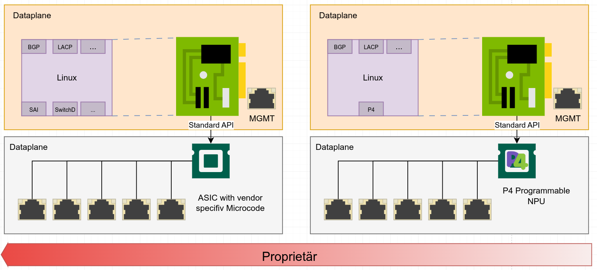
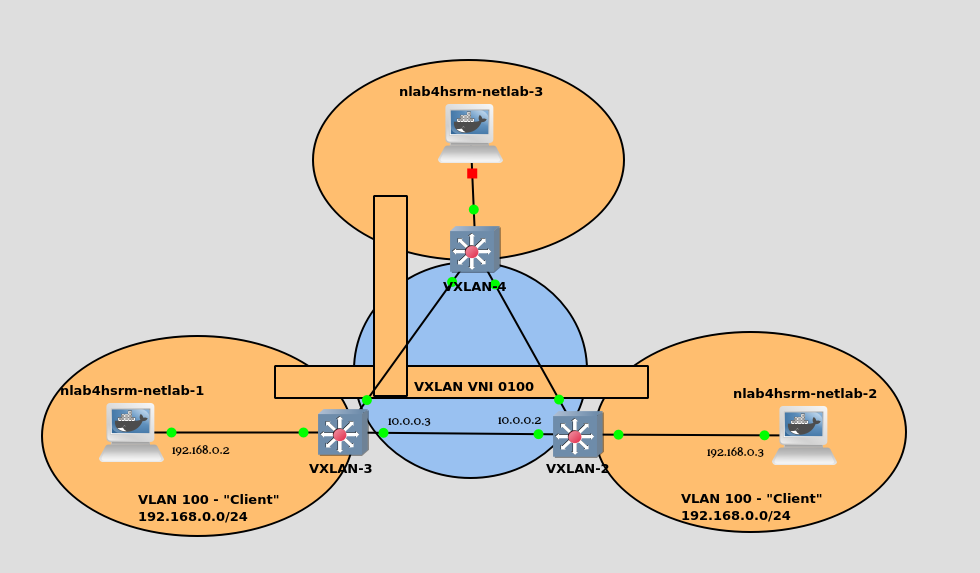

Grundlagen
==========

Open-Networking - Software-definierte Netzwerkkomponenten
---------------------------------------------------------

Netzwerkgeräte basieren typischerweise auf ASICs. Diese Chips haben ihre
Funktionalitäten in unveränderbarer Hardware integriert. So kann in
einem ASIC nachträglich nur sehr begrenzt eine neue Funktion wie zum
Beispiel VXLAN integriert werden. Vorteil dieser ASICs ist allerdings
die hohe parallele Performance die bei der Weiterleitung benötigt
werden. Für einen einfachen Vergleich, in der Spezifikation PCI Express
sind derzeit pro Lane 15,13 Gigabyte möglich. Der aktuelle High-End
Prozessor AMD Threadripper 3990X hat insgesammt 64 Lanes zur Anbindung
von Peripherie über PCI-Express und schafft damit eine theoretische
maximale Bandbreite von 64 x 15,13 = 968,32 Gigabyte in der Sekunde. Der
aktuelle High-End Switching-ASIC von Broadcom, der Tomahawk 5 / BCM78900
kann in der Sekunde 64 x 100 = 6400 Gigabyte verarbeiten. Der stark
vereinfachten Vergleich soll zeigen, dass selbst die theoretisch
maximale Datenmenge die ohne Verarbeitung bei Nutzung aller PCI Express
Lanes durch einen aktuellen x86 Prozessor fließen kann ein Bruchteil der
Bandbreite aktueller Switching-ASICs ist. Zumal der ASIC in dieser
Bandbreite auch Weiterleitungsentscheidungen zu jedem Paket trifft.

Dadurch das die ASICs in den Netzwerkgeräten in vielen Fällen von den
Herstellern selbst entwickelt sind, spezifische Funktionen abdecken und
vielen Fällen auf verschiedenen Konzepten der Paketweiterleitung beruhen
besteht eine enge Abhängigkeit zwischen dem Betriebssystem auf dem
Switch und der jeweiligen darunterliegenden Hardware.

{#fig:co1 width="100%"}

Auf der linken Seiten von [2.1](#fig:co1){reference-type="ref"
reference="fig:co1"} ist diese enge Integration dargestellt. Das
Betriebssystem aus dem Switch spricht direkt über eine Hersteller- und
ASIC spezifische API mit der [dp]{acronym-label="dp"
acronym-form="singular+short"}. Die Entwicklung geht derzeit allerdings
in Richtung der rechten Seite. Zum einen setzen viele Hersteller von
Netzwerkgeräten ASICs von Drittherstellern wie Broadcom ein. Broadcom
stellt zu seinen Chips teilweise offene Bibliotheken und APIs bereit.
Dies macht es, zusammen mit anderen Standard wie
[onie]{acronym-label="onie" acronym-form="singular+short"}, bedingt
möglich auf einer Hardwareplattform verschiedene
[sos]{acronym-label="sos" acronym-form="singular+short"}e zu nutzen. Ein
gutes Beispiel ist der aktuelle DELL S5248F-ON auf Basis des Broadcom
Trident 3. Dieser taucht in der Hardwarekompatibilitätsliste von einigen
[sos]{acronym-label="sos" acronym-form="singular+short"}en wie zum
Beispiel SONiC, Cumulus sowie PicOS auf.

Einen konsequenteres Ansatz verfolgt das Open-Compute-Project mit
[sai]{acronym-label="sai" acronym-form="singular+short"}. In diese
Schnittstelle werden Standard definiert, die mitunter die Art und Weise
der Konfiguration von Switching-ASICs. Dazu gehört zum Beispiel die
Konfiguration von Interfaces mit VLANs und IP-Adressen oder auch ACLs.
Derzeit setzt unter anderem SONiC und Aristas EOS SAI ein, um auf ein
breites Portfolio von Hardware-Plattformen unterstützen zu können.

{width="100%"}

Einen weiteren noch deutlichen konsequenteren Ansatz zeigt derzeit die
[onf]{acronym-label="onf" acronym-form="singular+short"} auf. Anstelle
eines fest programmierten ASICs wird eine programmierbare
[npu]{acronym-label="npu" acronym-form="singular+short"} eingesetzt. Das
verhalten diese NPU lässt sich mit der Sprache P4 definieren. Damit ist
es dem [sos]{acronym-label="sos" acronym-form="singular+short"} oder
einem Controller möglich benötigte Pipelines und Verhaltensweisen selbst
auf der Hardware dynamisch zu implementieren.

Ziel dieser Bestrebungen ist es ähnlich wie im Server-Umfeld schon lange
Standard die Software von der Hardware zu entkoppeln. Derzeit werden
Netzwerkgeräte in der Regel zusammen mit einem installiertem
Betriebsystem gekauft, welches sich nicht ohne weiteres austauschen
lässt. Hierfür sorgen zum einen technische Restriktionen von
Herstellern, umd zum anderen proprietäre Hardware die es
Softwareentwickeln schwer macht ein breites Portfolio von Plattformen zu
unterstützen. Der Erfolg von offenen Softwareplattformen hängt
allerdings im hohen Maße von der Unterstützung eines diversen
Hardware-Portfolios vieler Hersteller ab, da genau dies die Wahl eines
Dritt-Systems interessant macht. Gerade die Möglichkeit den
Hardware-Lieferanten zu wechseln, ohne das Switchbetriebsystem zu
wechseln zu müssen und damit sämtliche Konfigurationen neu zu erstellen
sowie teilweise Aufgrund der Unterstützung anderer Technologien ganze
Netzwerkkonzepte umbauen zu müssen ist für Unternehmen ein enormer
strategischer Vorteil.

### SAI

{#fig:evpncli width="50%"}

[sai]{acronym-label="sai" acronym-form="singular+short"}, Switch
Abstraction Interface, ist eine offene Schnittstelle um Hardware
ansprechen zu können. SAI ist eine lose Sammlung von C-Aufrufen in der
entsprechende Funktionen der Hardware-Treiber verlinkt werden. SAI ist
damit keine direkte Schnittstelle zur Hardware sondern ist eine
standardisierte Schnittstelle zwischen Anwendung sowie Hardware-Treiber.
SAI gibt damit den Herstellen von Hardware die Art und Weise der
Implementation vor. Durch den Einsatz von SONiC, welches SAI nutzt,
durch Microsoft in der Azure-Cloud ist diese Standardisierung die erste
mit einer relevanten Marktmacht um sich durchzusetzen. [@sai]

### ONIE

{#fig:onie width="100%"}

ONIE ist eine Art erweiterter Bootloader und bietet die einfache
Möglichkeit Betriebssysteme auf Switchen zu installieren. ONIE
implementiert dabei die bei Netzwerkhardware bekannte Mechanik einer
Primär- und einer Sekundärpartition, welche es nach einem Fehlerhaften
Update erlaubt wieder zur alten Installation zurückzukehren. Weiterhin
implementiert ONIE eine Linux-Shell mittels Busybox und wird im Rahmen
dessen Beispielweise von DELL genutzt um Firmware-Updates auf der
Hardware durchzuführen.

OpenFlow
--------

[of]{acronym-label="of" acronym-form="singular+short"} ist ein Protokoll
zur Kommunikation zwischen einer [cp]{acronym-label="cp"
acronym-form="singular+short"} und [dp]{acronym-label="dp"
acronym-form="singular+short"} um diese physikalisch und logisch
voneinander Trennen zu können. Das Protokoll spezifiziert die
Nachrichten die zwischen den Einheiten ausgetauscht werden. Durch diese
Nachrichten werden von dem Controller generierte Flow-Regeln auf die
jeweilige Dataplane geschrieben. OpenFlow kann vielseitig eingesetzt
werden. So kann mittels des Protokoll die Controlplane eines Netzwerkes
vollständig zentralisiert werden. OpenFlow kann auch dafür genutzt
werden nur bestimme Flows umzuleiten, beispielsweiße für die
Implementierung eines Traffic Engineerings oder einer Firewall
F´unktionalität. [@ofs]

{#fig:evpncli
width="80%"}

Eingehende Pakete auf einem Interface des per OpenFlow gesteuerten
Switches werden nun auf Basis der implementierten Flow-Regeln
weitergeleitet. OpenFlow wurde ursprünglich in der Version 1.1
veröffentlicht, und gibt es mittlerweile in der Version 1.5.1. Die
Flow-Regeln können auf verschiedene Header eines Ethernet-Pakets
greifen, darunter MAC, IP Adresse oder zum Beispiel ein VLAN Tag. Wenn
eine Regel passt kann eine Aktion definiert werden wie die Manipulation
eines weiteren Headers, wie zum Beispiel das umschreiben der
MAC-Zieladresse wie es bei Routing notwendig ist.

{#fig:evpncli width="70%"}

Die Regeln können dafür in mehrere untereinander verkette Tabellen
geschrieben werden. Die Regeln werden mittels eine ID identifiziert. Die
Pakete durchlaufen nicht automatisch alle Tabellen, die Pakete werden
den Tabellen mittels Regeln zugewiesen. [@ofs]

Das Protokoll basiert auf einer Menge von definierten Nachrichten,
welche über den normalen TCP/IP Stack übertragen werden:

-   HELLO - Herstellen einer Verbindung.

-   FEATURE REQUEST/ REPLY - Controller fragt damit Informationen vom
    Switch wie OpenFlow Version ab.

-   GET CONFIG REQUEST/ REPLY - Controller fragt Konfigurationen vom
    Switch an

-   PACKET-In - Erhällt ein Switch ein Paket auf das keine Nachricht
    passt, kann er das Paket an den Controller senden.

-   FLOW MOD - Damit sendet der Controller Flow-Regeln an den Switch.

-   BARRIER - Abfrage des Controllers ob alle vorher gesendeten
    Anweisungen umgesetzt worden sind.

OpenFlow ist kein abgeschlossener Standard, das Protokoll ist unter
stetiger Weiterentwicklung. Seit dem inititalen Release mit Version 1.1
ist eine Vielzahl von Versionen erschienen. Aktuell ist mittlerweile die
version 1.6. Hinzu kam zum Beispiel die Möglichkeit mehrere Tabellen zu
spezifizieren sowie die Möglichkeit auf neue Header zu matchen. Seit
Version 1.5.0 ist es zum Beispiel möglich Regeln auf TCP-Flags
anzuwenden. Diese stetige Weiterentwicklung stellt Netzwerk-Austatter
vor eine stetige Herausforderung die Funktionen zu implementieren.
Teilweise treffen sie hier auf durch die Hardware gegeben Limitationen
sodass Funktionen modifiziert implementiert werden oder weggelassen
werden.

P4
--

[@p4tum] [@p4pi]

### P4Runtime

P4Runtime spezifiziert eine Schnittstelle zwischen einem Controller und
einer programmierbaren [dp]{acronym-label="dp"
acronym-form="singular+short"}. Das Protokoll wird dafür genutzt, um in
P4 geschriebene Programmlogiken in entfernten [dp]{acronym-label="dp"
acronym-form="singular+short"}s zu installieren und dynamisch zu
modifizieren. Als Übertragungsprotokoll wird gRPC verwendet.

Ein anschauliches Beispiel wird dafür in einem Tutorial der
[onf]{acronym-label="onf" acronym-form="singular+short"} gegeben. In
diesem wird eine CLI-Implementierung von P4Runtime genutzt um erst ein
P4-Programm auf einen simulierten Switch zu installieren und dann
Tabellen und Variablen zu modifizieren.

``` {caption="P4Runtime Beispiel"}
util/p4rt-sh --grpc-addr localhost:50001 --config p4src/build/p4info.txt,p4src/build/bmv2.json --election-id 0,1
```

Das Program wird aufgerufen mit der gRPC Zieladresse, in diesem Fall ein
lokal laufender bmv2 Switch. Weiterhin sind zwei Konfigurationsdateien
notwendig, die p4info.txt und die bmv2.json. Die erste Textdatei
beschreibt ein Schema für die Nachrichten zwischen Controller und Switch
in Form von Protobufs. Die zweite Datei, eine JSON Datei, ist eine aus
einem P4-Programm compilierte Datei die das gewünschte Verhalten auf dem
Switch implementiert. Dies ist eine Spezialität der Implementierung des
bmv2. bmv2 steht für Behavioral Model Version 2und ist einer
Referenzimplementierung eines P4 Softwareswitches zu Entwicklungs- und
Testzwecken. Dieses Modell wird nicht direkt mit einem P4-Programm
programmiert, sondern benötigt den Zwischenschritt über einen Compiler
der das Verhalten in Form einer JSON Datei implementiert.

Prinzipiell ist P4Runtime auf Netzwerkgeräten möglich, die auf einer per
P4 programmierbaren Hardware basieren. Dazu gehört zum Beispiel Intels
Tofino. Zu Erweiterung der Möglichkeiten von P4Runtimer exisiter das
Projekt PINS. Dieser P4 Integrated Network Stack bietet die Möglichkeit
per SAI abstrahierte Hardware mit P4 zu programmieren. Damit ist es
prinzipiell möglich das Verhalten von klassischen ASICs wie den
verbreiteten Broadcom Chips die per SAI integriert werden können mit P4
beziehungsweise der P4Runtime zu beschreiben. Derzeit wird die P4Runtime
nativ von dem [sos]{acronym-label="sos" acronym-form="singular+short"}
STRATUM der [onf]{acronym-label="onf" acronym-form="singular+short"} und
der Software Referenzimplementierung in Form des bmv2. Eine Integration
der P4Runtime wird über PINS in dem GitHUB Repositorie von SONiC
erwähnt.

VXLAN {#sec:vxlan}
-----

VXLAN ist eine Technologie um Layer-2 Tunnel über ein geroutetes Layer-3
Netz zu spannen. VXLAN steht dabei für Virtual Extensible LAN und ist in
dem RFC 7348 standardisiert. Mit VXLAN ist die Unterscheidung zwischen
16 Millionen Netzwerken möglich und erlaubt in großen Umgebungen die
doppelte Nutzung von VLAN-IDs, beispielsweise zwischen verschiedenen
Kunden. Die doppelte Nutzung von VLAN war bereits im IEEE 802.1ad QinQ
möglich. VXLAN kombiniert die Fähigkeit Layer-2 Tunnel über geroutete
Strecken zu ziehen mit der Fähigkeit VLANs doppelt zu nutzen, um eine
ganzheitliche Netzwerkvirtualisierung zu schaffen.

{width="70%"}

VXLAN Pakete werden mittels eines weiteren VXLAN-Headers realisiert.
Verpackt werden die Paketen in UDP/IP Paketen.

{#fig:vxlan1 width="100%"}

In Abbildung [2.6](#fig:vxlan1){reference-type="ref"
reference="fig:vxlan1"} ist ein Beispiel für einen VXLAN-Tunnel gegeben.
Die beiden Hosts am Rand sollen über einer Layer-2 Domäne direkt
kommunizieren können. Die beiden Switche können über ein
Transfer-Netzwerk miteinander kommunizieren. Per VXLAN wird nun ein
Tunnel konfiguriert, der die beiden äußeren Layer-2 Netze miteinander
verbindet.

Ein Trace auf dem Verbindungsstrecke zwischen den beiden Switchen zeigt
nun bei einem Ping zwischen den beides Hosts folgende Pakete:

{#fig:vxlan2 width="100%"}

In der Abbildung [2.7](#fig:vxlan2){reference-type="ref"
reference="fig:vxlan2"} ist der äußere Header des VXLAN Pakets mit der
markiert. Dieses UDP Paket wird von der Loopback-Adressen des einen
Switches zu dem anderen gesendet. Diese Loopback-Adressen sind
gleichzeitig die Adressen der jeweiligen [vtep]{acronym-label="vtep"
acronym-form="singular+short"}s. Im inneren Teil des Headers, hier mit
der markiert, befindet sich der Header des ursprünglichen Paketes,
welches zwischen den beiden Hosts ausgetauscht wird. Der empfangende
[vtep]{acronym-label="vtep" acronym-form="singular+short"} Pakt dieses
Paket wieder aus und sendet es an den Ziel-Host.

{#fig:vxlan3 width="100%"}

Eigentlich relevante Vorteile eines VXLAN-Overlays werden in der
Abbildung [2.8](#fig:vxlan3){reference-type="ref"
reference="fig:vxlan3"} ersichtlich. Es ist möglich eine Topologie mit
mehreren Standorten und physikalisch redundanten Pfaden zu bauen. Durch
Nutzung von Routing-Protokollen lassen sich alle Pfade redundant nutzen.
Die logische Topologie des Overlay-Netzwerkes ist sternförmig. Dies wird
dadurch erreicht, das ein VTEP ein Paket das aus einem Tunnel
herauskommt nicht in einen weitern Tunnel wieder hineinschickt. Dadurch
entstehen trotz einer vermaschten Tunnel-Topologie keine Schleifen.

Damit die VTEPs die Pakete entsprechend weiterleiten können, haben sie
eigene Tabellen welche MAC-Adressen zu gegenüberliegenden VTEPs
zuordnen. Zum lernen dieser Zuordnungen gibt es mehrere Methoden.

#### Head End Replication

Bei dieser Methode wird [bum]{acronym-label="bum"
acronym-form="singular+short"}-Traffic der von den Hosts ausgeht an alle
eingetragenen Remote-VTEPs über Unicasts weitergeleitet. Der VTEPs
lernen die MAC-Adressen durch die gleichen Broadcast-Mechanischem wie
normale Switche. Jedem VTEP müssen alle anderen VTEPs in dem Netzwerk
statisch bekannt gemacht werde.

#### IP-Multicast

Diese Methode basiert ebenso wie die vorherige auf den bekannten
Broadcast-Mechanismen. Im Unterschied werden die entfernten VTEPs nicht
einzeln eingetragen sondern der [bum]{acronym-label="bum"
acronym-form="singular+short"}-Traffic an eine Multicast-Adresse
geschickt die die anderen VTEPs abhören.

#### OVSDB Controller

Ein Controller synchronisiert über das OVSDB-Protokoll die
Erreichbarkeitsinformationen zwischen den einzelnen VTEPs. Damit kann
der [bum]{acronym-label="bum" acronym-form="singular+short"}-Traffic
reduziert werden und das Verhalten des Netzwerken beeinflusst werden.
Beispiele sind Aristas CloudVision eXchange und VMWares NSX Lösung.

### BGP-EVPN

BGP-EVPN ist eine Erweiterung des Routing-Protokolls
[bgp]{acronym-label="bgp" acronym-form="singular+short"} und eine
weitere Variante eine Controlplane-Funktionalität für ein
VXLAN-Overlay-Netzwerk zu implementieren. Erreichbarkeitsinformationen
werden zwischen den teilnehmenden Netzwerkgeräten beziehungsweise derer
VXLAN-[vtep]{acronym-label="vtep" acronym-form="singular+short"}s
mittels einer BGP-Instanz ausgetauscht. EVPN steht dabei für Ethernet
Virtual Private Network. Das Protokoll ist standardisiert in mehreren
RFCs wie in RFC 7209, RFC 7432, RFC 8365 und RFC 8317.Eine Besonderheit
ist EVPN-Multihoming, eine Methode Server mittels mehrere Links
gebündelt als eine Link-Aggregation an mehrere Switche anzuschließen zum
Zwecke der Redundanz. Herkömmlicherweise werden dafür herstellereigene
[mlag]{acronym-label="mlag" acronym-form="singular+short"} Protokolle
eingesetzt welche nicht standardisiert sind und oft eigene Namen tragen.

Dafür wird eine neue Familie von Routen in BGP eingeführt. Ein Ethernet
Segment beschreibt eine Vielzahl von Links zur redundanten Anbindung
eines Endgerätes an mehrere Switche des BGP-EVPN Netzwerkes. Zu den EVPN
Routen gehören:

-   Type 1 - Ethernet Auto-Discovery Route. Diese Route wird hier für
    EVPN Multihoming eingesetzt. Es wird die Erreichbarkeit einer
    bestimmen MAC-Adresse ausgetauscht für eine Konvergenz bei Ausfall
    eines Links.

-   Type 2 - MAC/IP Route - Diese Route wird verwendet um Informationen
    über lokal gelernte MAC-Adressen an die Partner zu übertragen. Die
    IP-Adresse wird übertragen um ARP-Anfragen direkt von den entfernten
    [vtep]{acronym-label="vtep" acronym-form="singular+short"}s
    beantworten lassen zu können.

-   Type 3 - Inclusive Multicast Route - Diese Route wird eingesetzt um
    [vtep]{acronym-label="vtep" acronym-form="singular+short"}s im
    Netzwerk bekannt zu machen um entsprechende VXLAN-Tunnel aufbauen zu
    können.

-   Type 4 . Ethernet Segment Route .

-   Type 5 - IP Prefix Route . Diese Route wird bei verteilten Routing
    verwendet um die verschiedenen Gateways im Netzwerk bekannt zu
    machen,

[@evpn]

EVPN lässt sich neben VXLAN auch für MPLS als Controlplane einsetzen.

Segment Routing
---------------

BGP-LS P4RUntime

Netzwerksimulation
------------------

Die Simulation von Netzwerken basiert auf der Virtualisierung des
[sos]{acronym-label="sos" acronym-form="singular+short"} auf einem
Hypervisor. Eingesetzt werden je nach Betriebssystem-Architektur QEMU,
Dynamips, Virtualbox, VMware oder auch Containertechnologien wie Docker.
Die Mehrheit aktueller Enterprise-Switche basieren auf regulären
x86-Computern mit UNIX-artigen Betriebssystemen wie Linux. Dazu gehört
unter anderem Ciscos IOS-XE und XR, Extremes EXOS und VOSS und einige
mehr. Die Virtualisierung dieser Systeme stellt keine größere
Herausforderung dar da verbreitete Technologien genutzt werden. Um einen
virtuellen Link zwischen zwei virtuellen Switchen zu stecken setzt zum
Beispiel GNS3 jeweils zwei UDP Tunnel ein.

{#fig:gns3-udp
width="100%"}

In dieser Abbildung sind zwei UDP Verbindungen zwischen zwei offenen
Ports auf dem lokalen Loopback-Interface zu sehen. Jeweils für jede
Richtung einen. Diese Verbindungen werden durch den GNS3 eigenen ubridge
Dienst erstellt.[@ubridge] Vorteil dieses Verfahrens ist, das jegliche
Art von Interfaces miteinander Verbunden werden können. Weiterhin
besteht die Möglichkeit den Linux-Netzwerkstack zu nutzen. So können
immer jeweils zwei Interfaces in eine Linux-Bridge gesteckt werden um
eine Kommunikation zu ermöglichen. Diese funktioniert allerdings nur mit
Interfaces der virtuellen Instanzen die dem Kernel des Hosts bekannt
sind. Die durch GNS3 erstellten QEMU VMs haben zum Beispiel kein
virtuelles Interface im Linux Kernel des Hosts. Gleichzeitig ist eine
gemeinsame Topologie mit UDP Tunnel problemlos über mehrere
Virtualisierungshosts möglich, während dies bei Linux-Bridges nicht ohne
weiteres möglich ist. Zu beachten sind die Performance Einschränkungen
bei den UDP Tunneln, da die Pakete durch einen kompletten Software-Stack
gehen.

Die größte Herausforderung ist die Implementierung von hardwarenahen
Funktionen der Switche in die virtuellen Versionen. Die
[sos]{acronym-label="sos" acronym-form="singular+short"}e programmieren
viele Funktionen direkt in die Hardware. Im optimalen Fall wird ein
Paket welches an einem Switch ankommt direkt von der Hardware, zum
Beispiel einem ASIC, weitergeleitet und passiert nicht die CPU des
Switches. Lediglich Protokoll-Pakete wie zum Beispiel BGP-Pakete,
LLDP-Pakete oder STP-Pakete werden an die CPU weitergeleitet um dort
verarbeitet zu werden. Heutige Switche setzen MAC-basierte Layer-2
Weiterleitung, IP-basierte Layer-3 Weiterleitung sowie die
Implementierung von Filtern in Form von ACLs direkt in der Hardware um.
Da ein virtueller Switch keine Hardware wie einen ASIC hat, durchlaufen
alle Pakete den TCP/IP Stack des [sos]{acronym-label="sos"
acronym-form="singular+short"}es, welches in der Regel Linux ist. Die
Implementierung von [cp]{acronym-label="cp"
acronym-form="singular+short"} Funktionen wie Routing-Protokollen ist
damit in der Regel trivial da keine Änderungen an dem
[sos]{acronym-label="sos" acronym-form="singular+short"} vergenommen
werden müssen. Alle Funktionen die allerdings in die Hardware eines
Switches geschrieben werden, müssen durch den Linux TCP/IP Stack
dargestellt werden.

An dieser Stelle unterscheidet sich der Funktionsverlust zwischen den
Plattformen verschiedener Hersteller von einer physikalischen Appliance
hin zu einer virtuellen erheblich. Layer-2 Bridging mit VLANs stellen in
der Regel kein Problem da und werden durch Linux Boardmittel
implementiert. Die Filterung von Paketen durch ACLs hingegen müsste
durch Methoden wie eBPF implementiert werden. Auch wenn ACLs in
Testaufbauten nicht direkt benötigt werden, ist die Mechanik Grundlage
für viele andere Funktionen in einem Netzwerk die ohne Filterlisten
nicht korrekt funktionieren. Ein gutes Beispiel hierfür ist eine
Multi-Chassis-Link-Aggregation. Bei dieser ist es notwendig Filter auf
dem Link zwischen den beiden Switchen zu implementieren. Im Beispiel des
virtuellen DELL OS10 lässt sich dies zwar Konfigurieren, funktioniert
aber nicht korrekt da Pakete über den zwischen Link geschickt werden
nicht korrekt gefiltert werden.

Eine interessante Plattform zur Virtualisierung stellt SONiC dar. Die
Schnittstelle hin zur Hardware ist offen und bietet die Möglichkeit
eigene Bibliotheken zu verlinken. Zusätzlich lässt sich der Code
öffentlich einsehen um nachzuvollziehen, wie gewisse Funktionen
implementiert sind. Ein gesonderte Bibliothek implementiert die im ASIC
abgebildeten Funktionen im Linux Netzwerkstack.

### GNS3

GNS3 ist eine quelloffene Plattform zur Simulation von Netzwerken. GNS3
bietet eine graphische Benutzeroberfläche in der Geräte angeordnet
werden können sowie untereinander vernetzt werden können. Die Anwendung
ist Server-Client basiert. Der Server ist im Backend für die
Virtualisierung der verschiedenen angelegten Geräte zuständig, wobei
verschiedene Virtualisierungstechnologien eingesetzt werden können. Die
Vernetzungen zwischen den Geräten basiert auf UDP Tunneln welche mittels
ubridgerealisiert werden. GNS3 bietet weiterhin hilfreiche Tools wie die
Möglichkeit über die Oberfläche Wireshark-Mitschnitte auf bestimmten
UDP-Tunneln zwischen Geräten zu starten sowie Filter auf diesen
anzulegen. Weiterhin bietet GNS3 mit einem NAT-Knoten die Möglichkeit
einen Internet-Breakout zu realisieren sowie über einen Cloud-Knoten die
Möglichkeit ein physikalisches Interface in die Topologie einzubinden um
eine Schnittstelle zu echten Hardware-Komponenten herzustellen.

{width="100%"}

!

### GNS3-Server-Manager

Der GNS3-Server-Manager ist eine Web-Anwendung betrieben durch das NLAB
der Hochschule Rhein-Main. Diese bietet Nutzern die Möglichkeit aus
Templates heraus GNS3-Server zu erstellen. Die GNS3-Server werden über
OpenVPN erreichbar gemacht. Die Dokumentation für diese Anwendung ist zu
finden unter
<https://github.com/nlab4hsrm/gns3-Server-Manager/tree/main/Doc>

Marktanalyse {#sec:market}
