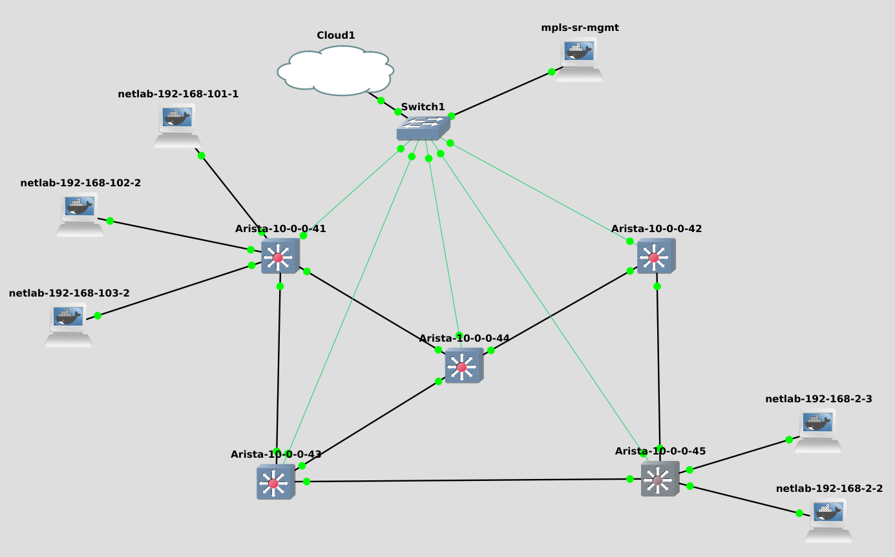
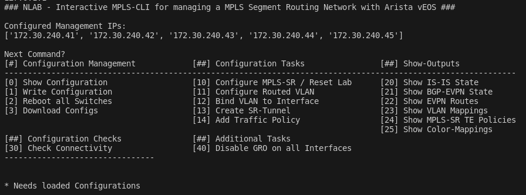
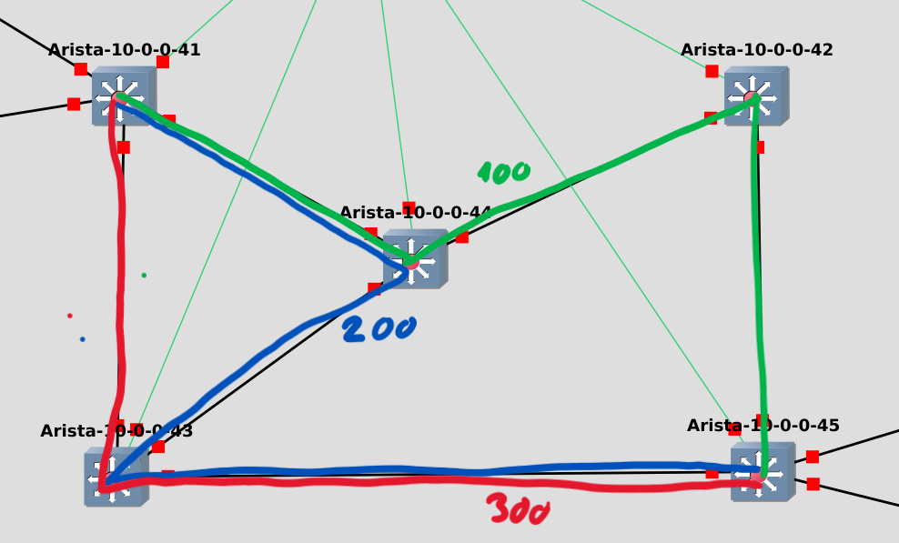

MPLS-SR Lab - Traffic-Engineering
=================================

Architektur und Technologien {#architektur-und-technologien-2}
----------------------------

In diesem GNS3-Lab wird eine Architektur zur Implementierung von
Traffic-Engineering gezeigt. Es werden Pfade durch ein Netzwerk
definiert und im Anschluss Datenverkehr diesen Pfaden zugewiesen. Die
Konfiguration von Pfaden und den Policies erfolgt statisch. Die für eine
potentielle Regelung notwendigen Telemetrie-Daten werden über sFlow
erfasst. Für die Bereitstellung von Gastnetzwerken wird EVPN eingesetzt,
welches aber in diesem Lab keine relevante Rolle besetzt. Eine genauere
Betrachtung von EVPN erfolgt in dem Lab
[8](#sec:evpnlab){reference-type="ref" reference="sec:evpnlab"}.

### Eingesetzte Technologien

#### MPLS

Bei Multiprotocol-Label-Switching, kurz MPLS und spezifiziert in RFC
3031 [@mpls], werden Pakete auf Basis von Labeln weitergeleitet. MPLS
Netzwerke sind eigene abgetrennte Systeme und werden über Router mit der
IP-Außenwelt verbunden. An diesen Übergabepunkten werden die eingehenden
Pakete mit Labeln markiert, beziehungsweise die Label von ausgehenden
Paketen wieder entfernt. Relevante Eigenschaft von MPLS ist ein
vereinfachter Lookup-Prozess, welche weniger Ressourcen erfordert als
ein IPv4-Lookup. Während ein MPLS-Label eindeutig ist, muss für ein
IPv4-Lookup immer die ganze Tabelle überprüft werden, um die Route mit
der größten Übereinstimmung zu finden. Diese Eigenschaft basiert auf dem
Longest-Prefix-Match, kurz LPM. Durch geschickte Programmierung kann ein
MPLS-Label direkt auf einen Speicherbereich zeigen in dem die
entsprechende Routing Anweisung steht. Der Eintrag muss im übertragenen
Sinne nicht gesucht werden sondern kann direkt gefunden werden.

#### Segment Routing {#sec:segmentrouting}

{width="100%"}

In einem MPLS-Netzwerk müssen Erreichbarkeitsinformationen im Netzwerk
signalisiert werden. Für gewöhnlich wird dafür LDP - Label Distribution
Protocol eingesetzt. Dieses arbeitet ähnlich einem IGP. Nachbarschaften
werden zwischen den physikalisch benachbarten Hosts geschlossen. In ein
MPLS-Netzwerk eingehende Pakete werden einer Forwarding Equivalence
Class, kurz FEC, zugeordnet. FECs können zum Beispiel auf ein Ziel
IP-Subnetz referenzieren. Für jede FEC wird ein Pfad -
*Label-Switched-Path*, kurz LSP - durch das Netzwerk signalisiert. Auf
dem Eingangsrouter erhält das Paket ein dem FEC entsprechendes Label.
Auf dem nächsten Router entspricht die ID des Labels der ID des
Tabelleneintrags mit dem nächsten Label. Das Label wird auf jedem Host
geswitcht. Diese Mechanik ist namensgebend für MPLS. RSVP-TE ist eine
Erweiterung diesen Konzeptes. Hierbei werden für die einzelnen FECs und
ihren zugehörigen LSPs über ein Protokoll Bandbreiten auf dem gesamten
Pfad angefragt und anschließend reserviert.

Als dritte und modernste Methode kann Segment-Routing verwendet werden,
welches im RFC 8660 spezifiziert ist [@sr]. Segment Routing basiert auf
ISIS oder OSPF und ist damit eine Erweiterung dieser Protokolle. Im
Unterschied zu LDP werden global gültige Labels für die am Rand
sitzenden Router vergeben. Pakete erhalten das Label des Ziel-Routers
und werden auf Basis dessen durch das Netzwerk geleitet. Das Label wird
in diesem Fall nicht gewechselt. Neben den Routern am Rand erhalten auch
die einzelnen Verbindungen Labels. Pakete können wahlweise nur mit dem
Label des Endpunktes oder mit einem Stack aus Labeln versehen werden.
Der Label-Stack wird dabei abgearbeitet, ein Label wird bei Erreichen
des jeweiligen Ziel-Abschnitts vom Stack entfernt. Dadurch kann einem
Paket ein dedizierten Pfad zugewiesen werden, was wiederum
Traffic-Engineering ermöglicht.

{#fig:sr-cisco width="50%"}

In der Abbildung [9.1](#fig:sr-cisco){reference-type="ref"
reference="fig:sr-cisco"} sind die global gültigen MPLS-Label
dargestellt. Jeder teilnehmende Router kennt alle globalen Labels der
einzelnen Router sowie den kürzesten Weg zu diesen. Der kürzeste Pfad
wird hierbei durch das jeweilig verwendete IGP berechnet.

Um alternative Pfade zu berechnen, kann ein PCE - Path Computation
Elementgrqq - eingesetzt werden. Dies ist ein abgesetzter Controller,
welcher auf Basis von Metriken optimierte Pfade berechnet. Diese
optimierten Pfade werden dem Router mitgeteilt, auf dem das Paket in das
MPLS-Netzwerk eintritt. Dieser Router ist dafür zuständig das Paket für
einen bestimmten Pfad zu klassifizieren und anschließend das Paket mit
einem entsprechendem Label-Stack zu versehen. Die weiteren Router
benötigen keine Kenntnis über den Pfad und arbeiten stupide den Stack
ab. Dadurch sind nur wenige Zustände notwendig, die im Netzwerk
synchronisiert werden müssen. Dies ist ein architektonischer Vorteil
gegenüber anderen Ansätzen.

### MPLS/IPv4 Underlay

Für ein MPLS Netzwerk wird ein IPv4-Netzwerk zwischen den MPLS-Routern
benötigt. Zu diesem Zweck erhält jeder Router eine eindeutige
Loopback-Adresse und es werden Transfernetzwerke auf den
[nni]{acronym-label="nni" acronym-form="singular+short"}s konfiguriert.
Als IGP wird ISIS eingesetzt. Ziel ist eine volle Erreichbarkeit aller
Loopback-Adressen zwischen den Routern. Für die Loopback-Adressen werden
die in Abbildung [9.2](#fig:mplstop){reference-type="ref"
reference="fig:mplstop"} gezeigten Adressen im **10.0.0.0/24** Netz mit
einer **/32** Subnetzmaske verwendet. Für die Transfernetze werden
**/30**-Subnetze aus dem Adressbereich **10.200.0.0/24** verwendet.

ISIS trägt eine Doppelrolle. Zusätzlich als IPv4-Routingprotokoll wird
ISIS für Segment-Routing eingesetzt. ISIS ist damit zuständig für den
Aufbau des MPLS-Netzwerkes in Form von Einträgen in den MPLS-Tabellen.
Ziel ist das jede Loopback-Adresse ein global eindeutiges MPLS-Label
besitzt und den anderen Switchen das MPLS-Label zu den jeweiligen
Loopback-Adressen bekannt ist. Weiterhin berechnet ISIS einen direkte
Pfad zu allen bekannten Routern, die ein globales Label tragen. Die
Global eindeutigen Label setzten sich zusammen aus **9000** und dem
letzten Byte der Loopback-Adresse. Für den ersten Switch mit der
Loopback-Adresse **10.0.0.41** wäre das entsprechende Label **900041**.

### EVPN-Overlay

Für die Signalisierung der lokal bekannten Prefixe der Gastnetze wird
BGP-EVPN eingesetzt. BGP-EVPN trägt in diesem Lab keine tragende Rolle
und ist beliebig austauschbar durch L3VPN oder VPLS. BGP-EVPN wird als
Adressfamilie auf allen Routern aktiviert. In der hier gezeigten
Topologie wird BGP auf allen Switch konfiguriert, da keine Router
existieren, die lediglich Teil des MPLS-Netzwerkes sind. Die Gastnetze
müssen auf den Routern später in VRFs angelegt werden.

### Traffic-Engineering Controlplane

Traffic-Engineering auf Basis von MPLS-SR benötigt Pfade in Form von
Label-Stacks und Regelwerke, welcher Datenverkehr welchem Tunnel
zugewiesen wird. Für beide Elemente gibt es verschiedene Wege sie zu
programmieren.

#### Tunnel Konfiguration

Tunnel können statisch auf der CLI konfiguriert werden, über eine eigene
Adressfamilie mit BGP signalisiert oder mittels einem speziellen
Protokoll - *PCEP* - programmiert werden. Die jeweils verfügbaren
Varianten hängen von der verwendeten Plattform ab. Aristas vEOS
unterstützt zum Beispiel in der Version 4.31.2.F kein PCEP, dafür aber
die anderen beiden Varianten. In diesem Lab werden die Tunnel statisch
über die CLI konfiguriert.

#### Traffic-Steering

Es gibt mehrere Varianten, Datenverkehr den Tunneln zuzuweisen. Arista
beschreibt folgende Arten des Traffic-Steerings:

-   **bsid** - Ein dem Tunnel zugewiesenes MPLS-Label.

-   **color** - Ein über BGP signalisiertes Attribut einer Route.

-   **DSCP** - Differentiated Services Code Point - Ein gesetzter DSCP
    Wert.

Jedem Tunnel muss bei Konfiguration ein global eindeutiges MPLS-Label,
die sogenannte *b-sid*, zugewiesen werden. Geht auf einem Router mit
einem Tunneleingang ein Paket mit einer zu einem Tunnel passendes
MPLS-Label ein, wird dieses Paket in diesen Tunnel weitergeleitet. Dafür
müssen Pakete vorab mit entsprechenden MPLS-Labeln markiert werden.

Die präferierte Variante um Datenverkehr anwendungsspezifisch und
symmetrisch Tunneln zuzuweisen, ist die Zuordnung über DSCP-Werte. Zu
diesem Zweck können Zuordnungen zwischen DSCP-Werten und Tunneln
konfiguriert werden. Der Lookup des DSCP-Wertes sowie die anschließende
Überschreibung der Routing-Entscheidung konnte mit der vorliegenden vEOS
Version nicht umgesetzt werden, da diese eigentlich in der Hardware
implementierte Funktion nicht in der virtuellen Plattform abgebildet
ist.

Die dritte Variante ist die Zuordnung über ein Attribut der Route mit
dem Namen *color*. Entspricht die hier signalisierte Farbe der Farbe
eines anliegenden Tunnels, wird das Paket über diesen Tunnel geroutet.
Das Attribut kann durch statisch definierte Route-Maps gesetzt werden.
Attribute können sowohl für über BGP empfangene Routen sowie selbst
signalisierte Routen gesetzt werden.

Aufgrund der fehlenden Umsetzung von *class-based-forwarding* erfolgt
die Zuordnung von Datenverkehr zu Tunneln über Route-Attributen. Die
Attribute werden durch statische Route-Maps gesetzt.

### Virtueller Switch: Arista vEOS

Für dieses Lab wird die virtuelle Variante von Aristas EOS eingesetzt.
Die Appliance ist im GNS3-Markplatz frei verfügbar. Zum Herunterladen
des benötigten Images ist eine kostenfreie Registrierung bei Arista
notwendig. Es muss zwischen Arista vEOS und Arista vEOS-lab
unterschieden werden. Arista vEOS ist eine kostenpflichtige Lösung für
den Einsatz in produktiven Umgebungen. vEOS unterstützt zur
Paketweiterleitung die beiden Varianten *kernel* und *dpdk* und wird
explizit als Router beschrieben, was auf fehlende Layer-2 Features
schließen lässt. vEOS-lab hingegen ist eine Version für die Simulation
von Netzwerken. Die Paketweiterleitung basiert auf einem eigenem Prozess
mit dem Namen *etba*. Dieser Prozess bildet die Dataplane des Switches
ab. Mehr Informationen zu Aristas EOS findet sich im Abschnitt
[3.3](#sec:arista){reference-type="ref" reference="sec:arista"}.

vEOS ist ein Linux-basiertes Betriebssystem für Switche und Router.
Konfiguration kann über einer klassische CLI vorgenommen werden. Arista
erlaubt den Zugriff auf die Linux-Shell über das absetzen des Befehles
bash in der CLI.

Arista bietet keine Dokumentation über die realisierten
Dataplane-Funktionen der virtuellen Plattform. In der Entwicklung des
Laborversuchs hat sich gezeigt das einfache Layer-2 Features wie
VLAN-Bridging, Layer-3 Routing, VXLAN sowie eine MPLS-Dataplane
implementiert sind. Nicht oder nur teilweise funktioniert haben Lookups
auf DSCP-Werte für Traffic-Engineering sowie die Errichtung eines
Layer-2 VPN über MPLS. Werden in den Endgeräten statische MAC-Adressen
eingetragen, funktioniert die Kommunikation. Der eigentlich dafür
zuständige ARP-Mechanismus funktioniert aber nicht, vermutlich aufgrund
mangelnder Broadcast-Behandlung oder einem alternativem ARP-Proxy.

#### Virtuelle Performance {#virtuelle-performance}

Arista bildet in der virtuellen Variante die Paketweiterleitung in einem
Userspace-Dienst mit dem Namen Etba ab. Der Forwarding-Agent kann in
einem modernerem Arfa-Modus - Arista Forwarding Agent, oder in einen
Legacy Python-Modus gestartet werden. Ab vEOS Version 4.30.1.F ist Arfa
standardmäßig aktiviert. Während Arfa eine bessere Performance bieten
soll, fehlen diesem Modus im Vergleich noch einige wenigen Funktionen
wie Multicast oder Q-in-Q [@arfa].

Bei einer einfachen Messung zwischen zwei Interfaces innerhalb eines
VLANs erreicht die Datenübertragung mit Iperf3 eine Geschwindigkeit von
knapp 3 Mbit/s.

In der Linux-Shell lassen dich über iproute2 alle dem Kernel bekannten
Interfaces ausgeben:

    ip link
    {...}
    7: vmnicet5: <BROADCAST,MULTICAST,PROMISC,UP,LOWER_UP> mtu 10000 qdisc pfifo_fast state UP mode DEFAULT group default qlen 1000
        link/ether 0c:9d:6e:35:00:05 brd ff:ff:ff:ff:ff:ff
    {...}
    30: et5: <BROADCAST,MULTICAST,UP,LOWER_UP> mtu 9214 qdisc pfifo_fast state UP mode DEFAULT group default qlen 1000
        link/ether 0c:9d:6e:00:70:fb brd ff:ff:ff:ff:ff:ff
    {...}

Erkennbar ist, dass zu jedem Front-Port des Switches zwei
Kernel-Interface existieren. Hierbei ist jeweils das *vmnicet\**
Interface das physikalische Interface und das *et\** Interface das
virtuelle interne Interface. Durch ein Mitschnitt mit *tcpdump* wird
ersichtlich, dass sämtlicher Datenverkehr, der über die Front-Ports
fließt über die Kernel-Interfaces vmnic\* läuft. Auf dem internen
Interface et5 sind nur Pakete, die von der Controlplane des Switches
stammen oder an diese gesendet werden, wie zum Beispiel Spanning-Tree
Pakete, ersichtlich.

Die Performance lässt sich durch Deaktivieren von *Generic Receive
Offload* erheblich steigern.

    sudo ethtool --offload vmnicet5 gro off

Hintergründe hierzu werden in
[8.1.4.1](#sec:sonicperf){reference-type="ref"
reference="sec:sonicperf"} erläutert.

Weiterhin lässt sich beobachten, dass die Paketverlustrate auf 100%
steigt, sobald Pakete eine gewisse Größe überschreiten. Dieses Phänomen
tritt nur auf, wenn die Pakete über MPLS-Strecken geroutet werden.

Eine Messung mit Iperf über eine MPLS-Strecke verdeutlicht das Phänomen:

    root@netlab-192-168-1-2:/# iperf3 -c 192.168.2.2
    Connecting to host 192.168.2.2, port 5201
    [  5] local 192.168.1.2 port 60470 connected to 192.168.2.2 port 5201
    [ ID] Interval           Transfer     Bitrate         Retr  Cwnd
    [  5]   0.00-1.00   sec   107 KBytes   879 Kbits/sec    2   1.41 KBytes
    [  5]   1.00-2.00   sec  0.00 Bytes  0.00 bits/sec    1   1.41 KBytes
    [  5]   2.00-3.00   sec  0.00 Bytes  0.00 bits/sec    0   1.41 KBytes
    [  5]   3.00-4.00   sec  0.00 Bytes  0.00 bits/sec    1   1.41 KBytes
    [  5]   4.00-5.00   sec  0.00 Bytes  0.00 bits/sec    0   1.41 KBytes
    [  5]   5.00-6.00   sec  0.00 Bytes  0.00 bits/sec    0   1.41 KBytes
    [  5]   6.00-7.00   sec  0.00 Bytes  0.00 bits/sec    1   1.41 KBytes
    [  5]   7.00-8.00   sec  0.00 Bytes  0.00 bits/sec    0   1.41 KBytes
    [  5]   8.00-9.00   sec  0.00 Bytes  0.00 bits/sec    0   1.41 KBytes
    [  5]   9.00-10.00  sec  0.00 Bytes  0.00 bits/sec    0   1.41 KBytes
    - - - - - - - - - - - - - - - - - - - - - - - - -
    [ ID] Interval           Transfer     Bitrate         Retr
    [  5]   0.00-10.00  sec   107 KBytes  88.0 Kbits/sec    5             sender
    [  5]   0.00-10.04  sec  0.00 Bytes  0.00 bits/sec                  receiver

Die ersten Pakete, welche Aufgrund von TCP slow start noch eine geringe
Größe aufweisen, werden erfolgreich übertragen. Die weiteren Pakete
kommen nicht an der Gegenstelle an. Da Iperf3 die Übertragung
erfolgreich abschließt, werden auch die Iperf3-Steuernachrichten
offenbar erfolgreich übertragen.

Ein Lösungsansatz ist, die maximale Paketgröße des Senders zu
reduzieren. Die lässt sich zum einen bei *iperf3* für die jeweilige
Übertragung setzen:

    iperf3 -c 192.168.2.2 --set-mss 1444

Hierbei hat sich bei MPLS 1444 Bytes für *mss* - Maximum Segment Size
als maximal möglicher Wert herausgestellt.

Alternativ lässt sich auf dem Interface die *mtu* - Maximum transmission
unit reduzieren.

    ip link set dev eth0 mtu 1484

Hierbei haben sich 1484 Bytes als maximale Größe erwiesen, wenn
MPLS-Strecken involviert sind.

Mit deaktiviertem *gro* und auf 1484 Bytes reduzierter *mtu* ist eine
Übertragungsrate über mehrere Hops und MPLS-Strecken mit circa 20 Mbit/s
möglich.

    root@netlab-192-168-1-2:/# iperf3 -c 192.168.2.2
    Connecting to host 192.168.2.2, port 5201
    [  5] local 192.168.1.2 port 36500 connected to 192.168.2.2 port 5201
    [ ID] Interval           Transfer     Bitrate         Retr  Cwnd
    [  5]   0.00-1.00   sec  3.13 MBytes  26.3 Mbits/sec    0    155 KBytes
    [  5]   1.00-2.00   sec  2.64 MBytes  22.2 Mbits/sec    7    145 KBytes
    [  5]   2.00-3.00   sec  2.58 MBytes  21.7 Mbits/sec    0    168 KBytes
    [  5]   3.00-4.00   sec  2.58 MBytes  21.7 Mbits/sec    2    130 KBytes
    [  5]   4.00-5.00   sec  2.58 MBytes  21.7 Mbits/sec    0    143 KBytes
    [  5]   5.00-6.00   sec  2.58 MBytes  21.7 Mbits/sec    0    155 KBytes
    [  5]   6.00-7.00   sec  2.58 MBytes  21.7 Mbits/sec    0    168 KBytes
    [  5]   7.00-8.00   sec  2.58 MBytes  21.7 Mbits/sec    3    143 KBytes
    [  5]   8.00-9.00   sec  2.58 MBytes  21.7 Mbits/sec    0    158 KBytes
    [  5]   9.00-10.00  sec  2.58 MBytes  21.7 Mbits/sec    0    166 KBytes
    - - - - - - - - - - - - - - - - - - - - - - - - -
    [ ID] Interval           Transfer     Bitrate         Retr
    [  5]   0.00-10.00  sec  26.4 MBytes  22.2 Mbits/sec   12             sender
    [  5]   0.00-10.11  sec  25.7 MBytes  21.3 Mbits/sec                  receiver

Bei der oben gezeigten Auslastung von circa 20Mbit/s zeigt der
Paketweiterleitungsagent *Etba* eine Auslastung von über 70% der CPU.

    [admin@Arista-1 ~]$ top
    top - 14:37:15 up 1 day,  1:07,  1 user,  load average: 0.41, 0.18, 0.09
    Tasks: 148 total,   3 running, 145 sleeping,   0 stopped,   0 zombie
    \%Cpu(s): 50.5 us, 27.2 sy,  0.0 ni,  0.0 id,  0.0 wa, 16.9 hi,  5.3 si,  0.0 st
    MiB Mem :   1933.5 total,     51.9 free,    844.0 used,   1037.6 buff/cache
    MiB Swap:      0.0 total,      0.0 free,      0.0 used.    859.1 avail Mem

      PID USER      PR  NI    VIRT    RES    SHR S  \%CPU  \%MEM     TIME+ COMMAND
     2510 root      20   0  338232 197296 169764 R  73.8  10.0   4:59.02 Etba
     2303 root      20   0  154088  83068  67732 R   2.6   4.2   0:17.15 MplsUtilL+
     1958 root      20   0   21700  18696  11692 S   0.3   0.9   1:38.14 ProcMgr
     4782 root      20   0       0      0      0 I   0.3   0.0   2:07.08 kworker/0+
        1 root      20   0   14700   8416   6804 S   0.0   0.4   0:06.06 systemd
        2 root      20   0       0      0      0 S   0.0   0.0   0:00.00 kthreadd

Das erhöhen der virtuellen CPU-Cores des virtuellen Arista-Switches auf
insgesamt 2 vCPUs erbrachte eine weitere geringfügige
Leistungssteigerung auf einen Durchsatz von insgesamt circa 30 Mbit/s.
Aufgrund der Architektur in Form von Paketweiterleitung auf Basis eines
zentralen Prozesses verhält sich der Switch blocking. Eine
Datenübertragung zwischen zwei Interfaces beeinflusst die
Datenübertragung zwischen zwei weiteren unabhängigen Interfaces auf dem
gleichen Gerät. Vor allem bei paralleler Messungen verschiedener Pfade
durch ein Netzwerk, welche sich aber an einzelnen Punkten im Netzwerk
kreuzen, muss dieses Verhalten beachtet werden. Bei dem in diesem
Versuch betrachtetem Traffic-Engineering, wo die Bandbreite durch die
Nutzung mehrerer Pfade erhöht werden soll, führt dies zu einem
spezifischem Verhalten, was nur in der virtualisierten Variante des
Netzwerkes auftritt. Physikalische Geräte arbeiten typischerweise
non-blocking, was bedeutet, dass die Dataplane die Kapazität hat, alle
Interfaces mit voller Bandbreite zu versorgen. Weiterhin ist die
Übertragungsgeschwindigkeit der simulierten Switche abhängig der
Gesamtlast, beziehungsweise Leistungsfähigkeit, des jeweiligen
GNS3-Servers.

Simulation
----------

### Topologie

Als Topologie wird der in Abschnitt [4.1](#sec:ref){reference-type="ref"
reference="sec:ref"} gezeigte Netzwerkaufbau in GNS3 genutzt.

{#fig:mplstop width="100%"}

Grün eingezeichnet sind die Verbindungen hin zu den
Management-Interfaces der Switche. Es kommt ein Management-Container zum
Einsatz mit dem Namen mpls-sr-mgmt, welcher eine interaktive CLI zur
Konfiguration der Switche enthält. An zwei Punkten des MPLS-Netzwerkes
werden Endgeräte angeschlossen. In diesem Lab werden nur Layer-3
Services provisioniert, um die Möglichkeiten für Traffic-Engineering
durch Segment-Routing und MPLS zu zeigen.

Der zugehörige Versuchsordner ist wie folgt strukturiert:

``` {caption="MPLS-SR: Versuchsordner"}
|-- GNS3-Portable-Project
|   `-- mpls-sr.gns3project
|-- Konfigurationen
|   |-- 172.30.240.41.txt
|   |-- 172.30.240.42.txt
|   |-- 172.30.240.43.txt
|   |-- 172.30.240.44.txt
|   `-- 172.30.240.45.txt
|-- mpls-sr-controller
|   |-- configs
|   |-- hosts
|   |-- mpls
{...}
|   |-- mpls-cli.py
|   `-- topology.csv
|-- MPLS-SR_-_Traffic-Engineering.md
`-- sflow-client
    `-- Dockerfile
```

Es liegt ein vollständig vorbereitetes portables GNS3-Projekt ab.
Weiterhin liegen alle finalen Konfigurationen ab, welche aber nicht
benötigt werden, da diese im weiteren generiert werden. In dem Ordner
*mpls-sr-controller* liegen alle notwendigen Dateien für den im
Folgenden beschriebenen Management-Controller ab.

### Konfiguration Arista vEOS

#### Grundkonfiguration

Damit die Switche nachfolgend über eine Python-API konfiguriert werden
können, müssen sie vorbereitet werden. Es müssen eine IP-Adresse für das
Management-Interface konfiguriert, ein Nutzer mit Passwort angelegt und
die in diesem Lab verwendete API aktiviert werden.

``` {caption="Arista vEOS: Grundkonfiguration"}
localhost login: admin
password: <leer-lassen-und-return>

# Aktivierung des Privileged-Moduses, notwendig bei Aenderungen an der Konfiguration.
localhost>enable

# Aktivierung des Konfigurations-Moduses
localhost#configure

# Setzen eines sinnvollen Hostnamens
localhost#hostname Arista-1

# Abstieg in das Konfigurations-Menue des Management-Interfaces
localhost(config)#interface Management1

# Setzen der Management IP Adresse
localhost(config-if-Ma1)#ip address 172.30.240.41/16

# Setzen des Passwortes arista fuer den Nutzer admin
localhost(config)#username admin privilege 15 role network-admin secret arista

# Aktivierung der API fuer die Remote-Konfiguration durch den Controller
management api http-commands
   protocol http
   no shutdown

# Beenden des Konfigurationsmoduses
localhost(config)#end

# Speichern der Konfigurationsaenderung
localhost#write 
```

Die notwendigen Schritte sind im gezeigten Listing dokumentiert. Die
Management IP-Adresse sollte bei Nutzung des Cloud-Knotens mit anderen
Nutzern der GNS3-Plattform abgestimmt sein. Bei Nutzung der
GNS3-Plattform des NLABs der Hochschule muss sie in dem
**172.30.0.0/16**-Subnetz liegen, um per VPN von außerhalb erreicht
werden zu können.

#### Konfiguration von MPLS-SR und EVPN

Die weitere Konfiguration kann über die *mpls-cli* erfolgen, welche im
Management-Container *nlab4hsrm / mpls-eos-management* enthalten ist.
Alternativ können die Geräte auf Basis der folgenden Erläuterung auch
manuell konfiguriert werden. Die Anwendung liegt in folgender
Ordnerstruktur vor:

``` {caption="mpls-cli - Ordnerstruktur"}
|-- hosts
|-- mpls
|   |-- generate.py
|    -- tools.py
|-- mpls-cli.py
 -- topology.csv
```

In der *hosts* Datei werden die Management IP-Adressen der Switche
eingetragen, eine Adresse pro Zeile. In der *topology.csv* wird die
Topologie definiert. Jede Zeile in der Spalte repräsentiert hierbei eine
Verbindung zwischen zwei Switchen, welche jeweils durch ihr letztes
Management-IP Byte identifiziert werden. Bei dem jeweiligen ersten
Vorkommen eines Switches wird das erste Interface und bei jedem weiteren
Vorkommen ein von unten ansteigend weiteres Interface konfiguriert.

Die CLI wird innerhalb des Containers gestartet mit dem Befehl:

``` {caption="mpls-cli - Aufruf der CLI"}
root@<docker-id>:/$ python3 /MPLS_LAB/mpls-cli.py
```

{width="100%"}

Durch Eingabe gezeigter Nummern lassen sich die einzelnen Optionen
aufrufen. Es sollten die hier ausgegeben Management-Adressen auf
Korrektheit überprüft werden.

Im ersten Schritt wird die Konnektivität zu allen Switchen mit der
Option überprüft. Hierbei sollte für jeden Switch folgende Zeile
erscheinen:

``` {caption="mpls-cli - Überprüfung Konnektivität"}
# Connectivity for 172.30.240.41
Hostname: Arista-1
FQDN:     Arista-1
Node reachable!
```

Sollten alle Switche erreichbar sein, kann die Grundkonfiguration von
MPLS-SR und BGP-EVPN über die Option erfolgen. Dies passiert ohne
weitere Eingabe des Nutzers vollautomatisch. Die generierte
Konfiguration kann mit der Option betrachtet werden. Im weiteren wird
die Konfiguration erläutert, wobei weniger relevante sowie sich
wiederholende Elemente nicht berücksichtigt werden.

``` {caption="vEOS Konfiguration - ISIS"}
{...}
interface Ethernet1
   no switchport
   ip address 10.200.0.1/30
   isis enable ISIS-SR
!
{...}
interface Loopback1
   ip address 10.0.0.41/32
   node-segment ipv4 index 41
   isis enable ISIS-SR
{...}
router isis ISIS-SR
   net 20.0000.0020.0200.2041.00
   is-type level-2
   !
   address-family ipv4 unicast
   !
   segment-routing mpls
      router-id 10.0.0.41
      no shutdown
   !
```

ISIS wird bei Arista lokal auf den jeweiligen Interfaces aktiviert und
global pro Router-Instanz konfiguriert. Den [nni]{acronym-label="nni"
acronym-form="singular+short"}-Interfaces wird eine IP-Adresse in einem
30er-Transfernetz zugewiesen und ISIS unter Angabe der Router-Instanz
aktiviert.

Da ISIS auf CLNP basiert, benötigt es eine eindeutige NET-Adresse
(Network Entity Title). Dies ist eine 20-Byte lange NSAP (Network
Service Access Point) Adresse, welche im OSI-Modell auf Ebene 3 gültig
ist. ISIS ist älter als IP. Diese wird mit dem Konfigurationskommando
*net* konfiguriert.

Die Adressfamilie *IPv4 Unicast* wird aktiviert, da MPLS auf ein
IP-Netzwerk angewiesen ist. Hierdurch werden alle Loopback-Adressen der
verschiedenen Switche im Netzwerk erreichbar. Weitere Bedingung hierfür
ist es, ISIS auch auf dem Loopback-Interface zu aktivieren. Dem
Loopback-Interface wird zusätzlich eine *segment-id* zugewiesen, welche
diesen als MPLS-Endpunkt in diesem Netzwerk eindeutig identifiziert. Als
ID wird das letzte Byte der Loopback-Adresse verwendet.

``` {caption="vEOS Konfiguration - BGP"}
!
router bgp 64020
   router-id 10.0.0.41
   neighbor NLAB-CORE peer group
   neighbor NLAB-CORE remote-as 64020
   neighbor NLAB-CORE next-hop-self
   neighbor NLAB-CORE update-source Loopback1
   neighbor NLAB-CORE additional-paths receive
   neighbor NLAB-CORE additional-paths send any
   neighbor NLAB-CORE send-community standard extended
   neighbor NLAB-CORE maximum-routes 0
   neighbor 10.0.0.42 peer group NLAB-CORE
   neighbor 10.0.0.43 peer group NLAB-CORE
   neighbor 10.0.0.44 peer group NLAB-CORE
   neighbor 10.0.0.45 peer group NLAB-CORE
   !
   address-family evpn
      neighbor default encapsulation mpls next-hop-self source-interface Loopbac                                                                                                                                                                                                                                                                                                                                                            k1
      neighbor 10.0.0.42 activate
      neighbor 10.0.0.43 activate
      neighbor 10.0.0.44 activate
      neighbor 10.0.0.45 activate
   !
   vrf NLAB
      rd 64020:1
      route-target import evpn 64020:1
      route-target export evpn 64020:1
      redistribute connected
!
```

Nachdem das MPLS-Underlay konfiguriert ist, wird auf den MPLS-Endpunkten
BGP konfiguriert. Über BGP werden die EVPN-Routen mit den jeweils
verfügbaren Layer-3 und Layer-2 Netzwerken verteilt. Die notwendigen
Konfigurationselemente werden auf einer peer group definiert, zu der die
benachbarten Switche zugeordnet werden. Weiterhin wird die Adressfamilie
*evpn* für alle Nachbarn aktiviert. In dieser wird auch die
Enkapsulierung mittels MPLS festgelegt.

Für die Gastnetzwerke wird ein VRF (Virtual-Routing-Function) angelegt,
welcher innerhalb des MPLS Netzwerkes über einen Route Distinguisher
identifiziert wird. Es ist möglich weitere VRFs zu konfigurieren, welche
eine logische Separierung zwischen den Gastnetzwerken ermöglicht.
Weiterhin wird konfiguriert, welche Routen per *evpn* empfangen werden
und mit welchen Route Distinguisher sie ausgehend versehen werden. Durch
das redistribute connected werden alle in diesem VRF lokal bekannten
Routen über BGP signalisiert.

``` {caption="vEOS Konfiguration - Gastnetzwerk"}
vlan 30
!
interface Vlan30
   vrf NLAB
   ip address 192.168.1.1/24
!
interface Ethernet5
   switchport access vlan 30
!
```

Hier wird ein Beispiel für ein Gastnetzwerk gegeben. Hierfür wird ein
VLAN konfiguriert und diesem eine IP-Adresse zugewiesen. Dieses
Interface wird der Routing-Instanz NLAB zugewiesen. Die letzte Sektion
zeigt die Zuweisung des VLANs auf ein Front-Port des Switches, an dem
nun entsprechend ein Endgerät angeschlossen werden kann.

### Validierung der Basis-Konfiguration

#### Underlay-Netzwerk

Im ersten Schritt wird überprüft, ob das ISIS-Protokoll korrekt arbeitet
und eine IPv4-Konnektivität durch das Netzwerk gegeben ist. Dies kann
durch eine Kontrolle der ISIS Instanzen sowie der verfügbaren über ISIS
gelernten Routen erfolgen.

Mittels der Option kann mit der *mpls-cli* der Befehl show isis
neighbors auf allen Switchen abgesetzt werden.

``` {caption="Arista vEOS: show isis neighbors"}
#### 172.30.240.41
 
Instance  VRF      System Id        Type Interface          SNPA              State        
ISIS-SR   default  Arista-3         L2   Ethernet2          c:20:af:91:5a:c5  UP
ISIS-SR   default  arista-4         L2   Ethernet1          c:9d:23:cb:fd:1e  UP

#### 172.30.240.42
 
Instance  VRF      System Id        Type Interface          SNPA              State         
ISIS-SR   default  arista-4         L2   Ethernet1          c:9d:23:cb:fd:1e  UP
ISIS-SR   default  Arista-5         L2   Ethernet2          c:20:ec:98:9f:19  UP
{...}
```

Hier sollten alle Nachbarschaften im Status UP sein.

``` {caption="Arista vEOS: show ip route isis"}
Arista-1#show ip route isis

VRF: default
Source Codes:
       C - connected, S - static, K - kernel,
       O - OSPF, IA - OSPF inter area, E1 - OSPF external type 1,
       E2 - OSPF external type 2, N1 - OSPF NSSA external type 1,
       N2 - OSPF NSSA external type2, B - Other BGP Routes,
       B I - iBGP, B E - eBGP, R - RIP, I L1 - IS-IS level 1,
       I L2 - IS-IS level 2, O3 - OSPFv3, A B - BGP Aggregate,
       A O - OSPF Summary, NG - Nexthop Group Static Route,
       V - VXLAN Control Service, M - Martian,
       DH - DHCP client installed default route,
       DP - Dynamic Policy Route, L - VRF Leaked,
       G  - gRIBI, RC - Route Cache Route,
       CL - CBF Leaked Route

 I L2     10.0.0.42/32 [115/30]
           via 10.200.0.2, Ethernet1
 I L2     10.0.0.43/32 [115/20]
           via 10.200.0.6, Ethernet2
 I L2     10.0.0.44/32 [115/20]
           via 10.200.0.2, Ethernet1
 I L2     10.0.0.45/32 [115/30]
           via 10.200.0.6, Ethernet2
{...}
```

Zusätzlich können auf den einzelnen Geräten die verfügbaren Routen
betrachtet werden. Wie in dieser Ausgabe zu erkennen, sollte zu jeder
weiteren Loopback-Adresse eine Route existieren.

Zur Überprüfung des MPLS Netzwerk lassen sich die MPLS-Tabellen
betrachten.

``` {caption="Arista vEOS: show mpls lfib route"}
Arista-1#show mpls lfib route
MPLS forwarding table (Label [metric] Vias) - 7 routes
MPLS next-hop resolution allow default route: False
Via Type Codes:
          M - MPLS via, P - Pseudowire via,
          I - IP lookup via, V - VLAN via,
          VA - EVPN VLAN aware via, ES - EVPN ethernet segment via,
          VF - EVPN VLAN flood via, AF - EVPN VLAN aware flood via,
          NG - Nexthop group via
Source Codes:
{...}
 IA    116384   [1]
                via M, 10.200.0.6, pop
                 payload autoDecide, ttlMode uniform, apply egress-acl
                 interface Ethernet2
 IA    116385   [1]
                via M, 10.200.0.2, pop
                 payload autoDecide, ttlMode uniform, apply egress-acl
                 interface Ethernet1
 IP    900042   [1], 10.0.0.42/32
                via M, 10.200.0.2, swap 900042
                 payload autoDecide, ttlMode uniform, apply egress-acl
                 interface Ethernet1
 IP    900043   [1], 10.0.0.43/32
                via M, 10.200.0.6, pop
                 payload autoDecide, ttlMode uniform, apply egress-acl
                 interface Ethernet2
 IP    900044   [1], 10.0.0.44/32
                via M, 10.200.0.2, pop
                 payload autoDecide, ttlMode uniform, apply egress-acl
                 interface Ethernet1
 IP    900045   [1], 10.0.0.45/32
                via M, 10.200.0.6, swap 900045
                 payload autoDecide, ttlMode uniform, apply egress-acl
                 interface Ethernet2
```

Hier sollte für jeden Endpunkt und für jeden Transferlink ein Eintrag
mit einem MPLS-Label vermerkt sein. In den MPLS Labeln im 900000er Block
sind die im vorherigen Schritt konfigurierten Node-IDs wiederzuerkennen.

#### Overlay-Netzwerk

Für die Validierung des Overlay-Netzwerkes können sich die BGP
Nachbarschaften sowie die hierüber verteilten Routen betrachtet werden.
Die Nachbarschaften sowie die EVPN-Routen lassen sich über die
*mpls-cli* über die Optionen 21 und 22 ausgeben.

``` {caption="Arista vEOS: show bgp evpn summary"}
#### 172.30.240.41
BGP summary information for VRF default
Router identifier 10.0.0.41, local AS number 64020
Neighbor Status Codes: m - Under maintenance
  Neighbor  V AS           MsgRcvd   MsgSent  InQ OutQ  Up/Down State   PfxRcd PfxAcc
  10.0.0.42 4 64020             54        55    0    0 00:42:23 Estab   0      0
  10.0.0.43 4 64020             54        56    0    0 00:42:24 Estab   0      0
  10.0.0.44 4 64020             58        55    0    0 00:42:24 Estab   1      1
  10.0.0.45 4 64020             56        56    0    0 00:42:23 Estab   1      1
```

Es sollten bei jedem Switch jeweils vier Einträge in dem Zustand Estab
sein.

``` {caption="Arista vEOS: show bgp evpn"}
#### 172.30.240.41
BGP routing table information for VRF default
Router identifier 10.0.0.41, local AS number 64020
Route status codes: * - valid, > - active, S - Stale, E - ECMP head, e - ECMP
                    c - Contributing to ECMP, % - Pending best path selection
Origin codes: i - IGP, e - EGP, ? - incomplete
AS Path Attributes: Or-ID - Originator ID, C-LST - Cluster List, LL Nexthop - Link Local Nexthop

          Network                Next Hop              Metric  LocPref Weight  Path
 * >      RD: 64020:1 ip-prefix 192.168.1.0/24
                                 -                     -       -       0       i
 * >      RD: 64020:1 ip-prefix 192.168.2.0/24
                                 10.0.0.45             -       100     0       i
 * >      RD: 64020:1 ip-prefix 192.178.70.0/24
                                 10.0.0.44             -       100     0       i
```

Sobald auf mehreren Switchen in diesem Netzwerk Interfaces im VRF *NLAB*
mit entsprechenden Netzwerken angelegt sind, sollten diese in den
Tabellen auftauchen. In dieser Ausgabe ist zu sehen, dass das Subnetz
.2.0/24 hinter der Adresse .0.45 verfügbar ist. Da es zu diese Adresse
einen Eintrag in der MPLS-Tabelle existiert, würde ein Paket in Richtung
dieses Netzwerkes per MPLS versendet werden.

Zum weiteren Test kann jeweils ein Gastnetzwerk an zwei Enden des
Netzwerkes angelegt werden und Netlab-PCs mit diesem verbunden werden.
Mit einem Ping zwischen den Netlab Geräten kann das soeben validierte
Netzwerk getestet werden.

### Traffic-Engineering

Für das Traffic-Engineering werden explizit definierte Tunnel und
Regeln, welche Datenverkehr Tunnel zuweisen, benötigt.

#### Tunnel-Konfiguration

Die Tunnel werden durch *colors* identifiziert. Die *colors* werden
durch Zahlen repräsentiert, können aber zur Verdeutlichung mit echten
Farben gekennzeichnet werden. Diese werden allerdings nur als Name
hinterlegt und haben keine technische Bedeutung.

{#fig:srtunnel
width="100%"} [\[fig:srtunnel\]]{#fig:srtunnel label="fig:srtunnel"}

In der Abbildung werden drei Tunnel gezeigt. In dem Beispiel sollen am
Switch *Arista-10-0-0-41* drei verschiedene Services, wie ein
Video-Streaming Dienst oder einen File-Service angeboten werden. Diese
Services befinden sich alle in jeweils unterschiedlichen IP-Subnetzen.
Die Clients an *Arista-5* sollen diese Services über verschiedene Tunnel
erreichen.

``` {caption="Arista vEOS: Segment-Routing Tunnel"}
!
router traffic-engineering
   segment-routing
      rib system-colored-tunnel-rib
      !
      policy endpoint 10.0.0.45 color 100
         binding-sid 1000100
         name GREEN
         !
         path-group preference 1
            segment-list label-stack 900043 900044 900042 900045
!
```

Der Tunnel wird auf dem Switch konfiguriert, auf dem die Pakete in den
Tunnel eintreten. Die Tunnel sind nicht bidirektional und müssen, wenn
Bidirektionalität gewünscht ist, auf beiden Seiten konfiguriert werden.
Da die Zuordnung der Tunnel über die IP-Zieladresse verfolgt, ist in
diesem Beispiel die Rückrichtung zu dem Client nur über einen Tunnel
möglich.

Die *policy* wird unter der Angabe eines *endpoints* angelegt, wofür die
Loopback-Adresse des Switches eingesetzt wird, auf dem der Tunnel
terminiert . Als *color* wird die Zahl gesetzt, welche den Tunnel
identifiziert.

Die Arista Implementation setzt eine gesetzte *binding-sid* voraus.
Diese kann ebenfalls dazu genutzt werden, Datenverkehr in diesen Tunnel
zu leiten. Dafür muss ein Paket bereits mit der *binding-sid* als
MPLS-Label durch ein vorgeschaltetes Gerät versehen werden.

Der Name Green dient lediglich zur Visualisierung und hat keine
technische Bedeutung.

Die *path-group* beschreibt für diesen Tunnel einen möglichen Pfad durch
das Netzwerk. Hierbei wird die *path-group* mit der geringsten Präferenz
bevorzugt. Der Switch überprüft, ob er für das erste Label einen
gültigen Eintrag in seiner *lfib* besitzt. Ist dies nicht der Fall, wäre
die *path-group* ungültig und würde nicht benutzt. Für dieses Beispiel
wird für jeden Tunnel nur ein Pfad konfiguriert. Der Pfad wird in dem
Unterbefehl durch eine Vielzahl von Labeln definiert, welche
nacheinander abgearbeitet werden. Das Paket würde im ersten Schritt an
den Switch mit dem lokalen MPLS-Label geschickt. Dieser entfernt das
oberste Label und sendet das Paket weiter an den Switch mit der .

``` {caption="Arista-10-0-0-41: Tunnel-Konfiguration für Lab"}
router traffic-engineering
   segment-routing
      rib system-colored-tunnel-rib
      !
      policy endpoint 10.0.0.41 color 100
         binding-sid 1000100
         name GREEN
         !
         path-group preference 1
            segment-list label-stack 900042 900044 900041
      !
      policy endpoint 10.0.0.41 color 200
         binding-sid 1000200
         name BLUE
         !
         path-group preference 1
            segment-list label-stack 900043 900044 900041
      !
      policy endpoint 10.0.0.41 color 300
         binding-sid 1000300
         name RED
         !
         path-group preference 1
            segment-list label-stack 900043 900041
!
```

Hier wird die vollständige Konfiguration für die drei in Abbildung
[9.3](#fig:srtunnel){reference-type="ref" reference="fig:srtunnel"}
eingezeichneten Tunnel gezeigt.

#### Policy-Konfiguration

Um Datenverkehr in die entsprechenden Tunnel zu leiten, wird in dieser
Simulation IP-Steering verwendet. Dafür werden Routen mit einer *color*
versehen. Dadurch weiß der Switch, über welchen Tunnel der Verkehr
geleitet werden soll. BGP ist in der Lage, diese *color* als Attribut
einer Route mit bekannt zu geben. Dadurch ist es möglich, die Route auf
dem Quell- und auf dem Ziel-Switch einzufärben. In diesem Beispiel wird
die Route auf dem Quell-Switch, also auf dem Switch auf dem das Netzwerk
anliegt, mit der *color* markiert.

``` {caption="Arista vEOS: Route-Maps"}
!
ip prefix-list NLAB-2 seq 10 permit 192.168.2.0/24
!
{...}
!
route-map SET-COLOR permit 10
   match ip address prefix-list NLAB-02
   set extcommunity color 100 additive
!
```

Dafür wird im ersten Schritt eine *Route-Map* konfiguriert. Diese
besteht aus einer *match*-Sektion, in der die Routen spezifiziert
werden, auf welche die weiteren Regeln angewendet werden. In gezeigten
Beispiel wird die im oberen Teil definierte Prefix-Liste konfiguriert.
Teil dieser Prefix-Liste ist das einzufärbende Subnetz. In der
*set*-Sektion wird der Route eine Farbe zugewiesen.

``` {caption="Arista vEOS: Route-Maps an VRF binden"}
vrf NLAB
      rd 64020:1
      route-target import evpn 64020:1
      route-target export evpn 64020:1
      route-target export evpn route-map SET-COLOR
      redistribute connected
```

Damit die *Route-Map* angewendet wird, muss die explizit im
entsprechendem VRF konfiguriert werden. Da in diesem Beispiel die an die
Router zu sendenden Routen markiert werden sollen, wird die Route-Map zu
route-target export zugewiesen.

``` {caption="Arista-10-0-0-41: Route-Maps für Lab"}
!
ip prefix-list NLAB-101 seq 10 permit 192.168.101.0/24
ip prefix-list NLAB-102 seq 10 permit 192.168.102.0/24
ip prefix-list NLAB-103 seq 10 permit 192.168.103.0/24
!
mpls ip
!
route-map SET-COLOR permit 101
   match ip address prefix-list NLAB-101
   set extcommunity color 100 additive
!
route-map SET-COLOR permit 102
   match ip address prefix-list NLAB-102
   set extcommunity color 200 additive
!
route-map SET-COLOR permit 103
   match ip address prefix-list NLAB-103
   set extcommunity color 300 additive
!
```

Hier wird die vollständige Konfiguration der Policys über Route-Maps für
den Arista Switch *Arista-10-0-0-41* gezeigt. Die drei vorhanden
Subnetze werden jeweils durch das Setzen einer entsprechenden Farbe
einem Tunnel zugewiesen.

#### Validierung Traffic-Engineering

Zur Validierung können im ersten Schritt die Routen auf dem Switch
*Arista-10-0-0-45* betrachtet werden. Diese sollte mit einer Farbe
versehen sein und als Next-Hop die entsprechende Policy und den Tunnel
eingetragen haben.

``` {caption="Arista-10-0-0-45: Validierung Traffic-Engineering"}
Arista-5(config-te-sr)#show ip route vrf NLAB
{...}
 C        192.168.2.0/24
           directly connected, Vlan30
 B I      192.168.101.0/24 [200/0]
           via SR-TE Policy 10.0.0.41, color 100, label 100000
              via SR-TE tunnel index 2, weight 1
                 via 10.200.0.21, Ethernet2, label 900044 900041
 B I      192.168.102.0/24 [200/0]
           via SR-TE Policy 10.0.0.41, color 200, label 100000
              via SR-TE tunnel index 3, weight 1
                 via 10.200.0.13, Ethernet1, label 900044 900041
 B I      192.168.103.0/24 [200/0]
           via SR-TE Policy 10.0.0.41, color 300, label 100000
              via SR-TE tunnel index 1, weight 1
                 via 10.200.0.13, Ethernet1, label 900041
{...}
```

In der Ausgabe sind die drei Routen zu erkennen, welche durch den Switch
*Arista-10-0-0-41* signalisiert werden. Die Routen sind mit einer Farbe
versehen und haben dementsprechend als Next-Hop einen Tunnel zugewiesen.

Zur weiteren Validierung können jeweilige Endgeräte in die Netzwerke
gehangen werden und mittels Ping oder Iperf Datenverkehr erzeugt werden.
Durch Mitschneiden und Visualisierung des Datenverkehrs auf den
[nni]{acronym-label="nni" acronym-form="singular+short"}-Strecken mit
den GNS3-Boardmittel lässt sich der Datenpfad nachvollziehen.

In diesem Setup ist die Datenweiterleitung asymmetrisch. Da in
Rückrichtung zum **192.168.2.0/24** kein expliziter Tunnel konfiguriert
ist, werden die Daten über den von ISIS berechneten kürzesten Pfad
geleitet. Lediglich die Hinrichtung über die oben gezeigten Routen wird
über die Tunnel geleitet.

Fazit
-----

MPLS-SR ist eine vergleichsweise neue Technologie, was sich in einer
mangelhaften Dokumentation der Hersteller-Implementation niederschlägt.
Wie bei neuen Technologien üblich, die gerade für Carrier-Netzwerke
interessant sind, sind die benötigten Features nur in den gehobenen
Serien der Hersteller zu finden. Während VXLAN mittlerweile eine hohe
Verbreitung auch auf günstigen Access-Switchen findet, ist MPLS auf
diesen oft nicht zu finden. Die Technologie hingegen selbst basiert auf
robusten Protokollen wie ISIS und MPLS.

Während Traffic-Engineering sich in Form von SD-WAN Lösungen derzeit
etabliert, spielt es innerhalb der meisten Enterprise-Netzwerke eine
untergeordnete Rolle. Die Marktanalyse zeigt derzeit keine fertige
Lösung auf Basis von MPLS und Segment-Routing. Beworben wird, bis auf
von Extreme Networks und andere Ausnahmen, durchgängig Lösungen auf
Basis von VXLAN und IP.

Der zentrale Faktor für die Verbreitung von Netzwerken auf Basis von
MPLS-SR wird die Verfügbarkeit von Controllern sein, welche das
Potential des Traffic-Engineering in einem Netzwerk ausschöpfen. Hier
ist es wichtig, reichhaltige Metriken erfassen zu können und
anschließend granular Dienste wie Voice-over-IP einen optimalen Pfad
zuzuweisen.

Als kommerzielle Controller-Lösungen sind derzeit Junipers Northstar und
eine Cisco Lösung zu nennen. Cisco implementiert die PCE-Funktion auf
ihrem IOS XRv 9000 Router, welcher ein Netzwerk mit insgesamt 50000
Knoten verwalten kann. Beide Lösungen sind Carrier-Grade und nicht für
den Enterprise-Markt bestimmt.

Fazit
