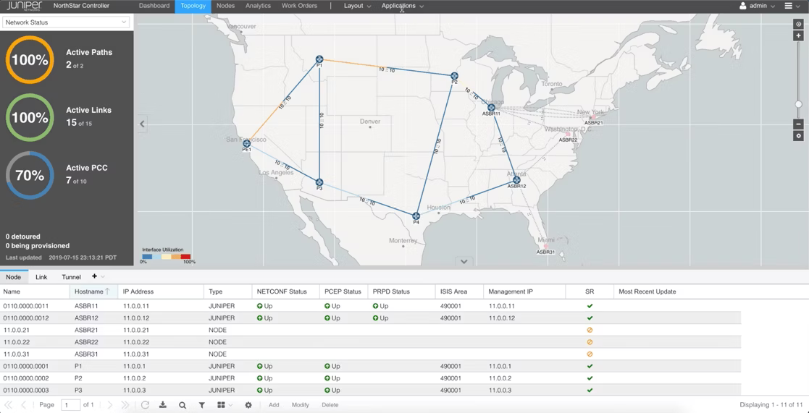
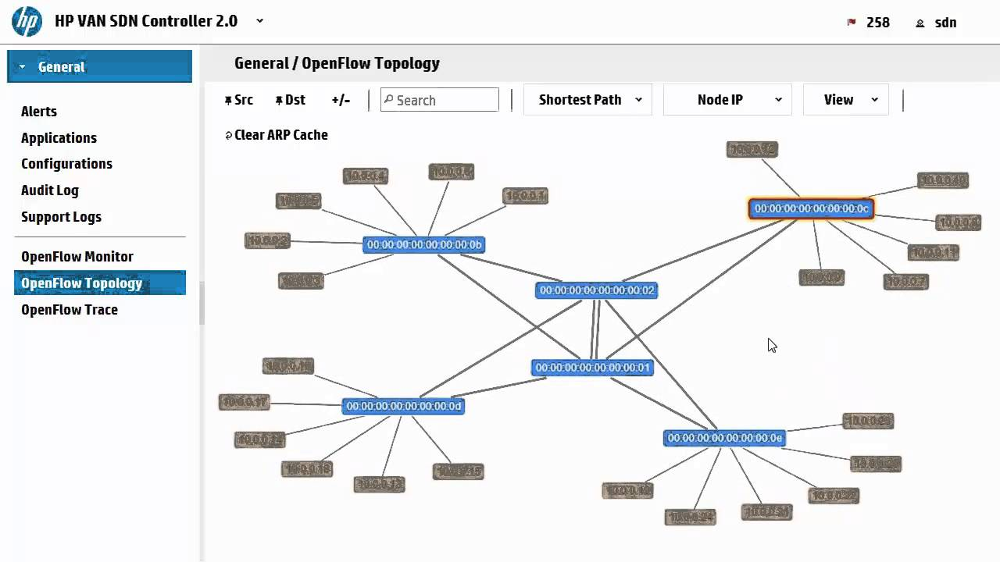

Marktanalyse {#sec:market}
============

In dieser Marktanalyse sollen Lösungen für Campusnetzwerke für kleine
bis mittelständische Unternehmen und Einrichtungen in der Größe von
Krankenhäusern, Universitäten und Hochschulen betrachtet werden. Nicht
betrachtet werden Lösungen für reine Rechenzentren zu finden bei
Cloud-Anbieter und Hyperscaler, sowie Lösungen für Privatanwender und
Kleinstunternehmen. Es werden die jeweiligen Fabric-Lösungen als auch
die Implementation gängiger Protokolle aus dem [sdn]{acronym-label="sdn"
acronym-form="singular+short"} Umfeld betrachtet.

Zur Identifikation relevanter Hersteller wird der Gartner Bericht zu LAN
und WLAN Lösungen für Unternehmen genutzt, in dem die Vision und die
entsprechende Fähigkeit die Vision zum Implementieren bewertet wird. Da
diese Quelle lediglich zur Identifikation relevanter Anbietern dient
wird sie inhaltlich nicht weiter bewertet.

{#fig:gartner1 width="100%"}

Betrachtet werden die Lösungen der Hersteller die in der Abbildung
[3.1](#fig:gartner1){reference-type="ref" reference="fig:gartner1"} im
Quadranten Leadergeführt werden. Gartner definiert ihre
Bewertungskriterien nur in einem kompletten Bericht, welche
kostenpflichtig erworben werden muss. Die Grafik wird nicht zur
Bewertung der Hersteller untereinander sondern lediglich als
Anhaltspunkt für eine Auswahl von Herstellen genutzt. Daher wird auf
eine exakte Quellenanalyse verzichtet.

Cisco
-----

Cisco bietet im Netzwerksegment drei verschiedene Switch Serien an. Die
Nexus-Serie sind die hauseigenen Rechenzentrumsswitche, die
Catalyst-Serie sind die hauseigenen Distributions- und Access Switche.
Zuletzt hat Cisco mit Meraki einen Netzwerkausrüster gekauft, und dessen
[cm]{acronym-label="cm" acronym-form="singular+short"} Switchreihe als
dritte Option in ihr Portfolio übernommen.

Mit der [npu]{acronym-label="npu" acronym-form="singular+short"} Cisco
Silicon Onehat Cisco eine programmierbare NPU im Portfolio. Der Chip
wird unter anderem bei der im Jahr 2023 angekündigten Catalyst 9000
Serie neben den Cisco eigenen [asic]{acronym-label="asic"
acronym-form="singular+short"}s mit dem Namen UADP - Unified Access Data
Plane verbaut. Dieser Chip lässt sich mit der Sprache P4 programmieren.
Dadurch lassen sich auf Basis dieses Chips Netzwerkkomponenten
entwickeln die vielfältige Anforderung erfüllen kann. Cisco selbst wirbt
damit, dass sich der Chip in traditioneller Netzwerkhardware sowie in
spezialisierten Backend-Netzwerken die nicht auf klassischer TCP/IP
Kommunikation basieren verwenden lässt. Cisco selbst baut einen dieser
Chips, den Silicon One G200, in seinen Cisco Catalyst 9500X ein, der in
der größten Ausbaustufe 8 x 400 Gbit/s und insgesamt 12,1 Tb/s
verarbeiten kann. [@sone]

Cisco unterstützt auf seinen Switchbetriebsystemen IOS-XE der Catalyst
Serie als einer der letzten Hersteller OpenFlow. Das System unterstützt
gängige Konfigurationsprotokolle und Virtualisierungstechnologien wie
VXLAN.

Cisco bietet für die gängigen Plattformen wie auch die aktuellste Cisco
Catalyst 9000 Plattform virtuelle Varianten an, welche für Trainings-
und Schulungszwecke gedacht sind. Diese sind allerdings nicht frei
erhältlich und überwiegend für die Cisco eigene Simulationsplattform
Cisco Modelling Labs gedacht, welche kostenpflichtig ist.

### Cisco Extensible Network Controller

Der Cisco Extensible Network Controller, kurz XNC ist ein klassischer
SDN Controller auf Basis des OpenDaylight Controllers. Neben dem
standardisiertem OpenFlow Protokoll nutzt der Controller proprietäre
Cisco Protokolle aus dem Cisco Open Network Environment Plattform Kit,
kurz onePK. [@xnc]

![CISCO XNC - Bildquelle: [@xnc]](media/xnc.png){width="100%"}

Die Architektur dieses Produktes folgt dem ursprünglichen Ansatz der
[onf]{acronym-label="onf" acronym-form="singular+short"}, siehe . Das
Produkt wurde 2022 abgekündigt.

### Cisco ACI

Mit der Application Centric Infrastructur, kurz ACI, hat Cisco eine SDN
Lösung im Jahr 2014 vorgestellt. Die Lösung basiert auf einem Controller
mit dem Namen Application Policy Infrastructure Controller, kurz APIC.
Als [sb]{acronym-label="sb" acronym-form="singular+short"}-Protokoll
zwischen Controllern und Hardware wir Opflex eingesetzt [@opf]. Mit dem
Cisco eigenem Protokoll lassen sich auch Geräte und Software von
Drittherstellern in die Fabric einbinden. Zudem gibt es auf der
Applikationsseite Schnittstellen zu Red Hats Ansible, Terraform und
weiteren [iac]{acronym-label="iac" acronym-form="singular+short"}
Lösungen. Zusätzlich gibt es Schnittstellen zu Applikationsplattformen
wie Kubernetes und OpenShift, um auch sich auch hier in die
Infrastruktur zu integrieren..[@aci] [@aci2]

{width="100%"}

In dieser Abbildung ist der Initialisierungsvorgang einer ACI Umgebung
in den verschiedenen Schritten beschrieben. Die Switches finden direkt
angebundene APICs per LLDP und fordern ihre Konfiguration an. Dies
Vorgang erstreckt sich nun schrittweise über die gesamte Infrastruktur.

{width="100%"}

Die Lösung basiert auf einem [uo]{acronym-label="uo"
acronym-form="singular+short"} Ansatz, auf Basis von
[vx]{acronym-label="vx" acronym-form="singular+short"} als
Transportprotokoll und IS-IS als Routingprotokoll. [@aci3] Die Lösung
wird bis heute, Stand 2023, aktiv von Cisco vertrieben.

### Cisco SD-Access

Cisco SD-Access ist die aktuelle Campus Lösung von Cisco. Mit diesem
Produkt will Cisco moderne Konzepte wie [ztna]{acronym-label="ztna"
acronym-form="singular+short"} oder Microsegmentation in skalierbaren
Netzwerken umsetzen. Die Lösung basiert auf einem
[uo]{acronym-label="uo" acronym-form="singular+short"} Ansatz und einem
dedizierten Managementcontroller Cisco Catalyst Center. Der Controller
kann lokal und in der Cloud betrieben werden. Als Transportprotokoll auf
der Dataplane wird auch hier [vx]{acronym-label="vx"
acronym-form="singular+short"} eingesetzt. Cisco setzt für die
Controlplane LISP ein. Der Grund dafür wird diskutiert [@sdlisp].

![SD-Access Fabric Roles -- Example - Bildquelle:
[@csda]](media/cisco-sda-design-guide_8.png){width="100%"}

Cisco lässt aber gewissen Freiheitsgrade bei den eingesetzten
Technologien. Das aktuelle IOS-XE unterstützt beispielsweise auch
BGP-EVPN.

Juniper
-------

Juniper bietet Netzwerkausrüstung für Service Provider, Rechenzentren
sowie für [can]{acronym-label="can" acronym-form="singular+short"} an.
Die Switche für [can]{acronym-label="can" acronym-form="singular+short"}
werden unter dem Namen EX geführt. Juniper entwickelt für diese Switche
eigene ASIC[@junasi]. Bei den [dcn]{acronym-label="dcn"
acronym-form="singular+short"} bietet Juniper auch einige Modelle auf
Basis von Broadcom Chips an, die teilweise auch offiziell SONiC
unterstützen.

Das Juniper eigene Betriebsystem nennt sich Junos-OS und unterstützt
unter anderem BGP-EVPN. Eine automatisierte und WebGUI basierende
Konfiguration und Administration eines solchen [uo]{acronym-label="uo"
acronym-form="singular+short"}-Konzeptes ermöglicht Juniper mit der
Cloudlösung Juniper Mistund der On-Premise Lösung Apstra.

### Juniper Apstra

Apstra ist ein On-Premise Controller, der als eine oder eine Viezahl von
VMs implementiert wird. Er erlaubt die Administraton und Konfiguration
von verschiedenen Netzwerkdesigns, wobei der Fokus auf Konzepten mit IP
Underlay und EVPN-VXLAN als Overlay liegt. Aspra ist ein zugekauftes
Produkt und unterstützt daher auch andere Plattformen wie Cisco Nexus,
Arista EOS und SONiC. Dafür werden auf den Switchen jeweilige Agents
installiert, welche dem Apstra-Server eine entsprechende REST-API
anbieten. [@junapstra]

### Juniper Mist

{#fig:mist width="80%"}

Juniper Mist ist eine Cloud-Anwendung zu Konfiguration, Administration
und Überwachung von Juniper Netzwerkgeräten verschiedene Architekturen
auf Basis von BGP-EVPN und VXLAN unterstützt. Diese werden in Abbildung
[3.2](#fig:mist){reference-type="ref" reference="fig:mist"} gezeigt.
Juniper wirbt mit einer KI-Integration, welche bei der Fehlerfindung und
Behebung im erheblichen Maße unterstützt. [@junevpn] [@junmist].

### Juniper Northstar

Northstar ist ein Controller für Traffic-Engineering für MPLS-Netzwerke
und IP-Netzwerke auf Basis von Segment Routing. Der Controller arbeitet
Pfad-basiert und etabliert durch Auswertung von Netzwerkauslastung und
darauffolgender Pfadberechnung einen geschlossenen Regelkreislauf.

{#fig:evpncli width="100%"}

Arista
------

Arista bietet ein breites Portfolio an Datacenter- Campusswitchen. Die
Datacenterswitche sind zu erkennen an Modellnummern mit 4 Ziffern wie
zum Beispiel 7060CX2-32S. Die Campusswitche sind zu erkennen an
Modellnummern mit 3 Ziffern wie zum Beispiel 720XP-48Y6. Die Switche
basieren vorwiegend auf Broadcom Chips [@aristams]. Arista hat ein
eigenes [sos]{acronym-label="sos" acronym-form="singular+short"} mit dem
Namen EOS. Es gibt eine virtuell Variante, vEOS, und einer
containerisierte Variante, cEOS. Beide sind für den produktiven Betrieb
gedacht.

Aristas Linux-basiertes Switch-Betriebssystem EOS wirbt mit einer großen
Bandbreite von Schnittstellen über alle Ebenen um diese in
[sdn]{acronym-label="sdn" acronym-form="singular+short"} Konzepte zu
integrieren. EOS steht für Extensible Operating System. Arista wirbt mit
der Möglichkeitet dieses Betriebssystemen mit RPM-Packages einfach
erweitern zu können um beispielsweise neue Protokolle implementieren zu
können. Neben OpenFlow hat Arista ein funktional erweitertes Protokoll
mit dem Namen DirectFlow entwickelt, um Flow-Regeln in den Switch zu
programmieren. Dies nutzte eine Firewall Lösung von Palo Alto, um
Regelwerke direkt auf den Switches zu implementieren [@aristapalo]. Als
weitere Programmierschnittstellen nennt Arista bei seinem EOS:

-   Linux

-   EOS extensible APIs (eAPIs) using JSON

-   Open source Go, Python and Ruby based object models

-   Native Go and Python on box scripting

-   XMPP

-   Advanced Event Manager

-   SQLite Databases

-   OpenFlow und DirectFlow

-   EOS SDK

Zusätzlich beherrscht EOS die gängigen [uo]{acronym-label="uo"
acronym-form="singular+short"} Protokolle wie VXLAN.

![Arista Open Networking - Bildquelle:
[@aon]](media/Open-Networking-1.png){#fig:arista1 width="100%"}

In Abbildung [3.4](#fig:arista1){reference-type="ref"
reference="fig:arista1"} sind die vielfältigen Einsatzmöglichkeiten und
Arista Hardware sowie dem Arista eigenen [sos]{acronym-label="sos"
acronym-form="singular+short"} gezeigt. So erlaubt Arista den Einsatz
andere Software auf Ihren Switchen und stellt einen containerisierte
Variante ihres [sos]{acronym-label="sos" acronym-form="singular+short"}
bereit, um dieses auf Fremdhardware einzusetzen. Als Hardwareabstraktion
wird [sai]{acronym-label="sai" acronym-form="singular+short"} genutzt.
Es wird zum Beispiel der Facebook Switch Wedge 100 von Arista
unterstützt [@aristaoh].

Die Bemühungen von Arista zeigen sich in der frühen Unterstützung von
OpenFlow, welche allerdings wieder entfernt wurde, sowie einer
entsprechenden Weiterentwicklung unter dem Namen Directflow . Arista
setzt anstelle von ONIE ihre eigene Lösung Abootein, die es ermöglicht
andere [sos]{acronym-label="sos" acronym-form="singular+short"} zu
installieren. Aristas EOS unterstützt die gängigen offenen und
standardisierten Konfigurationsprotokolle.

Weiterer nennenswerter Bestandteil des Portfolios ist die 7170 Serie.
Dieser Switch basiert auf dem P4 programmierbaren Intel Tofino
[npu]{acronym-label="npu" acronym-form="singular+short"}. Dies nutzt
Arista dafür, um den Switch mit verschiedenen Anwendungsprofilen
anzubieten und Features dyamisch implementieren zu können. Dazu gehören
die Profile Network Service Offload, Stateless Cloud Load Balancing,
Broadcast Media Tools und einige mehr. Der Switch wird mit Aristas EOS
betrieben, welches auch hier kein P4Runtime unterstützt. [@aristap4]

### CloudVision

Unter dem Namen CloudVision vertreibt Arista eine Controller-basierte
Lösung zur WebGUI basierten Administration von Netzwerken. Kern ist eine
Managementinstanz die per gRPC Netzwerkhardware mit dem hauseigenen
Betriebssystem EOS konfiguriert. Arista unterstützt dabei mehrere
Netzwerkkonzepte, welche jeweils als Configlets in dem Git Account des
Herstellers finden lassen. Die Configlets können über den CloudVision
Controller an der Netzwerkhardware angewendet werden. BGP-EVPN ist eine
der möglichen Netzwerkarchitekturen[@aristaevpn]. Weiterhin bietet
Arista mit NetDB eine Möglichkeit reichhaltige Telemetriedaten von den
Geräten zu sammeln. [@cve] Auch unter CloudVision bietet Arista eine
direkte Integration mit einer PaloAlto Firewall um Regeln direkt im
Netzwerk zu implementieren [@aristapalo2].

![Arista Open Networking - Bildquelle:
[@aristacvds]](media/arista-cloudvision-api.png){#fig:aristaapi
width="100%"}

Die Abbildung [3.5](#fig:aristaapi){reference-type="ref"
reference="fig:aristaapi"} zeigt den Einsatz von gRPC als Interface zu
den eigenen Switchen hin. Der Controller bietet eine Integration zu
VMWares SDN-Lösung NSX.

HPE Aruba
---------

HPE hat lange Zeit Switche unter dem Namen ProCurveangeboten die mit dem
Betriebssystem ProVision ausgeliefert worden sind. Nach der Akquisition
von Aruba, einem Hersteller von hauptsächlich Wireless-Komponenten,
wurden die Switche unter Aruba vermarktet und das Betriebsystem in
ArubaOS-Switch umbenannt. Mittlerweile vertreibt HPE mit dem Markennamen
Aruba sowohl Campus- als auch Datacenterswitche mit dem neuentwickeltes
Betriebsystem ArubaOS-CX. Zusätzlich vertreibt HPE Netzwerkhardware des
chinesischen Herstellers H3C mit dem Betriebsystem Comware unter eigenem
Namen.

Das Betriebssystem ArubaOS-CX ist bedienbar über eine klassische CLI
sowie eine Rest-API, welche laut Hersteller alle Funktionen der CLI
abdeckt. Es sind keine weiteren standardisierten Schnittstellen wie
NETCONF oder gNMI implementiert.

Während die ProCurve Geräte von HPE mir ProVision noch OpenFlow
unterstützt haben,

### HPE VAN SDN Controller

{width="100%"}

Der Controller, der später umbenannt wurde zu Aruba VAN SDN Controller,
ist ein Controller auf Basis von OpenFlow. Ausgehend von den
Dokumentation wirkt der Funktionsumfang dieses Controller relativ
ausgereift. Das Produkt ist abgekündigt. [@hpevan]

### Aruba Central

Aruba Central ist ein Controller zur Konfiguration und Administration
von Aruba Geräten. Der Controller kann On-Premise und in der Cloud
betrieben werden. Der Controller spricht per HTTP mit den angebundenen
Aruba-CX Geräten. Aruba Central NetConductor Unterstützt bei der
Errichtung von [uo]{acronym-label="uo"
acronym-form="singular+short"}-Netzwerkarchitekturen mittels einem
Fabric Wizard, bietet eine Telemetrie mit Network Insights und Dienste
wie [nac]{acronym-label="nac" acronym-form="singular+short"}. Als
Protokolle werden unter anderem [vx]{acronym-label="vx"
acronym-form="singular+short"} und BGP-EVPN unterstützt [@arubac].

DELL
----

DELL hat im Jahr 2011 den Netzwerkausrüster Force10 übernommen. Die bis
dahin angebotenen Geräte waren im Auftrag gefertigte Hardware von
Broadcom und Marvell Technology Group, welche das PowerConnect Logo
trugen. Zusätzlich wurden Netzwerkgeräte von Juniper und Brocade mit dem
PowerConnect Logo angeboten. Durch die Übernahme von Force10 stieg DELL
in den Enterprise-Netzwerk Markt ein. Diese Entwicklung führt zu
mehreren DELL eigenen [sos]{acronym-label="sos"
acronym-form="singular+short"}en mit den Namen DNOS6, DNOS9 und dem
aktuellstem Ableger OS10.

-   **DNOS6** - Ehemaliges PowerConnect OS. Läuft überwiegend auf der
    DELL N-Serie, einfache Access Switche

-   **DNOS9** - Ehemaliges Force10 OS, wurde zusammen mit dem Hersteller
    übernommen und weiterentwickelt.

-   **DNOS10** - Dell eigenentwickeltes und Linuxbasiertes Smart
    Fabric[nos]{acronym-label="nos" acronym-form="singular+short"}.

Ein Großteil des Switchportolios von DELL basiert auf Broadcom-Chips.
Dell hat einige [on]{acronym-label="on"
acronym-form="singular+short"}-Switche mit [onie]{acronym-label="onie"
acronym-form="singular+short"} im Portfolio die teilweise offiziell für
Cumulus Linux sowie für SONiC unterstützt werden. DELL bewirbt aktiv den
Einsatz von SONiC auf den eigenen Switchen. Cumulus wird bei neuen
Geräten nicht mehr unterstützt.

Das aktuellste DELL OS10 unterstützt OpenFlow. Dell hat keinen eigenen
OpenFlow-Controller im Portfolio.

### SmartFabric

{width="100%"}

Dell bietet mit SmartFabric ebenfalls einen eigenes Managementsystem an.
Dieser läuft nicht als dedizierter Controller, sondern ist ein
verteiltes System auf mehreren DELL OS10 Switchen. Die einzelnen Switche
bilden einen Cluster und wählen einen Master. Die Switche müssen dafür
in einen speziellen L3FABRICBetriebsmodus geschaltet werden. Nun kann
eine Fabric auf Basis Basis eines Layer-3 BGP Underlays und eines VXLAN
Overlays provisioniert werden. Die Rollen jeweiligen Rollen Leaf und
Spine werden statisch zugewiesen. Die Leaf Pärchen werden per VLTi in
ein [mlag]{acronym-label="mlag" acronym-form="singular+short"}-Verbund
gekoppelt. Die Lösung ist eng integriert in Dells
[hci]{acronym-label="hci" acronym-form="singular+short"} Plattform
VXRail.

EXTREME
-------

Extreme bietet über den Zukauf vieler Hersteller über die Jahre ein
breites Portfolio von Lösungen. Aktuell vermarktet Extreme für den
Campus Bereich hauptsächlich Universal-Switche, welche in der Lage sind
zwei hauseigene Betriebssysteme auszuführen. Zum einen gibt es EXOS, ein
Extreme eigenes Betriebssystem was durch die Jahre durch die Integration
von Funktionen zugekaufter Betriebsysteme wie EOS von Enterasys
profitiert hat. Das Betriebsystem wird mittlerweile Switching Engine
genannt und ist auf traditionelle Netzwerke spezialisiert. Es
unterstützt VXLAN sowie eine proprietäre Variante einer Funktionalität
wie BGP-EVPN.

Die Extreme Switche basieren auf Broadcom-Asics. Die aktuellen
Universall-Switche basieren auf ONIE, erlauben allerdings nicht die
Installation von dritten [sos]{acronym-label="sos"
acronym-form="singular+short"}

Extreme hatte zeitweise eine Unterstützung für OpenFlow in EXOS, sowie
einen eigenen Controller im Portfolio [@exofc].

Es findet sich im Portfolio mit dem Extreme 9920 eine Plattform auf
Basis des Intel Tofino 2. Hierbei handelt es sich um einem modularen
Core-Switch. Auch hier wird die Programmierbarkeit lediglich intern
verwendet, es werden keine Schnittstellen wie die P4Runtime
bereitgestellt. [@exp4]

### Extreme Fabric

Zusätzlich gibt es VOSS, ein von Avaya dazugekauftes
[sos]{acronym-label="sos" acronym-form="singular+short"} welches für
eine Fabric optimiert ist. Als Enkapsulierung wird allerdings IEEE
802.1ah - Provider Backbone Bridging welches anders als VXLAN auf
Layer-2 Ebene arbeitet und nicht auf Layer-3 Ebene. Also
Overlay-Controlplane wird 802.1aq Shortes Path Bridging eingesetzt,
welches Erreichbarkeitsinformationen mittels dem Routing-Protokoll IS-IS
verteilt.

### Extreme IP Fabric

OpenFlow Controller
-------------------

Auf der Suche nach OpenFlow-basierten Kontrollern stellt man fest, dass
die Webseiten und Dokumentationen auf die man stößt größtenteils
veraltet sind. Kommerzielle Produkte wie HPE VAN oder der Cisco XNC sind
abgekündigt. Mit Lumina, einem Anbieter einer kommerziellen OpenDayLight
Version, hat einer der letzten Anbieter im Jahr 2020 das Geschäft
eingestellt. Lumina ging als Ausgliederung der [sdn]{acronym-label="sdn"
acronym-form="singular+short"}-Sparte von Brocade hervor.[@lumina] Die
Weiterentwicklung von Junipers Contrails, Tungsten Fabric hat ebenfalls
das Projekt eingestellt. Verfügbar bleiben daher im wesentlichen
Community-gepflegte quelloffene Projekte.

Die derzeit populären drei offenen Projekte sind OpenDayLight, FAUCETund
ONOS. Die Projekte haben unterschiedliche Fokussierungen in ihrer
Anwendung. Faucet ist ein auf Basis von dem Framework RYUentwickelter
einfach gehaltener Controller. Er stellt die grundlegend notwendigen
Funktionen für ein Netzwerk bereit. OpenDayLight ist ein deutlich
größeres und modulares Projekt, welches im speziellen für eine
Integration in eine OpenStack Umgebung gedacht ist. ONOS besitzt die
selbe modulare Architektur wie OpenDayLight, der Fokus liegt allerdings
auf großen Backbone- und Carriernetzwerken.

Im folgenden wird ein Blick auf die Anzahl der eingereichten
Code-Änderungen in den Github-Repositories der einzelnen Projekte
geworfen. Daraus soll eingeschätzt werden inwieweit die Projekte aktuell
gepflegt werden.

{width="100%"}

{width="100%"}

{width="100%"}

Diese Graphen sind nicht vollständig repräsentativ da bei dem
OpenDaylight und dem ONOS Projekt der originale Code auf gerrit gehostet
wird. Die Repositories in Github sind Spiegelungen. Ein Trend ist
dennoch zu erkennen. Während das Projekt ONOS praktisch keine
Weiterentwicklung mehr erfährt, wird der OpenDaylight Controller und
Faucet derzeit noch gepflegt.

### OpenDayLight

Der OpenDayLight Controller ist ein quelloffenes Projekt verwaltet durch
die LinuxFoundation und ist für viele synonym für
[sdn]{acronym-label="sdn" acronym-form="singular+short"}-Controller. Das
Projekt ist hauptsächlich in Java geschrieben. Als
[sb]{acronym-label="sb" acronym-form="singular+short"}-Protokoll
unterstützt der Controller neben [of]{acronym-label="of"
acronym-form="singular+short"} Netconf, OVSDB und einige andere. Eine
Weboberfläche mit dem Namen DLUXwird nicht mehr weiterentwickelt. Der
Controller ist keine fertige Anwendung zum Bau eines
Unternehmensnetzwerkes. Er ist die Basis einiger Kommerzieller
Anwendungen wie Cisco XNC oder dem Lumina SDN Controller, welche
allerdings mittlerweile wie bereits erwähnt abgekündigt sind. Was
OpenDayLight heute bietet, ist eine Abstraktionsschicht für die
Konfiguration von Netzwerkgeräten mit verschiedenen Protokollen.
Hauptsächlich wird der Controller in OpenStack-Umgebungen eingesetzt,
wobei hier eine enge Integration besteht.

### Faucet

Faucet ist ein quelloffenes Projekt welches auf Ryu basiert. Ryu ist ein
Python Framework welches für Faucet [of]{acronym-label="of"
acronym-form="singular+short"} implementiert. Faucet ist im Gegensatz zu
den beiden vorher genannten Projekten vollständig auf den Bau von
[of]{acronym-label="of" acronym-form="singular+short"}-basierten
Netzwerken ausgerichtet. Ein erster Blick in die Doku verrät, dass
Faucet dafür viele relevanten Komponenten wie ACLs, VLANs sowie Routing
zwischen VLANs unterstützt. Zusätzlich kann Faucet 802.1X Pakete
abfangen und an einen Controller weiterleiten. Mit dem Projekt chewie,
welches ebenfalls von Faucet betrieben wird, gibt es sogar einen
integrierten Authentifizierungsdienst welcher per gegen einen Radius
Server Clients an einem Port authentifizieren kann. Die Dokumentation
von Faucet ist im Vergleich zu ONOS und OpenDaylight deutlich besser und
größtenteils vollständig. Faucet bietet ein fertiges Konzept Metriken in
dem Netzwerk zu erheben und über ein Stack mit Prometheus und Grafana zu
visualisieren.

### ONOS

ONOS geht aus der [onf]{acronym-label="onf"
acronym-form="singular+short"} hervor und ist das größte hier genannte
Projekt. ONOS selbst basiert wie OpenDayLight auf Modulen und lässt sich
dadurch beliebig in seiner Funktionalität erweitern. Das Einsatzgebiet
von ONOS ist aber überwiegend große Carrier-Netzwerke. Die Unternehmen
die als Referenz genannt werden oder selbst zu dem Projekt beitragen
sind ausschließlich Betreiber großer Netzwerke, wie zum Beispiel Google
oder die Telekom.

ONOS bietet eine Weboberfläche sowie grundlegende Module von Bau von
Netzwerken. Mit den Modulen org.onosproject.openflow,
org.onosproject.fwdund org.onosproject.gui2ein einfaches Netzwerk zu
bauen. Durch die Module wird den Namen entsprechend
[of]{acronym-label="of" acronym-form="singular+short"} implementiert,
eine einfache Paket-Weiterleitungslogik sowie eine Weboberfläche
implementiert. Weitere Module erlauben die Implementierung einer VLAN
Funktionalität sowie einfaches Routing und Routingprotokolle wie BGP.

Open-Networking
---------------

### Offene Switchbetriebsysteme

In diesem Kapitel werden [sos]{acronym-label="sos"
acronym-form="singular+short"} vorgestellt welche ohne eine dedizierte
Hardware vertrieben werden. Es gibt am Markt neben einigen offenen
Projekten auch kommerzielle Produkte. Zu den relevantesten kommerziellen
Anbietern gehören Pica8 mit ihrem PicOS, ipinfusion mit OcNOS und Big
Switch Networks. Big Switch Networks gehört mittlerweile zu Arista, die
Produkte sind in das Portfolio von Arista übergegangen. Ipinfusion
ziehlt hauptsächlich auf große Carrier Netzwerke ab. Relevante offene
Projekte sind ONL, Cumulus Linux sowie SONiC.

Ope

#### ONL

Open-Networking-Linux ist eine Linux-Distribution für Switche und dient
als Referenz [sos]{acronym-label="sos" acronym-form="singular+short"}
beziehungsweise Grundlage für weitere Projekte. Betreut wird das Projekt
von dem OPC - Open Compute Project. ONL ist wird als Grundlage für
kommerzielle Produkte wie unter anderem Ciscos IOS-XR und Big Switches
SwitchLight OS eingesetzt. ONL ist damit eher als Framework zu sehen, da
es auch kaum für den Betrieb eines Netzweres notwendigen Funktionen
integriert hat.

ONL bietet im Unterschied zu einer einfachen Linux Distribution wie zum
Beispiel Debian, auf dem ONL basiert, die ONLP [api]{acronym-label="api"
acronym-form="singular+short"}. Diese Schnittstelle bietet einem
Anwendungsentwickler einen standardisierten Zugriff auf die typischen
Hardware Komponenten eines Switches wie zum Beispiel Netzteile, Lüfter
und [sfp]{acronym-label="sfp" acronym-form="singular+short"}s. Auf der
Liste der unterstützten Switche finden sich 103 Geräte, unter anderem
von Edge-Core, Dell, Mellanox, HPE. Bis auf die Ausnahme von den
Mellanox Geräten basieren alle Geräte auf Broadcom Chips. Mellanox
Geräte basieren auf selbstentwickelten Mellanox SpectrumChips.

Zur Programmierung der eigentlichen [dp]{acronym-label="dp"
acronym-form="singular+short"} unterstützt ONL die Abstraktionen OF-DPA,
OpenNSL und SAI. ONL unterstützt damit hardwaregestützte
Paketweiterleitung. Die Broadcam ASICs werden zum Beispiel über die
Broadcom eigenen OpenNSL Bibliotheken eingebunden.

#### Cumulus Linux

Cumulus Linux, entwickelt von Cumulus Networks, ist einer der ersten
größeren offenen Projekten das eine relevante Verbreitung las offenes
[sos]{acronym-label="sos" acronym-form="singular+short"} erreichen
konnte. Cumulus wird von vielen als Pionier bezeichnet, da es nicht nur
eine breite Palette an Hardware unterstützt sondern mit unter anderem
VLXAN auch viele wichtigen Funktionen zum Einsatz in
[can]{acronym-label="can" acronym-form="singular+short"}en integriert
hat.

Cumulus nutzt zu großen Teilen den regulären Linux-Netzwerkstack.
Dadurch erscheinen die Interfaces eines Switches als Linux-Interface und
lassen sich über bekannte Methoden konfigurieren. Parallel gibt es eine
integrierte CLI welche die Konfiguration über Kommandos in gewohnter
Manier erlaubt.

![Cumulus Architektur - [@cumarch]](media/nvue-architecture.png){#fig:nv
width="100%"}

Wie in Abbildung [3.6](#fig:nv){reference-type="ref" reference="fig:nv"}
gezeigt, wandelt die Nvidia-Shell eingegebene Befehle primär in unter
Linux bekannten Konfiguration. Als Schnittstelle zwischen der
Konfiguration und der eigentlich [dp]{acronym-label="dp"
acronym-form="singular+short"} in Form eines ASICs fungiert der Dienst
switchd. Damit Cumulus mit hardwaregestützten Paketweiterleitung
eingesetzt werden kann, muss ein entsprechender ASIC hier integriert
werden. Die Liste der unterstützten Hardwareplattformen beinhaltet auch
hier hauptsächlich Broadcom basierte Geräte von Edge-Core, Dell und
weiteren, sowie die Plattformen von Mellanox auf Basis der
Mellanox-eigenen Chips.

Vermutlich weil Mellanox mit ihren eigenen Chips in direkte Konkurrenz
mit Broadcom stehen, hat Broadcom Cumulus den Zugriff auf die
Entwicklungstools für Ihre Chips versperrt. Dies sowie die Übernahme von
Cumulus und Mellanox durch NVIDIA schürte Zweifel bei den Kunden an dem
Interesse an der Offenheit des nun NVIDIA Cumulus heißenden
[sos]{acronym-label="sos" acronym-form="singular+short"}.

#### SONiC {#sec:sonic}

Für viele der inoffizielle Nachfolger von Cumulus ist SONiC. SONiC steht
für Software for Open Networking in the Cloud. Ursprünglich von
Microsoft für die Azure Cloud entwickelt steht dieses Projekt nun unter
der Linux Foundation. SONiC hat dadurch das es bereits in der Azure
Cloud eingesetzt wird, und zum Beispiel von DELL als offizielles
präferiertes [sos]{acronym-label="sos" acronym-form="singular+short"}
empfohlen wird, hat es großes Potential sich zu einem defacto Standard
zu entwickeln.

![SONiC Architektur - [@sonarch]](media/sonarch.png){#fig:sonarch
width="100%"}

In Abbildung [3.7](#fig:sonarch){reference-type="ref"
reference="fig:sonarch"} ist die Architektur von SONiC dargestellt.
Maßgebender Unterschied ist die Art wie verschiedene ASICs integriert
werden. Während bei den vorher vorgestellten Systemen es notwendig war
jede spezielle ASIC API entsprechend zu integrieren, muss für SONiC sich
der Entwickler des ASICs über die SAI nach oben integrieren. Hardware
vendors are expected to provide a SAI-friendly implementation of the SDK
required to drive their ASICs.[@saiasic]. SONiC hat mit seiner
Verbreitung die Möglichkeit, Hardwarehersteller dazu zu bringen sich an
den SAI Standard zu halten.

### Open-Networking Hardwareplattformen

   Anbieter        Plattform               NPU          Boot Loader     Supported 3rd Party OS    
  ----------- -------------------- ------------------- ------------- ---------------------------- --
     CISCO     8000 Series Router      SiliconOne          ONIE                 SONiC             
    Juniper       ua. QFX 5200      Broadcom Tomahawk      ONIE                 SONiC             
    Arista     einige DCS-7000er    Broadcom diverse       Aboot                SONiC             
    Arista         DCS-7170er         Intel Tofino         Aboot                SONiC             
   HPE Aruba           \-                  \-               \-                    \-              
   HPE Aruba     S, Z, E Serie      Broadcom diverse.      ONIE         SONiC, Cumulus, Picos     
    EXTREME            \-           Broadcom diverse.      ONIE                   \-              
    NVIDIA          SN-Serie         Nvidia Spectrum       ONIE             Cumulus, SONiC        
   EdgeCore           Alle          Broadcom diverse       ONIE       SONiC, Cumulus, Picos uvm.  

**Cisco** bietet mit dem 8000 Series Router eine Plattform an, welche
ein spezielles OpenBios mit offenen Firmware implementierungen hat. Nur
auf dieser ist eine Installation von ONIE möglich. Der SiliconOne
unterstützt in dieser Plattform das SAI und wird darüber von SONiC
unterstützt. [@ciscosonic]

**Juniper** unterstützt mit mehreren Switchen auf Basis des Broadcom
Tomahawks aus der QFX Serie offiziell SONiC. Da alle aktuellen Switche
mit von Jupiter mit ONIE vorinstalliert werden ist die Installation von
anderen Betriebssysteme wie Cumulus prinzipiell möglich, allerdings ist
dies nicht offiziell unterstützt und so können Treiber für zum Beispiel
die Lüftersteuerung fehlen. Ebenso problematisch ist der Einsatz auf
Juniper Geräten mit eigenen Juniper ASICs wie dem Juniper Q5.

**Arista** bietet für eine große Anzahl seiner Switche eine
entsprechende SAI Implementierung und Treiber in Ihrem GitHUB, es gibt
aber auch fertige Images im SONiC Repository. Auf den eigenen Geräten
setzt Arista kein ONIE sondern Aboot ein. Interessanterweise gibt es für
Arista EOS eine Version für ONIE die ebenfalls SAI unterstützt.
[@aristaon]

**HPE** verkauft viele Switchserien von Fremdherstellern die
verschiedene Betriebssysteme unterstützen. Die aktuellen HPE Aruba
Switche unterstützen keine Installation von dritten Betriebssystemen. Da
Aruba aktuell eigene Asics einsetzt ist eine Implementation schwierig.

**Dell** unterstützt in den aktuellen Serien, die auch zu großen Teilen
den Namenszusatz ON für Open Networking tragen viele Betriebssysteme.
Das ist möglich durch offene Broadcom SDKs sowie ONIE.

Obwohl die aktuellen **Extreme Networks** Switche auf Broadcom Chips
basieren sowie ONIE unterstützen erlaubt Extreme keine fremden
Betriebssysteme auf Ihren Switchen und stellt keine Schnittstellen
bereit.

Die ehemaligen Mellanox Switche, welche von **NVIDIA** übernommen worden
sind, basieren auf eigenen ASICs. Diese werden von Cumulus unterstützt
und haben selbst eine SAI Implementierung. Ebenfalls unterstützt wird
noch Onyx, das ehemalig Mellanox eigene Betriebssystem.

**Edgecore** gehört zu den Whitebox Herstellern die Switche auf Basis
von Broadcom Chips und ONIE ohne eigenes Betriebsystem vertreiben.
Dadurch sind die vorallem auf die Unterstützung von offenen
Betriebsystemen angewiesen und unterstützen alle gängigen
Softwareplattformen,

Protokollimplementationen
-------------------------

In diesem Abschnitt soll eine tabellarische Übersicht über die
Implementation in dieser Thesis genannten Protokolle und Technologien
gegeben werden.

::: {#tab:dpp}
       Plattform          OpenFlow       P4Runtime   BGP-EVPN     
  ------------------- ----------------- ----------- ---------- -- --
     CISCO IOS-XE         Latest^1^         \-        Latest      
       Junos OS        14.2R-Latest^1^      \-        Latest      
      Arista EOS          4.15-4.29         \-        Latest      
   ArubaOS-Switch^2^       Latest           \-          ?         
      ArubaOS-CX             \-             \-        Latest      
   HPE Comware(H3C)          \-             \-        Latest      
       DELL OS10          Latest^1^         \-        Latest      
     Extreme EXOS       15.3-30.4^1^        \-          ?         
     Extreme VOSS            \-             \-          \-        
         SONiC               \-            PINS       Latest      
        Stratum              \-            Nativ        \-        
      OpenvSwitch          Latest         Geplant       \-        

  : Dataplane SDN Protokolle
:::

-   1 - Hardwareabhängig

-   2 - Ehemaliges HPE Provision

In der Tabelle [3.1](#tab:dpp){reference-type="ref" reference="tab:dpp"}
werden die aktuellen Implementierungen von Protokollen zur
Programmierung einer Dataplane eines Switches durch einen Controller
gezeigt. Es fällt auf, dass sowohl Arista als auch Extreme OpenFlow
nicht mehr in den aktuellen Betriebssystemen unterstützt. Die beiden
sehr aktuellen offenen Betriebssysteme unterstützen ebenfalls kein
OpenFlow. Stratum ist derzeit das einzige System, dass P4Runtime
vollständig untersützt. Für den OpenVSwitch finden sich im Internet
Vorschläge [@ovsp4], für SONiC wurde es in den aktuellsten Versionen
bereits über PINS implementiert [@sonicpins].

Evaluation und Simulation ausgewählter Konzepte
