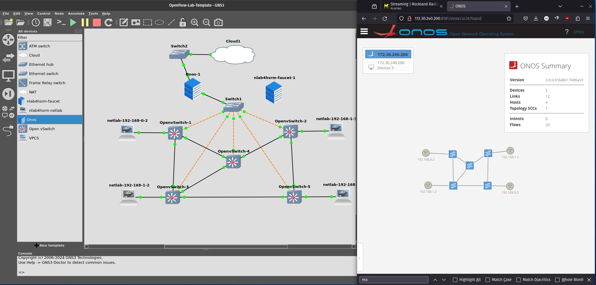
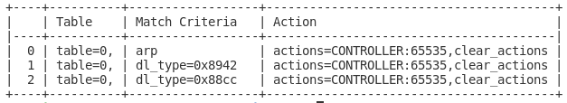
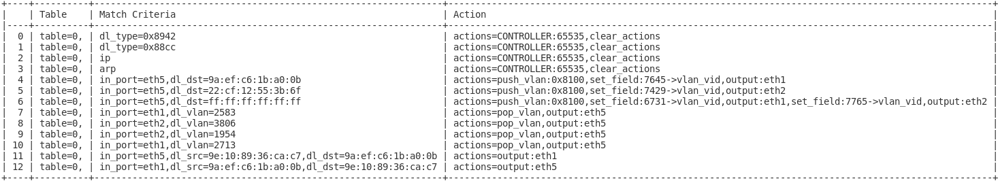

OpenFlow Lab II - Pfadbasiertes Forwarding mit ONOS
===================================================

Auch dieser Ansatz ist asymmetrisch weil Controller-basiert. Der
Unterschied besteht darin, dass der Controller kein Regelwerk zum
Nachbau eines klassischen Netzwerkes wie im ersten Ansatz implementiert,
sondern für Kommunikationsbeziehungen jeweils Pfade implementiert. Der
ONOS Controller arbeitet auf diesem Prinzip und wird daher zur
Veranschaulichung genutzt.

{#fig:onostop
width="100%"}

Die Funktionsweise dieses Prinzips wird an der gleichen
Netzwerktopologie wie im Kapitel [5.1](#sec:of1){reference-type="ref"
reference="sec:of1"} gezeigt.

#### Layer-2 Fabric - Reactive Forwarding

ONOS ist lediglich eine Controller-Plattform. Funktionen werden mittels
Plugins hinzugefügt. Die Weiterleitung von Paketen wird in diesem Fall
über das Plugin Reactive Forwarding implementiert. Auch OpenFlow wird
als Treiber über ein Plugin in ONOS integriert.

Sobald sich die Switche mit dem ONOS Controller per
[of]{acronym-label="of" acronym-form="singular+short"} verbunden haben
werden folgende Regeln in die Switche programmiert:

{width="100%"}

Jeder Regel besteht aus einem Kriterium für die Paketet auf die sie
angewendet werden soll - Match Criteria, und einer Aktion die im
Anschluss mit dem Paket ausgeführt werden soll Action. Die drei Regeln
sorgen dafür, dass alle ARP, LLDP und BDDP Pakete an den Controler
geschickt werden. Durch die LLDP Pakete lernt ONOS die Topologie. Durch
die abgefangenen ARP Requests lernt der Controller MAC zu entsprechenden
IP Adressen und den Ort der Hosts. Durch die ARP Requests erkennt der
Controller die Absicht eines Hosts zu einem anderen Host eine
Kommunikation aufzubauen und kann einen entsprechenden Pfad
Implementieren.

{width="100%"}

Nach einem empfangenen ARP-Request, in diesem Fall durch einen Ping
zwischen den beiden Hosts nlab4hsrm-netlab-1 und nlab4hsrm-netlab-2 aus
Abbildung [6.1](#fig:onostop){reference-type="ref"
reference="fig:onostop"} verursacht, sind drei neue Regeln in dem Switch
1 zu finden. Anstelle eines komplexen Regelwerkes wird nur mittels
zweier Regeln ein exakter Pfad zwischen den beiden Hosts hergestellt und
Pakete auf Basis Ihrer Mac-Adresse weitergeleitet.

In dieser Variante ist das Netzwerk floodless, Broadcasts werden
prinzipiell nicht weitergeleitet. Es ist allerdings durch weitere
Plugins möglich Broadcast-Domänen zu spezifizieren und damit Broadcasts
für Nutzer des Netwerkes zu ermöglichen.

{width="100%"}

Die Konfiguration des VLAN-Plugins resultiert in einem erweiterten
Regelwerk. Die ersten vier Regeln bleiben identisch. Bei den Regeln für
die eingehenden Pakete auf Port eth5 wird als erste Aktion das Paket mit
dem Wert 0x8100 als ein nach IEEE 802.1p markierten Frame markiert.
Anschließend wird die VLAN-ID in das entsprechende Feld geschrieben. Mit
Regel 6 wird eine Regel zur Behandlung von Broadcasts implementiert.

### Netzwerk Visibilität

{width="100%"}

Ein großer konzeptioneller Vorteil von dieser Art von Netzwerken ist,
dass der Zustand des Netzwerkes dem Controller bekannt ist. Auf Basis
dieser Informationen sind Entscheidungen zu optimalen Pfaden möglich.
ONOS kann in der Weboberfläche die Auslastung von Links darstellen.

Simulation
----------

In dieser Simulation wird das gleiche Template, Netzwerktopologie sowie
Switche mit identischer Konfiguration wie aus
[5.1](#sec:of1){reference-type="ref" reference="sec:of1"} verwendet.
Einzig der Faucet-Controller wird durch den ONOS Controller
ausgetautscht.

Der **ONOS**-Controller wird ebenfalls als Docker-Container
implementiert und kann direkt aus dem GNS3-Marktplatz installiert
werden. Dies ist in dem Template bereits vorbereitet.

### Konfiguration ONOS

Switche: OVS Controller: ONOS

``` {caption="ONOS Interface Konfiguration für VPLS"}
"of:0000000000000003/5": {
            "interfaces": [
                {
                    "name": "v100-3-5",
                    "mac": "A4:23:05:00:00:00",
                    "vlan": "100"
                }
            ]
        },
        "of:0000000000000002/5": {
            "interfaces": [
                {
                    "name": "v100-2-5",
                    "mac": "A4:23:05:00:00:00",
                    "vlan": "100"
                }
            ]
        }
```

Die Konfiguration der VLANS erfolgt durch JSON-Dateien auf dem
Controller. Jedes Interface in dem OpenFlow Netzwerk ist spezifiziert
durch eine Bridge-ID und einer Port-Nummer. Im Beispiel wird auf der
Bridge und jeweils auf dem Port 5 ein VLAN gelegt.

### OVS Cheatsheet

``` {caption="Faucet Commands"}
# Show OpenFlow Port Mapping
ovs-vsctl -- --columns=name,ofport list Interface
# Dump Flows of Bridge
ovs-ofctl dump-flows of --protocols=OpenFlow13


# Configure OpenFlow Bridge
ovs-vsctl add-br of
ovs-vsctl set bridge of protocols=OpenFlow13
ovs-vsctl set bridge of fail_mode=secure
ovs-vsctl set bridge of other-config:datapath-id=0000000000000005
ovs-vsctl set-controller of tcp:10.0.0.250:6653


ovs-vsctl del-port eth1
ovs-vsctl add-port of eth1
ovs-vsctl set Interface eth1 ofport_request=1
ovs-vsctl del-port eth2
ovs-vsctl add-port of eth2
ovs-vsctl set Interface eth2 ofport_request=2
ovs-vsctl del-port eth3
ovs-vsctl add-port of eth3
ovs-vsctl set Interface eth3 ofport_request=3
ovs-vsctl del-port eth4
ovs-vsctl add-port of eth4
ovs-vsctl set Interface eth4 ofport_request=4
ovs-vsctl del-port eth5
ovs-vsctl add-port of eth5
ovs-vsctl set Interface eth5 ofport_request=5
ovs-vsctl del-port eth6
ovs-vsctl add-port of eth6
ovs-vsctl set Interface eth6 ofport_request=6
ovs-vsctl del-port eth7
ovs-vsctl add-port of eth7
ovs-vsctl set Interface eth7 ofport_request=7
ovs-vsctl del-port eth8
ovs-vsctl add-port of eth8
ovs-vsctl set Interface eth8 ofport_request=8
ovs-vsctl del-port eth9
ovs-vsctl add-port of eth9
ovs-vsctl set Interface eth9 ofport_request=9
ovs-vsctl del-port eth10
ovs-vsctl add-port of eth10
ovs-vsctl set Interface eth10 ofport_request=10
```

#### ONOS Cheatsheet

Shortcuts: H - Show Hosts A - Show Port Stats

    apt update
    apt install ssh
    ssh -p 8101 onos@localhost
    app activate org.onosproject.openflow
    app activate org.onosproject.fwd

Fazit
-----

ONOS zeigt durch seine Implementierung eines verteilten Layer-2 Switches
die möglichen Vorteile einer zentralen Controlplane. ONOS kennt die
Topologie und installiert for jegliche Kommunikationsbeziehungen
spezifische Pfade durch das Netzwerk. Dies vereinfacht die Konfiguration
eines Netzwerkes massiv und bildet die ideale Grundlage für
Traffic-Engineering oder die Implementation von Firewalling direkt im
eigentlichen Netzwerk. Die Implementation ist allerdings sehr
grundlegend und bietet zum Beispiel kein Traffic-Engineering auf Basis
der Auslastung einzelner Strecken. ONOS muss mehr als Plattform für
spezialisierte Eigenentwicklungen großer Unternehmen wie
Telekommunikationsanbieter betrachtet werden als eine fertige Lösung für
den Betrieb von internen Unternehmensnetzwerken. So erfordert zum
Beispiel verteiltes IP-Routing die statische Konfiguration von
IP-Adressen auf Interfaces, was in den meisten Anwendungsfällen nicht
praktikabel da zu wenig dynamisch ist.

P4Runtime Lab - Programmierbare Dataplane
