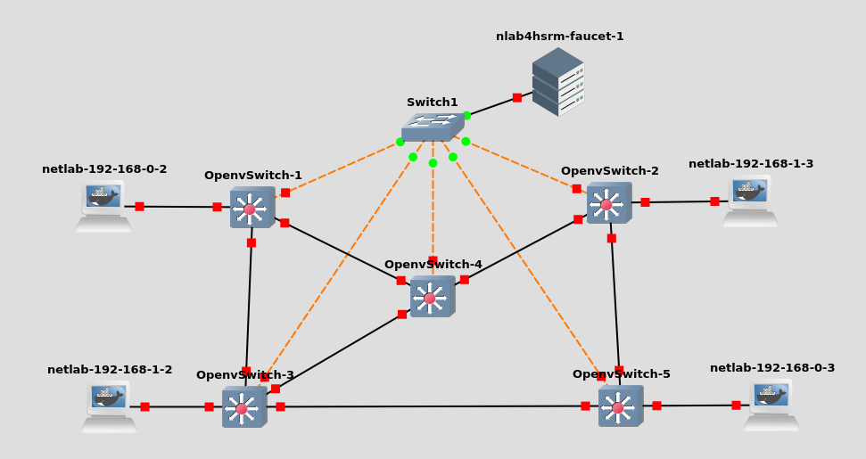

OpenFlow I: Controller- und Broadcastbasiert mit Faucet {#sec:of1}
=======================================================

Architektur und Technologien
----------------------------

Bei diesem Ansatz wird die Dataplane der Switche vollständig durch einen
externen Controller programmiert. Das Prinzip ist asymmetrisch da die
Controlplane zentral in Form eines Controllers implementiert ist.
MAC-Adressen werden wie bei traditionellen Ethernet-Architekturen
gelernt, zum auflösen von IP-Adressen werden Broadcasts implementiert.
Um Broadcasts in einem vermaschten Netz möglich zu machen, erstellt der
Controller für die Broadcasts eine sternförmige Topologie hin zu einer
Root-Bridge. Dieses Prinzip ist bekannt durch das
[stp]{acronym-label="stp" acronym-form="singular+short"}.

[1.6](#sec:ref){reference-type="ref" reference="sec:ref"} errichtet.

{#fig:fauarch
width="100%"}

Das Prinzip soll Anhand der Implementierung des Controllers Faucet sowie
der Referenztopologie aus [1.6](#sec:ref){reference-type="ref"
reference="sec:ref"} deutlich gemacht werden. Die virtuellen Switche
sind per OpenFlow mit dem Controller verbunden. Es werden vier Endgeräte
in zwei verschiedenen Subnetzen an das Netzwerk angeschlossen. Das Ziel
ist das sich alle Endgeräte untereinander erreichen können.

Die Topologie des Netzwerkes wird in einer Konfigurationsdatei auf dem
Controller definiert. Bei Faucet handelt es sich dabei um eine YAML
Datei, zu finden unter:

    $ /etc/faucet/faucet.yaml

Diese zentrale Art der Konfiguration erlaubt automatisierte und
dynamische Änderungen an dem Netzwerk an einer zentralen Stelle.
Weiterhin bringt Faucet eigene Module mit, die beispielsweise auf Basis
einer Port-Authentifizierung dynamisch ein VLAN zuweisen können

In dieser zentralen Datei werden VLANs, Router mit virtuellen
IP-Adressen sowie die einzelnen Interfaces mit ihren jeweiligen getagten
und ungetagten VLAN-IDs konfiguriert. Es ist notwendig die Topologie dem
Controller statisch bekannt zu machen. Der Controller bildet das hier
definierte Netzwerk im Anschluss in Form von OpenFlow Regeln ab.

Es wird zum einen ein statisches Regelwerk programmiert, welches dafür
sorgt, dass bestimmte Pakete an den Controller gesendet werden oder den
Pfad für Broadcast-Pakete definiert. Die Weiterleitung bestimmer Pakete
beziehungsweise deren Header ist Funktional in traditionellen Switchen
auch implementiert. Auch hier werden Informationen an die CPU
weitergeleitet um hier verarbeitet zu werden und Entscheidungen auf
Controlplane-Ebene treffen zu können.

Weiterhin wird dynamisch auf neue MAC-Adressen und Änderungen in der
Topologie reagiert. Dies hat jeweils entsprechende neue Regeln zur
Folge. Wo bei traditionellen Switchen bei einem neuen Host ein neuer
MAC-Eintrag in der [fdb]{acronym-label="fdb"
acronym-form="singular+short"} eingefügt wird, ist in diesem Konstrukt
eine neue Regel in der OpenFlow Tabelle notwendig.

### Initial implementiertes Regelwerk

Zuerst werden die wichtigsten initialen Regeln von dem Switch
OpenVSwitch-5 nach der Initialisierung von Faucet betrachtet. Die Regeln
sind im mehreren Tabellen kaskadiert, Regeln können Pakete auf weitere
Regeltabellen verweisen. Zur Interpretation folgender Regelwerke werden
zusätzlich folgende Informationen gegeben:

-   **eth1** - Link zu dem Switch 2

-   **eth2** - Link zu dem Switch 3

-   **eth5** - Client-Interface mit VLAN-Tag 100

-   **eth2** - Client-Interface mit VLAN-Tag 200

-   **VLAN 100** - 192.168.0.1/24 / 00:00:00:00:00:11 virtuelle MAC

-   **VLAN 200** - 192.168.1.1/24 / 00:00:00:00:00:22 virtuelle MAC

{width="100%"}

-   **Regel 0-1**: Weiterleitung von LLDP-Paketen an den Controller.
    Dieser erfährt damit von ausgefallen Links um die Pfade neu zu
    berechnen.

-   **Regel 2-3**: Pakete ohne VLAN-Tag werden auf den
    Infrastruktur-Links zwischen den Switchen verworfen.

-   **Regel 5-6**: Eingehende Pakete auf den Client-Interfaces werden
    der Konfiguration entsprechend mit VLAN-IDs markiert und an Tabelle
    1 weitergeleitet

-   **Regel 6-7**: Eingehende Pakete auf den Infrastruktur Links werden
    an die nächste Tabelle weitegerleitet.

{width="100%"}

In dieser Tabelle wird der Mechanismus zur Verarbeitung von Broadcasts
deutlich.

-   **Regel 58+60**: Broadcasts die aus Richtung der Root-Bridge kommen
    werden an alle Client-Interfaces weitergeleitet.

-   **Regel 69-60**: Broadcasts die von Switchen die nicht in der
    Richtung der Root-Bridge liegen kommen werden zur Root-Bridge
    weitergeleitet

-   **Regel 62-63**: Alle sonstigen Broadcasts innerhalb der definierten
    VLANs werden zur Root Bridge weitergeleitet.

{width="100%"}

Im Gegensatz dazu leitet die Root Bridge Broadcast-Pakete auch an alle
Interfaces weiter an der weitere Switche angeschlossen sind, um sie von
hier aus wieder zu verteilen. Switche auf dem Weg zwischen der
Root-Bridge und einem Stern-Endpunkt leiten die Broadcasts auch an die
jeweiligen darunterliegenden Switche weiter.

### Dynamische Regeln nach Anschluss eines Hosts

Nun werden die Hosts 2 und 3, die jeweils in unterschiedlichen VLANs
sitzen mit dem Netzwerk verbunden und ein Ping zwischen den beiden Hosts
durchgeführt.

{width="100%"}

Der Wireshark-Mitschnitt zeigt einige Besonderheiten dieser
Netzwerkarchitektur. Zu Beginn sehen wir die ARP-Auflösung von Host-2
für das entsprechende Default Gateway. Wir sehen lediglich die
ARP-Antwort die von der Root-Bridge kommt, währen die Anfrage direkt von
Switch-5 an den Controller gesendet wurde. Die Besonderheit ist nun dass
die Pakete obwohl sie über ein Gateway geroutet werden dennoch direkt
über den Querlink direkt zwischen den Switchen ausgetauscht werden, und
nicht über einen dedizierten Router an einer Stelle im Netzwerk geleitet
werden müssen.

Die Regeln die dies möglich machen werden im folgenden Erläutert.

{width="100%"}

-   **Regel 45**: Pakete aus dem VLAN 100 mit der Zieladresse des Hosts
    im VLAN 200 werden hier geroutet. Zu diesem Zweck wird die
    Quell-Macadresse durch die des virtuellen Router-Interfaces im VLAN
    200 ausgetauscht und die Ziel-Macadresse durch die des jeweiligen
    Zieles ausgetauscht. Anschließend werden die Pakete in Tabelle 4
    weiter behandelt. Dies geschieht immer jeweils auf dem Switch auf
    dem der Host angeschlossen ist. Dadurch wird ein verteiltes Routing
    erreicht.

{width="100%"}

-   **Regel 66**: Das soeben geroutete Paket wird durch diese Regel über
    das Interface eth1 an den jeweiligen Switch mit dem zu erreichenden
    Host gesendet.

{width="100%"}

Eine Betrachtung der MAC-Adressen auf den Paketen bestätigt die zueben
erläuterte Mechanik. Die Pakete haben als Quell-Macadressen jeweils die
Adressen der virtuellen Gateways, und als Ziel-Macaddresse bereits die
des zu erreichenden Hosts.

{width="60%"}

Die Pfade die Faucet errichtet folgen immer dem zu Beginn erschaffenen
Baum hin zu einer Root-Bridge. Das bedeutet das der Datenverkehr
zwischen Switch-2 und Switch-5 immer den Umweg über die Root-Bridge und
damit alle anderen Switche geht.

Virtueller Switch: OpenvSwitch
------------------------------

Der OpenVSwitch ist eine Open-Source-Software, die primär auf Linux als
virtueller Switch dient. Dieser Switch wird in
Virtualisierungsumgebungen und Cloud-Umgebungen dafür verwendet um
virtuelle Maschinen auf Hypervisoren wie KVM mit dem Netzwerk zu
verbinden. Der Switch hat viele Layer-2 Funktionen wie VLANs,
[stp]{acronym-label="stp" acronym-form="singular+short"} sowie
komplexere Technologien wie VXLAN implementiert.

{width="100%"}

Der OpenVSwitch hat unter Linux ein eigenes Kernel-Modul für die
performante Weiterleitung von Paketen. Die Regeln dieses Datenpfads
werden durch den Dienst vswitchd implementiert, der damit als
Controlplane fungiert. Auch hier werden Pakete für die keine Regeln
greifen an die Controlplane übergeben, um dort verarbeitet zu werden und
eine neue Regel zu erzeugen. Die Kommunikation zwischen dem Kernel-Modul
und vswitchd erfolgt über Netlink. Über einen Socket werden Flow Keys
übergeben, welche Regeln zur Weiterleitung von Paketen definieren.
[@ovsdp].

Alternativ kann DPDK als Controlplane genutzt werden, welches im
Userspace läuft und Aufgrund einer anderen Architektur höhere
Übertragungsraten als das OpenvSwitch Kernel-Modul erreicht. DPDK
unterstützt weiterhin die Auslagerung von Mechaniken auf die
physikalische Netzwerkkarte.

{#fig:ovsdp
width="100%"}

Über den in der Abbildung[5.2](#fig:ovsdp){reference-type="ref"
reference="fig:ovsdp"} gezeigten Befehl lassen sich die in den Kernel
implementierten Regeln ausgeben. In diesem Fall sind zwei Hosts an den
Switch angebunden, die untereinander Kommunizieren. Es existiert für
jeweils jede Richtung eine Regel welche auf die Pakete matcht und diese
die als Aktion an den entsprechenden Port weiterleitet. Ein
detaillierter Vergleich zwischen der Performance verschiedener Dataplane
Technologien unter dem OpenvSwitch findet sich hier: [@ovsdpperf].

Simulation
----------

Für die Simulation wird das Template OpenFlow-Lab im GNS3-Server-Manager
der Hochschule genutzt. In diesem sind die Docker-Container für Faucet
und den OpenVSwitch bereits vorbereitet. Zusätzlich ist bereits ein
Projekt angelegt, in dem die Referenztopologie angelegt ist.

Der **OpenVSwitch** wird als Docker-Container implementiert. Es wird ein
fertiger Container aus dem öffentlichden Dockerhub Repository verwendet
- gns3/openvswitch:latest. Die Appliance ist vorgefertigt in dem
GNS3-Markplatz verfügbar-

Für **Faucet** wird ein eigener Container erstellt, der im Repository
der Hochschule verfügbar ist unter nlab4hsrm/faucet. In diesem sind
bereits Konfigurationen für diese Simulation abgelegt.

### Konfiguration OpenVSwitche

Die IP-Adresse für die Verbindung zum Controller wurde bereits über Edit
Config im GNS3-Kontextmenü gesetzt. Im ersten Schritt werden die Switche
konfiguriert. Dafür wird im ersten Schritt eine OpenFlow-Bridge
angelegt, sowie das Protokoll und der Controller festgelegt. Dafür wird
das Konfigurationstool ovs-vsctl genutzt.

``` {caption="Faucet OpenVSwitch Konfiguration 1"}
# Configure OpenFlow Bridge
ovs-vsctl add-br of
ovs-vsctl set bridge of protocols=OpenFlow13
ovs-vsctl set bridge of fail_mode=secure
ovs-vsctl set bridge of other-config:datapath-id=0000000000000001
ovs-vsctl set-controller of tcp:10.0.0.250:6653
```

Im Anschluss werden Interfaces von der Standard-Bridge entfernt und der
OpenFlow-Bridge hinzugefügt.

``` {caption="Faucet OpenVSwitch Konfiguration 1"}
ovs-vsctl del-port eth1
ovs-vsctl add-port of eth1
ovs-vsctl set Interface eth1 ofport_request=1
ovs-vsctl del-port eth2
ovs-vsctl add-port of eth2
ovs-vsctl set Interface eth2 ofport_request=2
ovs-vsctl del-port eth3
ovs-vsctl add-port of eth3
ovs-vsctl set Interface eth3 ofport_request=3
ovs-vsctl del-port eth4
ovs-vsctl add-port of eth4
ovs-vsctl set Interface eth4 ofport_request=4
ovs-vsctl del-port eth5
ovs-vsctl add-port of eth5
ovs-vsctl set Interface eth5 ofport_request=5
ovs-vsctl del-port eth6
ovs-vsctl add-port of eth6
ovs-vsctl set Interface eth6 ofport_request=6
ovs-vsctl del-port eth7
ovs-vsctl add-port of eth7
ovs-vsctl set Interface eth7 ofport_request=7
ovs-vsctl del-port eth8
ovs-vsctl add-port of eth8
ovs-vsctl set Interface eth8 ofport_request=8
```

Die Konfiguration lässt sich anschließend wie folgt überprüfen:

    / # ovs-vsctl show
    {...}
        Bridge of
            Controller "tcp:10.0.0.250:6653"
                is_connected: true
            fail_mode: secure
            Port eth4
                Interface eth4
            Port eth1
                Interface eth1
            Port eth7
                Interface eth7
            Port eth8
                Interface eth8
            Port of
                Interface of
                    type: internal
            Port eth3
                Interface eth3
            Port eth2
                Interface eth2
            Port eth6
                Interface eth6
            Port eth5
                Interface eth5
        Bridge br1
            datapath_type: netdev
            Port br1
                Interface br1
                    type: internal

Es sollte die eben angelegte Bridge mit entsprechenden Eigenschaften
gezeigt werden. Der is connected Eintrag sollte erscheinen sobald Faucet
konfiguriert und gestartet ist.

Das Mapping zwischen den Interfaces und der OpenFlow-ID lässt sich mit
folgendem Befehl überprüfen:

    / # ovs-vsctl -- --columns=name,ofport list Interface
    {...}
    name                : eth5
    ofport              : 5

    name                : eth2
    ofport              : 2
    {...}

### Konfiguration Faucet

Faucet wird über eine YAML-Konfigurationsdatei im Pfad
/etc/faucet/faucet.yaml Konfiguriert. Im Wurzelverzeichnis von Faucet
leigen bereits die Konfiguration für ein Layer-2 und ein Layer-3
Netzwerk für die entsprechende Topologie ab. Diese können an
entsprechende Stelle kopiert werden mittels

    $ cp /faucet-L2.yaml /etc/faucet/faucet.yaml

Die Konfiguration faucet-L2.yaml implementiert zwei VLANs innerhalb
deren die jeweiligen Hosts kommunizieren können. In der erweiterten
Konfiguration faucet-L3.yaml ist zusätzlich ein Routing zwischen den
beiden VLANs implementiert.

### Start des Netzwerkes

Zum Start des Netzwerkes wird nun der FaucetDienst gestartet. Dafür wird
in der Konsole für Faucet folgender Aufruf abgesetzt um den Prozess im
Hintergrund zu starten:

    $ faucet &

Im Anschluss kann der Log unter /var/log/faucet/faucet.log betrachtet
werden. Eine Erfolgreiche Konfiguration der einzelnen Switche sollte wie
folgt aussehen:

    Mar 12 14:49:17 faucet.valve INFO     DPID 1 (0x1) sw1 Stack node sw1 UNHEALTHY (running 0s ago, stack ports [Port 1, Port 2] (100%) not up)
    Mar 12 14:49:17 faucet INFO     Stack root sw1 (previous None)
    Mar 12 14:49:17 faucet INFO     Reconfiguring existing datapath DPID 1 (0x1)
    Mar 12 14:49:17 faucet.valve INFO     DPID 1 (0x1) sw1 no ACL changes
    Mar 12 14:49:17 faucet.valve INFO     DPID 1 (0x1) sw1 no VLAN changes
    Mar 12 14:49:17 faucet.valve INFO     DPID 1 (0x1) sw1 no METERS changes
    Mar 12 14:49:17 faucet.valve INFO     DPID 1 (0x1) sw1 no port changes
    Mar 12 14:49:17 faucet.valve INFO     DPID 1 (0x1) sw1 Stack topology change detected, restarting stack ports
    Mar 12 14:49:17 faucet.valve INFO     DPID 1 (0x1) sw1 Port 1 (sw1 isl to sw4) down
    Mar 12 14:49:17 faucet.valve INFO     DPID 1 (0x1) sw1 Port 2 (sw1 isl to sw3) down
    Mar 12 14:49:17 faucet.valve INFO     DPID 1 (0x1) sw1 Using stacking root flood reflection
    Mar 12 14:49:17 faucet.valve INFO     DPID 1 (0x1) sw1 IPv4 routing is active on VLAN office vid:100 untagged: Port 5 with VIPs ['192.168.0.1/24']
    Mar 12 14:49:17 faucet.valve INFO     DPID 1 (0x1) sw1 IPv4 routing is active on VLAN server vid:200 untagged: Port 6 with VIPs ['192.168.1.1/24']
    Mar 12 14:49:17 faucet.valve INFO     DPID 1 (0x1) sw1 Port 1 (sw1 isl to sw4) up
    Mar 12 14:49:17 faucet.valve INFO     DPID 1 (0x1) sw1 Port 2 (sw1 isl to sw3) up
    Mar 12 14:49:17 faucet.valve INFO     DPID 1 (0x1) sw1 Configuring VLAN server vid:200 untagged: Port 6
    Mar 12 14:49:17 faucet.valve INFO     DPID 1 (0x1) sw1 Configuring VLAN office vid:100 untagged: Port 5
    Mar 12 14:49:17 faucet.valve INFO     DPID 1 (0x1) sw1 warm starting

Ist dies für alle konfigurierten Switche der Fall, kann die
Konnektivität zwischen den Endgeräten mittels Ping und Iperf3 überprüft
werden.

Fazit
-----

Faucet ist eine solide OpenFlow-basierte Lösung welches ein solides
Netzwerk mit Layer-2 und Layer-3 Funktionalitäten bereitstellen kann.
Faucet zeigt die Vorteile eines zentral konfigurierbaren Netzwerkes,
macht sich aber mögliche Vorteile durch eine zentrale Controlplane nicht
zu nutze. Zwar wird Spanning-Tree ersetzt durch eine eigene Mechanik,
Pfade in einem vermaschten Netzwerk verlaufen aber dennoch entlang einer
Baumstruktur und sind damit nicht in jedem Fall optimal. Faucet bietet
keine Möglichkeiten für Traffic-Engineering wie geregeltes
Load-Balancing. Zu Demonstrationszecken bietet Faucet den Vorteil das
durch das auf die Switche installierte Regelwerk viele grundlegenden
Mechaniken eines Ethernet und IP Netzwerkes gezeigt werden können.

OpenFlow II: Controller- und Pfad-basiert mit ONOS
