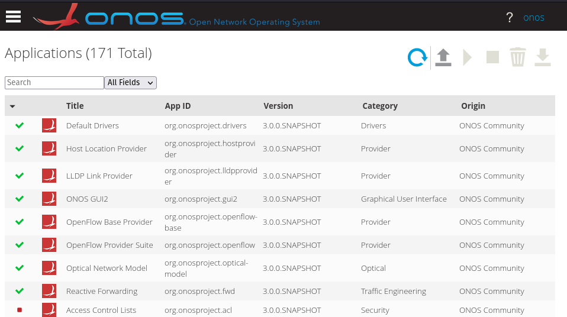
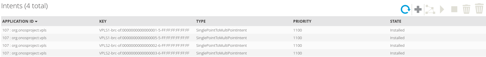

OpenFlow Lab II - Pfadbasiertes Forwarding mit ONOS
===================================================

In diesem Lab wird ein Netzwerk auf Basis des OpenFlow-Controllers ONOS
simuliert. Dieser arbeitet Pfad-basiert und implementiert für jede
Kommunikationsbeziehung einen eigenen Datenpfad. ONOS erkennt
automatisch die eingesetzte Netzwerktopologie durch mitschneiden von
LLDP-Paketen.

{#fig:onostop
width="100%"}

Die Konfiguration der OpenvSwitche sowie die eingesetzte Topologie ist
identisch zum OpenFlow Lab I und kann dort nachgelesen werden.

### ONOS

ONOS wird entwickelt unter der [onf]{acronym-label="onf"
acronym-form="singular+short"} und ist dessen Referenzimplementierung
eines Netzwerk-Controllers. ONOS basiert auf Modulen und lässt sich
dadurch beliebig in seiner Funktionalität erweitern. ONOS ist
spezialisiert für Backbone-Netzwerke und ist nicht für den Einsatz in
Campus-Netzwerken bestimmt. ONOS zeigt allerdings wie ein Pfad-basiertes
Netzwerk aufgebaut werden kann.

ONOS wird bis heute durch neue Module erweitert und von der ONF genutzt
um neue Technologien wie zum Beispiel P4Runtime zu demonstrieren. ONOS
ist zentraler Bestandteil der aktuellen SD-Fabric auf Basis von
P4Runtime und MPLS-Segment Routing, was aber nichts mehr mit OpenFlow zu
tuen hat. In diesem Lab wird lediglich das Plugin Reactive Forwarding
eingesetzt, welches Layer-2 Dienste in einem Netzwerk anbietet.

#### Layer-2 Fabric - Reactive Forwarding

Mit dem Plugin *Reactive Forwarding* lässt sich ein über mehrere Switche
verteiltes Layer-2 Netzwerk implementieren. Die Switche können dabei
redundant untereinander vernetzt werden. Der Weg der Pakete durch dieses
Netzwerk erfolgt entlang von durch den Controller berechneten Pfaden.
Bei dieser Implementierung werden keine Broadcasts weitergeleitet.
ARP-Pakete werden durch den Controller abgefangen und entsprechend
beantwortet.

Sobald sich die Switche mit dem ONOS Controller per
[of]{acronym-label="of" acronym-form="singular+short"} verbunden haben
werden folgende Regeln in die Switche programmiert:

{width="100%"}

Jeder Regel besteht aus einem Kriterium für die Pakete auf die sie
angewendet werden sollen, dem Match Criteria, und einer Aktion die im
Anschluss mit dem Paket ausgeführt werden soll, der Action. Die hier
gezeigten drei Regeln sorgen dafür, dass alle ARP, LLDP und BDDP Pakete
an den Controller geschickt werden. BDDP ist ein nicht standardisiertes
Protokoll welches ähnlich wie LLDP funktioniert, allerdings spezifisch
bei OpenFlow-Controllern eingesetzt wird. Vorteil ist das diese Pakete
in der Regel von dritten Ethernet-Switchen im nicht verworfen werden.
Durch die LLDP Pakete lernt ONOS die Topologie. Durch die abgefangenen
ARP Requests gewinnt der Controller die Information über den Ort eines
Hosts mit dessen MAC und IP-Adresse. Mit dieser Tabelle kann der
Controller die ARP-Requests weitere Netzwerkteilnehmer beantworten.
Sobald ein Host nun kommunizieren möchte kennt ONOS den Ort beider
involvierten MAC-Adressen und kann entsprechend einen Pfad durch das
Netzwerk programmieren.

{width="100%"}

Nach einem Ping zwischen den beiden Endgeräten nlab4hsrm-netlab-1 und
nlab4hsrm-netlab-2, gezeigt in der Abbildung
[6.1](#fig:onostop){reference-type="ref" reference="fig:onostop"}, sind
drei neue Regeln in dem Switch-1 ersichtlich. Es sind zwei Regeln für
beide Kommunikationsrichtungen implementiert. Broadcasts werden nicht
weitergeleitet.

#### Layer-2 Fabric - VPLS

Mit dem Plugin *vpls* lassen sich Layer-2 Domänen spezifizieren die zum
einen voneinander abgekapselt sind und zum anderen Broadcasts
ermöglichen. Die hier gezeigte Technologie hat nichts mit der
gleichnamigen Technologie VPLS in Zusammenhang mit MPLS zu tun, ähnelt
dieser nur in Teilen funktionell.

{width="100%"}

Die Konfiguration des VPLS-Plugins resultiert in einem erweiterten
Regelwerk. Die ersten vier Regeln bleiben identisch. Bei den Regeln für
die eingehenden Pakete auf Port eth5 wird als erste Aktion das Paket mit
dem Wert 0x8100 markiert, was ein nach IEEE 802.1Q (VLANS) getagtes
Paket spezifiziert. Anschließend wird die VLAN-ID in das entsprechende
Feld geschrieben. Mit Regel 6 wird eine die Weiterleitung von Broadcasts
implementiert.

#### Netzwerk Visibilität

{#fig:onosperf
width="100%"}

Ein konzeptioneller Vorteil von dieser Art von Netzwerken ist, dass der
Zustand des Netzwerkes dem Controller bekannt ist. Die Abbildung
[6.2](#fig:onosperf){reference-type="ref" reference="fig:onosperf"}
zeigt ein Ausschnitt der WebGUI von ONOS mit der visualisierten
Auslastung der einzelnen Pfade des Netzwerkes. Auf Basis dieser
Informationen sind Entscheidungen zu optimalen Pfaden möglich.

Simulation
----------

Für die Simulation kann das vorbereitete Template OpenFlow-Lab auf dem
GNS3-Server-Manager der Hochschule genutzt werden. In diesem sind die
Docker-Container für Faucet und den OpenVSwitch bereits vorbereitet.
Zusätzlich ist bereits ein Projekt erstellt, in dem die
Referenztopologie angelegt ist. Die Konfiguration der OpenvSwitche ist
identisch zum OpenFlow Lab I und kann dort nachgelesen werden.

### Konfiguration ONOS

Der ONOS-Controller wird als Docker-Container implementiert und kann
direkt aus dem GNS3-Marktplatz installiert werden.

ONOS kann über eine integrierte Weboberfläche, einer Kommandozeile und
über eine REST-API konfiguriert werden. Zentrales Konfigurationselement
ist eine JSON-Datei welche sich über eine Rest-API ausgeben und
modifizieren lässt.

Im ersten Schritt werden die notwendigen Module aktiviert. Dies erfolgt
am komfortabelsten über die Web-GUI. Die Management-IP von ONOS kann im
Kontextmenü von GNS3 unter Edit config bearbeitet werden. Im
vorbereitetem Template hat ONOS dafür mehrere Interfaces. Eines wird zur
Kommunikation mit den OpenvSwitchen verwendet und ein weiteres wird
mittels dem Cloud-Knoten über den VPN erreichbar gemacht. Die Management
IP-Adresse sollte also innerhalb des GNS3-Server IP-Adressbereich
liegen.

Anschließend kann die Web-GUI über folgende URL aufgerufen werden. Zur
Anmeldung werden die Zugangsdaten onos/rocks verwendet.

    http://<mgmt-ip>:8181/onos/ui/

Die CLI ist erreichbar über SSH mit folgenden Terminal-Befehl:

    ssh -p 8101 onos@<mgmt-ip>

Unter dem Menüpunkt Applikationen werden nun folgende Plugins aktiviert:

-   OpenFlow Provider Suite

-   Reactive Forwarding

Notwendige Abhängigkeiten werden automatisch aktiviert.

{#fig:evpncli
width="100%"}

Wechselt man nun zu dem Menüpunkt Topology sollten die Switche angezeigt
werden und die Verbindungen zwischen diesen eingezeichnet sein. Ein Ping
sollte nun zwischen den Endgeräten im gleichen Subnetz möglich sein.
Durch drücken der Taste H werden erkannte Hosts auch in der Webgui von
ONOS angezeigt.

### Konfiguration ONOS VPLS

Für Broadcasts und zur Separierung von Netzwerken wird das Plugin VPLS
eingesetzt. Dafür muss eine JSON-Konfiguration über die REST-API in den
Controller geladen werden. In diesem Lab wird dafür Postman genutzt, die
Nutzung anderer Tools wie curl ist ebenfalls möglich. Die vollständige
in diesem Lab genutzte Konfiguration liegt im Versuchsordner ab.

``` {caption="ONOS Interface Konfiguration für VPLS"}
"of:0000000000000003/5": {
            "interfaces": [
                {
                    "name": "v100-3-5",
                    "vlan": "100"
                }
            ]
        },
        "of:0000000000000002/5": {
            "interfaces": [
                {
                    "name": "v100-2-5",
                    "vlan": "100"
                }
            ]
        }
```

Die Konfiguration der VLANS erfolgt durch gezeigte beispielhafte
JSON-Datei. Die für dieses Lab notwendige Konfiguration findet sich im
Versuchsordner. Jedes Interface in dem OpenFlow Netzwerk ist
spezifiziert durch eine Bridge-ID und einer Port-Nummer. Den Ports wird
ein jeweiliges VLAN-Tag zugewiesen.

{width="100%"}

Der Upload der Konfiguration kann wie in der Abbildung gezeigt erfolgen.
Abgeändert werden muss die IP-Adresse im URL-Pfad nach folgendem Schema:

    http://<mgmt-ip>:8181/onos/v1/network/configuration/

{width="100%"}

Wichtig ist, dass der Application-Typekorrekt gesetzt wird. Anderenfalls
schlägt der Aufruf fehl.

{width="100%"}

Die Broadcast-Domänen werden über Intents abgebildet, welche sich in der
WebGUI von ONOS betrachten lassen. Es existiert für jeden Port ein
Intent, welcher die Weiterleitung von Broadcast-Paketen an verschiedene
Endpunkte definiert.

Fazit
-----

ONOS zeigt durch seine Implementierung eines verteilten Layer-2 Switches
die Vorteile einer zentralen Controlplane. ONOS kennt die Topologie und
berechnet und installiert für jede Kommunikationsbeziehungen spezifische
Pfade durch das Netzwerk. Dies vereinfacht die Konfiguration eines
Netzwerkes massiv und bildet die ideale Grundlage für
Traffic-Engineering oder die Implementierung von Regelwerken direkt im
Datenpfad. Im aktuellen Zustand kann Aufgrund mangelnder Reife der
Plugins sowie der Dokumentation ONOS nicht für den produktiven Einsatz
in Enterprise-Netzwerken empfohlen werden. Zusätzlich ergibt sich aus
der Marktanalyse, dass das Protokoll OpenFlow eine immer geringere
Verbreitung findet.

P4Runtime Lab - Programmierbare Dataplane
