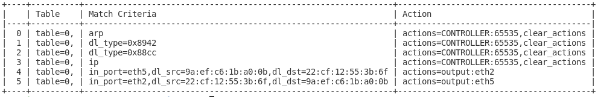

OpenFlow Lab II - Pfadbasiertes Forwarding mit ONOS
===================================================

In diesem Lab wird ein Netzwerk auf Basis des OpenFlow-Controllers ONOS
simuliert. Dieser arbeitet Pfad-basiert und implementiert für jede
Kommunikationsbeziehung einen eigenen Datenpfad. ONOS erkennt
automatisch die eingesetzte Netzwerktopologie durch das Mitschneiden von
LLDP-Paketen.

{#fig:onostop
width="100%"}

Die Konfiguration der OpenvSwitche sowie die eingesetzte Topologie ist
identisch zum OpenFlow Lab I, siehe Abschnitt
[5.1](#sec:of1){reference-type="ref" reference="sec:of1"}, und kann dort
nachgelesen werden.

### ONOS

ONOS wird entwickelt unter der [onf]{acronym-label="onf"
acronym-form="singular+short"} und ist dessen Referenzimplementierung
eines Netzwerk-Controllers. ONOS ist modular aufgebaut und lässt sich
dadurch in seiner Funktionalität erweitern. ONOS ist spezialisiert für
Backbone-Netzwerke und ist nicht für den Einsatz in Campus-Netzwerken
entwickelt, zeigt allerdings die Funktionsweise eines Pfad-basierten
Netzwerkes.

ONOS wird bis heute durch neue Module erweitert und von der ONF genutzt,
um neue Technologien wie zum Beispiel P4Runtime zu demonstrieren. ONOS
ist zentraler Bestandteil der aktuellen SD-Fabric auf Basis von
P4Runtime und MPLS-Segment Routing, welche allerdings kein OpenFlow mehr
einsetzt. In diesem Lab wird lediglich das Plugin Reactive Forwarding
verwendet, welches Layer-2 Dienste in einem Netzwerk anbietet.

#### Layer-2 Fabric - Reactive Forwarding

Mit dem Plugin *Reactive Forwarding* lässt sich ein über mehrere Switche
verteiltes Layer-2 Netzwerk implementieren. Die Switche können dabei
redundant untereinander vernetzt werden. Der Weg der Pakete durch dieses
Netzwerk erfolgt entlang von Pfaden, die durch den Controller berechnet
werden. Bei dieser Implementierung werden keine Broadcasts
weitergeleitet. ARP-Pakete werden durch den Controller abgefangen und
entsprechend beantwortet.

Sobald sich die Switche mit dem ONOS Controller per OpenFlow verbunden
haben, werden folgende Regeln in die Switche programmiert:

{width="100%"}

Jede Regel besteht aus einem Kriterium zur Identifizierung von Paketen,
dem Match Criteria, und einer Aktion, die im Anschluss auf dem Paket
ausgeführt werden soll, der Action. Die hier gezeigten drei Regeln
sorgen dafür, dass alle ARP, LLDP und BDDP Pakete an den Controller
gesendet werden. BDDP (Ethertype 0x8942) ist ein nicht standardisiertes
Protokoll, welches ähnlich wie LLDP funktioniert, allerdings spezifisch
bei OpenFlow-Controllern eingesetzt wird. Vorteil ist, dass diese Pakete
in der Regel von dritten Ethernet-Switchen im Normalfall nicht verworfen
werden. Durch die LLDP Pakete lernt ONOS die Topologie. Durch die
abgefangenen ARP-Pakete gewinnt der Controller die Information über den
Ort eines Hosts mit dessen MAC und IP-Adresse. Mit dieser Tabelle kann
der Controller weitere ARP-Anfragen beantworten. Sobald ein Host nun
kommunizieren möchte, kennt ONOS den Ort beider involvierten
MAC-Adressen und kann entsprechend einen Pfad durch das Netzwerk
programmieren.

{width="100%"}

Nach einem Ping zwischen den beiden Endgeräten nlab4hsrm-netlab-1 und
nlab4hsrm-netlab-2, gezeigt in der Abbildung
[6.1](#fig:onostop){reference-type="ref" reference="fig:onostop"}, sind
drei neue Regeln in dem Switch-1 ersichtlich. Es sind zwei Regeln für
beide Kommunikationsrichtungen implementiert. Broadcasts werden nicht
weitergeleitet.

Wie an den Regeln erkennbar, werden Pakete lediglich aufgrund ihrer
MAC-Adresse weitergeleitet. Das Plugin bietet keine Möglichkeiten
zwischen verschiedenen Verbindungen aufgrund anderer Header, wie zum
Beispiel eines DSCP-Wertes, zu unterscheiden. Der Ausfall einer
Netzwerkstrecke wird über BDDPs zyklisch erkannt. Obwohl diese Pakete
circa viermal in der Sekunde gesendet werden, wurde im Lab eine
Konvergenz-Zeit von circa 4 Sekunden festgestellt.

Die implementierte ARP-Mechanik erfolgt vierstufig:

-   OFPF\_PACKET\_OUT: Der Switch sendet die empfangende ARP-Anfrage an
    den Controller.

-   OFPT\_PACKET\_IN: Da ONOS die Adresse nicht kennt, weist er alle
    Switche an, die ARP-Anfrage auf allen Ports zu fluten.

-   OFPF\_PACKET\_OUT: Der Switch der eine Antwort erhält, sendet diese
    wieder an den Controller.

-   OFPT\_PACKET\_IN: Der Controller sendet die ARP-Antwort an den
    Client zurück.

{width="70%"}

In der Abbildung ist ein Paket dargestellt, welches eine Übertragung
einer ARP-Nachricht von dem Controller an einen Switch zeigt. Der Switch
wird angewiesen, das Paket auf allen Interfaces zu fluten, dies ist zu
erkennen an der Action - Port: OFPP\_FLOOD. Diese Anfrage hat der
Controller zuvor von einem Switch übermittelt bekommen. Da er sie nicht
aus seiner Datenbank heraus beantworten kann, flutet er die Nachricht in
das gesamte Netzwerk.

#### Layer-2 Fabric - VPLS

Mit dem Plugin *vpls* lassen sich Layer-2 Domänen spezifizieren, die zum
einen voneinander abgekapselt sind und zum anderen Broadcasts
ermöglichen. Das hier gezeigte Plugin hat nichts mit der gleichnamigen
Technologie VPLS in Zusammenhang mit MPLS zu tun, ähnelt dieser nur in
Teilen funktionell.

{width="100%"}

Die Konfiguration des VPLS-Plugins resultiert in einem erweiterten
Regelwerk. Die ersten vier Regeln bleiben identisch. Bei den Regeln für
die eingehenden Pakete auf Port eth5 wird als erste Aktion das Paket mit
dem Wert 0x8100 markiert, was ein nach IEEE 802.1Q (VLANs) markiertes
Paket kennzeichnet. Anschließend wird die VLAN-ID in das entsprechende
Feld geschrieben. Mit Regel 6 wird die Weiterleitung von Broadcasts
implementiert.

#### Netzwerk Visibilität

{#fig:onosperf
width="100%"}

Ein konzeptioneller Vorteil dieses Netzwerk-Konzeptes ist, dass der
Zustand des Netzwerkes dem Controller bekannt ist. Die Abbildung
[6.2](#fig:onosperf){reference-type="ref" reference="fig:onosperf"}
zeigt ein Ausschnitt der WebGUI von ONOS mit der visualisierten
Auslastung der einzelnen Pfade des Netzwerkes. Auf Basis dieser
Informationen sind Entscheidungen zu optimalen Pfaden möglich.

Simulation
----------

Für die Simulation kann das vorbereitete Template OpenFlow-Lab auf dem
GNS3-Server-Manager der Hochschule genutzt werden. Dies ist das
identische Template, welches auch im Versuch OpenFlow Lab I, siehe
Abschnitt [5.1](#sec:of1){reference-type="ref" reference="sec:of1"},
verwendet wird. In diesem sind die Docker-Container für ONOS und den
OpenvSwitch bereits vorbereitet. Zusätzlich ist bereits ein Projekt
erstellt, in dem die Referenztopologie angelegt ist. Die Konfiguration
der OpenvSwitche ist identisch zum OpenFlow Lab I und kann dort
nachgelesen werden.

### Konfiguration ONOS

Der ONOS-Controller wird als Docker-Container implementiert und kann
direkt aus dem GNS3-Marktplatz installiert werden.

ONOS kann über eine integrierte Weboberfläche, einer Kommandozeile und
über eine REST-API konfiguriert werden. Zentrales Konfigurationselement
ist eine JSON-Datei, welche sich über eine Rest-API ausgeben und
modifizieren lässt.

Im ersten Schritt werden die notwendigen Module aktiviert. Dies erfolgt
am komfortabelsten über die Web-GUI. Die Management-IP von ONOS kann im
Kontextmenü von GNS3 unter Edit config bearbeitet werden. Im
vorbereiteten Template hat ONOS mehrere Schnittstellen. Eines wird zur
Kommunikation mit den OpenvSwitchen verwendet und ein weiteres wird
mittels dem Cloud-Knoten über den VPN erreichbar gemacht. Die Management
IP-Adresse sollte also innerhalb des GNS3-Server IP-Adressbereich
liegen.

Anschließend kann die Web-GUI über folgende URL aufgerufen werden:

    http://<mgmt-ip>:8181/onos/ui/

Zur Anmeldung werden die Zugangsdaten onos/rocks verwendet.

Die CLI ist erreichbar über SSH mit folgenden Terminal-Befehl:

    ssh -p 8101 onos@<mgmt-ip>

Unter dem Menüpunkt Applikationen müssen folgende Plugins aktiviert
werden:

-   OpenFlow Provider Suite

-   Reactive Forwarding

Notwendige Abhängigkeiten werden automatisch aktiviert.

{#fig:evpncli
width="100%"}

Wechselt man nun zu dem Menüpunkt Topology, sollten die Switche
angezeigt werden und die Verbindungen zwischen diesen eingezeichnet
sein. Ein Ping sollte nun zwischen den Endgeräten im gleichen Subnetz
möglich sein. Durch drücken der Taste H werden erkannte Hosts auch in
der Webgui von ONOS angezeigt.

### Konfiguration ONOS VPLS

Für Broadcasts und zur Separierung von Netzwerken wird das Plugin VPLS
eingesetzt. Dafür muss eine JSON-Konfiguration über die REST-API in den
Controller geladen werden. In diesem Lab wird dafür Postman genutzt, die
Nutzung anderer Tools wie curl ist ebenfalls möglich. Die vollständige
in diesem Lab genutzte Konfiguration liegt im Versuchsordner ab.

``` {caption="ONOS Interface Konfiguration für VPLS"}
"of:0000000000000003/5": {
            "interfaces": [
                {
                    "name": "v100-3-5",
                    "vlan": "100"
                }
            ]
        },
        "of:0000000000000002/5": {
            "interfaces": [
                {
                    "name": "v100-2-5",
                    "vlan": "100"
                }
            ]
        }
```

Die Konfiguration des VLANS ist beispielhaft in der gezeigten JSON-Datei
im vorhergehendem Listing dargestellt. Die für dieses Lab notwendige
Konfiguration findet sich im Versuchsordner. Jedes Interface in dem
OpenFlow-Netzwerk ist spezifiziert durch eine Bridge-ID und einer
Port-Nummer. Den Ports wird ein jeweiliges VLAN-Tag zugewiesen.

{width="100%"}

Der Upload der Konfiguration kann wie in der Abbildung gezeigt erfolgen.
Abgeändert werden muss die IP-Adresse im URL-Pfad nach folgendem Schema:

    http://<mgmt-ip>:8181/onos/v1/network/configuration/

{width="100%"}

Wichtig ist, dass der Application-Type korrekt gesetzt wird.
Anderenfalls schlägt der Aufruf fehl.

{width="100%"}

Die Broadcast-Domänen werden über Intents abgebildet, welche sich in der
WebGUI von ONOS betrachten lassen. Es existiert für jeden Port ein
Intent, welcher die Weiterleitung von Broadcast-Paketen an verschiedene
Endpunkte definiert.

Fazit
-----

ONOS zeigt durch seine Implementierung eines verteilten Layer-2 Switches
die Vorteile einer zentralen Controlplane. ONOS kennt die Topologie und
berechnet und installiert für jede Kommunikationsbeziehungen spezifische
Pfade durch das Netzwerk. Dies vereinfacht die Konfiguration eines
Netzwerkes massiv und bildet die ideale Grundlage für
Traffic-Engineering oder die Implementierung von Regelwerken direkt im
Datenpfad. Derartige Funktionen müssten im derzeitigen Zustand von ONOS
allerdings selbst implementiert werden. Im aktuellen Zustand kann
Aufgrund mangelnder Reife der Plugins sowie der Dokumentation ONOS nicht
für den produktiven Einsatz in Enterprise-Netzwerken genutzt werden.
Zusätzlich ergibt sich aus der in dieser Thesis durchgeführten
Marktanalyse, dass das Protokoll OpenFlow eine immer geringere
Verbreitung auf Netzwerkkomponenten findet.

P4Runtime Lab - Programmierbare Dataplane
