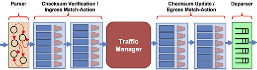

P4Runtime
=========

P4Runtime ist keine Netzwerkarchitektur als solchen, sondern lediglich
ein Protokoll auf einem entferntem Switch eine per P4 definierte
Dataplane-Logik zu implementieren und im Anschluss zu steuern. Für ein
funktionierendes Netzwerk wird ein P4-Programm sowie - wenn die
Implementation es erfordert - ein Controller benötigt. Eine
Beispielhafte Implementierung ist die SD-Fabric der
[onf]{acronym-label="onf" acronym-form="singular+short"}. Diese
Implementiert Segment Routing mit einem zentralen PCE mittels einer per
P4 definierten Controlplane und einer Anbindung des Controllers über
P4Runtime.

In diesem Kapitel wird die Simulation P4 basierter Topologien auf Basis
einer einfachen quelloffenen Software gezeigt, welche ein einfaches
Layer-2 Switching ohne weitere Funktionalitäten implementiert. Dafür
wird der p4runtime-go-client genutzt, welcher mittels P4Runtime eine
P4-Dataplane auf den Switch aufspielt und anschließend das Lernen der
MAC-Adressen übernimmt. Die per P4 definierte Dataplane sowie der
GO-Client ist im Repository des Entwicklers zu finden unter\
<https://github.com/antoninbas/p4runtime-go-client>. Als virtueller
Switch wird Stratum der [onf]{acronym-label="onf"
acronym-form="singular+short"} verwendet.

Virtueller Switch: Stratum-bmv2
-------------------------------

Stratum ist das [sos]{acronym-label="sos" acronym-form="singular+short"}
welches die Grundlage aktueller Konzepte der [onf]{acronym-label="onf"
acronym-form="singular+short"} ist. Dazu gehört das Projekt TRELLIS,
welches neben dem Einsatz von P4Runtime auch OpenFlow noch unterstützt
sowie das aktuelle Projekt SD-FABRIC, welches vollständig auf dem
Einsatz von Stratum basiert. Das Betriebssystem wird auch als Thin-os
bezeichnet und fokussiert sich auf die Bereitstellung einer P4Runtime
Schnittstelle zur Programmierung der Dataplane. Stratum bietet neben der
P4Runtime noch die Schnittstellen gNMI und gNOI. Es gibt keine CLI
abseits der Linux-Boardmittel, als Schnittstellen sind lediglich die
P4Runtime sowie gNOI und gNMI implementiert. Stratum unterstützt
Plattformen auf Basis von Intels Tofinos, Broadcoms Tomahawk, sowie den
Software-Switch bmv2.

{#fig:faucettop
width="100%"}

Während Stratum bei Nutzung eines Intel Tofinos viele Aufrufe lediglich
durchreicht, müssen die Aufrufe für die nicht auf P4 basierenden
Broadcom Chips übersetzt werden. bmv2 steht für Behavioural Modell
Version 2, welche Pakete auf Basis einer Definition die in JSON abliegt
weiterleitet. Diese JSON selbst wird mittels einem Compiler aus einem P4
Programm compiliert. [@stratum]

P4Runtime Controller
--------------------

Im folgenden werden Teile des P4-Programms sowie des in GO geschriebenen
Controllers erläutert.

Der Quellcode des in GO geschrieben Controllers sowie der eingesetzte
P4-Code findet sich in einem geforkten Repository im Github-Account der
Hochschule unter **nlab4hsrm/p4runtime-go-client**. Der Code steht unter
der Apache 2.0 Lizenz und kann damit frei verwendet und modifiziert
werden. Der Build-Prozess ist innerhalb des Repositorys dokumentiert und
über ein Makefile automatisiert. Nach klonen des Repositorys reicht ein
einfaches make Kommando im Wurzelverzeichnis um das Programm zu
kompilieren. Voraussetzung dafür ist die Installation von GO. Der P4
Code wird mittels einem temporär gestarteten Docker Container der den
Compiler p4c enthält kompiliert. Dies macht allerdings die Installation
von Docker zur Voraussetzung.

### l2\_switch.p4

In dieser Datei wird das Verhalten der Dataplane spezifiziert, welches
im weiteren auf einem Switch implementiert wird.

    #include <core.p4>
    #include <v1model.p4>

Grundlage sind die beiden Bibliotheken core und v1model. core.p4 bringt
wichtige Routinen sowie Typendefinitionen mit. v1model.p4 beschreibt die
verwendete Pipeline, welche alternativ auch selbst geschrieben und
entwickelt werden kann. v1model ist eine gegebene Implementation die für
gewöhnlich in Zusammenhang mit bmv2eingesetzt wird. Die Beschreibung der
Dataplane findet also auf Basis eines Framework statt, welches Werkzeuge
zum Parsen und implementieren von Logiken bereitstellt.

{width="100%"}

Das Modell besteht aus mehreren Blöcken, welche in dem
selbstgeschriebenem P4-Programm mit Funktion gefüllt werden müssen.
Dafür werden controlund parser Elemente erzeugt, aus denen dann ein
V1Model-Objekt erzeugt wird. Auf technischer Ebene sieht das wie folgt
aus:

``` {caption="l2\\_switch.p4"}
V1Switch(p = ParserImpl(),
         ig = IngressImpl(),
         vr = verifyChecksum(),
         eg = EgressImpl(),
         ck = computeChecksum(),
         dep = DeparserImpl()) main;
```

Der eingehenden Parser p erhält das vollständige Paket und extrahiert
aus diesen Informationen die er in der Pipeline weiterreicht.

``` {caption="l2\\_switch.p4 Parser eingehend"}
parser ParserImpl(packet_in packet, out headers hdr, inout metadata meta, inout standard_metadata_t standard_metadata) {
    state parse_ethernet {
        packet.extract(hdr.ethernet);
        transition accept;
    }
    state start {
        transition parse_ethernet;
    }
}
```

Relevant sind an dieser Stelle die Objekte die der Parser entgegen nimmt
und welche er wieder zurück gibt. Er nimmt ein Objekt packet entgegen
und gibt die drei Objekte hdr, meta und standard\_metadata wieder
zurück. Auf diese Objekte können die weiteren Blöcke in der Pipeline nun
Zugreifen.

``` {caption="'l2\\_switch.p4 Ingress'"}
control IngressImpl(inout headers hdr, inout metadata meta, inout standard_metadata_t standard_metadata) {
    action drop() {
        mark_to_drop(standard_metadata);
    }
    action learn_mac() {
        digest<digest_t>(0, {hdr.ethernet.srcAddr, standard_metadata.ingress_port});
    }
    action fwd(PortId_t eg_port) {
        standard_metadata.egress_spec = eg_port;
    }
    action broadcast(McastGrp_t mgrp) {
        standard_metadata.mcast_grp = mgrp;
    }
    table smac {
        key = {
            hdr.ethernet.srcAddr: exact;
        }
        actions = {
            learn_mac;
            NoAction;
        }
        const default_action = learn_mac();
        size = 4096;
        support_timeout = true;
    }
    table dmac {
        key = {
            hdr.ethernet.dstAddr: exact;
        }
        actions = {
            fwd;
            broadcast;
            drop;
        }
        default_action = drop();
        size = 4096;
    }
    apply {
        igPortsCounts.count(standard_metadata.ingress_port);
        smac.apply();
        dmac.apply();
    }
}
```

Dies ist der wichtigste Block. Die Funktion nimmt die Objekte entgegen,
welche durch den vorhergehenden Parser erstellt wurden: hdr, meta und
standard\_metadata. Zu Beginn werden vier mögliche Aktionen definiert,
welche im weiteren aufgerufen werden können. Dazu gehören drop,
learn\_mac, fwd und broadcast. Darunter sind die drei Methoden die ein
Switch prinzipiell auf ein Paket anwenden kann, sprich Weiterleiten,
Verwerfen und Fluten. Die Funktion digest unter der Aktion learn\_mac
sorgt für die Weiterleitung der beiden Objekte hdr.ethernet.srcAddr
standard\_metadata.ingress\_port an den Controller, in unserem Fall an
die in GO geschriebene Anwendung. Die Aktion werden über entsprechende
Einträge in den Tabellen aufgerufen. Definiert sind die beiden Tabellen
smac und dmac, welche jeweils auf die entsprechende MAC-Adresse matchen.

Die smac Tabelle hat als Beispiel als default\_action die Aktion
learn\_mac definiert. Die Einträge der Tabelle sehen wie folgt aus:

``` {caption="'l2\\_switch.p4 - smac Tabellen Eintrag'"}
P4Runtime sh >>> for te in table_entry["IngressImpl.smac"].read():
            ...:     print(te)
            ...:
table_id: 36205427 ("IngressImpl.smac")
match {
  field_id: 1 ("hdr.ethernet.srcAddr")
  exact {
    value: "\\x86\\xee\\xaf\\x2a\\x62\\x8e"
  }
}
action {
  action {
    action_id: 21257015 ("NoAction")
  }
}
idle_timeout_ns: 10000000000
{...}
```

Sobald eine MAC-Adresse bekannt ist und in dieser Tabelle steht wird die
Aktion NoAction ausgeführt und das Paket damit nicht an den Controller
gesendet. Analog dazu wird bei der Tabelle dmac verfahren. Zusätzlich
wird hier allerdings noch ein Parameter übergeben, welche zum Beispiel
die Port-ID sein kann an zu der das Paket weitergeleitet werden soll.

``` {caption="'l2\\_switch.p4 - smac Tabellen Eintrag'"}
table_id: 45595255 ("IngressImpl.dmac")
match {
  field_id: 1 ("hdr.ethernet.dstAddr")
  exact {
    value: "\\x1e\\x98\\x5e\\x39\\x8f\\x3d"
  }
}
action {
  action {
    action_id: 19387472 ("IngressImpl.fwd")
    params {
      param_id: 1 ("eg_port")
      value: "\\x08"
    }
  }
}
```

Unter dem Schlüsselwort apply werden die in dem Block durchgeführten
Aktionen definiert, in gezeigten Beispiel wird a) ein Counter
inkrementiert, b) die smac-Tabelle mit entsprechender Aktion und
abschließend die dmac-Tabelle mit entsprechender Aktion durchlaufen

Analog zu den gezeigten Modulen durchläuft das Paket auch die weiteren
Module bis es schließlich vom Deparser dep entsprechend vorher gesetzter
Werte weitergeleitet oder eben verworfen wird.

``` {caption="'l2\\_switch.p4 - Deparser'"}
control DeparserImpl(packet_out packet, in headers hdr) {
    apply {
        packet.emit(hdr.ethernet);
    }
}
```

### main.go

Pakete mit unbekannter Quell-Macadressen werden wie im vorherigen
Kapitel gezeigt an den Controller gesendet. In dem GO Programm wird
dafür eine a) eine gRPC Verbindung aufgebaut b) eine P4Runtime Session
auf Basis der gRPC Verbindung instanziiert und c) mittels einer
go-Routine paralell auf eingehende Nachrichten reagiert.

``` {caption="'main.go - Aufbau einer P4Runtime Sesssion'"}
conn, err := grpc.Dial(addr, grpc.WithTransportCredentials(insecure.NewCredentials()))
{...}
c := p4_v1.NewP4RuntimeClient(conn)
{...}
p4RtC := client.NewClient(c, deviceID, electionID)
```

Der Aufbau der Verbindung wurde hier vereinfacht dargestellt.

``` {caption="'main.go - GOroutine zum behandeln von Nachrichten'"}
go func() {
        ctx := context.Background()
        handleStreamMessages(ctx, p4RtC, messageCh)
    }()
```

Mittels eine GO-Routine welche asynchron im Hintergrund läuft wird auf
eingehende Pakete reagiert.

``` {caption="'main.go - Aufruf der Funktion learnMacs'"}
func handleStreamMessages(ctx context.Context, p4RtC *client.Client, messageCh <-chan *p4_v1.StreamMessageResponse) {
    for message := range messageCh {
        switch m := message.Update.(type) {
{...}
        case *p4_v1.StreamMessageResponse_Digest:
            log.Debugf("Received DigestList")
            if err := learnMacs(ctx, p4RtC, m.Digest); err != nil {
                log.Errorf("Error when learning MACs: %v", err)
            }
{..}
        }
    }
}
```

Mittels einer Case Anweisung wird auf Digest-Nachrichten, also von der
Dataplane aufgrund unbekannter MAC-Adresse an den Controller gesendeten
Paketen, die Funkion learnMacs ausgeführt.

``` {caption="'main.go - Die Funktion learnMacs'"}
func learnMacs(ctx context.Context, p4RtC *client.Client, digestList *p4_v1.DigestList) error {
{...}
        dmacEntry := p4RtC.NewTableEntry(
            "IngressImpl.dmac",
            map[string]client.MatchInterface{
                "hdr.ethernet.dstAddr": &client.ExactMatch{
                    Value: srcAddr,
                },
            },
            p4RtC.NewTableActionDirect("IngressImpl.fwd", [][]byte{ingressPort}),
            nil,
        )
        if err := p4RtC.InsertTableEntry(ctx, dmacEntry); err != nil {
            log.Errorf("Cannot insert entry in 'dmac': %v", err)
{...}
    return nil
```

Diese Funktion sorgt letztendlich dafür, dass die neue MAC-Adresse in
die entsprechende Tabelle auf dem Switch eingetragen wird mir der
zugeordneten Aktion NoAction.

Simulation
----------

### Stratum-bmv2 Container

Der Switch wird über einen Docker-Container implementiert. Der Software
Switch Stratum-bmv2 wird mittels einem Debian-Pakets installiert,
welches selbst aus entsprechendem Quellcode erstellt werden muss. Die
Vorgehensweise für die Erstellung des Debian-Pakets ist in dem
Repository des Entwicklers dokumentiert.[@stratum-git]

Im GNS3-Server-Manager Repository der Hochschule findet sich unter dem
Ordner lab-templates ein Verzeichnis stratum-bmv2-container. In diesem
liegen alle Dateien, auf die im weiteren referenziert wird.

``` {caption="Stratum-bmv2 Dockerfile"}
FROM debian:buster
ENV DEBIAN_FRONTEND noninteractive

ADD stratum_bmv2_deb.deb stratum_bmv2_deb.deb 
# install tools
RUN apt-get update \
        && apt-get upgrade -y \
        && apt-get install -y /stratum_bmv2_deb.deb

ADD chassis_config.pb.txt /etc/stratum/chassis_config.pb.txt
RUN mkdir /var/log/stratum
RUN chmod 777 /var/log/stratum

CMD ["/bin/bash"]
```

Der Auszug zeigt das Dockerfile zum Erstellen des Containers, welches
mittels folgendem Befehl erfolgt:

    $ docker build . -t nlab4hsrm/stratum-bmv2:<tag>

Es wird als Basis-Image debian:buster eingesetzt, ein Test mit dem
aktuelleren Debian Bookworm schlug fehl. Im weiteren wird das im
vorherigen Schritt erstellte Debian-Paket hineinkopiert und mittels dem
Paketmanager apt installiert. Die Anwendung benötigt im weiteren eine
Konfigurationsdatei in welchen die verwendeten Linux-Interfaces
definiert werden und entsprechende IDs vergeben werden. Diese Datei
trägt den Namen chassis\_config.pb.txt und wird in dem Dockerfile dem
Container hinzugefügt.

Der Container kann im Anschluss in GNS3 angelegt werden. In dem
entsprechendem GNS3-Server-Manager Template ist dies bereits
vorbereitet. Es liegt im Repository ein vorgefertigte GNS3-Appliance
Datei (\*.gns3a) ab, die einfach importiert werden kann.

{#fig:evpncli
width="100%"}

Es werden 9 Interfaces konfiguriert, wobei das erste - eth0- als
Management-Interface genutzt wird. Als Start command des Containers wird
Stratum aufgerufen und als Parameter den Pfad zur Chassis-Konfiguration
übergeben.

    root@stratum-bmv2-2:/# stratum_bmv2 -chassis-config-file=/etc/stratum/chassis_config.pb.txt
    16:09:25.746376    82 logging.cc:72] Stratum version: not stamped.
    16:09:25.746848    82 main.cc:124] Starting bmv2 simple_switch and waiting for P4 pipeline
    {...}
    16:09:25.750290    82 hal.cc:127] Setting up HAL in COLDBOOT mode...
    16:09:25.750356    82 config_monitoring_service.cc:94] Pushing the saved chassis config read from /etc/stratum/chassis_config.pb.txt...
    16:09:25.754789    82 bmv2_chassis_manager.cc:519] Registered port status callbacks successfully for node 1.
    16:09:25.754822    82 bmv2_chassis_manager.cc:61] Adding port 1 to node 1
    16:09:25.802373    82 bmv2_chassis_manager.cc:61] Adding port 2 to node 1
    16:09:25.838375    82 bmv2_chassis_manager.cc:61] Adding port 3 to node 1
    16:09:25.870373    82 bmv2_chassis_manager.cc:61] Adding port 4 to node 1
    16:09:25.902369    82 bmv2_chassis_manager.cc:61] Adding port 5 to node 1
    16:09:25.938369    82 bmv2_chassis_manager.cc:61] Adding port 6 to node 1
    16:09:25.970402    82 bmv2_chassis_manager.cc:61] Adding port 7 to node 1
    16:09:25.998498    82 bmv2_chassis_manager.cc:61] Adding port 8 to node 1
    {...}
    16:09:26.049036    82 hal.cc:220] Stratum external facing services are listening to 0.0.0.0:9339, 0.0.0.0:9559, localhost:9559...

Durch Doppelklick in der GNS3-GUI auf den Stratum-Switch lässt sich der
ausgegebene Log betrachten. Die sollte die im Listing gezeigten Zeilen
enthalten. Wichtig ist, das die 8 Ports hinzugefügt worden sind und
Stratum auf den Ports 9339 und 9559 Verbindungen akzeptiert.

### p4runtime-controller Container

``` {caption="P4-Runtime Dockerfile"}
FROM ubuntu:22.04
ENV DEBIAN_FRONTEND noninteractive

# install tools
RUN apt-get update \
        && apt-get upgrade -y \
        && apt-get install -y iputils-ping iproute2 nano ssh python3 python3-pip

RUN pip3 install p4runtime-shell

ADD P4_LAB /P4_LAB

CMD ["/bin/bash"]
```

Dieser Container wird als P4Runtime-Controller in dem Versuch
eingesetzt. Auch für diesen existiert ein entsprechender Ordner unter
lab-templates mit einem Dockerfile, den benötigten Programmen sowie
einer GNS3-Appliance Definition. Als Basis Image wird Ubuntu genutzt, es
werden ein paar grundlegende Pakete sowie Python und dessen Paketmanager
Pip installiert. Mittels Pip wird im Anschluss das Python-Modul
p4runtime-shell installiert, welches eine interaktive Kommandozeile
bietet die sich mit dem Befehl

    $ python3 -m p4runtime-sh --grpc-addr <Switch Management IP>:<gRPC Port>

aufrufen lässt.

Abschließend wird ein Ordner in den Container kopiert, welcher den in GO
geschriebenen P4Runtimer-Controller enthält. Dies liegt in Form einer
ausführbaren Binärdatei vor, welche auch den kompilierten P4-Code
beinhaltet. Dieser wird durch den Controller auf den Switch aufgespielt.

### Start des Netzwerkes

{#fig:evpncli
width="100%"}

Zur Demonstration wird eine Topologie erstellt mit einem Stratum-Switch
sowie einem P4Runtime-Controller. Zu Beginn werden dem Controller sowie
dem Switch IP-Adressen zugewiesen. Dies kann über den Punkt Edit config
im GNS3-Kontextmenü unter Auswahl der jeweiligen Geräte durchgeführt
werden. Da keine externen Verbindungen benötigt werden ist die Nutzung
des Cloud-Knotens und die damit notwendige Nutzung des 172.30.0.0/24er
Netzwerkes optional. Nun sollte die Verbindung zwischen Controller und
Switch mittels Ping überprüft werden. Ist dies erfolgreich, kann
fortgefahren werden.

    ./P4_LAB/l2_switch -addr=172.30.240.110:9559 -device-id=1 -ports=1,2,3,4,5,6,7,8 &

Im Anschluss wird eine Konsole hin zum Controller gestartet und der
Controller mit dem gezeigten Befehl gestartet. Die gezeigte IP-Adresse
muss entsprechend angepasst werden. Durch das nachgestellte & wird der
Prozess im Hintergrund ausgeführt und die Linux-Konsole ist weiter
nutzbar.

Nun sollte ein Ping zwischen den beiden NETLAB Knoten möglich sein,
sofern diese eine korrekte IP-Adresse konfiguriert haben.

    python3 -m p4runtime_sh --grpc-addr 172.30.240.110:9559

Im Anschluss kann auf dem Controller eine p4runtime-shell gestartet
werden um die Tabellen auf dem Stratum-Switch auszulesen. Auch hier muss
die IP-Adresse entsprechend angepasst werden.

Über folgenden Befehl lassen sich alle verfügbaren Tabellen auflisten:

``` {caption="'P4Runtime-Shell: Tabellen auflisten'"}
P4Runtime sh >>> tables
IngressImpl.dmac
IngressImpl.smac
```

Die Informationen über eine Tabelle lassen sich wie folgt ausgeben:

``` {caption="P4Runtime-Shell: Tabellen Informationen anzeigen"}
P4Runtime sh >>> tables["IngressImpl.dmac"]
Out[20]:
preamble {
  id: 45595255
  name: "IngressImpl.dmac"
  alias: "dmac"
}
match_fields {
  id: 1
  name: "hdr.ethernet.dstAddr"
  bitwidth: 48
  match_type: EXACT
}
action_refs {
  id: 19387472 ("IngressImpl.fwd")
}
action_refs {
  id: 22047199 ("IngressImpl.broadcast")
}
action_refs {
  id: 17676690 ("IngressImpl.drop")
}
size: 4096
```

Um die einzelnen Einträge einer Tabelle anzuzeigen muss in der
Python-Shell eine Schleife gebaut werden:

``` {caption="P4Runtime-Shell: Tabelleneinträge anzeigen"}
P4Runtime sh >>> for te in table_entry["IngressImpl.smac"].read():
            ...:     print(te)
            ...:
```

Fazit
-----

P4Runtime ist neben OpenFlow ein vollständig anderer Ansatz ein Netzwerk
per Software zu definieren. Der Controller implementiert nicht nur
Regeln die ein Switch auf Basis seiner durch die Hardware gegebenen
Pipelines abstrahieren muss, sondern definiert diese Pipelines in Form
von P4 Code direkt mit. In einer idealen Vorstellung könnte damit
generische Hardware beschafft werden und das Netzwerk als gesamtes durch
einen zentralen Controller mittels P4-Code und beliebigen
Controller-Implementierungen definiert werden. Die derzeitige
Betrachtung am Markt zeigt, dass die wenigen P4 Switche derzeit
überwiegend nur durch die Hersteller selbst genutzt werden um Agil
Dataplane-Funktionen implementieren zu können. Die Möglichkeit wird
nicht an den Kunden weitergegeben. Einzig der SD-Fabric Ansatz der
[onf]{acronym-label="onf" acronym-form="singular+short"} zeigt was
potentiell möglich ist. Der Versuch zeigt eine sehr einfache per P4
definierte Dataplane mit einer über P4Runtime angeschlossene und
ebenfalls einfach gehaltenen Controlplane. Es wird deutlich das der
Stratum-Switch für das Netzwerkkonzept lediglich eine austauschbare
Komponente ist. Implementierung beliebiger Funktionen im Access-Bereich
bis hin zu komplexen Traffic-Engineering in einem vermaschten Netzwerk
ist mittels Programmcode auf dem zentralen Controller möglich. Dieser
Ansatz ist damit zwar der konsequenteste Ansatz, hab aber den geringsten
Reifegrad und derzeit praktisch keine Verbreitung. Vielversprechend ist
die Implementierung von P4Runtime auch auf nicht P4 nativer Hardware
mittels PINS, wie zum Beispiel in SONiC. Zwar gehen hier Freiheitsgrade
in der Programmierung der Dataplane verloren, der Verbreitung der Idee
sowie der Protokolle tut es genüge.

BGP-EVPN: Verteilter und Broadcast-optimierter Ansatz mit SONiC
