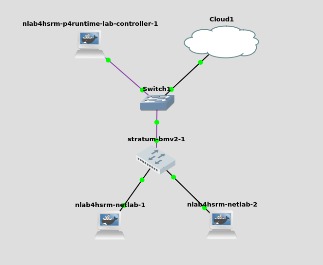

P4Runtime Lab - Programmierbare Dataplane
=========================================

Architektur und Technologien {#architektur-und-technologien}
----------------------------

P4Runtime ist ein Protokoll für die Kommunikation einer abgesetzten
Controlplane und einer Netzwerkkomponente. Im Unterschied zu OpenFlow
ist die Implementierung auf Seite der Dataplane nicht durch einen
Standard vorgegeben.

P4 und P4Runtime stellen damit mehr ein Framework zur Verfügung um
Technologien wie VXLAN zu implementieren. Die Art und Weise der
Implementierung, welche Funktionen auf eine externe Controlplane
ausgelagert wird und wie diese kommunizieren liegen damit vollständig in
Händen des Entwicklers. Eine beispielhafte Referenzimplementierung zeigt
die Open-Networking-Foundation mit der SD-FABRIC. Mittels P4
programmierbarer Switche mit Stratum als Betriebssystem wird ein
Netzwerk auf Basis der Technologien Segment-Routing und IPv6 errichtet.
Über P4Runtime wird eine externe Controlplane angebunden welche
Applikationen die direkte Steuerung des Netzwerkes ermöglicht. Dies kann
zum Beispiel in 5G Mobilfunknetzwerken eingesetzt werden, wo jedem
einzelnen Nutzer gewisse Datenkontingente zugestanden werden und
entsprechend die Verbindung gedrosselt wird.

P4Runtime benötigt im Gegensatz zu OpenFlow eine durch den Nutzer
gegebene Dataplane-Definition. In diesem Lab soll ein virtueller Switch
über P4 programmiert werden und eine abgesetzte Controlplane über
P4Runtime angebunden werden. Da dies an einem einfachem Beispiel gezeigt
werden soll wird ein einzelner Layer-2 Switch mit zwei angeschlossenen
Endgeräten gezeigt. Es wird keine komplexe Topologie und kein Layer-3
Routing implementiert.

P4
--

P4 ist eine durch ein Konsortium entwickelte Programmiersprache zur
Beschreibung des Verhaltens einer Dataplane. [@p4] P4 ist aktuell durch
kein RFC standardisiert, die Nutzung der Sprache in RFCs wird lediglich
in einem Draft erwähnt [@p4rfc]. Das Projekt steht als freies Projekt
unter der Linux Foundation.

P4 benötigt einen Compiler für das jeweilige Ziel auf dem das Programm
ausgeführt werden soll. Verfügbare Compiler sind zum Beispiel:

-   Intel P4 Studio - beinhaltet Compiler für Intel Tofino.

-   p4c-bm2-ss - Compiler für bmv2, eine Referenz Softwareswitch
    Implementierung für P4.

-   p4c-ebpf - Compiler für eBPF - ein Linux Kernelmodul zur
    performanten Paketverarbeitung

-   p4c-dpdk - Compiler für dpdk - ein Linux Modul zur performanten
    Paketverarbeitung

-   Xilinx P4-SDNet - Compiler für Xilinx FPGAs

-   AMD Pensando SSDK - Compiler für AMD Pensando DPUs

P4 ist Protokollunabhängig und hat damit keinen nativen Support für
bestimmte Technologien wie VXLAN. Header von eingehenden Paketen können
nach belieben geparsed werden und entsprechend verarbeitet werden. Zu
diesem Zwecke können Parser, Tabellen und entsprechende Aktionen
definiert werden. Damit liegt die Pipeline der Paketverarbeitung
vollständig in den Händen des Entwicklers.

{#fig:p4arch
width="100%"}

Ein P4 Programm besteht aus mehreren Komponenten. Während die Sprache
selbst und viele Funktionen aus der Core Library zum Standard gehören
und auf allen Plattformen verfügbar sind, sind die möglichen
Architektur-Komponenten durch den Compiler vorgegeben. Die
entsprechenden Compiler bringen Architekturen mit, beziehungsweise
müssen die jeweiligen Architekturen unterstützen.

{width="100%"}

In der Abbildung sind verschiedene Architekturen gezeigt. Die
Architektur V1Model wird häufig eingesetzt und unter anderem auch durch
den bmv2 Softwareswitch genutzt. Die Idee hinter PSA ist die Schaffung
einer Architektur welche sich allgemein auf verschiedener Hardware
abstrahieren lässt. Der Compiler für den Intel Tofino zum Beispiel
unterstützt die Architekturen V1Model, PSA und die eigene Architektur
TNA.

### P4Runtime

{width="30%"}

P4Runtime ist ein gRPC basiertes Protokoll zwischen einem
Netzwerk-Controller und einer in der Regel per P4 programmierten
Netzwerkkomponente. Mit dem Protokoll können zum einen P4-Programme auf
Netzwerkkomponenten übertragen werden und zum anderen auf Objekte wie
Tabellen zugegriffen werden. Die zugreifbaren Objekte werden bereits in
dem P4-Programm definiert und müssen sowohl dem P4Runtime-Server aus
auch dem Client bekannt sein. Sie werden gespeichert in einer .p4info
Datei. gRPC wiederum basiert auf protobufs, welches Daten im
Binär-Format seriell überträgt. Bei protobufs ist es im allgemeinen
notwendig, das die übertragenen Datenformate vorab beiden Seiten bekannt
sind.

### PINS

In der Regel ist P4Runtime auf Netzwerkgeräten implementiert, die auf
einer per P4 programmierbaren Hardware basieren. Dazu gehört zum
Beispiel Intels Tofino. Mit dem Projekt PINS wird die Schnittstelle auch
auf nicht P4-basierter Hardware implementiert. Die Freiheiten in der
Programmierung durch die Beschreibungssprache P4 sind hierbei stärker
eingeschränkt durch vorgegebene Blöcke in der Pipeline, die in
unveränderlicher Hardware abgebildet sind.

{width="100%"}

PINS dockt dabei oberhalb der Abstraktionsschicht SAI an.

### Virtueller Switch: Stratum-bmv2

Stratum ist ein Betriebssystem für Switche welches fundamentaler
Bestandteil aktueller Konzepte der [onf]{acronym-label="onf"
acronym-form="singular+short"} ist. Beispiele sind die Projekte TRELLIS,
welches neben dem Einsatz von P4Runtime noch OpenFlow unterstützt sowie
das aktuelle Projekt SD-FABRIC, welches vollständig auf dem Einsatz von
Stratum basiert. Das Betriebssystem wird auch als Thin-os bezeichnet und
fokussiert sich auf die Bereitstellung einer P4Runtime Schnittstelle zur
Programmierung der Dataplane. Stratum bietet neben der P4Runtime noch
die Schnittstellen gNMI und gNOI. Es gibt keine CLI abseits der
Linux-Boardmittel, als Schnittstellen sind lediglich die P4Runtime, gNOI
und gNMI implementiert. Stratum unterstützt Plattformen auf Basis von
Intels Tofinos, Broadcoms Tomahawk, sowie den Software-Switch bmv2.
[@stratum]

{#fig:faucettop
width="100%"}

Stratum integriert die Peripherie über entsprechende Treiber. Die
eigentliche Forwarding-Hardware wird über entsprechende SDKs
angesprochen. Die hier gezeigte SDKLT, Software Development Kit Logical
Table ist eine Schnittstelle von Broadcom zur Programmierung der
Broadcom eigenen ASICs. *These goals are best achieved by having a
networking stack that is efficient, customizable and open at all layers,
including the layer configuring the switch ASIC. SDKLT enables hardware
vendors, Network OS vendors and end users to build tailored,
highly-automated, high-quality, high-performance networking solutions
that meet the needs of both distributed control-plane and centralized
SDN-controller environments. In table-based programming, all the device
physical resources such as MAC Address Tables, L3 route tables, TCAMs,
etc. are exposed as logical tables.* [@sdklt]

### P4Runtime Go Controller {#sec:go-client}

Dieser Controller ist ein privat entwickeltes und quelloffenes Projekt
gefunden auf Github. Es handelt sich um ein kleines P4-Programm welches
einige wenige *tables* und *actions* zur Weiterleitung von
Ethernet-Paketen implementiert. Mittels eines abgesetzten und in GO
geschriebenen Controllers wird das Lernen von MAC-Adressen implementiert
sodass der Switch sich wie eine Bridge verhält. [@p4go]

Im weiteren werden die beiden Komponenten auf Basis ihres Quellcodes
erläutert.

#### l2\_switch.p4

In diesem P4-Pogramm wird die Dataplane des Switches definiert.

    #include <core.p4>
    #include <v1model.p4>

Zu Beginn wird die Bibliothek *core.p4* geladen, welches weiterhin
benötigte Routinen und Typdefinitionen enthält. An dieser Stelle wird
ebenfalls die Architektur des P4-Targets geladen. Hier wird die in
Abbildung [7.3](#fig:v1model){reference-type="ref"
reference="fig:v1model"} gezeigte Architektur verwendet.

{#fig:v1model width="100%"}

Das Model besteht aus einer festen Pipeline-Definition. Im weiteren
Verlauf des P4-Programms werden die einzelnen Blöcke beschrieben. Dafür
kennt die Sprache *parser*- und *control* Blöcke.

``` {caption="l2\\_switch.p4 - ParseImpl"}
\begin{lstlisting}[caption=l2\_switch.p4 ParseImpl]
parser ParserImpl(packet_in packet, out headers hdr, inout metadata meta, inout standard_metadata_t standard_metadata) {
    state parse_ethernet {
        packet.extract(hdr.ethernet);
        transition accept;
    }
    state start {
        transition parse_ethernet;
    }
}
```

Im ersten Block wird das empfangene Ethernet-Paket geparsed. Der
Funktionsblock nimmt einen komplettes Ethernet-Paket entgegen -
*packet\_in packet* - und gibt die Metadaten wieder zurück - *out
headers hdr*. Der Block arbeitet wie eine FSM - Finite State Mashine.
Der Block startet im Zustand *start* und wechselt ohne weitere Logik in
den Zustand *parse\_ethernet*. In diesem wird der Header extrahiert und
anschließend in den Zustand *accept* gewechselt, das Ende der FSM. Die
Variablen in der Definition des Funktionsblock können als *in*, *out*
und *inout* definiert werden. Alle Variablen die als *out* oder *inout*
definiert sind werden dabei an den nächsten Funktionsblock, also dem
Checksum Verificator weitergegeben.

``` {caption="'l2\\_switch.p4 - verify Checksum'"}
control verifyChecksum(inout headers hdr, inout metadata meta) {
    apply { }
}
```

Dieser Block ist in diesem einfachen P4-Programm leer, die Checksumme
wird also nicht überprüft.

``` {caption="'l2\\_switch.p4 IngressImpl'"}
control IngressImpl(inout headers hdr, inout metadata meta, inout standard_metadata_t standard_metadata) {
    action drop() {
        mark_to_drop(standard_metadata);
    }
    action learn_mac() {
        digest<digest_t>(0, {hdr.ethernet.srcAddr, standard_metadata.ingress_port});
    }
    action fwd(PortId_t eg_port) {
        standard_metadata.egress_spec = eg_port;
    }
    action broadcast(McastGrp_t mgrp) {
        standard_metadata.mcast_grp = mgrp;
    }
    table smac {
        key = {
            hdr.ethernet.srcAddr: exact;
        }
        actions = {
            learn_mac;
            NoAction;
        }
        const default_action = learn_mac();
        size = 4096;
        support_timeout = true;
    }
    table dmac {
        key = {
            hdr.ethernet.dstAddr: exact;
        }
        actions = {
            fwd;
            broadcast;
            drop;
        }
        default_action = drop();
        size = 4096;
    }
    apply {
        igPortsCounts.count(standard_metadata.ingress_port);
        smac.apply();
        dmac.apply();
    }
}
```

In diesem Block wird die eigentliche Weiterleitungsentscheidung
getroffen. Dafür werden vier *actions* sowie zwei *tables* definiert.
Bei der Definition der Tabelle werden die möglichen Aktionen sowie eine
Standardaktion definiert. Die vier Aktionen bilden die bekannten drei
Handlungsmöglichkeiten einer Bridge ab, ein Paket zu verwerfen (drop),
weiterzuleiten (fwd), zu fluten (broadcast) und zusätzlich eine neue
MAC-Adresse auf einer Schnittstelle zu lernen (learn\_mac).

Die smac Tabelle hat als Beispiel als default\_action die Aktion
learn\_mac definiert. Die Einträge der Tabelle sehen wie folgt aus:

``` {caption="'l2\\_switch.p4 - textit{smac} Tabellen Eintrag'"}
P4Runtime sh >>> for te in table_entry["IngressImpl.smac"].read():
            ...:     print(te)
            ...:
table_id: 36205427 ("IngressImpl.smac")
match {
  field_id: 1 ("hdr.ethernet.srcAddr")
  exact {
    value: "\\x86\\xee\\xaf\\x2a\\x62\\x8e"
  }
}
action {
  action {
    action_id: 21257015 ("NoAction")
  }
}
idle_timeout_ns: 10000000000
{...}
```

Sobald eine MAC-Adresse bekannt ist und in dieser Tabelle steht wird die
Aktion *NoAction* ausgeführt und das Paket damit nicht an den Controller
gesendet. Ist eine MAC-Adresse nicht bekannt wird die Standardaktion
*learnmac* ausgeführt.

``` {caption="l2\\_switch.p4 - \\textit{dmac} Tabellen Eintrag"}
table_id: 45595255 ("IngressImpl.dmac")
match {
  field_id: 1 ("hdr.ethernet.dstAddr")
  exact {
    value: "\\x1e\\x98\\x5e\\x39\\x8f\\x3d"
  }
}
action {
  action {
    action_id: 19387472 ("IngressImpl.fwd")
    params {
      param_id: 1 ("eg_port")
      value: "\\x08"
    }
  }
}
```

Analog dazu wird bei der Tabelle dmac verfahren. Zusätzlich wird hier
ein Parameter zurückgegeben. In diesem Fall wird die ID der
Schnittstelle auf dem das Ethernet-Paket weitergeleitet werden soll
übergeben.

Unter dem Schlüsselwort apply werden die in dem Block durchgeführten
Aktionen definiert, in gezeigten Beispiel wird erst ein Counter
inkrementiert, die smac-Tabelle mit entsprechender Aktion und
abschließend die dmac-Tabelle mit entsprechender Aktion aufgerufen.

``` {caption="l2\\_switch.p4 - DeparserImpl"}
control DeparserImpl(packet_out packet, in headers hdr) {
    apply {
        packet.emit(hdr.ethernet);
    }
}
```

Analog zu den gezeigten Modulen durchläuft das Paket die weiteren Module
bis es vom Deparser entsprechend vorher gesetzter Werte weitergeleitet
oder eben verworfen wird.

``` {caption="l2\\_switch.p4 - Instanziierung V1Model"}
V1Switch(p = ParserImpl(),
         ig = IngressImpl(),
         vr = verifyChecksum(),
         eg = EgressImpl(),
         ck = computeChecksum(),
         dep = DeparserImpl()) main;
```

Zuletzt wird eine Instanz des V1Models mit den soeben definierten
Blöcken erstellt.

#### main.go

Pakete mit unbekannter Quell-Macadressen werden wie im vorherigen
Kapitel gezeigt an den Controller gesendet. In dem GO Programm wird
dafür eine eine gRPC Verbindung aufgebaut, eine P4Runtime Session auf
Basis der gRPC Verbindung instanziiert und mittels einer go-Routine auf
eingehende Nachrichten reagiert.

``` {caption="main.go - Aufbau einer P4Runtime Sesssion"}
conn, err := grpc.Dial(addr, grpc.WithTransportCredentials(insecure.NewCredentials()))
{...}
c := p4_v1.NewP4RuntimeClient(conn)
{...}
p4RtC := client.NewClient(c, deviceID, electionID)
```

Der Aufbau einer P4Runtime Session wird in dem Listing vereinfacht
dargestellt. Es resultiert ein Objekt mit dem die Verbindung auf
eingehende Nachrichten abgehört werden kann. Die P4Runtime-Session wird
auf Basis einer bestehenden gRPC-Session aufgebaut.

``` {caption="'main.go - GO-routine zur Verarbeitung eingehender Nachrichten'"}
go func() {
        ctx := context.Background()
        handleStreamMessages(ctx, p4RtC, messageCh)
    }()
```

Mittels eine GO-Routine welche asynchron im Hintergrund läuft wird auf
eingehende Pakete reagiert.

``` {caption="main.go - Aufruf der Funktion learnMacs"}
func handleStreamMessages(ctx context.Context, p4RtC *client.Client, messageCh <-chan *p4_v1.StreamMessageResponse) {
    for message := range messageCh {
        switch m := message.Update.(type) {
        case *p4_v1.StreamMessageResponse_Packet:
            log.Debugf("Received PacketIn")
        case *p4_v1.StreamMessageResponse_Digest:
            log.Debugf("Received DigestList")
            if err := learnMacs(ctx, p4RtC, m.Digest); err != nil {
                log.Errorf("Error when learning MACs: %v", err)
            }
{..}
        }
    }
}
```

Durch eine *case*-Abfrage wird auf Digest-Nachrichten, also von der
Dataplane aufgrund unbekannter MAC-Adresse an den Controller gesendeten
Paketen, die Funkion learnMacs ausgeführt.

``` {caption="main.go - Die Funktion learnMacs"}
func learnMacs(ctx context.Context, p4RtC *client.Client, digestList *p4_v1.DigestList) error {
{...}
        smacEntry := p4RtC.NewTableEntry(
            "IngressImpl.smac",
            map[string]client.MatchInterface{
                "hdr.ethernet.srcAddr": &client.ExactMatch{
                    Value: srcAddr,
                },
            },
            p4RtC.NewTableActionDirect("NoAction", nil),
            smacOptions,
        )
        if err := p4RtC.InsertTableEntry(ctx, smacEntry); err != nil {
            log.Errorf("Cannot insert entry in 'smac': %v", err)
{...}
    return nil
```

In diesem Ausschnitt der *learnmacs*-Funktion wird die Instanziierung
eines neuen Tabellen-Eintrags sowie die anschließende Übertragung des
Eintrags auf den Stratum-Switch gezeigt. Hierbei handelt es sich um
einen Eintrag in der Tabelle *smac* mit der Aktion *NoAction*.

Simulation
----------

### Stratum-bmv2 Container

Der Switch wird in Form eines Docker-Containers virtualisiert. Der
Software Switch Stratum-bmv2 wird über ein Debian-Paket installiert,
welches selbst aus entsprechendem Quellcode kompiliert werden muss. Die
Vorgehensweise für die Erstellung des Debian-Pakets ist in dem
entsprechenden Github Repository dokumentiert.[@stratum-git]. Das
bereits kompilierte Debian-Paket, ein Dockerfile sowie eine zugehörige
GNS3-Appliance Beschreibungsdatei (\*.gns3a) liegen im Versuchsordner
ab.

    $ docker build . -t nlab4hsrm/stratum-bmv2:<tag>

Der Container wird mit gezeigtem Befehl erstellt. Der Befehl muss im
Verzeichnis in dem das Dockerfile sowie das Debian-Paket abliegt
ausgeführt werden. Als Basis-Image wird das ältere Debian Buster
verwendet. Ein Versuch mit dem aktuellerem Bookworm schlug fehl

Der Container kann im Anschluss in GNS3 als Applikation angelegt werden.
In dem GNS3-Server-Manager Template Stratum\_P4\_Lab ist die Applikation
vorbereitet.

{#fig:evpncli
width="100%"}

Es werden 9 Schnittstellen provisioniert, wobei die erste - eth0- als
Management-Schnittstelle genutzt wird. Als Start command des Containers
wird die Anwendung stratum\_bmv2 aufgerufen der als Parameter der Pfad
zur Chassis-Konfiguration übergeben wird.

    root@stratum-bmv2-2:/# stratum_bmv2 -chassis-config-file=/etc/stratum/chassis_config.pb.txt
    16:09:25.746376    82 logging.cc:72] Stratum version: not stamped.
    16:09:25.746848    82 main.cc:124] Starting bmv2 simple_switch and waiting for P4 pipeline
    {...}
    16:09:25.750290    82 hal.cc:127] Setting up HAL in COLDBOOT mode...
    16:09:25.750356    82 config_monitoring_service.cc:94] Pushing the saved chassis config read from /etc/stratum/chassis_config.pb.txt...
    16:09:25.754789    82 bmv2_chassis_manager.cc:519] Registered port status callbacks successfully for node 1.
    16:09:25.754822    82 bmv2_chassis_manager.cc:61] Adding port 1 to node 1
    16:09:25.802373    82 bmv2_chassis_manager.cc:61] Adding port 2 to node 1
    16:09:25.838375    82 bmv2_chassis_manager.cc:61] Adding port 3 to node 1
    16:09:25.870373    82 bmv2_chassis_manager.cc:61] Adding port 4 to node 1
    16:09:25.902369    82 bmv2_chassis_manager.cc:61] Adding port 5 to node 1
    16:09:25.938369    82 bmv2_chassis_manager.cc:61] Adding port 6 to node 1
    16:09:25.970402    82 bmv2_chassis_manager.cc:61] Adding port 7 to node 1
    16:09:25.998498    82 bmv2_chassis_manager.cc:61] Adding port 8 to node 1
    {...}
    16:09:26.049036    82 hal.cc:220] Stratum external facing services are listening to 0.0.0.0:9339, 0.0.0.0:9559, localhost:9559...

Nach starten des Switches kann sich der Log durch öffnen eines Terminals
mit einem Doppelklick auf die Netzwerkkomponente betrachten. Die sollte
die im Listing gezeigten Zeilen enthalten. Wichtig ist, das die 8 Ports
hinzugefügt worden sind und Stratum auf den Ports 9339 und 9559
Verbindungen akzeptiert.

### p4runtime-controller Container

``` {caption="P4-Runtime Dockerfile"}
FROM ubuntu:22.04
ENV DEBIAN_FRONTEND noninteractive

# install tools
RUN apt-get update \
        && apt-get upgrade -y \
        && apt-get install -y iputils-ping iproute2 nano ssh python3 python3-pip

RUN pip3 install p4runtime-shell

ADD P4_LAB /P4_LAB

CMD ["/bin/bash"]
```

Als Controller wird ein selbst erstellter Docker-Container verwendet.
Dieser enthält die kompilierte GO-Anwendung, beschrieben in Kapitel
[7.2.4](#sec:go-client){reference-type="ref" reference="sec:go-client"},
sowie eine in Python geschrieben P4Runtime-Shell mit der sich dynamisch
Objekte von einem Switch anzeigen und modifizieren lassen. Die
GO-Anwendung beinhaltet den ebenfalls bereits kompilierten P4-Code für
den Stratum Software-Switch.

    $ python3 -m p4runtime-sh --grpc-addr <Switch Management IP>:<gRPC Port>

Diese P4Runtime-Shell lässt sich als Python-Modul mit dem hier gezeigten
Befehl als interaktive Shell aufrufen.

### Start des Netzwerkes

{#fig:evpncli
width="100%"}

Zur Demonstration wird eine Topologie erstellt mit einem Stratum-Switch
sowie einem P4Runtime-Controller. Zu Beginn werden dem Controller sowie
dem Stratum Software-Switch IP-Adressen zugewiesen. Dies kann über den
Punkt Edit config im GNS3-Kontextmenü unter Auswahl der jeweiligen
Geräte durchgeführt werden. Da keine externen Verbindungen benötigt
werden ist die Nutzung des Cloud-Knotens und die damit notwendige
Nutzung des 172.30.0.0/24er Netzwerkes optional. Nun sollte die
Verbindung zwischen Controller und Switch mittels Ping überprüft werden.
Ist dies erfolgreich, kann fortgefahren werden.

    ./P4_LAB/l2_switch -addr=172.30.240.110:9559 -device-id=1 -ports=1,2,3,4,5,6,7,8 &

Im Anschluss wird eine Konsole auf dem Controller-Knoten gestartet und
der Controller mit dem gezeigten Befehl gestartet. Die gezeigte
IP-Adresse muss entsprechend angepasst werden. Durch das nachgestellte &
wird der Prozess im Hintergrund ausgeführt und die Linux-Konsole ist
weiter nutzbar.

Nun sollte ein Ping zwischen den beiden an dem Software-Switch
angeschlossenen Endgeräten möglich sein, sofern diese eine IP-Adresse im
gleichen Subnetz konfiguriert haben.

    $ python3 -m p4runtime-sh --grpc-addr <Switch Management IP>:<gRPC Port>

Im nächsten Schritt kann auf dem Controller eine p4runtime-shell
gestartet werden um die Tabellen auf dem Stratum Software-Switch
auszulesen. Auch hier muss die IP-Adresse entsprechend angepasst werden.

Über folgenden Befehl lassen sich alle verfügbaren Tabellen auflisten:

``` {caption="P4Runtime-Shell: Tabellen auflisten"}
P4Runtime sh >>> tables
IngressImpl.dmac
IngressImpl.smac
```

Die Informationen über eine Tabelle lassen sich wie folgt ausgeben:

``` {caption="P4Runtime-Shell: Tabellen Informationen anzeigen"}
P4Runtime sh >>> tables["IngressImpl.dmac"]
Out[20]:
preamble {
  id: 45595255
  name: "IngressImpl.dmac"
  alias: "dmac"
}
match_fields {
  id: 1
  name: "hdr.ethernet.dstAddr"
  bitwidth: 48
  match_type: EXACT
}
action_refs {
  id: 19387472 ("IngressImpl.fwd")
}
action_refs {
  id: 22047199 ("IngressImpl.broadcast")
}
action_refs {
  id: 17676690 ("IngressImpl.drop")
}
size: 4096
```

Um die einzelnen Einträge einer Tabelle anzuzeigen muss in der
Python-Shell eine Schleife konstruiert werden:

``` {caption="P4Runtime-Shell: Tabelleneinträge anzeigen"}
P4Runtime sh >>> for te in table_entry["IngressImpl.smac"].read():
            ...:     print(te)
            ...:
```

Fazit
-----

Das Lab zeigt in einem einfachem Beispiel die Funktionsweise und die
Implementierung einer P4-basierten Netzwerkkomponente und des
zugehörigen Controllers.

P4Runtime ist ein konsequenter Ansatz Netzwerkkomponenten und
Architekturen programmierbar zu gestalten. Mit P4Runtime lassen sich
Controller-basierte Architekturen in zentraler und dezentraler Form
realisieren. P4 bildet weiterhin eine mächtige Abstraktionsschicht
zwischen der Vorstellung eines Anwenders wie das Netzwerk zu
funktionieren hat und der eigentlich eingesetzten Hardware. Portable
P4-Programme entkoppeln hierbei konsequent die Hardware von der
Funktion. Die Programmierbarkeit ist weiter zuträglich neue Funktionen
einfach in bestehende Netzwerke integrieren zu können.

P4-basierte Netzwerkarchitekturen haben für Enterprise-Segment eine
geringe Relevanz da hier Zeit und Kompetenz fehlt eigene Anwendungen zu
schreiben, was der eigentlich primäre Vorteil von P4 ist. Eigentliche
Vorteile der Programmierbarkeit auf diesem Level werden durch Anbieter
im Carrier- und Cloudumfeld ausgeschöpft, die auf Basis von P4
leistungsfähige und anwendungsspezifische Loadbalancer oder ähnliches
entwickeln. Mögliche Vorteile im Enterprise-Segment sind die
Implementierung neuer Funktionen im Feld was die Lebensdauer von
Hardware erhöhen kann. Zeitgleich ist ein Unternehmen nicht auf eine
bestimmte Hardware-Serie von einem Hersteller angewiesen und kann
unabhängig seiner logischen Netzwerkarchitektur eine andere P4-basierte
Hardwareplattform einkaufen.

P4 kommt damit am nächsten und konsequentesten an die Definition von SDN
heran. Die ONF beschreibt P4 als NG-SDN -Next Generation Software
defined Networking.

BGP-EVPN Lab - Netzwerkvirtualisierung mit SONiC {#sec:evpnlab}
