---
author:
- Benedikt Heuser
bibliography:
- literatur.bib
date: 02.11.2023
title: 'Evaluation und Simulation aktueller Software-Defined-Networking
  Konzepte'
---

{width="30%"}

Hochschule RheinMain\
Fachbereich ITE\
Studiengang EE-CS

**Masterthesis**\

1.2

  -------------- ----------------------------------- --
  verfasst von   **Benedikt [Heuser]{.smallcaps}**   
                 Matrikelnummer 105320               
                                                     
  am                                                 
                                                     
  -------------- ----------------------------------- --

[Kompiliert am  um  - Erstellt mit LaTeX]{style="color: 0.4"}

Einleitung
==========

Die Hochschule Rhein-Main betreibt einen GNS3-Server mit einer
Nutzerverwaltung sowie einer Template-Funktion zur Durchführung von
Praktikas im Netzwerbereich. Es sollen Switching- und Routingplattformen
sowie [sdn]{acronym-label="sdn" acronym-form="singular+short"}
Architekturen gefunden werden, die sich auf dieser Plattform
virtualisieren lassen. Ziel ist es hiermit verschiedene
[sdn]{acronym-label="sdn" acronym-form="singular+short"} Technologien im
Rahmen der Lehre auf der Plattform demonstrieren zu können.

Die erste Aufgabe ist hiermit die Suche nach SDN-Architekturen. Für die
Suche nach entsprechenden Architekturen wird zu Beginn der Begriff SDN
definiert. Der Begriff SDN ist zwar eng an die Technologie OpenFlow
geknüpft, ist aber mehr eine grundlegende Idee Netzwerke zu
implementieren und zu Betreiben. Zu diesem Zwecke wird eine Marktanalyse
durchgeführt um Technologien auszumachen die bei am Markt erhältlichen
Lösungen eingesetzt werden und diese Technologien auf Relevanz und
Implementierungsreife bewerten zu können.

Die zweite Aufgabe besteht darin gefundene Technologien und
Architekturen auf der Plattform der Hochschule zu simulieren. Dafür
müssen virtualisierbare Switchbetriebsysteme gefunden werden die zu
demonstrierende Protokolle und Technologien unterstützen. Nach
Möglichkeit werden quelloffene Lösungen eingesetzt, da bei diesen
gezeigtes Verhalten Anhand des Quellcodes nachvollzogen werden kann.

*Software-defined networking (SDN) is obsolete, \...* - das zumindest
behauptet das Beratungsunternehmen Gartner in Ihrem Hype Cycle for
Enterprise Networking, 2023. Dies mag zwar für einzelne Technologien
stimmen, trifft aber nicht allgemein auf die Idee
[sdn]{acronym-label="sdn" acronym-form="singular+short"} zu. Eine
Differenzierung des Begriffes SDN sowie Gründe für die heutige Relevanz
von [sdn]{acronym-label="sdn" acronym-form="singular+short"} und dessen
Paradigmen wird zu Beginn der Thesis gegeben.[@ghc]

Abschließend wird in einem kurzen jeweiligem Fazit die Vorteile der
Architektur gegenüber einem traditionellem Ansatz sowie der Reifegrad
der Implementation bewertet. SDN Architekturen eignen sich insbesondere
Routing und Switching Funktionsweisen zu verdeutlichen, da eingesetzte
Mechaniken zur Weiterleitung von Daten Anhand der in der Regel
quelloffenen Software beziehungsweise durch Auswertung von einsehbaren
Regeltabellen gut nachvollziehbar sind.

Motivation
----------

Ich arbeite selbst in einem kleinem Unternehmer als Berater und
Architekt für Computer-Netzwerke. Kunden sind in der Regel
mittelständige Unternehmen und Behörden. Nachdem ich im Rahmen der
Master-Vorlesungen Prof. Dr.-Ing. Bernhard Gross in Kontakt mit
[sdn]{acronym-label="sdn" acronym-form="singular+short"} Konzepten auf
Basis von OpenFlow kam, ist mir aufgefallen das diese Technologie mir im
Rahmen meiner Berufstätigkeit noch nicht untergekommen ist. Während
OpenFlow Implementierungen schwinden, etabliert sich Underlay/Overlay
Netzwerke bei vielen Herstellern als gängiges Lösungsdesign.
Gleichzeitig stellt die [onf]{acronym-label="onf"
acronym-form="singular+short"} einen Nachfolger von OpenFlow vor, die
P4Runtime. In dieser Thesis möchte ich den aktuellen SDN-Konzepte für
Campusnetzwerke erörtern und diese auf der GNS3-Plattform des NLABs
simulieren sowie entsprechende Templates dokumentieren und zur Verfügung
stellen.

Tradionelles Netzwerk {#sec:tn}
---------------------

Da im weiteren Verlauf öfter ein Vergleich zu einem traditionellen
Netzwerkgezogen wird, soll an dieser Stelle die Eigenschaften erläutert
werden, die [sdn]{acronym-label="sdn" acronym-form="singular+short"}
besser machen möchte.

Die Aufgabe eines Netzwerkes ist es Endgeräten untereinander
Kommunikation zu ermöglichen. Betrachtet werden Netzwerke deren
Kommunikation auf IP über Ethernet basiert. Ethernet ist eine
Technologie die bereits in den 1970er Jahren von Xerox entwickelt worden
ist. An einem Ethernet-Netzwerk konnten mehrere Teilnehmer angeschlossen
werden. Ähnlich einer Bus-Topologie haben alle Teilnehmer sich das selbe
physikalische Medium geteilt, was eine Kollisionsdetektion in Form von
CSMA/CD notwendig machte. Eine Belastung des Netzwerkes von über 60
Prozent führte zu vielen Kollisionen, so dass das Netzwerk ineffizient
wurde. Als weiteren Entwicklungsschritt wurden Bridges eingeführt,
welche Pakete auf Basis Ihrer MAC-Adresse nur an den dedizierten
Ziel-Host weiterleiten. Diese Bridges sind heute allgemein als Switche
bekannt. Diese segmentieren damit Ethernet-Netzwerke und verringern
Kollisionen durch Dämpfung von Datenverkehr zu Hosts die nicht an den
Daten interessiert sind. IP-Netzwerke werden unterteilt in Subnetze,
definiert durch einen IP-Adressbereich und einer dazugehörigen
Subnetzmaske. Innerhalb eines Subnetzes kommunizieren Hosts über
Ethernet direkt miteinander. Zwischen Subnetzen kommunizieren sie über
Router, welche in mehreren Subnetzen gleichzeitig eine Schnittstelle
besitzen. Der Host schickt sein Paket um einen Host in einem anderen
Subnetz zu erreichen an den Router, der das Paket entsprechend
weiterleitet - oder auch routet. Der Host kennt das Router unter dem
Synonym Default-Gateway.

Die IP-Kommunikation basiert auf dem [arp]{acronym-label="arp"
acronym-form="singular+short"}-Protokoll. Das Protokoll dient dazu, zu
einer IP-Adresse die zugehörige MAC-Adresse aufzulösen. Dazu sendet er
einen Broadcast an alle Teilnehmer des Netzwerkes woraufhin der gesuchte
Host mit seiner MAC-Adresse antwortet. Unter Kenntnis der MAC-Adresse
adressiert er seine Nachricht mit dieser MAC-Adresse und schickt sie in
Richtung des Switches. Der Switch hat eine Tabelle mit MAC-Adressen und
den zugehörigen Schnittstellen und leitet das Paket analog dazu weiter.
Hat er keinen entsprechenden Eintrag schickt er das Paket über alle
Interfaces heraus. Befindet sich ein Host in einem anderen Netzwerk,
entscheidet der Host das Paket nicht direkt, sondern über sein
Default-Gateway zu versenden. Dies ist in der Regel ein Router mit eine
IP-Adresse im selben Subnetz.

Sowohl das ARP-Protokoll als auch die Layer-2 Paketweiterleitung
benötigen Broadcasts, also das fluten (engl. flooding) von Paketen um zu
funktionieren. Genau dieser Mechanismus führt bei traditioneller
Netzwerke in Hinsicht aus Skalierbarkeit und Ausgestaltung der Topologie
zu Einschränkungen.

Um diesen Herausforderungen in Ethernet-Netzwerk zu begegnen wurden
Protokolle wie [stp]{acronym-label="stp" acronym-form="singular+short"}
oder später [spb]{acronym-label="spb" acronym-form="singular+short"}
eingeführt.

Durch die dezentrale Konfiguration haben Protokolle und Mechanismen eine
gewisse Komplexität. Eine Layer-2 Verbindung durch ein Netzwerk hindurch
muss unter Nutzung von VLANs auf jedem Hopim Datenpfad konfiguriert
werden. Zusätzlich ist dieser Datenpfad statisch und reagiert nicht auf
Überlast oder Ausfall von einzelnen Links. Redundante Datenpfade lassen
sich über Layer-3 Verbindungen auf Basis von Routingprotokollen, dem
dynamischen blockieren von Ports mit Spanning-Tree,
[spb]{acronym-label="spb" acronym-form="singular+short"} oder auch
[mlag]{acronym-label="mlag" acronym-form="singular+short"} Konstrukten
herstellen.

Gründe für SDN
--------------

Durch Entkopplung der [cp]{acronym-label="cp"
acronym-form="singular+short"} von der [dp]{acronym-label="dp"
acronym-form="singular+short"} versucht man die vorig genannten
Einschränkungen sowie administrativen Herausforderungen zu begegnen.
Netzwerke sollen programmierbar sein und redundante sowie vermaschte
Topologien ermöglicht werden. Primär geschieht dies durch die
Optimierung von Netzwerkbroadcasts und der geregelten Steuerung von
Datenpfaden. Die Controlplane benötigt dafür einen globalen Blick auf
das Netzwerk, muss die verschiedenen Datenpfade sowie den Ort der
einzelnen Hosts kennen. Die Controlplane eines einzelnen Switches kennt
bei einfachem Layer-2 Switching und Layer-3 Routing in der Regeln nur
den nächsten Hop für das Paket. Sie hat keine Kenntnis über die
Topologie sowie dem genauen Ort eines Ziel-Hosts. Bei
[sdn]{acronym-label="sdn" acronym-form="singular+short"} soll wird eine
abgesetzte [cp]{acronym-label="cp" acronym-form="singular+short"}
implementiert die das Verhalten des Netzwerk im gesamtem kennt und
entsprechend programmieren kann.

Der Begriff SDN
---------------

In diesem Kapitel wird eine Differenzierung des Begriffes
Software-Defined-Networking versucht.

Der Begriff [sdn]{acronym-label="sdn" acronym-form="singular+short"}
wird oft als Marketingbegriff eingesetzt. Der Begriff kam in
Zusammenhang mit Entwicklungen der Stanford Universität auf, die mit
Hilfe von [of]{acronym-label="of" acronym-form="singular+short"} die
[dp]{acronym-label="dp" acronym-form="singular+short"} eines Switches
programmieren konnten. Damit ließen sich Controller-basierte
Netzwerkkonzepte realisieren. Allgemeiner betrachtet wird die
Bezeichnung Software-Definedfür Geräte verwendet, deren Funktionen und
deren Funktionsweise programmiert und damit per Software definiert
werden kann. Ein Beispiel sind Software-Defined-Radios. Diese Geräten
verfügen über eine Antenne welche in verschiedenen Frequenzen Signale
modulieren können. Über eine entsprechende Software lassen sich diese
Geräte dann zum Beispiel für Bluetooth, WLAN oder Zigbee einsetzen. Die
eigentliche Funktion der Geräte ist also durch Software definiert. Oft
verschwimmt der Begriff auch mit dem Begriff Virtualisierung. So werden
Systeme im Storage-Bereich, welche auf Grundlage von mehreren Servern
einen gemeinsamen Speicher virtualisiert darstellen auch gerne als
Software-Defined-Storage bezeichnet. Gleiches gilt für
Netzwerkvirtualisierungskonzepte auf Basis von Software-Switchen oder
VXLAN, welche auch gerne unter der Kategorie [sdn]{acronym-label="sdn"
acronym-form="singular+short"} geführt werden.

Im Netzwerk-Bereich beschreibt der Begriff primär die Entkopplung der
[cp]{acronym-label="cp" acronym-form="singular+short"} von der
[dp]{acronym-label="dp" acronym-form="singular+short"}, was die
Notwendigkeit einer programmierbaren [dp]{acronym-label="dp"
acronym-form="singular+short"} sowie Protokolle zur Kommunikation dieser
beiden untereinander bedingt. Dies ermöglicht nicht nur die im vorigen
Kapitel erwähnten Optimierungen, sondern ermöglicht auch eine zentrale
Konfiguration von Netzwerken. Oberflächen-basierte Administrationstools
sind hierbei wesentlich einfache umzusetzen, da die Komplexität des
Netzwerkes nicht in der Konfiguration abgebildet wird.

### Unterscheidungsmerkmale SDN

#### Asymmetrisch vs Symmetrisch

[sdn]{acronym-label="sdn" acronym-form="singular+short"} Architekturen
lassen sich unterscheiden in Asymmetrisch und Symmetrisch. Bei
Asymmetrischen Modellen wird die [cp]{acronym-label="cp"
acronym-form="singular+short"} zentralisiert und in der Regel als eine
Software-Anwendung implementiert. Bei symmetrischen Modellen wird die
[cp]{acronym-label="cp" acronym-form="singular+short"} verteilt direkt
auf den einzelnen Netzwerkgeräten implementiert. Die Vorteile
asymmetrischer Modelle sind die zentrale Konfiguration und die
Verzichtbarkeit von Protokollen zur Verteilung von Informationen.
Nachteile ist das dieser Controller eine Single Point of Failure
darstellt. Zusätzlich können zentrale Controller nicht unbegrenzt mit
dem Netzwerk mit skalieren. Vorteile symmetrischer Modelle ist die
Architektur-bedinge Redundanz und Skalierung bei wachsender
Netzwerkgröße.

#### Floodless vs Floodbased

Wie Eingangs beschrieben basieren wichtige Mechaniken von Ethernet/IP
Netzwerken auf Broadcasts. Diese Broadcasts sind in allgemein in großen
Netzwerken und vermaschten Topologien problematisch. Daher versuchen
einige Ansätze diese Broadcasts zu unterdrücken und durch andere
Mechaniken zu ersetzen. Gesendete Broadcasts zur Auflösung von Adressen
werden abgefangen und direkt aus einer Datenbank heraus beantwortet.
Architekturen deren Verbreitung von Erreichbarkeits-Informationen nicht
auf Broadcasts basiert werden daher allgemein als Floodless bezeichnet.
Broadcasts werden allerdings auch gerne von Anwendungen auf der
Applikationsebene eingesetzt um zum Beispiel alle Drucker in einem
Netzwerk zu finden, was eine entsprechende Implementierung von
intelligenten Broadcasts oft notwendig macht.

#### Hostbased vs Netbased

Traditionellerweise ist das Netzwerk vollständig auf Netzwerkhardware
implementiert. Ein Host ist über ein einfaches Layer-2 Interface ohne
VLAN-Tag mit dem Netzwerk verbunden. Durch das Aufkommen von
Virtualisierungsplattformen und anderen Applikationsplattformen wie
Kubernetes welche innere Netzwerkarchitekturen haben, wurde begonnen
Netzwerkfunktionalität auf die Server zu ziehen. Prominentes Beispiel
ist der OpenvSwitch, welche zum Beispiel dafür verwendet wird Netzwerk
an Virtuelle Maschinen zu provisionieren. Diese virtuellen Switche sind
mittlerweile weit entwickelt und unterstützen Routing-Protokolle und
Virtualisierungsprotokolle wie VXLAN. Dies macht es naheliegend ein
VXLAN Overlay direkt auf dem Server zu terminieren, und die
konfigurative Komplexität in der Virtualisierungsanwendung zu
implementieren. Das physikalische Netzwerk stellt in diesen
Architekturen lediglich einfache IP Konnektivität her. Prominente
Beispiele sind OpenStacks Neutron, VMwares NSX und Flow von Nutanix.
Diese Produkte erlauben die Provisionierung von Netzwerkdiensten auf der
Anwendungsschicht.

### Erwartungen an SDN

Wie festgestellt gibt es keine scharfe Definition des Begriffes SDN.
Weiterhin wird versucht die auf SDN-Netzwerke projizierten Erwartungen
zu Beschreiben.

#### Erwartung 1: Controllerbasiert - Programmierbarkeit und Zentrales Management

Die abgekoppelte [cp]{acronym-label="cp" acronym-form="singular+short"}
ist häufig in Form einer zentralen Anwendung implementiert. Durch diese
Architektur ist die Konfiguration des gesamten Netzwerkes an eine
zentralen Stelle naheliegend. Dies wird als komfortabel empfunden und
stellt damit eine Anforderungen an solche Konzepte da. Weiterhin wird
das Netzwerk dadurch durch das anbieten von APIs durch den Controller
programmierbar. Dies ist auch mit einen klassischen Netzwerkansatz
möglich, allerdings ungleich komplexer.

#### Erwartung 2: Redundanz, Skalierfähigkeit und Weiterleitungsoptimierungen

Durch eine globale Controlplane lassen sich die
Paketweiterleitungsmechanismen optimieren und Redundant und die
Skalierfähigkeit eines Netzwerkes erhöhen. Weiterhin ist eine
intelligente Steuerung von Datenflüssen möglich, da dem Controller die
vollständige Topologie und im besten Fall auch die Auslastung einzelner
Links bekannt ist. Dieser kann entsprechend Pfade modifizieren.

#### Erwartung 3: Disaggregation Funktion/Software von Hardware

Die Software auf Switchen ist in der Regel eng an die jeweilige
Hardwareplattform gekoppelt und in seiner Bedienung und Funktionalität
sehr Herstellerspezifisch. Das Mischen von Plattformen verschiedener
Hersteller sollte in der Regel getestet werden und muss nicht unbedingt
funktionieren. Das liegt nicht nur an abweichenden Implementierungen von
Standards, sondern auch Mechanismen die Herstellerproprietär sind. Ein
gutes Beispiel sind [mlag]{acronym-label="mlag"
acronym-form="singular+short"} Protokolle, welche nicht standardisiert
sind und zwischen zwei unterschiedlichen Herstellerplattformen nicht
funktionieren. Der Einsatz einer Softwareplattform in einem Netzwerk auf
Hardwareplattformen verschiedener Hersteller kann dies entgegen wirken.
Der Vendor-Lockin kann damit erheblich minimiert werden.

#### Erwartung 4: Traffic Engineering

Traffic Engineering ist vorallem bei der Nutzung mehrerer
Netzwerk-Strecken mit verschiedenen Eigenschaften zur Verbindung
verschiedener Standorte. In diesem Bereich haben derzeit
Software-Defined-Lösungen eine relevante Verbreitung. Diese Lösungen
werden im allgemeinen mit SD-WAN bezeichnet. Ein Controller erfasst hier
verschiedene Metriken der Strecken wie Durchsatz und Paketverzögerung
und weißt auf Basis dessen Datenverkehr einen optimierten Pfad zu. Damit
können geschlossene Regelkreise zur idealen Nutzung von Netzwerkstrecken
und Überwachung von Mindestanforderungen für zum Beispiel
Videotelefonie.

### WCMP

In traditionellen vermaschten IP-Netzwerken wird der Datenpfad in der
Regel durch Routing-Protokolle bestimmt. Da es in einem vermaschten
Netzwerk mehrere Wege zwischen zwei Routern gibt, nutzen
Routing-Protokolle in der Regel Algorithmen die die Pfadkosten der
verschiedenen Wege bestimmen um den optimalen Pfad zu bestimmen. Dies
führt dementsprechend dazu, dass die Daten unabhängig der Auslastung der
Strecke, immer den selben Pfad nutzen. Eine Erweiterung dessen bieten
manche Protokolle mit ECMP - Equal Cost Multipathing. Hierbei werden auf
Basis eines konfigurierbaren Load-Sharing Algorithmuses die Daten auf
Pfade mit gleichen Kosten aufgeteilt. Eine konsequente Erweiterung davon
ist WCMP - Weighted Cost Multipathing. Hierbei werden die verschiedenen
Links dynamisch auf Basis der aktuellen Auslastung ider anderen
messbaren Metriken wie Jitter gewichtet. Die Implementierung dessen
erfordert allerdings eine Instanz die dynamisch die Strecken bewertet
und eben entsprechend gewichtet. Cisco hat WCMP auch schonmal in ihrem
Routing-Protokoll EIGRP implementiert, hierbei wurden Metriken zu
einzelnen Links zwischen den Routern verteilt und zur Gewichtung von
Pfaden genutzt.

### Kontext zum Begriff Netzwerkvirtualisierung

Der Begriff der Netzwerkvirtualisierung beschreibt die Abbildung einer
Netzwerkinfrastruktur unabhängig der darunter liegenden physikalischen
Topologie. Ein einfaches Beispiel sind VLANs.Im komplexeren Fall lassen
sich Netzwerke auf Basis von Enkapsulierungsprotokollen wie zum Beispiel
VXLAN auch über geroutete Strecken wie das Internet hinweg abbilden. Der
Begriff wird ebenfalls für den Einsatz virtueller Switche auf
Virtualisierungsplattformen genutzt. An diesen virtuellen Switch werden
Anwendungen in Form von Virtuellen Maschinen angeschlossen. Dieser
Switch kann nach außen auch als Router oder Tunnel-Endpunkt fungieren,
und Komplexität vom Netzwerk in die Anwendungsebene ziehen.

### Kontext zum Begriff Fabric

Im Netzwerkbereich wird der Begriff Fabric üblicherweise für Konzepte
genutzt, bei denen die Switche in einem vermaschten Topologie vernetzt
sind. Die Beschränkungen herkömmlicher Strukturen, in denen ein Netzwerk
Sternförmig aufgebaut werden muss was Konzepte mit mehreren Stufen wie
Core, Aggregation und Edge erfordert gelten hier nicht. Weiterhin ist es
Anspruch an eine Fabric diese beliebig erweitern zu können sowie eine
Konfiguration eines Services nur am Rand oder per Controller durchführen
zu können. Um eben diese Freiheiten zu erreichen sind Techniken aus dem
vermeintlichen SDN-Bereich notwendig.

Netzwerksimulation
------------------

Ähnlich wie in anderen Technologiesektoren entwickeln sich die Ansätze
und Technologien im Netzwerkbereich mit steigender Geschwindigkeit
weiter. Netzwerke nachzubauen kann hilfreich zum evaluieren von
Konzepten, zur Validierung von Änderungen an bestehenden Netzwerken und
zur Schulung und Lehre sein. Die Fähigkeit ein Netzwerk zu simulieren
ist nicht nur erheblich kostengünstiger, sondern ermöglicht auch den
Aufbau komplexer Topologien mit weniger zeitlichen und
arbeitstechnischen Aufwand. Herausforderung ist die Implementierung von
hardwarenahen Funktionen, welche bei den physikalischen Geräten direkt
im Chip implementiert sind.

Die Vorteile und Notwendigkeiten der Netzwerksimulation haben auch viele
Hersteller erkannt und bieten eigene Simulationsplattformen an. Gerne
genutzter Marketingbegriff hierfür ist Digital Twin, zu Deutsch
Digitaler Zwilling.

Ein Überblick über derzeit von Herstellern vertriebene
Simulationslösungen:

-   Cisco Modeling Labs

-   H3C Cloud Lab

-   ExtremeCloud IQ Co-Pilot: Digital Twin

-   Aruba AOS-CX Switch Simulator

Diese sind teilweise Cloud-basiert wie die Lösung von Cisco, und
teilweise in Grundlage ein GNS3 mit modifizierter Oberfläche wie die
Lösung von H3C.

Einige Hersteller bieten stattdessen oder simultan auch eine virtuelle
Variante ihres Switch-OS an, um dieses in eigenen Simulationsumgebungen
einzusetzen. Beispiele sind:

-   **DELL OS10** - Dell bietet auf seiner Homepage ein GNS-3 Bundle von
    DELL-OS10 an.

-   **Extreme EXOS** - Extreme bietet im Marktplatz von GNS-3 eine
    virtuelle Variante ihres Switch-Betriebsystemes an.

-   **vEOS** - Arista bietet eine allgemeine virtuelle Variante ihres
    Betriebsystemes an, welche dadurch auch in GNS-3 lauffähig ist.

-   **SONiC** - Die Entwickler von SONiC bieten eine virtuelle Variante
    SONIC-VSin Repository an.

´

Referenztopologie {#sec:ref}
-----------------

Um den weiteren Evaluationen und Bewertungen ein Rahmen zu geben soll
ein imaginären Campus-Netzwerk als Referenz definiert werden.

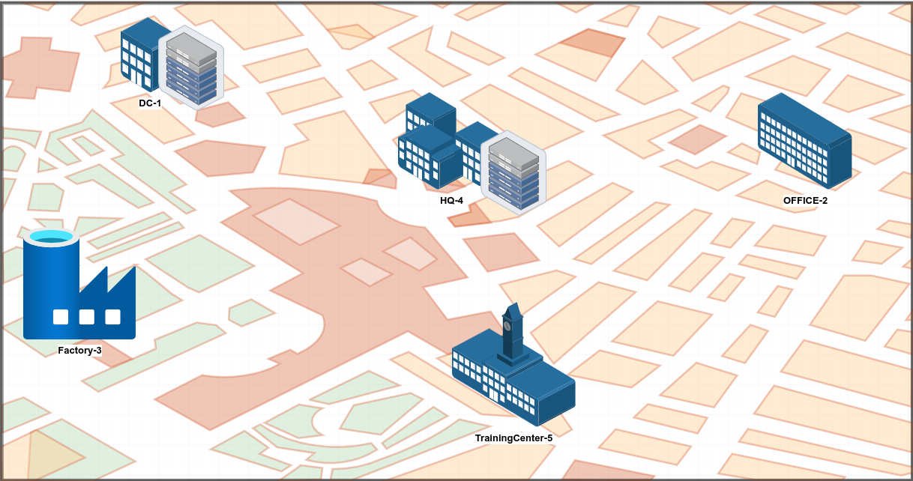{width="100%"}

Das Unternehmen erstreckt sich über 5 Standorte. In den Standorten 1 und
4 sind Rechenzentren mit Business-Anwendungen wie ERP-Systeme und
ähnlichem angesiedelt. Weiterhin gibt es in Gebäude 3 Produktionsanlagen
die einen hochverfügbaren Zugang zu den Business-Anwendungen benötigen,
da sie bei Abbruch der Verbindung nicht produzieren können. Weiterhin
gibt es ein abgelegenes Büro (2) sowie ein Training-Zentrum zur Schulung
von Kunden (5).

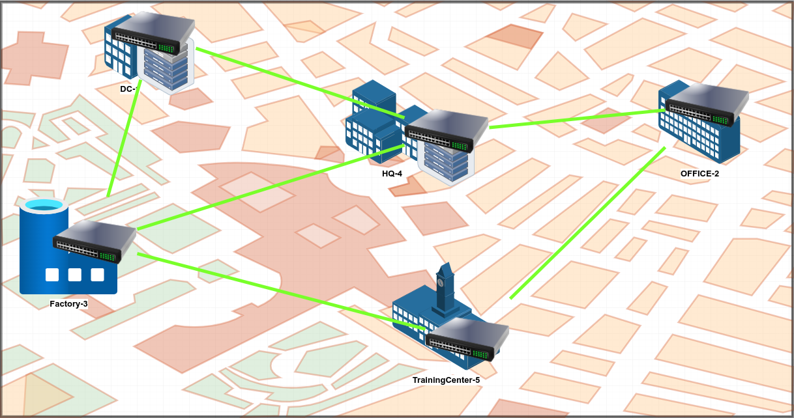{#fig:reftop
width="100%"}

Die Gebäude befinden sich verteilt in einem Gewerbegebiet und einer
Stadt, Glasfaserleitungen wurden wir in Abbildung
[1.1](#fig:reftop){reference-type="ref" reference="fig:reftop"} verlegt.
Eine Änderung dieser Topologie ist nur mit baulischen Maßnahmen mit
immensen Kosten möglich.

Die Anforderungen aus dem Netzwerk ergeben sich aus den angeschlossenen
Geräten sowie den Nutzern. So wird für Stechterminals eine Layer-2
Verbindung von allen Standorten hin zu einem der Rechenzentren benötigt.
Zusätzlich benötigt die Trainingsabteilung oft Layer-2 und Layer-3
Testnetzwerke hin zu einem der Rechenzentren.

Da die Mitarbeiter durch Port-Authentifizierung dynamisch und
standortunabhängig einem VLAN zugewiesen werden, müssen auch
Client-VLANs überall verfügbar sein. Es soll ein Routing zwischen den
Netzwerken abseits einer Firewall nötig sein, da einzelne Schutzzonen
wie die von Anlagensteuerungen die sinnvolle Größe von Subnetzen
überschreiten, aber durch einen hohes Datenaufkommen nicht über die
Firewall geschoben werden sollen.

Die Topologie wird vereinfacht mit einem einzelnen Switch pro Standort
betrachtet. Nicht in der Betrachtung sind Access-Technologien wie
Dual-Homing Technologien zum redundanten Anschluss von Servern.

Grundlagen
==========

Open-Networking - Software-definierte Netzwerkkomponenten
---------------------------------------------------------

Netzwerkgeräte basieren typischerweise auf ASICs. Diese Chips haben ihre
Funktionalitäten in unveränderbarer Hardware integriert. So kann in
einem ASIC nachträglich nur sehr begrenzt eine neue Funktion wie zum
Beispiel VXLAN integriert werden. Vorteil dieser ASICs ist allerdings
die hohe parallele Performance die bei der Weiterleitung benötigt
werden. Für einen einfachen Vergleich, in der Spezifikation PCI Express
sind derzeit pro Lane 15,13 Gigabyte möglich. Der aktuelle High-End
Prozessor AMD Threadripper 3990X hat insgesammt 64 Lanes zur Anbindung
von Peripherie über PCI-Express und schafft damit eine theoretische
maximale Bandbreite von 64 x 15,13 = 968,32 Gigabyte in der Sekunde. Der
aktuelle High-End Switching-ASIC von Broadcom, der Tomahawk 5 / BCM78900
kann in der Sekunde 64 x 100 = 6400 Gigabyte verarbeiten. Der stark
vereinfachten Vergleich soll zeigen, dass selbst die theoretisch
maximale Datenmenge die ohne Verarbeitung bei Nutzung aller PCI Express
Lanes durch einen aktuellen x86 Prozessor fließen kann ein Bruchteil der
Bandbreite aktueller Switching-ASICs ist. Zumal der ASIC in dieser
Bandbreite auch Weiterleitungsentscheidungen zu jedem Paket trifft.

Dadurch das die ASICs in den Netzwerkgeräten in vielen Fällen von den
Herstellern selbst entwickelt sind, spezifische Funktionen abdecken und
vielen Fällen auf verschiedenen Konzepten der Paketweiterleitung beruhen
besteht eine enge Abhängigkeit zwischen dem Betriebssystem auf dem
Switch und der jeweiligen darunterliegenden Hardware.

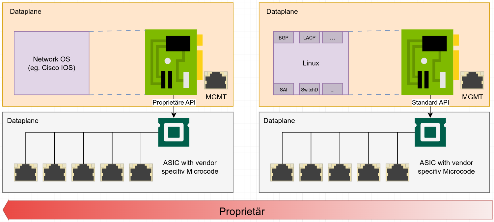{#fig:co1 width="100%"}

Auf der linken Seiten von [2.1](#fig:co1){reference-type="ref"
reference="fig:co1"} ist diese enge Integration dargestellt. Das
Betriebssystem aus dem Switch spricht direkt über eine Hersteller- und
ASIC spezifische API mit der [dp]{acronym-label="dp"
acronym-form="singular+short"}. Die Entwicklung geht derzeit allerdings
in Richtung der rechten Seite. Zum einen setzen viele Hersteller von
Netzwerkgeräten ASICs von Drittherstellern wie Broadcom ein. Broadcom
stellt zu seinen Chips teilweise offene Bibliotheken und APIs bereit.
Dies macht es, zusammen mit anderen Standard wie
[onie]{acronym-label="onie" acronym-form="singular+short"}, bedingt
möglich auf einer Hardwareplattform verschiedene
[sos]{acronym-label="sos" acronym-form="singular+short"}e zu nutzen. Ein
gutes Beispiel ist der aktuelle DELL S5248F-ON auf Basis des Broadcom
Trident 3. Dieser taucht in der Hardwarekompatibilitätsliste von einigen
[sos]{acronym-label="sos" acronym-form="singular+short"}en wie zum
Beispiel SONiC, Cumulus sowie PicOS auf.

Einen konsequenteres Ansatz verfolgt das Open-Compute-Project mit
[sai]{acronym-label="sai" acronym-form="singular+short"}. In diese
Schnittstelle werden Standard definiert, die mitunter die Art und Weise
der Konfiguration von Switching-ASICs. Dazu gehört zum Beispiel die
Konfiguration von Interfaces mit VLANs und IP-Adressen oder auch ACLs.
Derzeit setzt unter anderem SONiC und Aristas EOS SAI ein, um auf ein
breites Portfolio von Hardware-Plattformen unterstützen zu können.

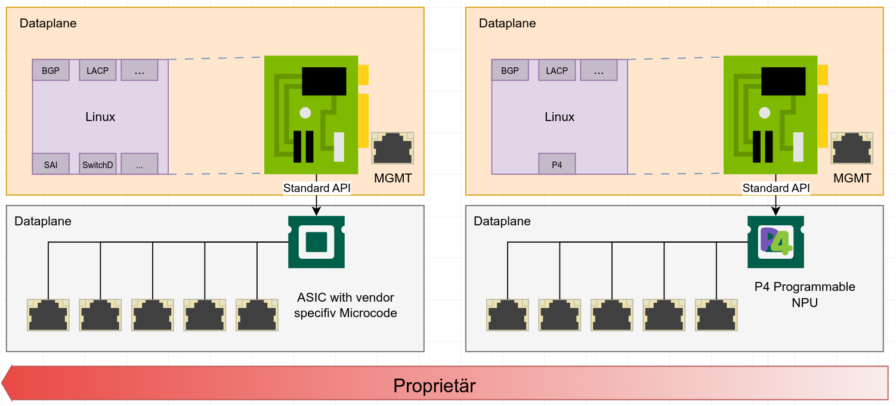{width="100%"}

Einen weiteren noch deutlichen konsequenteren Ansatz zeigt derzeit die
[onf]{acronym-label="onf" acronym-form="singular+short"} auf. Anstelle
eines fest programmierten ASICs wird eine programmierbare
[npu]{acronym-label="npu" acronym-form="singular+short"} eingesetzt. Das
verhalten diese NPU lässt sich mit der Sprache P4 definieren. Damit ist
es dem [sos]{acronym-label="sos" acronym-form="singular+short"} oder
einem Controller möglich benötigte Pipelines und Verhaltensweisen selbst
auf der Hardware dynamisch zu implementieren.

Ziel dieser Bestrebungen ist es ähnlich wie im Server-Umfeld schon lange
Standard die Software von der Hardware zu entkoppeln. Derzeit werden
Netzwerkgeräte in der Regel zusammen mit einem installiertem
Betriebsystem gekauft, welches sich nicht ohne weiteres austauschen
lässt. Hierfür sorgen zum einen technische Restriktionen von
Herstellern, umd zum anderen proprietäre Hardware die es
Softwareentwickeln schwer macht ein breites Portfolio von Plattformen zu
unterstützen. Der Erfolg von offenen Softwareplattformen hängt
allerdings im hohen Maße von der Unterstützung eines diversen
Hardware-Portfolios vieler Hersteller ab, da genau dies die Wahl eines
Dritt-Systems interessant macht. Gerade die Möglichkeit den
Hardware-Lieferanten zu wechseln, ohne das Switchbetriebsystem zu
wechseln zu müssen und damit sämtliche Konfigurationen neu zu erstellen
sowie teilweise Aufgrund der Unterstützung anderer Technologien ganze
Netzwerkkonzepte umbauen zu müssen ist für Unternehmen ein enormer
strategischer Vorteil.

### SAI

{#fig:evpncli width="50%"}

[sai]{acronym-label="sai" acronym-form="singular+short"}, Switch
Abstraction Interface, ist eine offene Schnittstelle um Hardware
ansprechen zu können. SAI ist eine lose Sammlung von C-Aufrufen in der
entsprechende Funktionen der Hardware-Treiber verlinkt werden. SAI ist
damit keine direkte Schnittstelle zur Hardware sondern ist eine
standardisierte Schnittstelle zwischen Anwendung sowie Hardware-Treiber.
SAI gibt damit den Herstellen von Hardware die Art und Weise der
Implementation vor. Durch den Einsatz von SONiC, welches SAI nutzt,
durch Microsoft in der Azure-Cloud ist diese Standardisierung die erste
mit einer relevanten Marktmacht um sich durchzusetzen. [@sai]

### ONIE

{#fig:onie width="100%"}

ONIE ist eine Art erweiterter Bootloader und bietet die einfache
Möglichkeit Betriebssysteme auf Switchen zu installieren. ONIE
implementiert dabei die bei Netzwerkhardware bekannte Mechanik einer
Primär- und einer Sekundärpartition, welche es nach einem Fehlerhaften
Update erlaubt wieder zur alten Installation zurückzukehren. Weiterhin
implementiert ONIE eine Linux-Shell mittels Busybox und wird im Rahmen
dessen Beispielweise von DELL genutzt um Firmware-Updates auf der
Hardware durchzuführen.

OpenFlow
--------

[of]{acronym-label="of" acronym-form="singular+short"} ist ein Protokoll
zur Kommunikation zwischen einer [cp]{acronym-label="cp"
acronym-form="singular+short"} und [dp]{acronym-label="dp"
acronym-form="singular+short"} um diese physikalisch und logisch
voneinander Trennen zu können. Das Protokoll spezifiziert die
Nachrichten die zwischen den Einheiten ausgetauscht werden. Durch diese
Nachrichten werden von dem Controller generierte Flow-Regeln auf die
jeweilige Dataplane geschrieben. OpenFlow kann vielseitig eingesetzt
werden. So kann mittels des Protokoll die Controlplane eines Netzwerkes
vollständig zentralisiert werden. OpenFlow kann auch dafür genutzt
werden nur bestimme Flows umzuleiten, beispielsweiße für die
Implementierung eines Traffic Engineerings oder einer Firewall
F´unktionalität. [@ofs]

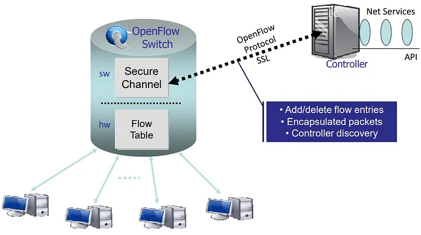{#fig:evpncli
width="80%"}

Eingehende Pakete auf einem Interface des per OpenFlow gesteuerten
Switches werden nun auf Basis der implementierten Flow-Regeln
weitergeleitet. OpenFlow wurde ursprünglich in der Version 1.1
veröffentlicht, und gibt es mittlerweile in der Version 1.5.1. Die
Flow-Regeln können auf verschiedene Header eines Ethernet-Pakets
greifen, darunter MAC, IP Adresse oder zum Beispiel ein VLAN Tag. Wenn
eine Regel passt kann eine Aktion definiert werden wie die Manipulation
eines weiteren Headers, wie zum Beispiel das umschreiben der
MAC-Zieladresse wie es bei Routing notwendig ist.

{#fig:evpncli width="70%"}

Die Regeln können dafür in mehrere untereinander verkette Tabellen
geschrieben werden. Die Regeln werden mittels eine ID identifiziert. Die
Pakete durchlaufen nicht automatisch alle Tabellen, die Pakete werden
den Tabellen mittels Regeln zugewiesen. [@ofs]

Das Protokoll basiert auf einer Menge von definierten Nachrichten,
welche über den normalen TCP/IP Stack übertragen werden:

-   HELLO - Herstellen einer Verbindung.

-   FEATURE REQUEST/ REPLY - Controller fragt damit Informationen vom
    Switch wie OpenFlow Version ab.

-   GET CONFIG REQUEST/ REPLY - Controller fragt Konfigurationen vom
    Switch an

-   PACKET-In - Erhällt ein Switch ein Paket auf das keine Nachricht
    passt, kann er das Paket an den Controller senden.

-   FLOW MOD - Damit sendet der Controller Flow-Regeln an den Switch.

-   BARRIER - Abfrage des Controllers ob alle vorher gesendeten
    Anweisungen umgesetzt worden sind.

OpenFlow ist kein abgeschlossener Standard, das Protokoll ist unter
stetiger Weiterentwicklung. Seit dem inititalen Release mit Version 1.1
ist eine Vielzahl von Versionen erschienen. Aktuell ist mittlerweile die
version 1.6. Hinzu kam zum Beispiel die Möglichkeit mehrere Tabellen zu
spezifizieren sowie die Möglichkeit auf neue Header zu matchen. Seit
Version 1.5.0 ist es zum Beispiel möglich Regeln auf TCP-Flags
anzuwenden. Diese stetige Weiterentwicklung stellt Netzwerk-Austatter
vor eine stetige Herausforderung die Funktionen zu implementieren.
Teilweise treffen sie hier auf durch die Hardware gegeben Limitationen
sodass Funktionen modifiziert implementiert werden oder weggelassen
werden.

P4
--

[@p4tum] [@p4pi]

### P4Runtime

P4Runtime spezifiziert eine Schnittstelle zwischen einem Controller und
einer programmierbaren [dp]{acronym-label="dp"
acronym-form="singular+short"}. Das Protokoll wird dafür genutzt, um in
P4 geschriebene Programmlogiken in entfernten [dp]{acronym-label="dp"
acronym-form="singular+short"}s zu installieren und dynamisch zu
modifizieren. Als Übertragungsprotokoll wird gRPC verwendet.

Ein anschauliches Beispiel wird dafür in einem Tutorial der
[onf]{acronym-label="onf" acronym-form="singular+short"} gegeben. In
diesem wird eine CLI-Implementierung von P4Runtime genutzt um erst ein
P4-Programm auf einen simulierten Switch zu installieren und dann
Tabellen und Variablen zu modifizieren.

``` {caption="P4Runtime Beispiel"}
util/p4rt-sh --grpc-addr localhost:50001 --config p4src/build/p4info.txt,p4src/build/bmv2.json --election-id 0,1
```

Das Program wird aufgerufen mit der gRPC Zieladresse, in diesem Fall ein
lokal laufender bmv2 Switch. Weiterhin sind zwei Konfigurationsdateien
notwendig, die p4info.txt und die bmv2.json. Die erste Textdatei
beschreibt ein Schema für die Nachrichten zwischen Controller und Switch
in Form von Protobufs. Die zweite Datei, eine JSON Datei, ist eine aus
einem P4-Programm compilierte Datei die das gewünschte Verhalten auf dem
Switch implementiert. Dies ist eine Spezialität der Implementierung des
bmv2. bmv2 steht für Behavioral Model Version 2und ist einer
Referenzimplementierung eines P4 Softwareswitches zu Entwicklungs- und
Testzwecken. Dieses Modell wird nicht direkt mit einem P4-Programm
programmiert, sondern benötigt den Zwischenschritt über einen Compiler
der das Verhalten in Form einer JSON Datei implementiert.

Prinzipiell ist P4Runtime auf Netzwerkgeräten möglich, die auf einer per
P4 programmierbaren Hardware basieren. Dazu gehört zum Beispiel Intels
Tofino. Zu Erweiterung der Möglichkeiten von P4Runtimer exisiter das
Projekt PINS. Dieser P4 Integrated Network Stack bietet die Möglichkeit
per SAI abstrahierte Hardware mit P4 zu programmieren. Damit ist es
prinzipiell möglich das Verhalten von klassischen ASICs wie den
verbreiteten Broadcom Chips die per SAI integriert werden können mit P4
beziehungsweise der P4Runtime zu beschreiben. Derzeit wird die P4Runtime
nativ von dem [sos]{acronym-label="sos" acronym-form="singular+short"}
STRATUM der [onf]{acronym-label="onf" acronym-form="singular+short"} und
der Software Referenzimplementierung in Form des bmv2. Eine Integration
der P4Runtime wird über PINS in dem GitHUB Repositorie von SONiC
erwähnt.

VXLAN {#sec:vxlan}
-----

VXLAN ist eine Technologie um Layer-2 Tunnel über ein geroutetes Layer-3
Netz zu spannen. VXLAN steht dabei für Virtual Extensible LAN und ist in
dem RFC 7348 standardisiert. Mit VXLAN ist die Unterscheidung zwischen
16 Millionen Netzwerken möglich und erlaubt in großen Umgebungen die
doppelte Nutzung von VLAN-IDs, beispielsweise zwischen verschiedenen
Kunden. Die doppelte Nutzung von VLAN war bereits im IEEE 802.1ad QinQ
möglich. VXLAN kombiniert die Fähigkeit Layer-2 Tunnel über geroutete
Strecken zu ziehen mit der Fähigkeit VLANs doppelt zu nutzen, um eine
ganzheitliche Netzwerkvirtualisierung zu schaffen.

{width="70%"}

VXLAN Pakete werden mittels eines weiteren VXLAN-Headers realisiert.
Verpackt werden die Paketen in UDP/IP Paketen.

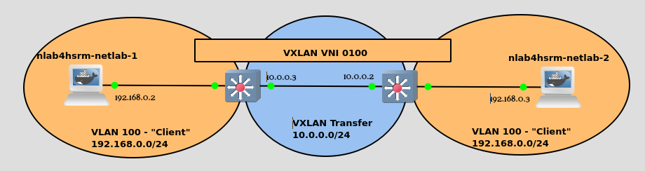{#fig:vxlan1 width="100%"}

In Abbildung [2.6](#fig:vxlan1){reference-type="ref"
reference="fig:vxlan1"} ist ein Beispiel für einen VXLAN-Tunnel gegeben.
Die beiden Hosts am Rand sollen über einer Layer-2 Domäne direkt
kommunizieren können. Die beiden Switche können über ein
Transfer-Netzwerk miteinander kommunizieren. Per VXLAN wird nun ein
Tunnel konfiguriert, der die beiden äußeren Layer-2 Netze miteinander
verbindet.

Ein Trace auf dem Verbindungsstrecke zwischen den beiden Switchen zeigt
nun bei einem Ping zwischen den beides Hosts folgende Pakete:

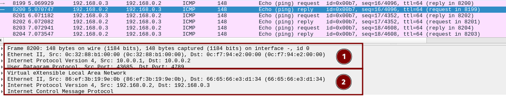{#fig:vxlan2 width="100%"}

In der Abbildung [2.7](#fig:vxlan2){reference-type="ref"
reference="fig:vxlan2"} ist der äußere Header des VXLAN Pakets mit der
markiert. Dieses UDP Paket wird von der Loopback-Adressen des einen
Switches zu dem anderen gesendet. Diese Loopback-Adressen sind
gleichzeitig die Adressen der jeweiligen [vtep]{acronym-label="vtep"
acronym-form="singular+short"}s. Im inneren Teil des Headers, hier mit
der markiert, befindet sich der Header des ursprünglichen Paketes,
welches zwischen den beiden Hosts ausgetauscht wird. Der empfangende
[vtep]{acronym-label="vtep" acronym-form="singular+short"} Pakt dieses
Paket wieder aus und sendet es an den Ziel-Host.

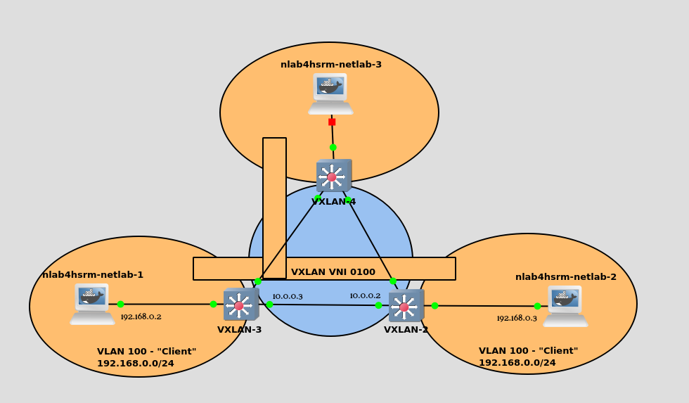{#fig:vxlan3 width="100%"}

Eigentlich relevante Vorteile eines VXLAN-Overlays werden in der
Abbildung [2.8](#fig:vxlan3){reference-type="ref"
reference="fig:vxlan3"} ersichtlich. Es ist möglich eine Topologie mit
mehreren Standorten und physikalisch redundanten Pfaden zu bauen. Durch
Nutzung von Routing-Protokollen lassen sich alle Pfade redundant nutzen.
Die logische Topologie des Overlay-Netzwerkes ist sternförmig. Dies wird
dadurch erreicht, das ein VTEP ein Paket das aus einem Tunnel
herauskommt nicht in einen weitern Tunnel wieder hineinschickt. Dadurch
entstehen trotz einer vermaschten Tunnel-Topologie keine Schleifen.

Damit die VTEPs die Pakete entsprechend weiterleiten können, haben sie
eigene Tabellen welche MAC-Adressen zu gegenüberliegenden VTEPs
zuordnen. Zum lernen dieser Zuordnungen gibt es mehrere Methoden.

#### Head End Replication

Bei dieser Methode wird [bum]{acronym-label="bum"
acronym-form="singular+short"}-Traffic der von den Hosts ausgeht an alle
eingetragenen Remote-VTEPs über Unicasts weitergeleitet. Der VTEPs
lernen die MAC-Adressen durch die gleichen Broadcast-Mechanischem wie
normale Switche. Jedem VTEP müssen alle anderen VTEPs in dem Netzwerk
statisch bekannt gemacht werde.

#### IP-Multicast

Diese Methode basiert ebenso wie die vorherige auf den bekannten
Broadcast-Mechanismen. Im Unterschied werden die entfernten VTEPs nicht
einzeln eingetragen sondern der [bum]{acronym-label="bum"
acronym-form="singular+short"}-Traffic an eine Multicast-Adresse
geschickt die die anderen VTEPs abhören.

#### OVSDB Controller

Ein Controller synchronisiert über das OVSDB-Protokoll die
Erreichbarkeitsinformationen zwischen den einzelnen VTEPs. Damit kann
der [bum]{acronym-label="bum" acronym-form="singular+short"}-Traffic
reduziert werden und das Verhalten des Netzwerken beeinflusst werden.
Beispiele sind Aristas CloudVision eXchange und VMWares NSX Lösung.

### BGP-EVPN

BGP-EVPN ist eine Erweiterung des Routing-Protokolls
[bgp]{acronym-label="bgp" acronym-form="singular+short"} und eine
weitere Variante eine Controlplane-Funktionalität für ein
VXLAN-Overlay-Netzwerk zu implementieren. Erreichbarkeitsinformationen
werden zwischen den teilnehmenden Netzwerkgeräten beziehungsweise derer
VXLAN-[vtep]{acronym-label="vtep" acronym-form="singular+short"}s
mittels einer BGP-Instanz ausgetauscht. EVPN steht dabei für Ethernet
Virtual Private Network. Das Protokoll ist standardisiert in mehreren
RFCs wie in RFC 7209, RFC 7432, RFC 8365 und RFC 8317.Eine Besonderheit
ist EVPN-Multihoming, eine Methode Server mittels mehrere Links
gebündelt als eine Link-Aggregation an mehrere Switche anzuschließen zum
Zwecke der Redundanz. Herkömmlicherweise werden dafür herstellereigene
[mlag]{acronym-label="mlag" acronym-form="singular+short"} Protokolle
eingesetzt welche nicht standardisiert sind und oft eigene Namen tragen.

Dafür wird eine neue Familie von Routen in BGP eingeführt. Ein Ethernet
Segment beschreibt eine Vielzahl von Links zur redundanten Anbindung
eines Endgerätes an mehrere Switche des BGP-EVPN Netzwerkes. Zu den EVPN
Routen gehören:

-   Type 1 - Ethernet Auto-Discovery Route. Diese Route wird hier für
    EVPN Multihoming eingesetzt. Es wird die Erreichbarkeit einer
    bestimmen MAC-Adresse ausgetauscht für eine Konvergenz bei Ausfall
    eines Links.

-   Type 2 - MAC/IP Route - Diese Route wird verwendet um Informationen
    über lokal gelernte MAC-Adressen an die Partner zu übertragen. Die
    IP-Adresse wird übertragen um ARP-Anfragen direkt von den entfernten
    [vtep]{acronym-label="vtep" acronym-form="singular+short"}s
    beantworten lassen zu können.

-   Type 3 - Inclusive Multicast Route - Diese Route wird eingesetzt um
    [vtep]{acronym-label="vtep" acronym-form="singular+short"}s im
    Netzwerk bekannt zu machen um entsprechende VXLAN-Tunnel aufbauen zu
    können.

-   Type 4 . Ethernet Segment Route .

-   Type 5 - IP Prefix Route . Diese Route wird bei verteilten Routing
    verwendet um die verschiedenen Gateways im Netzwerk bekannt zu
    machen,

[@evpn]

EVPN lässt sich neben VXLAN auch für MPLS als Controlplane einsetzen.

Segment Routing
---------------

BGP-LS P4RUntime

Netzwerksimulation
------------------

Die Simulation von Netzwerken basiert auf der Virtualisierung des
[sos]{acronym-label="sos" acronym-form="singular+short"} auf einem
Hypervisor. Eingesetzt werden je nach Betriebssystem-Architektur QEMU,
Dynamips, Virtualbox, VMware oder auch Containertechnologien wie Docker.
Die Mehrheit aktueller Enterprise-Switche basieren auf regulären
x86-Computern mit UNIX-artigen Betriebssystemen wie Linux. Dazu gehört
unter anderem Ciscos IOS-XE und XR, Extremes EXOS und VOSS und einige
mehr. Die Virtualisierung dieser Systeme stellt keine größere
Herausforderung dar da verbreitete Technologien genutzt werden. Um einen
virtuellen Link zwischen zwei virtuellen Switchen zu stecken setzt zum
Beispiel GNS3 jeweils zwei UDP Tunnel ein.

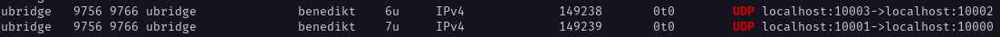{#fig:gns3-udp
width="100%"}

In dieser Abbildung sind zwei UDP Verbindungen zwischen zwei offenen
Ports auf dem lokalen Loopback-Interface zu sehen. Jeweils für jede
Richtung einen. Diese Verbindungen werden durch den GNS3 eigenen ubridge
Dienst erstellt.[@ubridge] Vorteil dieses Verfahrens ist, das jegliche
Art von Interfaces miteinander Verbunden werden können. Weiterhin
besteht die Möglichkeit den Linux-Netzwerkstack zu nutzen. So können
immer jeweils zwei Interfaces in eine Linux-Bridge gesteckt werden um
eine Kommunikation zu ermöglichen. Diese funktioniert allerdings nur mit
Interfaces der virtuellen Instanzen die dem Kernel des Hosts bekannt
sind. Die durch GNS3 erstellten QEMU VMs haben zum Beispiel kein
virtuelles Interface im Linux Kernel des Hosts. Gleichzeitig ist eine
gemeinsame Topologie mit UDP Tunnel problemlos über mehrere
Virtualisierungshosts möglich, während dies bei Linux-Bridges nicht ohne
weiteres möglich ist. Zu beachten sind die Performance Einschränkungen
bei den UDP Tunneln, da die Pakete durch einen kompletten Software-Stack
gehen.

Die größte Herausforderung ist die Implementierung von hardwarenahen
Funktionen der Switche in die virtuellen Versionen. Die
[sos]{acronym-label="sos" acronym-form="singular+short"}e programmieren
viele Funktionen direkt in die Hardware. Im optimalen Fall wird ein
Paket welches an einem Switch ankommt direkt von der Hardware, zum
Beispiel einem ASIC, weitergeleitet und passiert nicht die CPU des
Switches. Lediglich Protokoll-Pakete wie zum Beispiel BGP-Pakete,
LLDP-Pakete oder STP-Pakete werden an die CPU weitergeleitet um dort
verarbeitet zu werden. Heutige Switche setzen MAC-basierte Layer-2
Weiterleitung, IP-basierte Layer-3 Weiterleitung sowie die
Implementierung von Filtern in Form von ACLs direkt in der Hardware um.
Da ein virtueller Switch keine Hardware wie einen ASIC hat, durchlaufen
alle Pakete den TCP/IP Stack des [sos]{acronym-label="sos"
acronym-form="singular+short"}es, welches in der Regel Linux ist. Die
Implementierung von [cp]{acronym-label="cp"
acronym-form="singular+short"} Funktionen wie Routing-Protokollen ist
damit in der Regel trivial da keine Änderungen an dem
[sos]{acronym-label="sos" acronym-form="singular+short"} vergenommen
werden müssen. Alle Funktionen die allerdings in die Hardware eines
Switches geschrieben werden, müssen durch den Linux TCP/IP Stack
dargestellt werden.

An dieser Stelle unterscheidet sich der Funktionsverlust zwischen den
Plattformen verschiedener Hersteller von einer physikalischen Appliance
hin zu einer virtuellen erheblich. Layer-2 Bridging mit VLANs stellen in
der Regel kein Problem da und werden durch Linux Boardmittel
implementiert. Die Filterung von Paketen durch ACLs hingegen müsste
durch Methoden wie eBPF implementiert werden. Auch wenn ACLs in
Testaufbauten nicht direkt benötigt werden, ist die Mechanik Grundlage
für viele andere Funktionen in einem Netzwerk die ohne Filterlisten
nicht korrekt funktionieren. Ein gutes Beispiel hierfür ist eine
Multi-Chassis-Link-Aggregation. Bei dieser ist es notwendig Filter auf
dem Link zwischen den beiden Switchen zu implementieren. Im Beispiel des
virtuellen DELL OS10 lässt sich dies zwar Konfigurieren, funktioniert
aber nicht korrekt da Pakete über den zwischen Link geschickt werden
nicht korrekt gefiltert werden.

Eine interessante Plattform zur Virtualisierung stellt SONiC dar. Die
Schnittstelle hin zur Hardware ist offen und bietet die Möglichkeit
eigene Bibliotheken zu verlinken. Zusätzlich lässt sich der Code
öffentlich einsehen um nachzuvollziehen, wie gewisse Funktionen
implementiert sind. Ein gesonderte Bibliothek implementiert die im ASIC
abgebildeten Funktionen im Linux Netzwerkstack.

### GNS3

GNS3 ist eine quelloffene Plattform zur Simulation von Netzwerken. GNS3
bietet eine graphische Benutzeroberfläche in der Geräte angeordnet
werden können sowie untereinander vernetzt werden können. Die Anwendung
ist Server-Client basiert. Der Server ist im Backend für die
Virtualisierung der verschiedenen angelegten Geräte zuständig, wobei
verschiedene Virtualisierungstechnologien eingesetzt werden können. Die
Vernetzungen zwischen den Geräten basiert auf UDP Tunneln welche mittels
ubridgerealisiert werden. GNS3 bietet weiterhin hilfreiche Tools wie die
Möglichkeit über die Oberfläche Wireshark-Mitschnitte auf bestimmten
UDP-Tunneln zwischen Geräten zu starten sowie Filter auf diesen
anzulegen. Weiterhin bietet GNS3 mit einem NAT-Knoten die Möglichkeit
einen Internet-Breakout zu realisieren sowie über einen Cloud-Knoten die
Möglichkeit ein physikalisches Interface in die Topologie einzubinden um
eine Schnittstelle zu echten Hardware-Komponenten herzustellen.

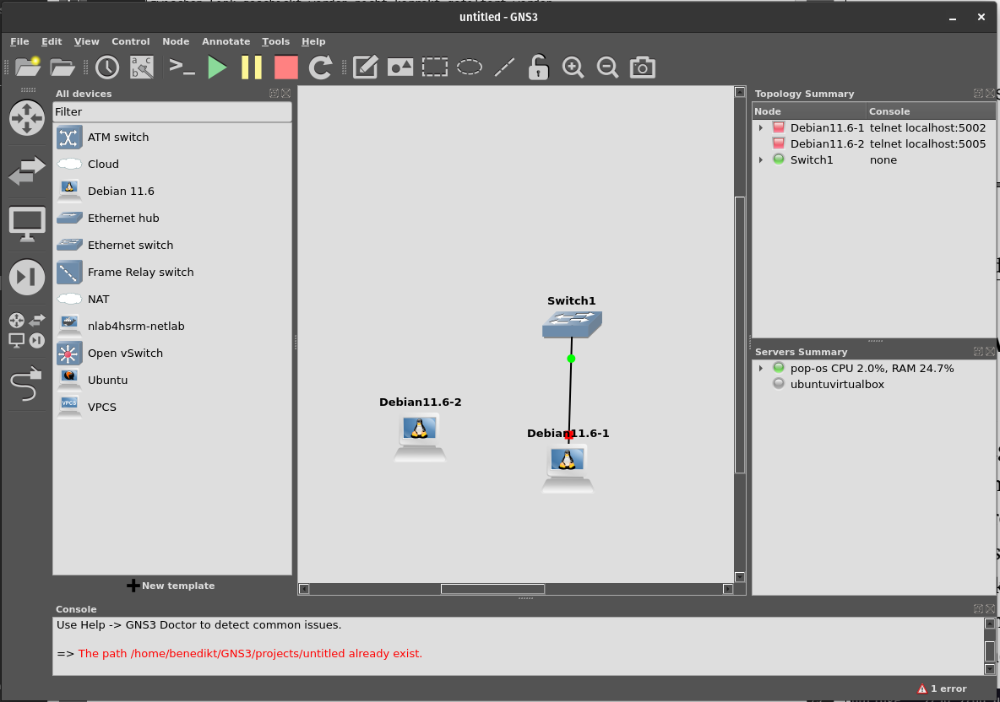{width="100%"}

!

### GNS3-Server-Manager

Der GNS3-Server-Manager ist eine Web-Anwendung betrieben durch das NLAB
der Hochschule Rhein-Main. Diese bietet Nutzern die Möglichkeit aus
Templates heraus GNS3-Server zu erstellen. Die GNS3-Server werden über
OpenVPN erreichbar gemacht. Die Dokumentation für diese Anwendung ist zu
finden unter
<https://github.com/nlab4hsrm/gns3-Server-Manager/tree/main/Doc>

Marktanalyse {#sec:market}
============

In dieser Marktanalyse sollen Lösungen für Campusnetzwerke für kleine
bis mittelständische Unternehmen und Einrichtungen in der Größe von
Krankenhäusern, Universitäten und Hochschulen betrachtet werden. Nicht
betrachtet werden Lösungen für reine Rechenzentren zu finden bei
Cloud-Anbieter und Hyperscaler, sowie Lösungen für Privatanwender und
Kleinstunternehmen. Es werden die jeweiligen Fabric-Lösungen als auch
die Implementation gängiger Protokolle aus dem [sdn]{acronym-label="sdn"
acronym-form="singular+short"} Umfeld betrachtet.

Zur Identifikation relevanter Hersteller wird der Gartner Bericht zu LAN
und WLAN Lösungen für Unternehmen genutzt, in dem die Vision und die
entsprechende Fähigkeit die Vision zum Implementieren bewertet wird. Da
diese Quelle lediglich zur Identifikation relevanter Anbietern dient
wird sie inhaltlich nicht weiter bewertet.

{#fig:gartner1 width="100%"}

Betrachtet werden die Lösungen der Hersteller die in der Abbildung
[3.1](#fig:gartner1){reference-type="ref" reference="fig:gartner1"} im
Quadranten Leadergeführt werden. Gartner definiert ihre
Bewertungskriterien nur in einem kompletten Bericht, welche
kostenpflichtig erworben werden muss. Die Grafik wird nicht zur
Bewertung der Hersteller untereinander sondern lediglich als
Anhaltspunkt für eine Auswahl von Herstellen genutzt. Daher wird auf
eine exakte Quellenanalyse verzichtet.

Cisco
-----

Cisco bietet im Netzwerksegment drei verschiedene Switch Serien an. Die
Nexus-Serie sind die hauseigenen Rechenzentrumsswitche, die
Catalyst-Serie sind die hauseigenen Distributions- und Access Switche.
Zuletzt hat Cisco mit Meraki einen Netzwerkausrüster gekauft, und dessen
[cm]{acronym-label="cm" acronym-form="singular+short"} Switchreihe als
dritte Option in ihr Portfolio übernommen.

Mit der [npu]{acronym-label="npu" acronym-form="singular+short"} Cisco
Silicon Onehat Cisco eine programmierbare NPU im Portfolio. Der Chip
wird unter anderem bei der im Jahr 2023 angekündigten Catalyst 9000
Serie neben den Cisco eigenen [asic]{acronym-label="asic"
acronym-form="singular+short"}s mit dem Namen UADP - Unified Access Data
Plane verbaut. Dieser Chip lässt sich mit der Sprache P4 programmieren.
Dadurch lassen sich auf Basis dieses Chips Netzwerkkomponenten
entwickeln die vielfältige Anforderung erfüllen kann. Cisco selbst wirbt
damit, dass sich der Chip in traditioneller Netzwerkhardware sowie in
spezialisierten Backend-Netzwerken die nicht auf klassischer TCP/IP
Kommunikation basieren verwenden lässt. Cisco selbst baut einen dieser
Chips, den Silicon One G200, in seinen Cisco Catalyst 9500X ein, der in
der größten Ausbaustufe 8 x 400 Gbit/s und insgesamt 12,1 Tb/s
verarbeiten kann. [@sone]

Cisco unterstützt auf seinen Switchbetriebsystemen IOS-XE der Catalyst
Serie als einer der letzten Hersteller OpenFlow. Das System unterstützt
gängige Konfigurationsprotokolle und Virtualisierungstechnologien wie
VXLAN.

Cisco bietet für die gängigen Plattformen wie auch die aktuellste Cisco
Catalyst 9000 Plattform virtuelle Varianten an, welche für Trainings-
und Schulungszwecke gedacht sind. Diese sind allerdings nicht frei
erhältlich und überwiegend für die Cisco eigene Simulationsplattform
Cisco Modelling Labs gedacht, welche kostenpflichtig ist.

### Cisco Extensible Network Controller

Der Cisco Extensible Network Controller, kurz XNC ist ein klassischer
SDN Controller auf Basis des OpenDaylight Controllers. Neben dem
standardisiertem OpenFlow Protokoll nutzt der Controller proprietäre
Cisco Protokolle aus dem Cisco Open Network Environment Plattform Kit,
kurz onePK. [@xnc]

![CISCO XNC - Bildquelle: [@xnc]](media/xnc.png){width="100%"}

Die Architektur dieses Produktes folgt dem ursprünglichen Ansatz der
[onf]{acronym-label="onf" acronym-form="singular+short"}, siehe . Das
Produkt wurde 2022 abgekündigt.

### Cisco ACI

Mit der Application Centric Infrastructur, kurz ACI, hat Cisco eine SDN
Lösung im Jahr 2014 vorgestellt. Die Lösung basiert auf einem Controller
mit dem Namen Application Policy Infrastructure Controller, kurz APIC.
Als [sb]{acronym-label="sb" acronym-form="singular+short"}-Protokoll
zwischen Controllern und Hardware wir Opflex eingesetzt [@opf]. Mit dem
Cisco eigenem Protokoll lassen sich auch Geräte und Software von
Drittherstellern in die Fabric einbinden. Zudem gibt es auf der
Applikationsseite Schnittstellen zu Red Hats Ansible, Terraform und
weiteren [iac]{acronym-label="iac" acronym-form="singular+short"}
Lösungen. Zusätzlich gibt es Schnittstellen zu Applikationsplattformen
wie Kubernetes und OpenShift, um auch sich auch hier in die
Infrastruktur zu integrieren..[@aci] [@aci2]

{width="100%"}

In dieser Abbildung ist der Initialisierungsvorgang einer ACI Umgebung
in den verschiedenen Schritten beschrieben. Die Switches finden direkt
angebundene APICs per LLDP und fordern ihre Konfiguration an. Dies
Vorgang erstreckt sich nun schrittweise über die gesamte Infrastruktur.

{width="100%"}

Die Lösung basiert auf einem [uo]{acronym-label="uo"
acronym-form="singular+short"} Ansatz, auf Basis von
[vx]{acronym-label="vx" acronym-form="singular+short"} als
Transportprotokoll und IS-IS als Routingprotokoll. [@aci3] Die Lösung
wird bis heute, Stand 2023, aktiv von Cisco vertrieben.

### Cisco SD-Access

Cisco SD-Access ist die aktuelle Campus Lösung von Cisco. Mit diesem
Produkt will Cisco moderne Konzepte wie [ztna]{acronym-label="ztna"
acronym-form="singular+short"} oder Microsegmentation in skalierbaren
Netzwerken umsetzen. Die Lösung basiert auf einem
[uo]{acronym-label="uo" acronym-form="singular+short"} Ansatz und einem
dedizierten Managementcontroller Cisco Catalyst Center. Der Controller
kann lokal und in der Cloud betrieben werden. Als Transportprotokoll auf
der Dataplane wird auch hier [vx]{acronym-label="vx"
acronym-form="singular+short"} eingesetzt. Cisco setzt für die
Controlplane LISP ein. Der Grund dafür wird diskutiert [@sdlisp].

![SD-Access Fabric Roles -- Example - Bildquelle:
[@csda]](media/cisco-sda-design-guide_8.png){width="100%"}

Cisco lässt aber gewissen Freiheitsgrade bei den eingesetzten
Technologien. Das aktuelle IOS-XE unterstützt beispielsweise auch
BGP-EVPN.

Juniper
-------

Juniper bietet Netzwerkausrüstung für Service Provider, Rechenzentren
sowie für [can]{acronym-label="can" acronym-form="singular+short"} an.
Die Switche für [can]{acronym-label="can" acronym-form="singular+short"}
werden unter dem Namen EX geführt. Juniper entwickelt für diese Switche
eigene ASIC[@junasi]. Bei den [dcn]{acronym-label="dcn"
acronym-form="singular+short"} bietet Juniper auch einige Modelle auf
Basis von Broadcom Chips an, die teilweise auch offiziell SONiC
unterstützen.

Das Juniper eigene Betriebsystem nennt sich Junos-OS und unterstützt
unter anderem BGP-EVPN. Eine automatisierte und WebGUI basierende
Konfiguration und Administration eines solchen [uo]{acronym-label="uo"
acronym-form="singular+short"}-Konzeptes ermöglicht Juniper mit der
Cloudlösung Juniper Mistund der On-Premise Lösung Apstra.

### Juniper Apstra

Apstra ist ein On-Premise Controller, der als eine oder eine Viezahl von
VMs implementiert wird. Er erlaubt die Administraton und Konfiguration
von verschiedenen Netzwerkdesigns, wobei der Fokus auf Konzepten mit IP
Underlay und EVPN-VXLAN als Overlay liegt. Aspra ist ein zugekauftes
Produkt und unterstützt daher auch andere Plattformen wie Cisco Nexus,
Arista EOS und SONiC. Dafür werden auf den Switchen jeweilige Agents
installiert, welche dem Apstra-Server eine entsprechende REST-API
anbieten. [@junapstra]

### Juniper Mist

{#fig:mist width="80%"}

Juniper Mist ist eine Cloud-Anwendung zu Konfiguration, Administration
und Überwachung von Juniper Netzwerkgeräten verschiedene Architekturen
auf Basis von BGP-EVPN und VXLAN unterstützt. Diese werden in Abbildung
[3.2](#fig:mist){reference-type="ref" reference="fig:mist"} gezeigt.
Juniper wirbt mit einer KI-Integration, welche bei der Fehlerfindung und
Behebung im erheblichen Maße unterstützt. [@junevpn] [@junmist].

### Juniper Northstar

Northstar ist ein Controller für Traffic-Engineering für MPLS-Netzwerke
und IP-Netzwerke auf Basis von Segment Routing. Der Controller arbeitet
Pfad-basiert und etabliert durch Auswertung von Netzwerkauslastung und
darauffolgender Pfadberechnung einen geschlossenen Regelkreislauf.

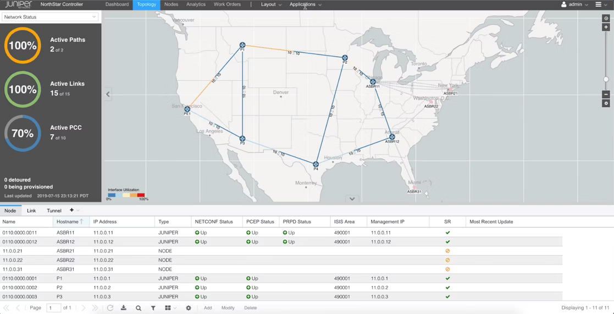{#fig:evpncli width="100%"}

Arista
------

Arista bietet ein breites Portfolio an Datacenter- Campusswitchen. Die
Datacenterswitche sind zu erkennen an Modellnummern mit 4 Ziffern wie
zum Beispiel 7060CX2-32S. Die Campusswitche sind zu erkennen an
Modellnummern mit 3 Ziffern wie zum Beispiel 720XP-48Y6. Die Switche
basieren vorwiegend auf Broadcom Chips [@aristams]. Arista hat ein
eigenes [sos]{acronym-label="sos" acronym-form="singular+short"} mit dem
Namen EOS. Es gibt eine virtuell Variante, vEOS, und einer
containerisierte Variante, cEOS. Beide sind für den produktiven Betrieb
gedacht.

Aristas Linux-basiertes Switch-Betriebssystem EOS wirbt mit einer großen
Bandbreite von Schnittstellen über alle Ebenen um diese in
[sdn]{acronym-label="sdn" acronym-form="singular+short"} Konzepte zu
integrieren. EOS steht für Extensible Operating System. Arista wirbt mit
der Möglichkeitet dieses Betriebssystemen mit RPM-Packages einfach
erweitern zu können um beispielsweise neue Protokolle implementieren zu
können. Neben OpenFlow hat Arista ein funktional erweitertes Protokoll
mit dem Namen DirectFlow entwickelt, um Flow-Regeln in den Switch zu
programmieren. Dies nutzte eine Firewall Lösung von Palo Alto, um
Regelwerke direkt auf den Switches zu implementieren [@aristapalo]. Als
weitere Programmierschnittstellen nennt Arista bei seinem EOS:

-   Linux

-   EOS extensible APIs (eAPIs) using JSON

-   Open source Go, Python and Ruby based object models

-   Native Go and Python on box scripting

-   XMPP

-   Advanced Event Manager

-   SQLite Databases

-   OpenFlow und DirectFlow

-   EOS SDK

Zusätzlich beherrscht EOS die gängigen [uo]{acronym-label="uo"
acronym-form="singular+short"} Protokolle wie VXLAN.

![Arista Open Networking - Bildquelle:
[@aon]](media/Open-Networking-1.png){#fig:arista1 width="100%"}

In Abbildung [3.4](#fig:arista1){reference-type="ref"
reference="fig:arista1"} sind die vielfältigen Einsatzmöglichkeiten und
Arista Hardware sowie dem Arista eigenen [sos]{acronym-label="sos"
acronym-form="singular+short"} gezeigt. So erlaubt Arista den Einsatz
andere Software auf Ihren Switchen und stellt einen containerisierte
Variante ihres [sos]{acronym-label="sos" acronym-form="singular+short"}
bereit, um dieses auf Fremdhardware einzusetzen. Als Hardwareabstraktion
wird [sai]{acronym-label="sai" acronym-form="singular+short"} genutzt.
Es wird zum Beispiel der Facebook Switch Wedge 100 von Arista
unterstützt [@aristaoh].

Die Bemühungen von Arista zeigen sich in der frühen Unterstützung von
OpenFlow, welche allerdings wieder entfernt wurde, sowie einer
entsprechenden Weiterentwicklung unter dem Namen Directflow . Arista
setzt anstelle von ONIE ihre eigene Lösung Abootein, die es ermöglicht
andere [sos]{acronym-label="sos" acronym-form="singular+short"} zu
installieren. Aristas EOS unterstützt die gängigen offenen und
standardisierten Konfigurationsprotokolle.

Weiterer nennenswerter Bestandteil des Portfolios ist die 7170 Serie.
Dieser Switch basiert auf dem P4 programmierbaren Intel Tofino
[npu]{acronym-label="npu" acronym-form="singular+short"}. Dies nutzt
Arista dafür, um den Switch mit verschiedenen Anwendungsprofilen
anzubieten und Features dyamisch implementieren zu können. Dazu gehören
die Profile Network Service Offload, Stateless Cloud Load Balancing,
Broadcast Media Tools und einige mehr. Der Switch wird mit Aristas EOS
betrieben, welches auch hier kein P4Runtime unterstützt. [@aristap4]

### CloudVision

Unter dem Namen CloudVision vertreibt Arista eine Controller-basierte
Lösung zur WebGUI basierten Administration von Netzwerken. Kern ist eine
Managementinstanz die per gRPC Netzwerkhardware mit dem hauseigenen
Betriebssystem EOS konfiguriert. Arista unterstützt dabei mehrere
Netzwerkkonzepte, welche jeweils als Configlets in dem Git Account des
Herstellers finden lassen. Die Configlets können über den CloudVision
Controller an der Netzwerkhardware angewendet werden. BGP-EVPN ist eine
der möglichen Netzwerkarchitekturen[@aristaevpn]. Weiterhin bietet
Arista mit NetDB eine Möglichkeit reichhaltige Telemetriedaten von den
Geräten zu sammeln. [@cve] Auch unter CloudVision bietet Arista eine
direkte Integration mit einer PaloAlto Firewall um Regeln direkt im
Netzwerk zu implementieren [@aristapalo2].

![Arista Open Networking - Bildquelle:
[@aristacvds]](media/arista-cloudvision-api.png){#fig:aristaapi
width="100%"}

Die Abbildung [3.5](#fig:aristaapi){reference-type="ref"
reference="fig:aristaapi"} zeigt den Einsatz von gRPC als Interface zu
den eigenen Switchen hin. Der Controller bietet eine Integration zu
VMWares SDN-Lösung NSX.

HPE Aruba
---------

HPE hat lange Zeit Switche unter dem Namen ProCurveangeboten die mit dem
Betriebssystem ProVision ausgeliefert worden sind. Nach der Akquisition
von Aruba, einem Hersteller von hauptsächlich Wireless-Komponenten,
wurden die Switche unter Aruba vermarktet und das Betriebsystem in
ArubaOS-Switch umbenannt. Mittlerweile vertreibt HPE mit dem Markennamen
Aruba sowohl Campus- als auch Datacenterswitche mit dem neuentwickeltes
Betriebsystem ArubaOS-CX. Zusätzlich vertreibt HPE Netzwerkhardware des
chinesischen Herstellers H3C mit dem Betriebsystem Comware unter eigenem
Namen.

Das Betriebssystem ArubaOS-CX ist bedienbar über eine klassische CLI
sowie eine Rest-API, welche laut Hersteller alle Funktionen der CLI
abdeckt. Es sind keine weiteren standardisierten Schnittstellen wie
NETCONF oder gNMI implementiert.

Während die ProCurve Geräte von HPE mir ProVision noch OpenFlow
unterstützt haben,

### HPE VAN SDN Controller

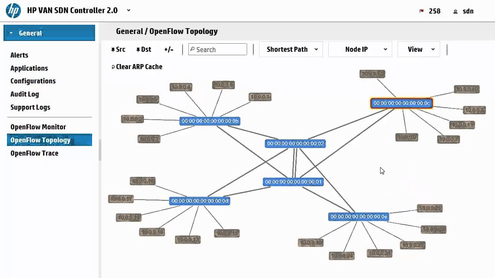{width="100%"}

Der Controller, der später umbenannt wurde zu Aruba VAN SDN Controller,
ist ein Controller auf Basis von OpenFlow. Ausgehend von den
Dokumentation wirkt der Funktionsumfang dieses Controller relativ
ausgereift. Das Produkt ist abgekündigt. [@hpevan]

### Aruba Central

Aruba Central ist ein Controller zur Konfiguration und Administration
von Aruba Geräten. Der Controller kann On-Premise und in der Cloud
betrieben werden. Der Controller spricht per HTTP mit den angebundenen
Aruba-CX Geräten. Aruba Central NetConductor Unterstützt bei der
Errichtung von [uo]{acronym-label="uo"
acronym-form="singular+short"}-Netzwerkarchitekturen mittels einem
Fabric Wizard, bietet eine Telemetrie mit Network Insights und Dienste
wie [nac]{acronym-label="nac" acronym-form="singular+short"}. Als
Protokolle werden unter anderem [vx]{acronym-label="vx"
acronym-form="singular+short"} und BGP-EVPN unterstützt [@arubac].

DELL
----

DELL hat im Jahr 2011 den Netzwerkausrüster Force10 übernommen. Die bis
dahin angebotenen Geräte waren im Auftrag gefertigte Hardware von
Broadcom und Marvell Technology Group, welche das PowerConnect Logo
trugen. Zusätzlich wurden Netzwerkgeräte von Juniper und Brocade mit dem
PowerConnect Logo angeboten. Durch die Übernahme von Force10 stieg DELL
in den Enterprise-Netzwerk Markt ein. Diese Entwicklung führt zu
mehreren DELL eigenen [sos]{acronym-label="sos"
acronym-form="singular+short"}en mit den Namen DNOS6, DNOS9 und dem
aktuellstem Ableger OS10.

-   **DNOS6** - Ehemaliges PowerConnect OS. Läuft überwiegend auf der
    DELL N-Serie, einfache Access Switche

-   **DNOS9** - Ehemaliges Force10 OS, wurde zusammen mit dem Hersteller
    übernommen und weiterentwickelt.

-   **DNOS10** - Dell eigenentwickeltes und Linuxbasiertes Smart
    Fabric[nos]{acronym-label="nos" acronym-form="singular+short"}.

Ein Großteil des Switchportolios von DELL basiert auf Broadcom-Chips.
Dell hat einige [on]{acronym-label="on"
acronym-form="singular+short"}-Switche mit [onie]{acronym-label="onie"
acronym-form="singular+short"} im Portfolio die teilweise offiziell für
Cumulus Linux sowie für SONiC unterstützt werden. DELL bewirbt aktiv den
Einsatz von SONiC auf den eigenen Switchen. Cumulus wird bei neuen
Geräten nicht mehr unterstützt.

Das aktuellste DELL OS10 unterstützt OpenFlow. Dell hat keinen eigenen
OpenFlow-Controller im Portfolio.

### SmartFabric

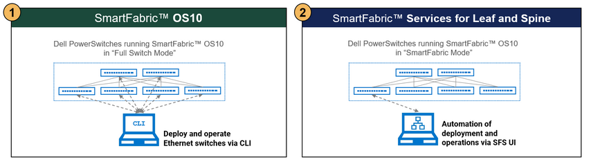{width="100%"}

Dell bietet mit SmartFabric ebenfalls einen eigenes Managementsystem an.
Dieser läuft nicht als dedizierter Controller, sondern ist ein
verteiltes System auf mehreren DELL OS10 Switchen. Die einzelnen Switche
bilden einen Cluster und wählen einen Master. Die Switche müssen dafür
in einen speziellen L3FABRICBetriebsmodus geschaltet werden. Nun kann
eine Fabric auf Basis Basis eines Layer-3 BGP Underlays und eines VXLAN
Overlays provisioniert werden. Die Rollen jeweiligen Rollen Leaf und
Spine werden statisch zugewiesen. Die Leaf Pärchen werden per VLTi in
ein [mlag]{acronym-label="mlag" acronym-form="singular+short"}-Verbund
gekoppelt. Die Lösung ist eng integriert in Dells
[hci]{acronym-label="hci" acronym-form="singular+short"} Plattform
VXRail.

EXTREME
-------

Extreme bietet über den Zukauf vieler Hersteller über die Jahre ein
breites Portfolio von Lösungen. Aktuell vermarktet Extreme für den
Campus Bereich hauptsächlich Universal-Switche, welche in der Lage sind
zwei hauseigene Betriebssysteme auszuführen. Zum einen gibt es EXOS, ein
Extreme eigenes Betriebssystem was durch die Jahre durch die Integration
von Funktionen zugekaufter Betriebsysteme wie EOS von Enterasys
profitiert hat. Das Betriebsystem wird mittlerweile Switching Engine
genannt und ist auf traditionelle Netzwerke spezialisiert. Es
unterstützt VXLAN sowie eine proprietäre Variante einer Funktionalität
wie BGP-EVPN.

Die Extreme Switche basieren auf Broadcom-Asics. Die aktuellen
Universall-Switche basieren auf ONIE, erlauben allerdings nicht die
Installation von dritten [sos]{acronym-label="sos"
acronym-form="singular+short"}

Extreme hatte zeitweise eine Unterstützung für OpenFlow in EXOS, sowie
einen eigenen Controller im Portfolio [@exofc].

Es findet sich im Portfolio mit dem Extreme 9920 eine Plattform auf
Basis des Intel Tofino 2. Hierbei handelt es sich um einem modularen
Core-Switch. Auch hier wird die Programmierbarkeit lediglich intern
verwendet, es werden keine Schnittstellen wie die P4Runtime
bereitgestellt. [@exp4]

### Extreme Fabric

Zusätzlich gibt es VOSS, ein von Avaya dazugekauftes
[sos]{acronym-label="sos" acronym-form="singular+short"} welches für
eine Fabric optimiert ist. Als Enkapsulierung wird allerdings IEEE
802.1ah - Provider Backbone Bridging welches anders als VXLAN auf
Layer-2 Ebene arbeitet und nicht auf Layer-3 Ebene. Also
Overlay-Controlplane wird 802.1aq Shortes Path Bridging eingesetzt,
welches Erreichbarkeitsinformationen mittels dem Routing-Protokoll IS-IS
verteilt.

### Extreme IP Fabric

OpenFlow Controller
-------------------

Auf der Suche nach OpenFlow-basierten Kontrollern stellt man fest, dass
die Webseiten und Dokumentationen auf die man stößt größtenteils
veraltet sind. Kommerzielle Produkte wie HPE VAN oder der Cisco XNC sind
abgekündigt. Mit Lumina, einem Anbieter einer kommerziellen OpenDayLight
Version, hat einer der letzten Anbieter im Jahr 2020 das Geschäft
eingestellt. Lumina ging als Ausgliederung der [sdn]{acronym-label="sdn"
acronym-form="singular+short"}-Sparte von Brocade hervor.[@lumina] Die
Weiterentwicklung von Junipers Contrails, Tungsten Fabric hat ebenfalls
das Projekt eingestellt. Verfügbar bleiben daher im wesentlichen
Community-gepflegte quelloffene Projekte.

Die derzeit populären drei offenen Projekte sind OpenDayLight, FAUCETund
ONOS. Die Projekte haben unterschiedliche Fokussierungen in ihrer
Anwendung. Faucet ist ein auf Basis von dem Framework RYUentwickelter
einfach gehaltener Controller. Er stellt die grundlegend notwendigen
Funktionen für ein Netzwerk bereit. OpenDayLight ist ein deutlich
größeres und modulares Projekt, welches im speziellen für eine
Integration in eine OpenStack Umgebung gedacht ist. ONOS besitzt die
selbe modulare Architektur wie OpenDayLight, der Fokus liegt allerdings
auf großen Backbone- und Carriernetzwerken.

Im folgenden wird ein Blick auf die Anzahl der eingereichten
Code-Änderungen in den Github-Repositories der einzelnen Projekte
geworfen. Daraus soll eingeschätzt werden inwieweit die Projekte aktuell
gepflegt werden.

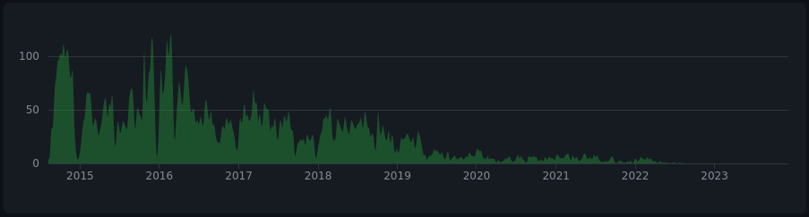{width="100%"}

{width="100%"}

{width="100%"}

Diese Graphen sind nicht vollständig repräsentativ da bei dem
OpenDaylight und dem ONOS Projekt der originale Code auf gerrit gehostet
wird. Die Repositories in Github sind Spiegelungen. Ein Trend ist
dennoch zu erkennen. Während das Projekt ONOS praktisch keine
Weiterentwicklung mehr erfährt, wird der OpenDaylight Controller und
Faucet derzeit noch gepflegt.

### OpenDayLight

Der OpenDayLight Controller ist ein quelloffenes Projekt verwaltet durch
die LinuxFoundation und ist für viele synonym für
[sdn]{acronym-label="sdn" acronym-form="singular+short"}-Controller. Das
Projekt ist hauptsächlich in Java geschrieben. Als
[sb]{acronym-label="sb" acronym-form="singular+short"}-Protokoll
unterstützt der Controller neben [of]{acronym-label="of"
acronym-form="singular+short"} Netconf, OVSDB und einige andere. Eine
Weboberfläche mit dem Namen DLUXwird nicht mehr weiterentwickelt. Der
Controller ist keine fertige Anwendung zum Bau eines
Unternehmensnetzwerkes. Er ist die Basis einiger Kommerzieller
Anwendungen wie Cisco XNC oder dem Lumina SDN Controller, welche
allerdings mittlerweile wie bereits erwähnt abgekündigt sind. Was
OpenDayLight heute bietet, ist eine Abstraktionsschicht für die
Konfiguration von Netzwerkgeräten mit verschiedenen Protokollen.
Hauptsächlich wird der Controller in OpenStack-Umgebungen eingesetzt,
wobei hier eine enge Integration besteht.

### Faucet

Faucet ist ein quelloffenes Projekt welches auf Ryu basiert. Ryu ist ein
Python Framework welches für Faucet [of]{acronym-label="of"
acronym-form="singular+short"} implementiert. Faucet ist im Gegensatz zu
den beiden vorher genannten Projekten vollständig auf den Bau von
[of]{acronym-label="of" acronym-form="singular+short"}-basierten
Netzwerken ausgerichtet. Ein erster Blick in die Doku verrät, dass
Faucet dafür viele relevanten Komponenten wie ACLs, VLANs sowie Routing
zwischen VLANs unterstützt. Zusätzlich kann Faucet 802.1X Pakete
abfangen und an einen Controller weiterleiten. Mit dem Projekt chewie,
welches ebenfalls von Faucet betrieben wird, gibt es sogar einen
integrierten Authentifizierungsdienst welcher per gegen einen Radius
Server Clients an einem Port authentifizieren kann. Die Dokumentation
von Faucet ist im Vergleich zu ONOS und OpenDaylight deutlich besser und
größtenteils vollständig. Faucet bietet ein fertiges Konzept Metriken in
dem Netzwerk zu erheben und über ein Stack mit Prometheus und Grafana zu
visualisieren.

### ONOS

ONOS geht aus der [onf]{acronym-label="onf"
acronym-form="singular+short"} hervor und ist das größte hier genannte
Projekt. ONOS selbst basiert wie OpenDayLight auf Modulen und lässt sich
dadurch beliebig in seiner Funktionalität erweitern. Das Einsatzgebiet
von ONOS ist aber überwiegend große Carrier-Netzwerke. Die Unternehmen
die als Referenz genannt werden oder selbst zu dem Projekt beitragen
sind ausschließlich Betreiber großer Netzwerke, wie zum Beispiel Google
oder die Telekom.

ONOS bietet eine Weboberfläche sowie grundlegende Module von Bau von
Netzwerken. Mit den Modulen org.onosproject.openflow,
org.onosproject.fwdund org.onosproject.gui2ein einfaches Netzwerk zu
bauen. Durch die Module wird den Namen entsprechend
[of]{acronym-label="of" acronym-form="singular+short"} implementiert,
eine einfache Paket-Weiterleitungslogik sowie eine Weboberfläche
implementiert. Weitere Module erlauben die Implementierung einer VLAN
Funktionalität sowie einfaches Routing und Routingprotokolle wie BGP.

Open-Networking
---------------

### Offene Switchbetriebsysteme

In diesem Kapitel werden [sos]{acronym-label="sos"
acronym-form="singular+short"} vorgestellt welche ohne eine dedizierte
Hardware vertrieben werden. Es gibt am Markt neben einigen offenen
Projekten auch kommerzielle Produkte. Zu den relevantesten kommerziellen
Anbietern gehören Pica8 mit ihrem PicOS, ipinfusion mit OcNOS und Big
Switch Networks. Big Switch Networks gehört mittlerweile zu Arista, die
Produkte sind in das Portfolio von Arista übergegangen. Ipinfusion
ziehlt hauptsächlich auf große Carrier Netzwerke ab. Relevante offene
Projekte sind ONL, Cumulus Linux sowie SONiC.

Ope

#### ONL

Open-Networking-Linux ist eine Linux-Distribution für Switche und dient
als Referenz [sos]{acronym-label="sos" acronym-form="singular+short"}
beziehungsweise Grundlage für weitere Projekte. Betreut wird das Projekt
von dem OPC - Open Compute Project. ONL ist wird als Grundlage für
kommerzielle Produkte wie unter anderem Ciscos IOS-XR und Big Switches
SwitchLight OS eingesetzt. ONL ist damit eher als Framework zu sehen, da
es auch kaum für den Betrieb eines Netzweres notwendigen Funktionen
integriert hat.

ONL bietet im Unterschied zu einer einfachen Linux Distribution wie zum
Beispiel Debian, auf dem ONL basiert, die ONLP [api]{acronym-label="api"
acronym-form="singular+short"}. Diese Schnittstelle bietet einem
Anwendungsentwickler einen standardisierten Zugriff auf die typischen
Hardware Komponenten eines Switches wie zum Beispiel Netzteile, Lüfter
und [sfp]{acronym-label="sfp" acronym-form="singular+short"}s. Auf der
Liste der unterstützten Switche finden sich 103 Geräte, unter anderem
von Edge-Core, Dell, Mellanox, HPE. Bis auf die Ausnahme von den
Mellanox Geräten basieren alle Geräte auf Broadcom Chips. Mellanox
Geräte basieren auf selbstentwickelten Mellanox SpectrumChips.

Zur Programmierung der eigentlichen [dp]{acronym-label="dp"
acronym-form="singular+short"} unterstützt ONL die Abstraktionen OF-DPA,
OpenNSL und SAI. ONL unterstützt damit hardwaregestützte
Paketweiterleitung. Die Broadcam ASICs werden zum Beispiel über die
Broadcom eigenen OpenNSL Bibliotheken eingebunden.

#### Cumulus Linux

Cumulus Linux, entwickelt von Cumulus Networks, ist einer der ersten
größeren offenen Projekten das eine relevante Verbreitung las offenes
[sos]{acronym-label="sos" acronym-form="singular+short"} erreichen
konnte. Cumulus wird von vielen als Pionier bezeichnet, da es nicht nur
eine breite Palette an Hardware unterstützt sondern mit unter anderem
VLXAN auch viele wichtigen Funktionen zum Einsatz in
[can]{acronym-label="can" acronym-form="singular+short"}en integriert
hat.

Cumulus nutzt zu großen Teilen den regulären Linux-Netzwerkstack.
Dadurch erscheinen die Interfaces eines Switches als Linux-Interface und
lassen sich über bekannte Methoden konfigurieren. Parallel gibt es eine
integrierte CLI welche die Konfiguration über Kommandos in gewohnter
Manier erlaubt.

![Cumulus Architektur - [@cumarch]](media/nvue-architecture.png){#fig:nv
width="100%"}

Wie in Abbildung [3.6](#fig:nv){reference-type="ref" reference="fig:nv"}
gezeigt, wandelt die Nvidia-Shell eingegebene Befehle primär in unter
Linux bekannten Konfiguration. Als Schnittstelle zwischen der
Konfiguration und der eigentlich [dp]{acronym-label="dp"
acronym-form="singular+short"} in Form eines ASICs fungiert der Dienst
switchd. Damit Cumulus mit hardwaregestützten Paketweiterleitung
eingesetzt werden kann, muss ein entsprechender ASIC hier integriert
werden. Die Liste der unterstützten Hardwareplattformen beinhaltet auch
hier hauptsächlich Broadcom basierte Geräte von Edge-Core, Dell und
weiteren, sowie die Plattformen von Mellanox auf Basis der
Mellanox-eigenen Chips.

Vermutlich weil Mellanox mit ihren eigenen Chips in direkte Konkurrenz
mit Broadcom stehen, hat Broadcom Cumulus den Zugriff auf die
Entwicklungstools für Ihre Chips versperrt. Dies sowie die Übernahme von
Cumulus und Mellanox durch NVIDIA schürte Zweifel bei den Kunden an dem
Interesse an der Offenheit des nun NVIDIA Cumulus heißenden
[sos]{acronym-label="sos" acronym-form="singular+short"}.

#### SONiC {#sec:sonic}

Für viele der inoffizielle Nachfolger von Cumulus ist SONiC. SONiC steht
für Software for Open Networking in the Cloud. Ursprünglich von
Microsoft für die Azure Cloud entwickelt steht dieses Projekt nun unter
der Linux Foundation. SONiC hat dadurch das es bereits in der Azure
Cloud eingesetzt wird, und zum Beispiel von DELL als offizielles
präferiertes [sos]{acronym-label="sos" acronym-form="singular+short"}
empfohlen wird, hat es großes Potential sich zu einem defacto Standard
zu entwickeln.

![SONiC Architektur - [@sonarch]](media/sonarch.png){#fig:sonarch
width="100%"}

In Abbildung [3.7](#fig:sonarch){reference-type="ref"
reference="fig:sonarch"} ist die Architektur von SONiC dargestellt.
Maßgebender Unterschied ist die Art wie verschiedene ASICs integriert
werden. Während bei den vorher vorgestellten Systemen es notwendig war
jede spezielle ASIC API entsprechend zu integrieren, muss für SONiC sich
der Entwickler des ASICs über die SAI nach oben integrieren. Hardware
vendors are expected to provide a SAI-friendly implementation of the SDK
required to drive their ASICs.[@saiasic]. SONiC hat mit seiner
Verbreitung die Möglichkeit, Hardwarehersteller dazu zu bringen sich an
den SAI Standard zu halten.

### Open-Networking Hardwareplattformen

   Anbieter        Plattform               NPU          Boot Loader     Supported 3rd Party OS    
  ----------- -------------------- ------------------- ------------- ---------------------------- --
     CISCO     8000 Series Router      SiliconOne          ONIE                 SONiC             
    Juniper       ua. QFX 5200      Broadcom Tomahawk      ONIE                 SONiC             
    Arista     einige DCS-7000er    Broadcom diverse       Aboot                SONiC             
    Arista         DCS-7170er         Intel Tofino         Aboot                SONiC             
   HPE Aruba           \-                  \-               \-                    \-              
   HPE Aruba     S, Z, E Serie      Broadcom diverse.      ONIE         SONiC, Cumulus, Picos     
    EXTREME            \-           Broadcom diverse.      ONIE                   \-              
    NVIDIA          SN-Serie         Nvidia Spectrum       ONIE             Cumulus, SONiC        
   EdgeCore           Alle          Broadcom diverse       ONIE       SONiC, Cumulus, Picos uvm.  

**Cisco** bietet mit dem 8000 Series Router eine Plattform an, welche
ein spezielles OpenBios mit offenen Firmware implementierungen hat. Nur
auf dieser ist eine Installation von ONIE möglich. Der SiliconOne
unterstützt in dieser Plattform das SAI und wird darüber von SONiC
unterstützt. [@ciscosonic]

**Juniper** unterstützt mit mehreren Switchen auf Basis des Broadcom
Tomahawks aus der QFX Serie offiziell SONiC. Da alle aktuellen Switche
mit von Jupiter mit ONIE vorinstalliert werden ist die Installation von
anderen Betriebssysteme wie Cumulus prinzipiell möglich, allerdings ist
dies nicht offiziell unterstützt und so können Treiber für zum Beispiel
die Lüftersteuerung fehlen. Ebenso problematisch ist der Einsatz auf
Juniper Geräten mit eigenen Juniper ASICs wie dem Juniper Q5.

**Arista** bietet für eine große Anzahl seiner Switche eine
entsprechende SAI Implementierung und Treiber in Ihrem GitHUB, es gibt
aber auch fertige Images im SONiC Repository. Auf den eigenen Geräten
setzt Arista kein ONIE sondern Aboot ein. Interessanterweise gibt es für
Arista EOS eine Version für ONIE die ebenfalls SAI unterstützt.
[@aristaon]

**HPE** verkauft viele Switchserien von Fremdherstellern die
verschiedene Betriebssysteme unterstützen. Die aktuellen HPE Aruba
Switche unterstützen keine Installation von dritten Betriebssystemen. Da
Aruba aktuell eigene Asics einsetzt ist eine Implementation schwierig.

**Dell** unterstützt in den aktuellen Serien, die auch zu großen Teilen
den Namenszusatz ON für Open Networking tragen viele Betriebssysteme.
Das ist möglich durch offene Broadcom SDKs sowie ONIE.

Obwohl die aktuellen **Extreme Networks** Switche auf Broadcom Chips
basieren sowie ONIE unterstützen erlaubt Extreme keine fremden
Betriebssysteme auf Ihren Switchen und stellt keine Schnittstellen
bereit.

Die ehemaligen Mellanox Switche, welche von **NVIDIA** übernommen worden
sind, basieren auf eigenen ASICs. Diese werden von Cumulus unterstützt
und haben selbst eine SAI Implementierung. Ebenfalls unterstützt wird
noch Onyx, das ehemalig Mellanox eigene Betriebssystem.

**Edgecore** gehört zu den Whitebox Herstellern die Switche auf Basis
von Broadcom Chips und ONIE ohne eigenes Betriebsystem vertreiben.
Dadurch sind die vorallem auf die Unterstützung von offenen
Betriebsystemen angewiesen und unterstützen alle gängigen
Softwareplattformen,

Protokollimplementationen
-------------------------

In diesem Abschnitt soll eine tabellarische Übersicht über die
Implementation in dieser Thesis genannten Protokolle und Technologien
gegeben werden.

::: {#tab:dpp}
       Plattform          OpenFlow       P4Runtime   BGP-EVPN     
  ------------------- ----------------- ----------- ---------- -- --
     CISCO IOS-XE         Latest^1^         \-        Latest      
       Junos OS        14.2R-Latest^1^      \-        Latest      
      Arista EOS          4.15-4.29         \-        Latest      
   ArubaOS-Switch^2^       Latest           \-          ?         
      ArubaOS-CX             \-             \-        Latest      
   HPE Comware(H3C)          \-             \-        Latest      
       DELL OS10          Latest^1^         \-        Latest      
     Extreme EXOS       15.3-30.4^1^        \-          ?         
     Extreme VOSS            \-             \-          \-        
         SONiC               \-            PINS       Latest      
        Stratum              \-            Nativ        \-        
      OpenvSwitch          Latest         Geplant       \-        

  : Dataplane SDN Protokolle
:::

-   1 - Hardwareabhängig

-   2 - Ehemaliges HPE Provision

In der Tabelle [3.1](#tab:dpp){reference-type="ref" reference="tab:dpp"}
werden die aktuellen Implementierungen von Protokollen zur
Programmierung einer Dataplane eines Switches durch einen Controller
gezeigt. Es fällt auf, dass sowohl Arista als auch Extreme OpenFlow
nicht mehr in den aktuellen Betriebssystemen unterstützt. Die beiden
sehr aktuellen offenen Betriebssysteme unterstützen ebenfalls kein
OpenFlow. Stratum ist derzeit das einzige System, dass P4Runtime
vollständig untersützt. Für den OpenVSwitch finden sich im Internet
Vorschläge [@ovsp4], für SONiC wurde es in den aktuellsten Versionen
bereits über PINS implementiert [@sonicpins].

Evaluation und Simulation ausgewählter Konzepte
===============================================

In den folgenden Kapiteln werden mehrere [sdn]{acronym-label="sdn"
acronym-form="singular+short"}-Konzepte erläutert sowie auf Basis
quelloffener Software in GNS3 simuliert. Für die Implementierung eines
Designs wird, wenn möglich, die Referenztopologie aus
[1.6](#sec:ref){reference-type="ref" reference="sec:ref"} genutzt.

Begonnen wird mir jeweils zwei Architekturen auf Basis von OpenFlow,
welche sich in Ihrer Mechanik zur Weiterleitung von Paketen
unterscheiden. Der erste Ansatz zeigt eine Netzwerkarchitektur die auf
traditionellen Ethernet-Mechaniken zur Weiterleitung von Paketen
basiert. Der Zweite Ansatz basiert auf einen Flow-basierten Ansatz.

P4Runtime ist der technologische Nachfolger von OpenFlow von der
[onf]{acronym-label="onf" acronym-form="singular+short"}. Während
OpenFlow nur ein Protokoll ist und die Switch-seitige Implementation in
Händen der Hersteller ist, wird bei P4Runtime auch die Switch-seitige
Implementation mittels eines P4-Programms durch den Netzwerkarchitekt
gegeben. Dies soll das Problem von nicht vollständigen und
unterschiedlich funktionierenden OpenFlow-Implementationen
architektonisch lösen. Es wird ein Software-basierter Switch gezeigt,
der sich per P4 programmieren lässt sowie eine P4Runtime Schnittstelle
hat. Zusätzlich soll die aktuelle [onf]{acronym-label="onf"
acronym-form="singular+short"} Referenzimplementation SD-Fabric
eingegangen werden, welche auf Segment Routing und MPLS basiert.

Zuletzt wird ein Ansatz auf BGP-EVPN gezeigt, welcher nicht unmittelbar
der [sdn]{acronym-label="sdn" acronym-form="singular+short"}-Definition
entspricht, da die Controlplane zwar zwischen den VTEPs durch ein
Routing-Protokoll implementiert wird, das Netzwerk hierdurch aber nicht
unmittelbar programmierbar wird. Die Martkanalyse zeigt allerdings eine
erhebliche Verbreitung solcher Underlay/Overlay Architekturen in
Lösungsdesigns sowie in Form von Protokollimplementationen.

Auswahl virtueller Switche
--------------------------

Für die Simulation der weiterhin genannten Konzepte wird jeweils ein
virtuelle Switch mit einer Implementierung von a) OpenFlow, b) BGP-EVPN
und c) P4Runtime benötigt. An dieser Stelle wird kurz die Auswahl der
entsprechend eingesetzten Plattformen begründet.

#### OpenFlow

Bei den getesteten virtuellen Hardware-Plattformen mit OpenFlow
Unterstützung, die durch Hersteller angeboten werden, kann OpenFlow zwar
konfiguriert werden, die Regeln werden aber nicht umgesetzt. Bei den
Hardware-Appliances geschieht dies in der Regel über Schnittstellen der
ASIC-Anbieter wie zum Beispiel Broadcoms OF-DPA [@broadcomofdpa]. Eine
Umsetzung in den virtuellen Versionen ist daher komplex und bedarf
Entwicklungsaufwand. Aus diesem Grund wird für die OpenFlow-basierten
Konzepte der OpenVSwitch eingesetzt. Dieser wird in OpenStack Umgebungen
eingesetzt. Da der OpenStack Netzwerk-Stack in Form von Neutron auf
OpenFlow basiert, ist die Implementierung von OpenFlow im OpenVSwitch
als vollständig anzunehmen.

#### BGP-EVPN

BGP-EVPN wird von SONiC in der virtuellen Variante unterstützt. Aktuell
in der virtuellen Variante nicht unterstützt werden Anycast-Gateways
sowie EVPN-Multihoming.

#### P4Runtime

Für P4Runtime wird die Referenzimplementierung Stratum auf Basis der
P4-Referenzimplementierung bmv2verwendet. Bei SONiC wird P4Runtime über
PINS implementiert, ist allerdings aktuell nicht in der virtuellen
Variante umgesetzt. Eine Umsetzung in der virtuellen Variante mittels
DPDK befindet sich im Backlog - SONiC with P4 DPDK (PNA architecture) --
Basic SoftSwitch with DPDK - Deferred from 202205 release der SONiC
Roadmap. [@sonicroadmap].

OpenFlow I: Controller- und Broadcastbasiert mit Faucet {#sec:of1}
=======================================================

Architektur und Technologien
----------------------------

Bei diesem Ansatz wird die Dataplane der Switche vollständig durch einen
externen Controller programmiert. Das Prinzip ist asymmetrisch da die
Controlplane zentral in Form eines Controllers implementiert ist.
MAC-Adressen werden wie bei traditionellen Ethernet-Architekturen
gelernt, zum auflösen von IP-Adressen werden Broadcasts implementiert.
Um Broadcasts in einem vermaschten Netz möglich zu machen, erstellt der
Controller für die Broadcasts eine sternförmige Topologie hin zu einer
Root-Bridge. Dieses Prinzip ist bekannt durch das
[stp]{acronym-label="stp" acronym-form="singular+short"}.

[1.6](#sec:ref){reference-type="ref" reference="sec:ref"} errichtet.

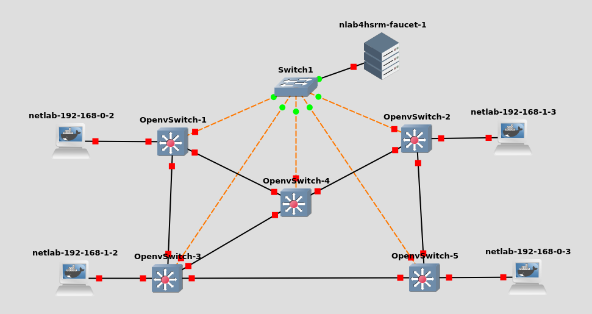{#fig:fauarch
width="100%"}

Das Prinzip soll Anhand der Implementierung des Controllers Faucet sowie
der Referenztopologie aus [1.6](#sec:ref){reference-type="ref"
reference="sec:ref"} deutlich gemacht werden. Die virtuellen Switche
sind per OpenFlow mit dem Controller verbunden. Es werden vier Endgeräte
in zwei verschiedenen Subnetzen an das Netzwerk angeschlossen. Das Ziel
ist das sich alle Endgeräte untereinander erreichen können.

Die Topologie des Netzwerkes wird in einer Konfigurationsdatei auf dem
Controller definiert. Bei Faucet handelt es sich dabei um eine YAML
Datei, zu finden unter:

    $ /etc/faucet/faucet.yaml

Diese zentrale Art der Konfiguration erlaubt automatisierte und
dynamische Änderungen an dem Netzwerk an einer zentralen Stelle.
Weiterhin bringt Faucet eigene Module mit, die beispielsweise auf Basis
einer Port-Authentifizierung dynamisch ein VLAN zuweisen können

In dieser zentralen Datei werden VLANs, Router mit virtuellen
IP-Adressen sowie die einzelnen Interfaces mit ihren jeweiligen getagten
und ungetagten VLAN-IDs konfiguriert. Es ist notwendig die Topologie dem
Controller statisch bekannt zu machen. Der Controller bildet das hier
definierte Netzwerk im Anschluss in Form von OpenFlow Regeln ab.

Es wird zum einen ein statisches Regelwerk programmiert, welches dafür
sorgt, dass bestimmte Pakete an den Controller gesendet werden oder den
Pfad für Broadcast-Pakete definiert. Die Weiterleitung bestimmer Pakete
beziehungsweise deren Header ist Funktional in traditionellen Switchen
auch implementiert. Auch hier werden Informationen an die CPU
weitergeleitet um hier verarbeitet zu werden und Entscheidungen auf
Controlplane-Ebene treffen zu können.

Weiterhin wird dynamisch auf neue MAC-Adressen und Änderungen in der
Topologie reagiert. Dies hat jeweils entsprechende neue Regeln zur
Folge. Wo bei traditionellen Switchen bei einem neuen Host ein neuer
MAC-Eintrag in der [fdb]{acronym-label="fdb"
acronym-form="singular+short"} eingefügt wird, ist in diesem Konstrukt
eine neue Regel in der OpenFlow Tabelle notwendig.

### Initial implementiertes Regelwerk

Zuerst werden die wichtigsten initialen Regeln von dem Switch
OpenVSwitch-5 nach der Initialisierung von Faucet betrachtet. Die Regeln
sind im mehreren Tabellen kaskadiert, Regeln können Pakete auf weitere
Regeltabellen verweisen. Zur Interpretation folgender Regelwerke werden
zusätzlich folgende Informationen gegeben:

-   **eth1** - Link zu dem Switch 2

-   **eth2** - Link zu dem Switch 3

-   **eth5** - Client-Interface mit VLAN-Tag 100

-   **eth2** - Client-Interface mit VLAN-Tag 200

-   **VLAN 100** - 192.168.0.1/24 / 00:00:00:00:00:11 virtuelle MAC

-   **VLAN 200** - 192.168.1.1/24 / 00:00:00:00:00:22 virtuelle MAC

{width="100%"}

-   **Regel 0-1**: Weiterleitung von LLDP-Paketen an den Controller.
    Dieser erfährt damit von ausgefallen Links um die Pfade neu zu
    berechnen.

-   **Regel 2-3**: Pakete ohne VLAN-Tag werden auf den
    Infrastruktur-Links zwischen den Switchen verworfen.

-   **Regel 5-6**: Eingehende Pakete auf den Client-Interfaces werden
    der Konfiguration entsprechend mit VLAN-IDs markiert und an Tabelle
    1 weitergeleitet

-   **Regel 6-7**: Eingehende Pakete auf den Infrastruktur Links werden
    an die nächste Tabelle weitegerleitet.

{width="100%"}

In dieser Tabelle wird der Mechanismus zur Verarbeitung von Broadcasts
deutlich.

-   **Regel 58+60**: Broadcasts die aus Richtung der Root-Bridge kommen
    werden an alle Client-Interfaces weitergeleitet.

-   **Regel 69-60**: Broadcasts die von Switchen die nicht in der
    Richtung der Root-Bridge liegen kommen werden zur Root-Bridge
    weitergeleitet

-   **Regel 62-63**: Alle sonstigen Broadcasts innerhalb der definierten
    VLANs werden zur Root Bridge weitergeleitet.

{width="100%"}

Im Gegensatz dazu leitet die Root Bridge Broadcast-Pakete auch an alle
Interfaces weiter an der weitere Switche angeschlossen sind, um sie von
hier aus wieder zu verteilen. Switche auf dem Weg zwischen der
Root-Bridge und einem Stern-Endpunkt leiten die Broadcasts auch an die
jeweiligen darunterliegenden Switche weiter.

### Dynamische Regeln nach Anschluss eines Hosts

Nun werden die Hosts 2 und 3, die jeweils in unterschiedlichen VLANs
sitzen mit dem Netzwerk verbunden und ein Ping zwischen den beiden Hosts
durchgeführt.

{width="100%"}

Der Wireshark-Mitschnitt zeigt einige Besonderheiten dieser
Netzwerkarchitektur. Zu Beginn sehen wir die ARP-Auflösung von Host-2
für das entsprechende Default Gateway. Wir sehen lediglich die
ARP-Antwort die von der Root-Bridge kommt, währen die Anfrage direkt von
Switch-5 an den Controller gesendet wurde. Die Besonderheit ist nun dass
die Pakete obwohl sie über ein Gateway geroutet werden dennoch direkt
über den Querlink direkt zwischen den Switchen ausgetauscht werden, und
nicht über einen dedizierten Router an einer Stelle im Netzwerk geleitet
werden müssen.

Die Regeln die dies möglich machen werden im folgenden Erläutert.

{width="100%"}

-   **Regel 45**: Pakete aus dem VLAN 100 mit der Zieladresse des Hosts
    im VLAN 200 werden hier geroutet. Zu diesem Zweck wird die
    Quell-Macadresse durch die des virtuellen Router-Interfaces im VLAN
    200 ausgetauscht und die Ziel-Macadresse durch die des jeweiligen
    Zieles ausgetauscht. Anschließend werden die Pakete in Tabelle 4
    weiter behandelt. Dies geschieht immer jeweils auf dem Switch auf
    dem der Host angeschlossen ist. Dadurch wird ein verteiltes Routing
    erreicht.

{width="100%"}

-   **Regel 66**: Das soeben geroutete Paket wird durch diese Regel über
    das Interface eth1 an den jeweiligen Switch mit dem zu erreichenden
    Host gesendet.

{width="100%"}

Eine Betrachtung der MAC-Adressen auf den Paketen bestätigt die zueben
erläuterte Mechanik. Die Pakete haben als Quell-Macadressen jeweils die
Adressen der virtuellen Gateways, und als Ziel-Macaddresse bereits die
des zu erreichenden Hosts.

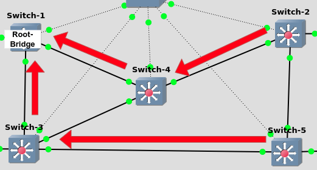{width="60%"}

Die Pfade die Faucet errichtet folgen immer dem zu Beginn erschaffenen
Baum hin zu einer Root-Bridge. Das bedeutet das der Datenverkehr
zwischen Switch-2 und Switch-5 immer den Umweg über die Root-Bridge und
damit alle anderen Switche geht.

Virtueller Switch: OpenvSwitch
------------------------------

Der OpenVSwitch ist eine Open-Source-Software, die primär auf Linux als
virtueller Switch dient. Dieser Switch wird in
Virtualisierungsumgebungen und Cloud-Umgebungen dafür verwendet um
virtuelle Maschinen auf Hypervisoren wie KVM mit dem Netzwerk zu
verbinden. Der Switch hat viele Layer-2 Funktionen wie VLANs,
[stp]{acronym-label="stp" acronym-form="singular+short"} sowie
komplexere Technologien wie VXLAN implementiert.

{width="100%"}

Der OpenVSwitch hat unter Linux ein eigenes Kernel-Modul für die
performante Weiterleitung von Paketen. Die Regeln dieses Datenpfads
werden durch den Dienst vswitchd implementiert, der damit als
Controlplane fungiert. Auch hier werden Pakete für die keine Regeln
greifen an die Controlplane übergeben, um dort verarbeitet zu werden und
eine neue Regel zu erzeugen. Die Kommunikation zwischen dem Kernel-Modul
und vswitchd erfolgt über Netlink. Über einen Socket werden Flow Keys
übergeben, welche Regeln zur Weiterleitung von Paketen definieren.
[@ovsdp].

Alternativ kann DPDK als Controlplane genutzt werden, welches im
Userspace läuft und Aufgrund einer anderen Architektur höhere
Übertragungsraten als das OpenvSwitch Kernel-Modul erreicht. DPDK
unterstützt weiterhin die Auslagerung von Mechaniken auf die
physikalische Netzwerkkarte.

{#fig:ovsdp
width="100%"}

Über den in der Abbildung[5.2](#fig:ovsdp){reference-type="ref"
reference="fig:ovsdp"} gezeigten Befehl lassen sich die in den Kernel
implementierten Regeln ausgeben. In diesem Fall sind zwei Hosts an den
Switch angebunden, die untereinander Kommunizieren. Es existiert für
jeweils jede Richtung eine Regel welche auf die Pakete matcht und diese
die als Aktion an den entsprechenden Port weiterleitet. Ein
detaillierter Vergleich zwischen der Performance verschiedener Dataplane
Technologien unter dem OpenvSwitch findet sich hier: [@ovsdpperf].

Simulation
----------

Für die Simulation wird das Template OpenFlow-Lab im GNS3-Server-Manager
der Hochschule genutzt. In diesem sind die Docker-Container für Faucet
und den OpenVSwitch bereits vorbereitet. Zusätzlich ist bereits ein
Projekt angelegt, in dem die Referenztopologie angelegt ist.

Der **OpenVSwitch** wird als Docker-Container implementiert. Es wird ein
fertiger Container aus dem öffentlichden Dockerhub Repository verwendet
- gns3/openvswitch:latest. Die Appliance ist vorgefertigt in dem
GNS3-Markplatz verfügbar-

Für **Faucet** wird ein eigener Container erstellt, der im Repository
der Hochschule verfügbar ist unter nlab4hsrm/faucet. In diesem sind
bereits Konfigurationen für diese Simulation abgelegt.

### Konfiguration OpenVSwitche

Die IP-Adresse für die Verbindung zum Controller wurde bereits über Edit
Config im GNS3-Kontextmenü gesetzt. Im ersten Schritt werden die Switche
konfiguriert. Dafür wird im ersten Schritt eine OpenFlow-Bridge
angelegt, sowie das Protokoll und der Controller festgelegt. Dafür wird
das Konfigurationstool ovs-vsctl genutzt.

``` {caption="Faucet OpenVSwitch Konfiguration 1"}
# Configure OpenFlow Bridge
ovs-vsctl add-br of
ovs-vsctl set bridge of protocols=OpenFlow13
ovs-vsctl set bridge of fail_mode=secure
ovs-vsctl set bridge of other-config:datapath-id=0000000000000001
ovs-vsctl set-controller of tcp:10.0.0.250:6653
```

Im Anschluss werden Interfaces von der Standard-Bridge entfernt und der
OpenFlow-Bridge hinzugefügt.

``` {caption="Faucet OpenVSwitch Konfiguration 1"}
ovs-vsctl del-port eth1
ovs-vsctl add-port of eth1
ovs-vsctl set Interface eth1 ofport_request=1
ovs-vsctl del-port eth2
ovs-vsctl add-port of eth2
ovs-vsctl set Interface eth2 ofport_request=2
ovs-vsctl del-port eth3
ovs-vsctl add-port of eth3
ovs-vsctl set Interface eth3 ofport_request=3
ovs-vsctl del-port eth4
ovs-vsctl add-port of eth4
ovs-vsctl set Interface eth4 ofport_request=4
ovs-vsctl del-port eth5
ovs-vsctl add-port of eth5
ovs-vsctl set Interface eth5 ofport_request=5
ovs-vsctl del-port eth6
ovs-vsctl add-port of eth6
ovs-vsctl set Interface eth6 ofport_request=6
ovs-vsctl del-port eth7
ovs-vsctl add-port of eth7
ovs-vsctl set Interface eth7 ofport_request=7
ovs-vsctl del-port eth8
ovs-vsctl add-port of eth8
ovs-vsctl set Interface eth8 ofport_request=8
```

Die Konfiguration lässt sich anschließend wie folgt überprüfen:

    / # ovs-vsctl show
    {...}
        Bridge of
            Controller "tcp:10.0.0.250:6653"
                is_connected: true
            fail_mode: secure
            Port eth4
                Interface eth4
            Port eth1
                Interface eth1
            Port eth7
                Interface eth7
            Port eth8
                Interface eth8
            Port of
                Interface of
                    type: internal
            Port eth3
                Interface eth3
            Port eth2
                Interface eth2
            Port eth6
                Interface eth6
            Port eth5
                Interface eth5
        Bridge br1
            datapath_type: netdev
            Port br1
                Interface br1
                    type: internal

Es sollte die eben angelegte Bridge mit entsprechenden Eigenschaften
gezeigt werden. Der is connected Eintrag sollte erscheinen sobald Faucet
konfiguriert und gestartet ist.

Das Mapping zwischen den Interfaces und der OpenFlow-ID lässt sich mit
folgendem Befehl überprüfen:

    / # ovs-vsctl -- --columns=name,ofport list Interface
    {...}
    name                : eth5
    ofport              : 5

    name                : eth2
    ofport              : 2
    {...}

### Konfiguration Faucet

Faucet wird über eine YAML-Konfigurationsdatei im Pfad
/etc/faucet/faucet.yaml Konfiguriert. Im Wurzelverzeichnis von Faucet
leigen bereits die Konfiguration für ein Layer-2 und ein Layer-3
Netzwerk für die entsprechende Topologie ab. Diese können an
entsprechende Stelle kopiert werden mittels

    $ cp /faucet-L2.yaml /etc/faucet/faucet.yaml

Die Konfiguration faucet-L2.yaml implementiert zwei VLANs innerhalb
deren die jeweiligen Hosts kommunizieren können. In der erweiterten
Konfiguration faucet-L3.yaml ist zusätzlich ein Routing zwischen den
beiden VLANs implementiert.

### Start des Netzwerkes

Zum Start des Netzwerkes wird nun der FaucetDienst gestartet. Dafür wird
in der Konsole für Faucet folgender Aufruf abgesetzt um den Prozess im
Hintergrund zu starten:

    $ faucet &

Im Anschluss kann der Log unter /var/log/faucet/faucet.log betrachtet
werden. Eine Erfolgreiche Konfiguration der einzelnen Switche sollte wie
folgt aussehen:

    Mar 12 14:49:17 faucet.valve INFO     DPID 1 (0x1) sw1 Stack node sw1 UNHEALTHY (running 0s ago, stack ports [Port 1, Port 2] (100%) not up)
    Mar 12 14:49:17 faucet INFO     Stack root sw1 (previous None)
    Mar 12 14:49:17 faucet INFO     Reconfiguring existing datapath DPID 1 (0x1)
    Mar 12 14:49:17 faucet.valve INFO     DPID 1 (0x1) sw1 no ACL changes
    Mar 12 14:49:17 faucet.valve INFO     DPID 1 (0x1) sw1 no VLAN changes
    Mar 12 14:49:17 faucet.valve INFO     DPID 1 (0x1) sw1 no METERS changes
    Mar 12 14:49:17 faucet.valve INFO     DPID 1 (0x1) sw1 no port changes
    Mar 12 14:49:17 faucet.valve INFO     DPID 1 (0x1) sw1 Stack topology change detected, restarting stack ports
    Mar 12 14:49:17 faucet.valve INFO     DPID 1 (0x1) sw1 Port 1 (sw1 isl to sw4) down
    Mar 12 14:49:17 faucet.valve INFO     DPID 1 (0x1) sw1 Port 2 (sw1 isl to sw3) down
    Mar 12 14:49:17 faucet.valve INFO     DPID 1 (0x1) sw1 Using stacking root flood reflection
    Mar 12 14:49:17 faucet.valve INFO     DPID 1 (0x1) sw1 IPv4 routing is active on VLAN office vid:100 untagged: Port 5 with VIPs ['192.168.0.1/24']
    Mar 12 14:49:17 faucet.valve INFO     DPID 1 (0x1) sw1 IPv4 routing is active on VLAN server vid:200 untagged: Port 6 with VIPs ['192.168.1.1/24']
    Mar 12 14:49:17 faucet.valve INFO     DPID 1 (0x1) sw1 Port 1 (sw1 isl to sw4) up
    Mar 12 14:49:17 faucet.valve INFO     DPID 1 (0x1) sw1 Port 2 (sw1 isl to sw3) up
    Mar 12 14:49:17 faucet.valve INFO     DPID 1 (0x1) sw1 Configuring VLAN server vid:200 untagged: Port 6
    Mar 12 14:49:17 faucet.valve INFO     DPID 1 (0x1) sw1 Configuring VLAN office vid:100 untagged: Port 5
    Mar 12 14:49:17 faucet.valve INFO     DPID 1 (0x1) sw1 warm starting

Ist dies für alle konfigurierten Switche der Fall, kann die
Konnektivität zwischen den Endgeräten mittels Ping und Iperf3 überprüft
werden.

Fazit
-----

Faucet ist eine solide OpenFlow-basierte Lösung welches ein solides
Netzwerk mit Layer-2 und Layer-3 Funktionalitäten bereitstellen kann.
Faucet zeigt die Vorteile eines zentral konfigurierbaren Netzwerkes,
macht sich aber mögliche Vorteile durch eine zentrale Controlplane nicht
zu nutze. Zwar wird Spanning-Tree ersetzt durch eine eigene Mechanik,
Pfade in einem vermaschten Netzwerk verlaufen aber dennoch entlang einer
Baumstruktur und sind damit nicht in jedem Fall optimal. Faucet bietet
keine Möglichkeiten für Traffic-Engineering wie geregeltes
Load-Balancing. Zu Demonstrationszecken bietet Faucet den Vorteil das
durch das auf die Switche installierte Regelwerk viele grundlegenden
Mechaniken eines Ethernet und IP Netzwerkes gezeigt werden können.

OpenFlow II: Controller- und Pfad-basiert mit ONOS
==================================================

Auch dieser Ansatz ist asymmetrisch weil Controller-basiert. Der
Unterschied besteht darin, dass der Controller kein Regelwerk zum
Nachbau eines klassischen Netzwerkes wie im ersten Ansatz implementiert,
sondern für Kommunikationsbeziehungen jeweils Pfade implementiert. Der
ONOS Controller arbeitet auf diesem Prinzip und wird daher zur
Veranschaulichung genutzt.

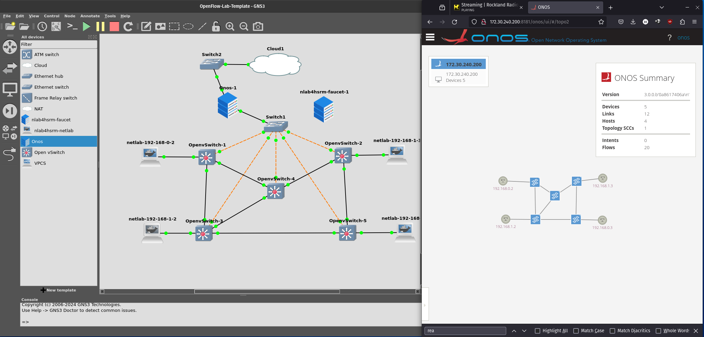{#fig:onostop
width="100%"}

Die Funktionsweise dieses Prinzips wird an der gleichen
Netzwerktopologie wie im Kapitel [5](#sec:of1){reference-type="ref"
reference="sec:of1"} gezeigt.

#### Layer-2 Fabric - Reactive Forwarding

ONOS ist lediglich eine Controller-Plattform. Funktionen werden mittels
Plugins hinzugefügt. Die Weiterleitung von Paketen wird in diesem Fall
über das Plugin Reactive Forwarding implementiert. Auch OpenFlow wird
als Treiber über ein Plugin in ONOS integriert.

Sobald sich die Switche mit dem ONOS Controller per
[of]{acronym-label="of" acronym-form="singular+short"} verbunden haben
werden folgende Regeln in die Switche programmiert:

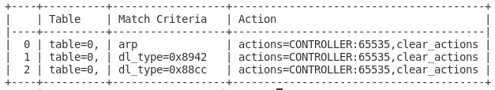{width="100%"}

Jeder Regel besteht aus einem Kriterium für die Paketet auf die sie
angewendet werden soll - Match Criteria, und einer Aktion die im
Anschluss mit dem Paket ausgeführt werden soll Action. Die drei Regeln
sorgen dafür, dass alle ARP, LLDP und BDDP Pakete an den Controler
geschickt werden. Durch die LLDP Pakete lernt ONOS die Topologie. Durch
die abgefangenen ARP Requests lernt der Controller MAC zu entsprechenden
IP Adressen und den Ort der Hosts. Durch die ARP Requests erkennt der
Controller die Absicht eines Hosts zu einem anderen Host eine
Kommunikation aufzubauen und kann einen entsprechenden Pfad
Implementieren.

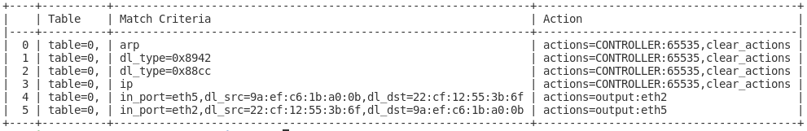{width="100%"}

Nach einem empfangenen ARP-Request, in diesem Fall durch einen Ping
zwischen den beiden Hosts nlab4hsrm-netlab-1 und nlab4hsrm-netlab-2 aus
Abbildung [6.1](#fig:onostop){reference-type="ref"
reference="fig:onostop"} verursacht, sind drei neue Regeln in dem Switch
1 zu finden. Anstelle eines komplexen Regelwerkes wird nur mittels
zweier Regeln ein exakter Pfad zwischen den beiden Hosts hergestellt und
Pakete auf Basis Ihrer Mac-Adresse weitergeleitet.

In dieser Variante ist das Netzwerk floodless, Broadcasts werden
prinzipiell nicht weitergeleitet. Es ist allerdings durch weitere
Plugins möglich Broadcast-Domänen zu spezifizieren und damit Broadcasts
für Nutzer des Netwerkes zu ermöglichen.

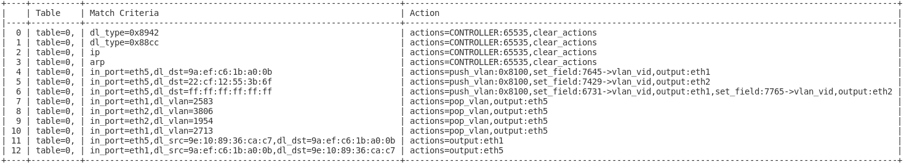{width="100%"}

Die Konfiguration des VLAN-Plugins resultiert in einem erweiterten
Regelwerk. Die ersten vier Regeln bleiben identisch. Bei den Regeln für
die eingehenden Pakete auf Port eth5 wird als erste Aktion das Paket mit
dem Wert 0x8100 als ein nach IEEE 802.1p markierten Frame markiert.
Anschließend wird die VLAN-ID in das entsprechende Feld geschrieben. Mit
Regel 6 wird eine Regel zur Behandlung von Broadcasts implementiert.

### Netzwerk Visibilität

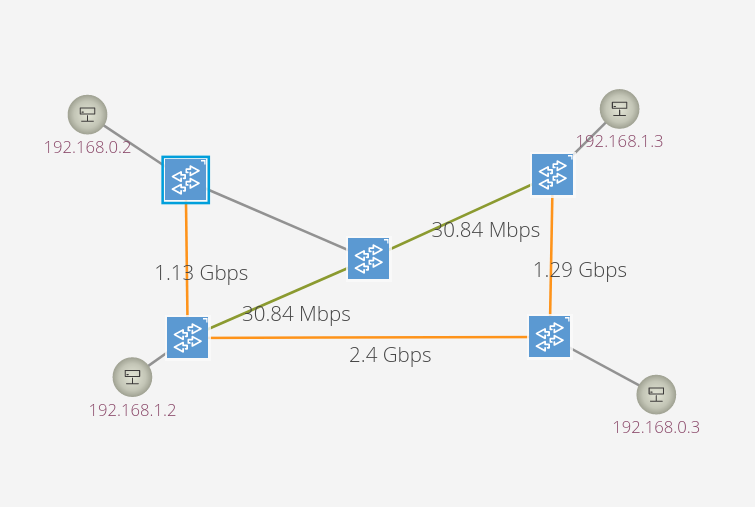{width="100%"}

Ein großer konzeptioneller Vorteil von dieser Art von Netzwerken ist,
dass der Zustand des Netzwerkes dem Controller bekannt ist. Auf Basis
dieser Informationen sind Entscheidungen zu optimalen Pfaden möglich.
ONOS kann in der Weboberfläche die Auslastung von Links darstellen.

Simulation
----------

In dieser Simulation wird das gleiche Template, Netzwerktopologie sowie
Switche mit identischer Konfiguration wie aus
[5](#sec:of1){reference-type="ref" reference="sec:of1"} verwendet.
Einzig der Faucet-Controller wird durch den ONOS Controller
ausgetautscht.

Der **ONOS**-Controller wird ebenfalls als Docker-Container
implementiert und kann direkt aus dem GNS3-Marktplatz installiert
werden. Dies ist in dem Template bereits vorbereitet.

### Konfiguration ONOS

Switche: OVS Controller: ONOS

``` {caption="ONOS Interface Konfiguration für VPLS"}
"of:0000000000000003/5": {
            "interfaces": [
                {
                    "name": "v100-3-5",
                    "mac": "A4:23:05:00:00:00",
                    "vlan": "100"
                }
            ]
        },
        "of:0000000000000002/5": {
            "interfaces": [
                {
                    "name": "v100-2-5",
                    "mac": "A4:23:05:00:00:00",
                    "vlan": "100"
                }
            ]
        }
```

Die Konfiguration der VLANS erfolgt durch JSON-Dateien auf dem
Controller. Jedes Interface in dem OpenFlow Netzwerk ist spezifiziert
durch eine Bridge-ID und einer Port-Nummer. Im Beispiel wird auf der
Bridge und jeweils auf dem Port 5 ein VLAN gelegt.

### OVS Cheatsheet

``` {caption="Faucet Commands"}
# Show OpenFlow Port Mapping
ovs-vsctl -- --columns=name,ofport list Interface
# Dump Flows of Bridge
ovs-ofctl dump-flows of --protocols=OpenFlow13


# Configure OpenFlow Bridge
ovs-vsctl add-br of
ovs-vsctl set bridge of protocols=OpenFlow13
ovs-vsctl set bridge of fail_mode=secure
ovs-vsctl set bridge of other-config:datapath-id=0000000000000005
ovs-vsctl set-controller of tcp:10.0.0.250:6653


ovs-vsctl del-port eth1
ovs-vsctl add-port of eth1
ovs-vsctl set Interface eth1 ofport_request=1
ovs-vsctl del-port eth2
ovs-vsctl add-port of eth2
ovs-vsctl set Interface eth2 ofport_request=2
ovs-vsctl del-port eth3
ovs-vsctl add-port of eth3
ovs-vsctl set Interface eth3 ofport_request=3
ovs-vsctl del-port eth4
ovs-vsctl add-port of eth4
ovs-vsctl set Interface eth4 ofport_request=4
ovs-vsctl del-port eth5
ovs-vsctl add-port of eth5
ovs-vsctl set Interface eth5 ofport_request=5
ovs-vsctl del-port eth6
ovs-vsctl add-port of eth6
ovs-vsctl set Interface eth6 ofport_request=6
ovs-vsctl del-port eth7
ovs-vsctl add-port of eth7
ovs-vsctl set Interface eth7 ofport_request=7
ovs-vsctl del-port eth8
ovs-vsctl add-port of eth8
ovs-vsctl set Interface eth8 ofport_request=8
ovs-vsctl del-port eth9
ovs-vsctl add-port of eth9
ovs-vsctl set Interface eth9 ofport_request=9
ovs-vsctl del-port eth10
ovs-vsctl add-port of eth10
ovs-vsctl set Interface eth10 ofport_request=10
```

#### ONOS Cheatsheet

Shortcuts: H - Show Hosts A - Show Port Stats

    apt update
    apt install ssh
    ssh -p 8101 onos@localhost
    app activate org.onosproject.openflow
    app activate org.onosproject.fwd

Fazit
-----

ONOS zeigt durch seine Implementierung eines verteilten Layer-2 Switches
die möglichen Vorteile einer zentralen Controlplane. ONOS kennt die
Topologie und installiert for jegliche Kommunikationsbeziehungen
spezifische Pfade durch das Netzwerk. Dies vereinfacht die Konfiguration
eines Netzwerkes massiv und bildet die ideale Grundlage für
Traffic-Engineering oder die Implementation von Firewalling direkt im
eigentlichen Netzwerk. Die Implementation ist allerdings sehr
grundlegend und bietet zum Beispiel kein Traffic-Engineering auf Basis
der Auslastung einzelner Strecken. ONOS muss mehr als Plattform für
spezialisierte Eigenentwicklungen großer Unternehmen wie
Telekommunikationsanbieter betrachtet werden als eine fertige Lösung für
den Betrieb von internen Unternehmensnetzwerken. So erfordert zum
Beispiel verteiltes IP-Routing die statische Konfiguration von
IP-Adressen auf Interfaces, was in den meisten Anwendungsfällen nicht
praktikabel da zu wenig dynamisch ist.

P4Runtime
=========

P4Runtime ist keine Netzwerkarchitektur als solchen, sondern lediglich
ein Protokoll auf einem entferntem Switch eine per P4 definierte
Dataplane-Logik zu implementieren und im Anschluss zu steuern. Für ein
funktionierendes Netzwerk wird ein P4-Programm sowie - wenn die
Implementation es erfordert - ein Controller benötigt. Eine
Beispielhafte Implementierung ist die SD-Fabric der
[onf]{acronym-label="onf" acronym-form="singular+short"}. Diese
Implementiert Segment Routing mit einem zentralen PCE mittels einer per
P4 definierten Controlplane und einer Anbindung des Controllers über
P4Runtime.

In diesem Kapitel wird die Simulation P4 basierter Topologien auf Basis
einer einfachen quelloffenen Software gezeigt, welche ein einfaches
Layer-2 Switching ohne weitere Funktionalitäten implementiert. Dafür
wird der p4runtime-go-client genutzt, welcher mittels P4Runtime eine
P4-Dataplane auf den Switch aufspielt und anschließend das Lernen der
MAC-Adressen übernimmt. Die per P4 definierte Dataplane sowie der
GO-Client ist im Repository des Entwicklers zu finden unter\
<https://github.com/antoninbas/p4runtime-go-client>. Als virtueller
Switch wird Stratum der [onf]{acronym-label="onf"
acronym-form="singular+short"} verwendet.

Virtueller Switch: Stratum-bmv2
-------------------------------

Stratum ist das [sos]{acronym-label="sos" acronym-form="singular+short"}
welches die Grundlage aktueller Konzepte der [onf]{acronym-label="onf"
acronym-form="singular+short"} ist. Dazu gehört das Projekt TRELLIS,
welches neben dem Einsatz von P4Runtime auch OpenFlow noch unterstützt
sowie das aktuelle Projekt SD-FABRIC, welches vollständig auf dem
Einsatz von Stratum basiert. Das Betriebssystem wird auch als Thin-os
bezeichnet und fokussiert sich auf die Bereitstellung einer P4Runtime
Schnittstelle zur Programmierung der Dataplane. Stratum bietet neben der
P4Runtime noch die Schnittstellen gNMI und gNOI. Es gibt keine CLI
abseits der Linux-Boardmittel, als Schnittstellen sind lediglich die
P4Runtime sowie gNOI und gNMI implementiert. Stratum unterstützt
Plattformen auf Basis von Intels Tofinos, Broadcoms Tomahawk, sowie den
Software-Switch bmv2.

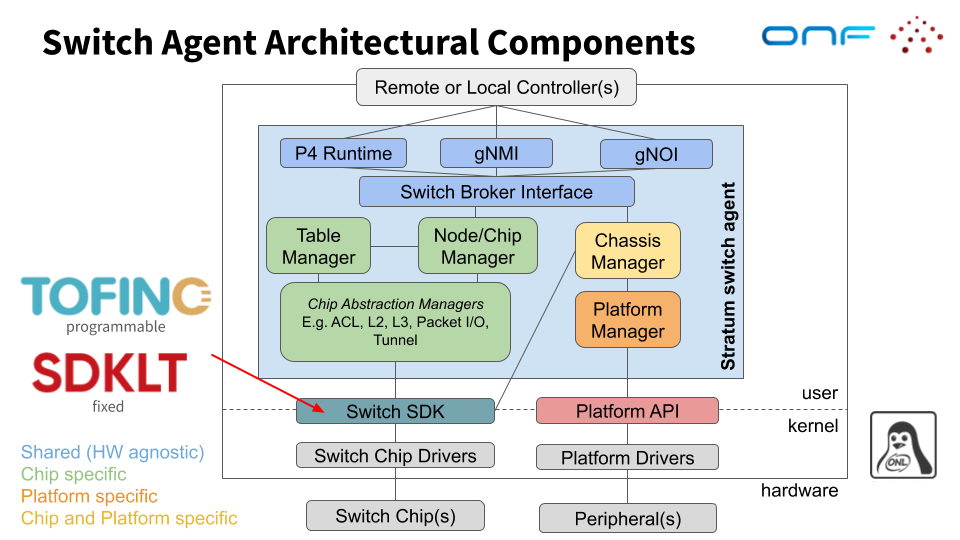{#fig:faucettop
width="100%"}

Während Stratum bei Nutzung eines Intel Tofinos viele Aufrufe lediglich
durchreicht, müssen die Aufrufe für die nicht auf P4 basierenden
Broadcom Chips übersetzt werden. bmv2 steht für Behavioural Modell
Version 2, welche Pakete auf Basis einer Definition die in JSON abliegt
weiterleitet. Diese JSON selbst wird mittels einem Compiler aus einem P4
Programm compiliert. [@stratum]

P4Runtime Controller
--------------------

Im folgenden werden Teile des P4-Programms sowie des in GO geschriebenen
Controllers erläutert.

Der Quellcode des in GO geschrieben Controllers sowie der eingesetzte
P4-Code findet sich in einem geforkten Repository im Github-Account der
Hochschule unter **nlab4hsrm/p4runtime-go-client**. Der Code steht unter
der Apache 2.0 Lizenz und kann damit frei verwendet und modifiziert
werden. Der Build-Prozess ist innerhalb des Repositorys dokumentiert und
über ein Makefile automatisiert. Nach klonen des Repositorys reicht ein
einfaches make Kommando im Wurzelverzeichnis um das Programm zu
kompilieren. Voraussetzung dafür ist die Installation von GO. Der P4
Code wird mittels einem temporär gestarteten Docker Container der den
Compiler p4c enthält kompiliert. Dies macht allerdings die Installation
von Docker zur Voraussetzung.

### l2\_switch.p4

In dieser Datei wird das Verhalten der Dataplane spezifiziert, welches
im weiteren auf einem Switch implementiert wird.

    #include <core.p4>
    #include <v1model.p4>

Grundlage sind die beiden Bibliotheken core und v1model. core.p4 bringt
wichtige Routinen sowie Typendefinitionen mit. v1model.p4 beschreibt die
verwendete Pipeline, welche alternativ auch selbst geschrieben und
entwickelt werden kann. v1model ist eine gegebene Implementation die für
gewöhnlich in Zusammenhang mit bmv2eingesetzt wird. Die Beschreibung der
Dataplane findet also auf Basis eines Framework statt, welches Werkzeuge
zum Parsen und implementieren von Logiken bereitstellt.

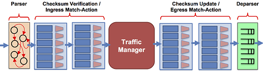{width="100%"}

Das Modell besteht aus mehreren Blöcken, welche in dem
selbstgeschriebenem P4-Programm mit Funktion gefüllt werden müssen.
Dafür werden controlund parser Elemente erzeugt, aus denen dann ein
V1Model-Objekt erzeugt wird. Auf technischer Ebene sieht das wie folgt
aus:

``` {caption="l2\\_switch.p4"}
V1Switch(p = ParserImpl(),
         ig = IngressImpl(),
         vr = verifyChecksum(),
         eg = EgressImpl(),
         ck = computeChecksum(),
         dep = DeparserImpl()) main;
```

Der eingehenden Parser p erhält das vollständige Paket und extrahiert
aus diesen Informationen die er in der Pipeline weiterreicht.

``` {caption="l2\\_switch.p4 Parser eingehend"}
parser ParserImpl(packet_in packet, out headers hdr, inout metadata meta, inout standard_metadata_t standard_metadata) {
    state parse_ethernet {
        packet.extract(hdr.ethernet);
        transition accept;
    }
    state start {
        transition parse_ethernet;
    }
}
```

Relevant sind an dieser Stelle die Objekte die der Parser entgegen nimmt
und welche er wieder zurück gibt. Er nimmt ein Objekt packet entgegen
und gibt die drei Objekte hdr, meta und standard\_metadata wieder
zurück. Auf diese Objekte können die weiteren Blöcke in der Pipeline nun
Zugreifen.

``` {caption="'l2\\_switch.p4 Ingress'"}
control IngressImpl(inout headers hdr, inout metadata meta, inout standard_metadata_t standard_metadata) {
    action drop() {
        mark_to_drop(standard_metadata);
    }
    action learn_mac() {
        digest<digest_t>(0, {hdr.ethernet.srcAddr, standard_metadata.ingress_port});
    }
    action fwd(PortId_t eg_port) {
        standard_metadata.egress_spec = eg_port;
    }
    action broadcast(McastGrp_t mgrp) {
        standard_metadata.mcast_grp = mgrp;
    }
    table smac {
        key = {
            hdr.ethernet.srcAddr: exact;
        }
        actions = {
            learn_mac;
            NoAction;
        }
        const default_action = learn_mac();
        size = 4096;
        support_timeout = true;
    }
    table dmac {
        key = {
            hdr.ethernet.dstAddr: exact;
        }
        actions = {
            fwd;
            broadcast;
            drop;
        }
        default_action = drop();
        size = 4096;
    }
    apply {
        igPortsCounts.count(standard_metadata.ingress_port);
        smac.apply();
        dmac.apply();
    }
}
```

Dies ist der wichtigste Block. Die Funktion nimmt die Objekte entgegen,
welche durch den vorhergehenden Parser erstellt wurden: hdr, meta und
standard\_metadata. Zu Beginn werden vier mögliche Aktionen definiert,
welche im weiteren aufgerufen werden können. Dazu gehören drop,
learn\_mac, fwd und broadcast. Darunter sind die drei Methoden die ein
Switch prinzipiell auf ein Paket anwenden kann, sprich Weiterleiten,
Verwerfen und Fluten. Die Funktion digest unter der Aktion learn\_mac
sorgt für die Weiterleitung der beiden Objekte hdr.ethernet.srcAddr
standard\_metadata.ingress\_port an den Controller, in unserem Fall an
die in GO geschriebene Anwendung. Die Aktion werden über entsprechende
Einträge in den Tabellen aufgerufen. Definiert sind die beiden Tabellen
smac und dmac, welche jeweils auf die entsprechende MAC-Adresse matchen.

Die smac Tabelle hat als Beispiel als default\_action die Aktion
learn\_mac definiert. Die Einträge der Tabelle sehen wie folgt aus:

``` {caption="'l2\\_switch.p4 - smac Tabellen Eintrag'"}
P4Runtime sh >>> for te in table_entry["IngressImpl.smac"].read():
            ...:     print(te)
            ...:
table_id: 36205427 ("IngressImpl.smac")
match {
  field_id: 1 ("hdr.ethernet.srcAddr")
  exact {
    value: "\\x86\\xee\\xaf\\x2a\\x62\\x8e"
  }
}
action {
  action {
    action_id: 21257015 ("NoAction")
  }
}
idle_timeout_ns: 10000000000
{...}
```

Sobald eine MAC-Adresse bekannt ist und in dieser Tabelle steht wird die
Aktion NoAction ausgeführt und das Paket damit nicht an den Controller
gesendet. Analog dazu wird bei der Tabelle dmac verfahren. Zusätzlich
wird hier allerdings noch ein Parameter übergeben, welche zum Beispiel
die Port-ID sein kann an zu der das Paket weitergeleitet werden soll.

``` {caption="'l2\\_switch.p4 - smac Tabellen Eintrag'"}
table_id: 45595255 ("IngressImpl.dmac")
match {
  field_id: 1 ("hdr.ethernet.dstAddr")
  exact {
    value: "\\x1e\\x98\\x5e\\x39\\x8f\\x3d"
  }
}
action {
  action {
    action_id: 19387472 ("IngressImpl.fwd")
    params {
      param_id: 1 ("eg_port")
      value: "\\x08"
    }
  }
}
```

Unter dem Schlüsselwort apply werden die in dem Block durchgeführten
Aktionen definiert, in gezeigten Beispiel wird a) ein Counter
inkrementiert, b) die smac-Tabelle mit entsprechender Aktion und
abschließend die dmac-Tabelle mit entsprechender Aktion durchlaufen

Analog zu den gezeigten Modulen durchläuft das Paket auch die weiteren
Module bis es schließlich vom Deparser dep entsprechend vorher gesetzter
Werte weitergeleitet oder eben verworfen wird.

``` {caption="'l2\\_switch.p4 - Deparser'"}
control DeparserImpl(packet_out packet, in headers hdr) {
    apply {
        packet.emit(hdr.ethernet);
    }
}
```

### main.go

Pakete mit unbekannter Quell-Macadressen werden wie im vorherigen
Kapitel gezeigt an den Controller gesendet. In dem GO Programm wird
dafür eine a) eine gRPC Verbindung aufgebaut b) eine P4Runtime Session
auf Basis der gRPC Verbindung instanziiert und c) mittels einer
go-Routine paralell auf eingehende Nachrichten reagiert.

``` {caption="'main.go - Aufbau einer P4Runtime Sesssion'"}
conn, err := grpc.Dial(addr, grpc.WithTransportCredentials(insecure.NewCredentials()))
{...}
c := p4_v1.NewP4RuntimeClient(conn)
{...}
p4RtC := client.NewClient(c, deviceID, electionID)
```

Der Aufbau der Verbindung wurde hier vereinfacht dargestellt.

``` {caption="'main.go - GOroutine zum behandeln von Nachrichten'"}
go func() {
        ctx := context.Background()
        handleStreamMessages(ctx, p4RtC, messageCh)
    }()
```

Mittels eine GO-Routine welche asynchron im Hintergrund läuft wird auf
eingehende Pakete reagiert.

``` {caption="'main.go - Aufruf der Funktion learnMacs'"}
func handleStreamMessages(ctx context.Context, p4RtC *client.Client, messageCh <-chan *p4_v1.StreamMessageResponse) {
    for message := range messageCh {
        switch m := message.Update.(type) {
{...}
        case *p4_v1.StreamMessageResponse_Digest:
            log.Debugf("Received DigestList")
            if err := learnMacs(ctx, p4RtC, m.Digest); err != nil {
                log.Errorf("Error when learning MACs: %v", err)
            }
{..}
        }
    }
}
```

Mittels einer Case Anweisung wird auf Digest-Nachrichten, also von der
Dataplane aufgrund unbekannter MAC-Adresse an den Controller gesendeten
Paketen, die Funkion learnMacs ausgeführt.

``` {caption="'main.go - Die Funktion learnMacs'"}
func learnMacs(ctx context.Context, p4RtC *client.Client, digestList *p4_v1.DigestList) error {
{...}
        dmacEntry := p4RtC.NewTableEntry(
            "IngressImpl.dmac",
            map[string]client.MatchInterface{
                "hdr.ethernet.dstAddr": &client.ExactMatch{
                    Value: srcAddr,
                },
            },
            p4RtC.NewTableActionDirect("IngressImpl.fwd", [][]byte{ingressPort}),
            nil,
        )
        if err := p4RtC.InsertTableEntry(ctx, dmacEntry); err != nil {
            log.Errorf("Cannot insert entry in 'dmac': %v", err)
{...}
    return nil
```

Diese Funktion sorgt letztendlich dafür, dass die neue MAC-Adresse in
die entsprechende Tabelle auf dem Switch eingetragen wird mir der
zugeordneten Aktion NoAction.

Simulation
----------

### Stratum-bmv2 Container

Der Switch wird über einen Docker-Container implementiert. Der Software
Switch Stratum-bmv2 wird mittels einem Debian-Pakets installiert,
welches selbst aus entsprechendem Quellcode erstellt werden muss. Die
Vorgehensweise für die Erstellung des Debian-Pakets ist in dem
Repository des Entwicklers dokumentiert.[@stratum-git]

Im GNS3-Server-Manager Repository der Hochschule findet sich unter dem
Ordner lab-templates ein Verzeichnis stratum-bmv2-container. In diesem
liegen alle Dateien, auf die im weiteren referenziert wird.

``` {caption="Stratum-bmv2 Dockerfile"}
FROM debian:buster
ENV DEBIAN_FRONTEND noninteractive

ADD stratum_bmv2_deb.deb stratum_bmv2_deb.deb 
# install tools
RUN apt-get update \
        && apt-get upgrade -y \
        && apt-get install -y /stratum_bmv2_deb.deb

ADD chassis_config.pb.txt /etc/stratum/chassis_config.pb.txt
RUN mkdir /var/log/stratum
RUN chmod 777 /var/log/stratum

CMD ["/bin/bash"]
```

Der Auszug zeigt das Dockerfile zum Erstellen des Containers, welches
mittels folgendem Befehl erfolgt:

    $ docker build . -t nlab4hsrm/stratum-bmv2:<tag>

Es wird als Basis-Image debian:buster eingesetzt, ein Test mit dem
aktuelleren Debian Bookworm schlug fehl. Im weiteren wird das im
vorherigen Schritt erstellte Debian-Paket hineinkopiert und mittels dem
Paketmanager apt installiert. Die Anwendung benötigt im weiteren eine
Konfigurationsdatei in welchen die verwendeten Linux-Interfaces
definiert werden und entsprechende IDs vergeben werden. Diese Datei
trägt den Namen chassis\_config.pb.txt und wird in dem Dockerfile dem
Container hinzugefügt.

Der Container kann im Anschluss in GNS3 angelegt werden. In dem
entsprechendem GNS3-Server-Manager Template ist dies bereits
vorbereitet. Es liegt im Repository ein vorgefertigte GNS3-Appliance
Datei (\*.gns3a) ab, die einfach importiert werden kann.

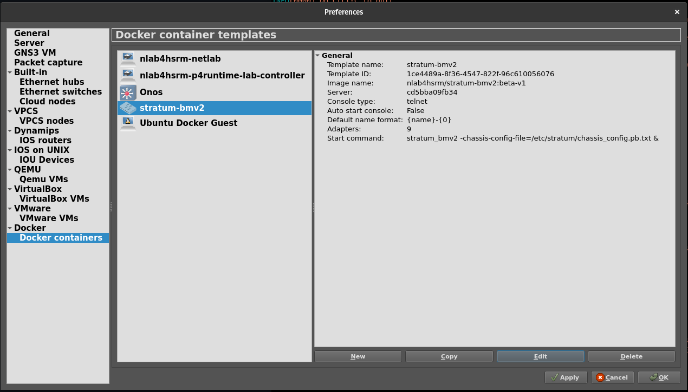{#fig:evpncli
width="100%"}

Es werden 9 Interfaces konfiguriert, wobei das erste - eth0- als
Management-Interface genutzt wird. Als Start command des Containers wird
Stratum aufgerufen und als Parameter den Pfad zur Chassis-Konfiguration
übergeben.

    root@stratum-bmv2-2:/# stratum_bmv2 -chassis-config-file=/etc/stratum/chassis_config.pb.txt
    16:09:25.746376    82 logging.cc:72] Stratum version: not stamped.
    16:09:25.746848    82 main.cc:124] Starting bmv2 simple_switch and waiting for P4 pipeline
    {...}
    16:09:25.750290    82 hal.cc:127] Setting up HAL in COLDBOOT mode...
    16:09:25.750356    82 config_monitoring_service.cc:94] Pushing the saved chassis config read from /etc/stratum/chassis_config.pb.txt...
    16:09:25.754789    82 bmv2_chassis_manager.cc:519] Registered port status callbacks successfully for node 1.
    16:09:25.754822    82 bmv2_chassis_manager.cc:61] Adding port 1 to node 1
    16:09:25.802373    82 bmv2_chassis_manager.cc:61] Adding port 2 to node 1
    16:09:25.838375    82 bmv2_chassis_manager.cc:61] Adding port 3 to node 1
    16:09:25.870373    82 bmv2_chassis_manager.cc:61] Adding port 4 to node 1
    16:09:25.902369    82 bmv2_chassis_manager.cc:61] Adding port 5 to node 1
    16:09:25.938369    82 bmv2_chassis_manager.cc:61] Adding port 6 to node 1
    16:09:25.970402    82 bmv2_chassis_manager.cc:61] Adding port 7 to node 1
    16:09:25.998498    82 bmv2_chassis_manager.cc:61] Adding port 8 to node 1
    {...}
    16:09:26.049036    82 hal.cc:220] Stratum external facing services are listening to 0.0.0.0:9339, 0.0.0.0:9559, localhost:9559...

Durch Doppelklick in der GNS3-GUI auf den Stratum-Switch lässt sich der
ausgegebene Log betrachten. Die sollte die im Listing gezeigten Zeilen
enthalten. Wichtig ist, das die 8 Ports hinzugefügt worden sind und
Stratum auf den Ports 9339 und 9559 Verbindungen akzeptiert.

### p4runtime-controller Container

``` {caption="P4-Runtime Dockerfile"}
FROM ubuntu:22.04
ENV DEBIAN_FRONTEND noninteractive

# install tools
RUN apt-get update \
        && apt-get upgrade -y \
        && apt-get install -y iputils-ping iproute2 nano ssh python3 python3-pip

RUN pip3 install p4runtime-shell

ADD P4_LAB /P4_LAB

CMD ["/bin/bash"]
```

Dieser Container wird als P4Runtime-Controller in dem Versuch
eingesetzt. Auch für diesen existiert ein entsprechender Ordner unter
lab-templates mit einem Dockerfile, den benötigten Programmen sowie
einer GNS3-Appliance Definition. Als Basis Image wird Ubuntu genutzt, es
werden ein paar grundlegende Pakete sowie Python und dessen Paketmanager
Pip installiert. Mittels Pip wird im Anschluss das Python-Modul
p4runtime-shell installiert, welches eine interaktive Kommandozeile
bietet die sich mit dem Befehl

    $ python3 -m p4runtime-sh --grpc-addr <Switch Management IP>:<gRPC Port>

aufrufen lässt.

Abschließend wird ein Ordner in den Container kopiert, welcher den in GO
geschriebenen P4Runtimer-Controller enthält. Dies liegt in Form einer
ausführbaren Binärdatei vor, welche auch den kompilierten P4-Code
beinhaltet. Dieser wird durch den Controller auf den Switch aufgespielt.

### Start des Netzwerkes

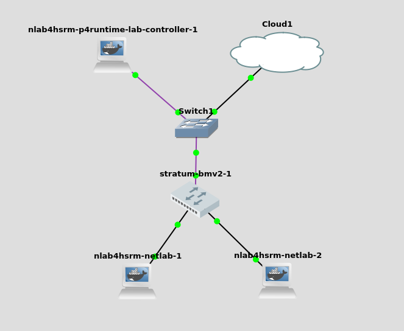{#fig:evpncli
width="100%"}

Zur Demonstration wird eine Topologie erstellt mit einem Stratum-Switch
sowie einem P4Runtime-Controller. Zu Beginn werden dem Controller sowie
dem Switch IP-Adressen zugewiesen. Dies kann über den Punkt Edit config
im GNS3-Kontextmenü unter Auswahl der jeweiligen Geräte durchgeführt
werden. Da keine externen Verbindungen benötigt werden ist die Nutzung
des Cloud-Knotens und die damit notwendige Nutzung des 172.30.0.0/24er
Netzwerkes optional. Nun sollte die Verbindung zwischen Controller und
Switch mittels Ping überprüft werden. Ist dies erfolgreich, kann
fortgefahren werden.

    ./P4_LAB/l2_switch -addr=172.30.240.110:9559 -device-id=1 -ports=1,2,3,4,5,6,7,8 &

Im Anschluss wird eine Konsole hin zum Controller gestartet und der
Controller mit dem gezeigten Befehl gestartet. Die gezeigte IP-Adresse
muss entsprechend angepasst werden. Durch das nachgestellte & wird der
Prozess im Hintergrund ausgeführt und die Linux-Konsole ist weiter
nutzbar.

Nun sollte ein Ping zwischen den beiden NETLAB Knoten möglich sein,
sofern diese eine korrekte IP-Adresse konfiguriert haben.

    python3 -m p4runtime_sh --grpc-addr 172.30.240.110:9559

Im Anschluss kann auf dem Controller eine p4runtime-shell gestartet
werden um die Tabellen auf dem Stratum-Switch auszulesen. Auch hier muss
die IP-Adresse entsprechend angepasst werden.

Über folgenden Befehl lassen sich alle verfügbaren Tabellen auflisten:

``` {caption="'P4Runtime-Shell: Tabellen auflisten'"}
P4Runtime sh >>> tables
IngressImpl.dmac
IngressImpl.smac
```

Die Informationen über eine Tabelle lassen sich wie folgt ausgeben:

``` {caption="P4Runtime-Shell: Tabellen Informationen anzeigen"}
P4Runtime sh >>> tables["IngressImpl.dmac"]
Out[20]:
preamble {
  id: 45595255
  name: "IngressImpl.dmac"
  alias: "dmac"
}
match_fields {
  id: 1
  name: "hdr.ethernet.dstAddr"
  bitwidth: 48
  match_type: EXACT
}
action_refs {
  id: 19387472 ("IngressImpl.fwd")
}
action_refs {
  id: 22047199 ("IngressImpl.broadcast")
}
action_refs {
  id: 17676690 ("IngressImpl.drop")
}
size: 4096
```

Um die einzelnen Einträge einer Tabelle anzuzeigen muss in der
Python-Shell eine Schleife gebaut werden:

``` {caption="P4Runtime-Shell: Tabelleneinträge anzeigen"}
P4Runtime sh >>> for te in table_entry["IngressImpl.smac"].read():
            ...:     print(te)
            ...:
```

Fazit
-----

P4Runtime ist neben OpenFlow ein vollständig anderer Ansatz ein Netzwerk
per Software zu definieren. Der Controller implementiert nicht nur
Regeln die ein Switch auf Basis seiner durch die Hardware gegebenen
Pipelines abstrahieren muss, sondern definiert diese Pipelines in Form
von P4 Code direkt mit. In einer idealen Vorstellung könnte damit
generische Hardware beschafft werden und das Netzwerk als gesamtes durch
einen zentralen Controller mittels P4-Code und beliebigen
Controller-Implementierungen definiert werden. Die derzeitige
Betrachtung am Markt zeigt, dass die wenigen P4 Switche derzeit
überwiegend nur durch die Hersteller selbst genutzt werden um Agil
Dataplane-Funktionen implementieren zu können. Die Möglichkeit wird
nicht an den Kunden weitergegeben. Einzig der SD-Fabric Ansatz der
[onf]{acronym-label="onf" acronym-form="singular+short"} zeigt was
potentiell möglich ist. Der Versuch zeigt eine sehr einfache per P4
definierte Dataplane mit einer über P4Runtime angeschlossene und
ebenfalls einfach gehaltenen Controlplane. Es wird deutlich das der
Stratum-Switch für das Netzwerkkonzept lediglich eine austauschbare
Komponente ist. Implementierung beliebiger Funktionen im Access-Bereich
bis hin zu komplexen Traffic-Engineering in einem vermaschten Netzwerk
ist mittels Programmcode auf dem zentralen Controller möglich. Dieser
Ansatz ist damit zwar der konsequenteste Ansatz, hab aber den geringsten
Reifegrad und derzeit praktisch keine Verbreitung. Vielversprechend ist
die Implementierung von P4Runtime auch auf nicht P4 nativer Hardware
mittels PINS, wie zum Beispiel in SONiC. Zwar gehen hier Freiheitsgrade
in der Programmierung der Dataplane verloren, der Verbreitung der Idee
sowie der Protokolle tut es genüge.

BGP-EVPN: Verteilter und Broadcast-optimierter Ansatz mit SONiC
===============================================================

Architektur und Technologien
----------------------------

Bei diesem Ansatz wird ein virtuelles Overlay-Netzwerk mit VXLAN
zwischen den Switchen gespannt. Mittels BGP-EVPN werden MAC-Adressen
zwischen Tunnel-Endpunkten durch BGP propagiert. Während die lokale
Weiterleitung zwischen den Schnittstellen eines Switches weiterhin wie
bei einer klassischen Bridge funktioniert, werden zur Weiterleitung von
Paketen zwischen zwei Switchen VXLAN Tunnel eingesetzt. Diese Tunnel
terminieren auf den jeweiligen Switchen mit User-Frontports. Auf
Broadcasts kann zu großen Teilen verzichtet werden, da
Erreichbarkeitsinformationen zwischen den VTEPs synchronisiert werden
und damit [arp]{acronym-label="arp" acronym-form="singular+short"} und
Unknown Unicast Pakete nicht zwischen den VTEPs geflutet werden muss.
Zusätzlich baut BGP-EVPN automatisch benötigte Tunnel auf, was durch die
Notwendigkeit eines Full-Meshes Komplexität der Konfiguration reduziert.
Full-Meshed bedeutet das ein Tunnel zwischen jedem der
Kommunikationspartner errichtet ist.

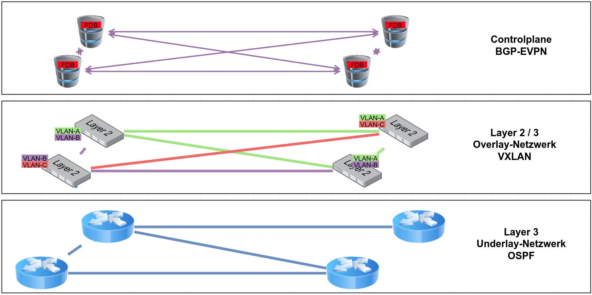{width="100%"}

Für diesen Ansatz werden mehrere Schichten konfiguriert.

### Underlay Netzwerk

Die Aufgabe dieser Schicht ist die Kommunikation zwischen den
Loopback-Interfaces der Switche herzustellen. Diese Loopback-Interfaces
werden weiterhin als Tunnel-Endpunkte verwendet und müssen Daten
untereinander austauschen. Diese Schicht ist damit auch verantwortlich
für die Redundanz, die Konvergenz sowie potentielles Load-Sharing für
die Verbindungen zwischen den Switchen. Aus diesem Grund ist die
Verwendung eines Routingprotokolls wie OSPF sinnvoll.

### Overlay Netzwerk

Als Overlay-Technologie wird VXLAN eingesetzt. Auf den Switchen mit
[uni]{acronym-label="uni" acronym-form="singular+short"}s werden dafür
VXLAN-[vtep]{acronym-label="vtep" acronym-form="singular+short"}s
konfiguriert, sowie Mappings zwischen angelegten lokalen VLANs und
global eindeutigen VXLAN Network Identifiern (VNI) erstellt. Der weitere
Schritt, die Konfiguration von Tunnel-Gegenstellen wird durch BGP-EVPN
erledigt.

### Overlay Controlplane

Zuletzt wird BGP-EVPN konfiguriert. Hierfür wird eine BGP Instanz
erstellt, in der alle teilnehmenden weiteren Switche als Nachbarn
eingetragen werden müssen. Da durch Nutzung von OSPF eine direkte
Erreichbarkeit alle Nachbarn gegeben ist, kann internal BGP verwendet
werden, was bedeutet das jede teilnehmende BGP-Instanz die identische
AS-Nummer erhält. Abschließend folgt die Konfiguration der EVPN
Adressfamilie auf der BGP-Instanz, die dafür sorgt das entsprechende
Erreichbarkeitsinformationen ausgetauscht werden.

Virtueller Switch: SONiC
------------------------

Als [sos]{acronym-label="sos" acronym-form="singular+short"} für die
Simulation wird eine virtuelle Variante von SONiC eingesetzt, welche per
QEMU virtualisiert wird.

SONiC ist mittels der Container-Technologie Docker modular aufgebaut.
Die einzelnen Komponenten in Form von Containern lassen sich wie folgt
ausgeben:

    $ docker ps

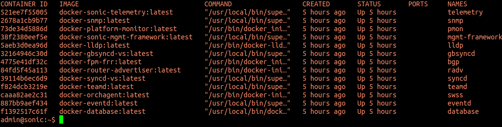{#fig:sondock
width="100%"}

Durch diese Architektur kann das System durch weitere Module in Form von
Containern erweitert werden. Wie in der Abbildung
[3.7](#fig:sonarch){reference-type="ref" reference="fig:sonarch"}
gezeigt, bildet Mittelpunkt der Architektur eine Redis-Datenbank. Diese
wird unter anderem als zentrale Stelle für Konfigurationen genutzt. Es
gibt mehrere Methoden diese Konfiguration zu modifizieren.

-   Direkte Manipulation mittels REDIS-CLI oder ähnlichen Tools

-   Laden von Konfigurationsartefakten aus YAML-Dateien mittels config
    load \*.yaml

-   Click-CLI - Eine Python-basierte CLI welche eine gewohnte
    CLI-Semantik direkt in der Linux-Shell verfügbar macht

-   SONIC-CLI - Ein Management-Framework welches an die Semantik eines
    DELL-OS 10 angelehnt ist

-   Standardisierte Konfigurationsschnittstellen wie gNMI oder Restconf

Die REDIS-Datenbank lädt ihren Inhalt bei Initialisierung nach
Systemstart aus der Datei etc/sonic/config\_db.json. Durch die Befehle
config save beziehungsweiße config load lässt sich der Inhalt der
Datenbank in die Datei schreiben beziehungsweise laden.

Ein Sonderfall stellt die Konfiguration des eingesetzten
Routingframeworks FRR dar. SONiC hat dafür drei konfigurierbare Modi
implementiert.

-   **sonic-bgpcdfd** - Dieser Modus ist aktueller Standard, welcher
    ohne einen entsprechenden Eintrag konfiguriert ist. Die
    Konfiguration von FRR wird durch SONiC aus der REDIS-Datenbank
    generiert. Die Datenbank bleibt damit zentrales
    Konfigurationselement. Die Click-CLI hat lediglich wenige Show
    Befehle, kann BGP aber nicht konfigurieren. Die Konfiguration über
    das in der REDIS-Datenbank implementierte YANG-Modell ist wenig
    dokumentiert und muss hauptsächlich durch lesen des Codes
    nachvollzogen werden.

-   **sonic-frrcfgd** - Dieser Konfigurationsdienst funktioniert gleich
    dem älteren bgpcfgd und kann als dessen Nachfolger betrachtet
    werden. Der Dienst setzt teilweise andere Konfigurationssemantiken
    in der REDIS-DB ein. Verbessert soll vor allem die dynamische
    Konfigurationsänderung zur Laufzeit sein.

-   **Split-Mode** - In diesem Modus wird frr nicht von SONiC
    konfiguriert. FRR kann nun über die vtysh Shell konfiguriert werden.
    Diese Konfiguration wird in eigenen Strukturen gespeichert und
    bleibt Persistent. Der Hersteller Edge-Core nutzt in seiner
    Enterprise-Distribution diesen Modus und dokumentiert diesen in den
    eigenen Dokumenten.

Die REDIS-DB wird außerdem als Schnittstelle zwischen den einzelnen
Prozessen genutzt und bildet zentrales Element des
Switch-Abstraction-Interfaces. Diese ist in Form einer Datenbank-Tabelle
realisiert, in welche durch die Controlplane innerhalb der SAI
definierte Schlüssel eingetragen werden. Diese Tabelle wird durch ein
Plattform-spezifischen Prozess ausgelesen und die darunter liegende
Hardware entsprechend programmiert. Im Beispiel des virtuellen SONiCS
heißt der Container des containerisierten Prozesses syncd-vs, bei einer
Broadcom Plattform heißt dieser syncd-brcm.

Im folgenden wird der Inhalt und die Struktur der ASIC DB erläutert.
Dafür werden mittels der REDIS-CLI, ein Kommandozeilentool für
REDIS-Datenbanken, verschiedene Schlüssel aus der Datenbank ausgelesen.
Als Datentyp werden allgemein Hashes eingesetzt, welche pro Schlüssel
mehrere untergeordnete Schlüssel-Werte Paare erlauben. Diese lassen sich
mittels dem Befehl hgetall anzeigen.

``` {caption="ASIC-DB - Physical Port"}
127.0.0.1:6379[1]> hgetall "ASIC_STATE:SAI_OBJECT_TYPE_PORT:oid:0x1000000000002"
 1) "NULL"
 2) "NULL"
 3) "SAI_PORT_ATTR_ADMIN_STATE"
 4) "true"
 5) "SAI_PORT_ATTR_SPEED"
 6) "40000"
 7) "SAI_PORT_ATTR_MTU"
 8) "9122"
 9) "SAI_PORT_ATTR_PORT_VLAN_ID"
10) "20"
```

Jeder physikalische Port hat eine eigene ID. Folgende Informationen
werden hier abgelegt:

-   **Admin State** - Administrativer Status des Interfaces

-   **Speed** - Interface-Geschwindigkeit in Mbit/s

-   **MTU** - Maximale größe eines Ethernet Frames - dieser Wer
    entspricht einem Jumbo-Frame

-   **VLAN-ID** - Dem Interface zugeordnetem PVID

``` {caption="ASIC-DB - Bridge Port"}
127.0.0.1:6379[1]> hgetall "ASIC_STATE:SAI_OBJECT_TYPE_BRIDGE_PORT:oid:0x3a000000000b6b"
1) "SAI_BRIDGE_PORT_ATTR_TYPE"
2) "SAI_BRIDGE_PORT_TYPE_PORT"
3) "SAI_BRIDGE_PORT_ATTR_PORT_ID"
4) "oid:0x1000000000002"
5) "SAI_BRIDGE_PORT_ATTR_ADMIN_STATE"
6) "true"
7) "SAI_BRIDGE_PORT_ATTR_FDB_LEARNING_MODE"
8) "SAI_BRIDGE_PORT_FDB_LEARNING_MODE_HW"
```

Interfaces die eine Bridge zugeordnet werden und damit Ethernet-Frames
weiterleiten bekommen weiterhin eine Bridge-Port-ID zugeordnet.

``` {caption="ASIC-DB FDB Eintrag"}
127.0.0.1:6379[1]> hgetall "ASIC_STATE:SAI_OBJECT_TYPE_FDB_ENTRY:{\"bvid\":\"oid:0x26000000000b6a\",\"mac\":\"F2:DB:FB:66:CC:B2\",\"switch_id\":\"oid:0x21000000000000\"}"
1) "SAI_FDB_ENTRY_ATTR_TYPE"
2) "SAI_FDB_ENTRY_TYPE_DYNAMIC"
3) "SAI_FDB_ENTRY_ATTR_BRIDGE_PORT_ID"
4) "oid:0x3a000000000b6b"
```

Die vorig genannte Bridge-Port-ID wird unter anderem für
[fdb]{acronym-label="fdb" acronym-form="singular+short"}-Einträge
verwendet, in dem damit das Interface spezifiziert wird auf dem eine
MAC-Adresse gelernt wurde. Durch die bvid wird der Eintrag einem VLAN
zugeordnet.

``` {caption="ASIC-DB VLAN"}
127.0.0.1:6379[1]> hgetall "ASIC_STATE:SAI_OBJECT_TYPE_VLAN:oid:0x26000000000b6a"
1) "SAI_VLAN_ATTR_VLAN_ID"
2) "20"
```

Jedes VLAN erhällt einen eigenen Eintrag, in dem einer bvid eine VLAN-ID
zugeordnet wird.

``` {caption="ASIC-DB VLAN-Member"}
127.0.0.1:6379[1]> hgetall "ASIC_STATE:SAI_OBJECT_TYPE_VLAN_MEMBER:oid:0x27000000000b6c"
1) "SAI_VLAN_MEMBER_ATTR_VLAN_ID"
2) "oid:0x26000000000b6a"
3) "SAI_VLAN_MEMBER_ATTR_BRIDGE_PORT_ID"
4) "oid:0x3a000000000b6b"
5) "SAI_VLAN_MEMBER_ATTR_VLAN_TAGGING_MODE"
6) "SAI_VLAN_TAGGING_MODE_UNTAGGED"
```

Jede Mitgliedschaft eines Interface zu einem VLAN wird durch einen
eigenen Schlüssel repräsentiert., in welchem VLAN-ID, PORT-ID sowie der
Tagging-Mode spezifiziert wird.

``` {caption="ASIC-DB Trap"}
127.0.0.1:6379[1]> hgetall "ASIC_STATE:SAI_OBJECT_TYPE_HOSTIF_TRAP:oid:0x22000000000b75"
1) "SAI_HOSTIF_TRAP_ATTR_TRAP_TYPE"
2) "SAI_HOSTIF_TRAP_TYPE_BGP"
3) "SAI_HOSTIF_TRAP_ATTR_TRAP_GROUP"
4) "oid:0x11000000000b73"
5) "SAI_HOSTIF_TRAP_ATTR_PACKET_ACTION"
6) "SAI_PACKET_ACTION_TRAP"
7) "SAI_HOSTIF_TRAP_ATTR_TRAP_PRIORITY"
8) "4"
```

Durch Traps werden der [dp]{acronym-label="dp"
acronym-form="singular+short"} mitgeteilt, welche Pakete an die
[cp]{acronym-label="cp" acronym-form="singular+short"} beziehungsweise
der CPU weitergeleitet werden sollen. In diesem Fall werden Pakete die
Teil des Routingprotokoll [bgp]{acronym-label="bgp"
acronym-form="singular+short"} sind an die CPU und damit an den
Routingprozess weitergeleitet.

SONiC implementiert vergleichsweise viele Layer-2 Funktionen in ihrer
virtuellen Variante von SONiC mittels einem speziellen Version von
syncd.

Simulation
----------

Zur Simulation wurde ein GNS3-Server-Manager Template mit dem Namen
BGP-EVPN-Lab vorbereitet. In diesem sind die als Appliances SONiC, ein
Versuchs-PC Netlab sowie ein Management-PC vorbereitet. Der Versuchs-PC
wird an das BGP-EVPN Netzwerk angeschlossen um die Konnektiviät durch
das Netzwerk zu testen. Der Management-PC wird zur zentralen
Konfiguration der SONiC-Komponenten genutzt. Zu diesem Zweck wurde ein
kleines interaktives und CLI-basiertes Python-Programm beschrieben
welches a) Konfiguration von den SONiC-Switchen laden sowie aufspielen
kann, b) die notwendige Grundkonfiguration sowie
[uni]{acronym-label="uni" acronym-form="singular+short"}-Konfigurationen
generieren und c) diverse Show-Befehle auf allen Switchen ausführen
kann.

### SONiC {#sonic}

Verwendete Scripte und Dateien liegen im Hochschulrepository:\
<https://github.com/nlab4hsrm/gns3-Server-Manager/tree/main/custom-appliances/sonic/>

Fertige Builds für verschiedene Softwarestände werden auf der Webseite
<https://sonic.software/> zum Download angeboten.

Nach Download eines aktuellen SONIC-VS Images kann mittels dem Script
sonic-gns3a.sh eine entsprechende GNS3-Appliance Datei für den Upload in
GNS3 erstellt werden. Das Script basiert auf einer Vorlage aus dem
originalen SONiC-Repository. Angepasst wurden der zugewiesene
Arbeitsspeicher sowie die Anzahl der virtuellen CPUs. Die im original
spezifizierten 2 Gigabyte haben sich in Versuchen als zu wenig erwiesen
und haben für Prozessabstürze gesorgt.

Das Script wird wie folgt aufgerufen:

    $ ./sonic-gns3a.sh -f <image-filename>

### NLAB Management Controller

Verwendete Scripte und Dateien liegen im Hochschulrepository:\
<https://github.com/nlab4hsrm/gns3-Server-Manager/tree/main/custom-appliances/bgp-evpn-management/>

Durch ein abgelegtes Dockerfile kann der Management-Container mittels
dem Docker Builder erstellt werden. Der Aufruf dafür sieht wie folgt
aus:

    $ docker build . -t nlab4hsrm/netlab-mgmt:<tag>

Es wird ein Ubuntu Basis Image genutzt, Python mit verschiedenen
Bibliotheken installiert sowie die im Repository abgelegten Scripte und
Konfigurationsdateien in den Container kopiert. Nach dem Image in das
Docker-Repository der Hochschule gepusht wurde, kann es in GNS3 als
Appliance konfiguriert und genutzt werden.

Die Scripte und Konfigurationen für diesen Versuch liegen unter

    /BGP_EVPN_LAB

Die Dateihierarchie sieht wie folgt aus:

    |-- evpn
    |   |-- generate_l3.py
    |   |-- generate.py
    |   |-- sonictoolset.py
    |-- hosts
    |-- run-cli.py
    |-- topology.csv

In der **hosts** Datei werden die Management-IP-Adressen der SONiC
Switche eingetragen. In der **topology.csv** ist die Verbindung der
Switche untereinander definiert, wobei eine Zeile der Tabelle für einen
Link steht und die Switche über ihr letztes IP-Tupel der Management-IP
spezifiziert werden. Gestartet werden kann das Tool mit dem Befehl

    $ ./run-cli.py

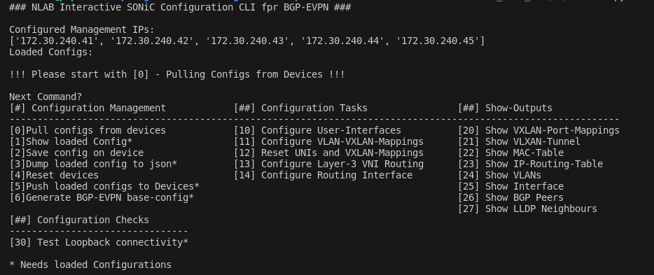{#fig:evpncli width="100%"}

Das Tool überträgt führt per SSH Befehle auf den SONiC-Switchen aus und
überträgt per SCP Konfigurationsdateien im JSON Format. Die
Konfigurationen speichert das Tool in lokalen temporären
Python-Dictionarys nachdem diese von den Switchen mittels dem ersten
Befehl geladen wurden. Auf Grundlage dieser initialen
Konfigurationsdatei sowie der Topologie-Beschreibung im CSV Format kann
das Tool jeweils Konfigurationen für BGP-EVPN erstellen und diese
anschließend wieder auf die SONiC-Switche aufspielen. Weiterhin sind
einige Konfigurationstasks wie das Anlagen von VLANs und VXLAN-Mappings
und verschiedene Show-Ausgaben implementiert.

### Topologie

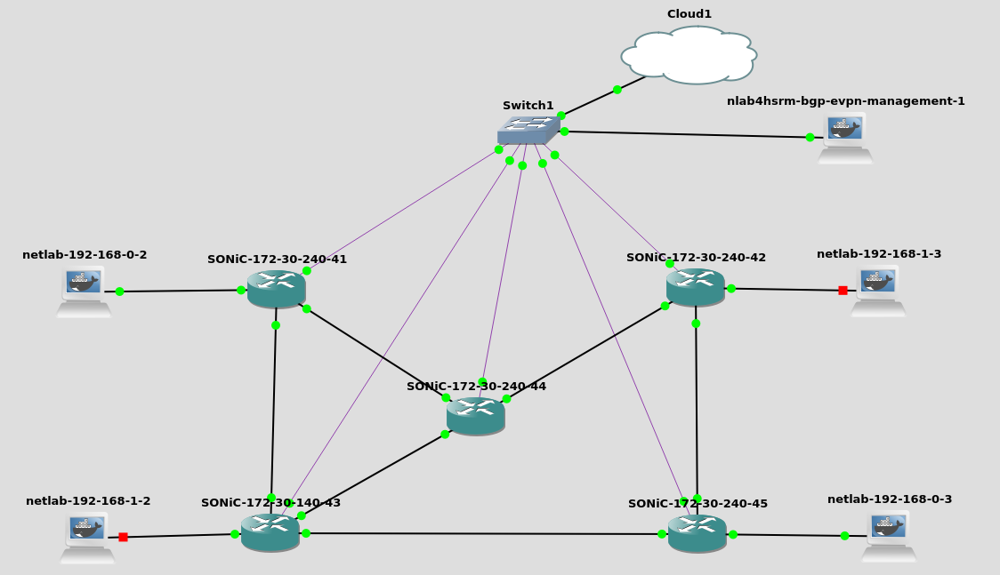{#fig:evpncli width="100%"}

Auch hier wird die in dem Kapitel
[1.1](#fig:reftop){reference-type="ref" reference="fig:reftop"} gezeigte
Topologie angelegt.

### Konfiguration SONiC

#### Grundlegende Einrichtung

Nachdem die SONiC-Switche gestartet sind, kann man per GNS3 ein
Telnet-Terminal zu den einzelnen Switchen starten und sich mit
[admin/YourPaSsWoRd]{.smallcaps} in dem Betriebsystem anmelden. Im
ersten Schritt wird die Management-IP-Adresse konfiguriert, was mit
Linux-Boardmitteln möglich ist:

    $ sudo ip addr add 172.30.240.41/16 dev eth0

Es wird eine IP-Adresse innerhalb des Subnetzes der GNS3-Umgebung der
Hochschule verwendet. Damit lässt sich später der Switch auch von
außerhalb erreichbar machen.

Die weiteren notwendigen Konfigurationen können mittels dem CLI-Tool aus
dem Management Container durchgeführt werden. Dafür müssen die soeben
gesetzten Management IP-Adressen in der **hosts**-Datei eingetragen
werden, was im hier gezeigten Beispiel wie folgt aussieht:

``` {caption="Hosts-Konfiguration im EVPN-CLI Tool"}
172.30.240.41
172.30.240.42
172.30.240.43
172.30.240.44
172.30.240.45
```

Zusätzlich muss die aufgebaute Topologie in der **topology.csv**
hinterlegt werden.

``` {caption="Topologie-Konfiguration im EVPN-CLI Tool"}
,peer1,peer2
0,41,44
1,41,43
2,43,44
3,43,45
4,42,44
5,42,45
```

Jede virtuelle Kabelverbindung ist durch eine Zeile repräsentiert und
wird durch jeweils zwei Geräte definiert, welche selbst durch ihr
letztes Tupel der Management-Adresse identifiziert werden. Die
Reihenfolge der Einträge ist dahingehende Entscheidend, das für das
erste vorkommen eines Switches das erste Interface genutzt wird, für das
zweite Vorkommen das zweite Interface, weiter Vorkommen der Logik
entsprechend.

Befor der Management-Container genutzt werden kann, muss auch diesem
eine IP-Adressen zugewiesen werden. Da es sich um einen Docker-Container
handelt, funktioniert dies am leichtesten über den Menüpunkt Edit
configim GNS3-Kontextmenü. Im Anschluss kann dieser gestartet werden und
mittels Ping die Erreichbarkeit der Management-Interfaces der
SONiC-Switche überprüft werden. Dies ist Voraussetzung für die weiteren
Schritte.

Klappt der Ping, funktionieren die weiteren Schritte wie folgt:

-   Option **\[0\]** - Herunterladen der aktuellen Konfigurationen von
    den Switchen. Hier sind Informationen enthalten, die für die
    Generierung neuer Konfigurationen notwendig sind. Sobald dies
    abgeschlossen ist, sollte unter Loaded configs fünfmal der Begriff
    sonic auftauchen.

-   Option **\[6\]** - Dadurch werden die geladenen Konfigurationen
    durch neu generierte Konfigurationen gesetzt. Darin enthalten sind
    Konfigurationen für die Transfer-Links, das OSPF-Routing, die VXLAN
    Virtualisierung sowie BGP-EVPN.

-   Option **\[5\]** - Hierdurch werden die soeben generierten
    Konfigurationen auf die Switche übertragen sowie entsprechende
    Dienste auf den Switchen neu gestartet.

#### Erläuterung Konfiguration

Die erstellte und hochgeladene Konfiguration lässt sich unter Option 1
im EVPN-CLI Tool oder direkt auf dem Switch betrachten. Die
Konfigurationen liegen auf dem Switch im JSON Format ab. Ein hilfreiches
Werkzeug um diese zu betrachten und zu modifizieren ist das Linux-Tool
jq, welches im weiteren verwendet wird.

Um die Konfiguration zu betrachten wird eine SSH-Session auf dem 41-er
SONiC Switch gestartet. Mit folgenden Befehl werden die einzelnen
Konfigurationselemente aus der JSON Datei ausgegeben:

    admin@SONiC-42:~$ cat /etc/sonic/config_db.json | jq 'keys'
    [
      "AUTO_TECHSUPPORT",
      "AUTO_TECHSUPPORT_FEATURE",
      "BGP_DEVICE_GLOBAL",
      "BGP_GLOBALS",
      "BGP_GLOBALS_AF",
      "BGP_NEIGHBOR",
      "CRM",
      "DEVICE_METADATA",
      "FEATURE",
      "FLEX_COUNTER_TABLE",
      "INTERFACE",
      "KDUMP",
      "LOGGER",
      "LOOPBACK",
      "LOOPBACK_INTERFACE",
      "MGMT_INTERFACE",
      "NTP",
      "OSPFV2_ROUTER",
      "OSPFV2_ROUTER_AREA",
      "OSPFV2_ROUTER_AREA_NETWORK",
      "PASSW_HARDENING",
      "PORT",
      "SNMP",
      "SNMP_COMMUNITY",
      "SYSLOG_CONFIG",
      "SYSLOG_CONFIG_FEATURE",
      "SYSTEM_DEFAULTS",
      "VERSIONS",
      "VXLAN_EVPN_NVO",
      "VXLAN_TUNNEL"
    ]

Relevante Konfigurationselement sind alle mit BGP,INTERFACE, OSPFV2
sowie VXLAN. Diese werden der Reihenfolge nach Erläutert.

``` {caption="SONiC-Konfig: BGP\\_GLOBALS"}
admin@SONiC-42:~$ cat /etc/sonic/config_db.json | jq '.BGP_GLOBALS'
{
  "default": {
    "local\_asn": "64020"
  }
}
```

In dieser Sektion wird die AS-Nummer für die BGP Session festgelegt.

``` {caption="SONiC-Konfig: BGP\\_GLOBALS\\_AF"}
admin@SONiC-42:~$ cat /etc/sonic/config_db.json | jq '.BGP_GLOBALS_AF'
{
  "default|l2vpn\_evpn": {
    "advertise-all-vni": "true"
  }
}
```

In dieser Sektion wird für die Adress-Familie l2vpn\_evpn festgelegt,
dass alle lokal erstellen VTEPs per BGP an die Nachbarn propagiert
werden sollen.

``` {caption="SONiC-Konfig: BGP\\_NEIGHBOR"}
admin@SONiC-42:~$ cat /etc/sonic/config\_db.json | jq '.BGP_NEIGHBOR'
{
  "default|10.0.3.41": {
    "admin\_status": "true",
    "local\_addr": "10.0.3.42",
    "name": "SONiC41",
    "peer\_type": "internal"
  },
  "default|10.0.3.43": {
    "admin\_status": "true",
    "local\_addr": "10.0.3.42",
    "name": "SONiC43",
    "peer\_type": "internal"
  },
  "default|10.0.3.44": {
    "admin_status": "true",
    "local_addr": "10.0.3.42",
    "name": "SONiC44",
    "peer_type": "internal"
  },
  "default|10.0.3.45": {
    "admin_status": "true",
    "local_addr": "10.0.3.42",
    "name": "SONiC45",
    "peer_type": "internal"
  }
}
```

Jeder BGP-Nachbarschaft muss explizit durch einen eigenen Eintrag
konfiguriert werden. Als lokale Adresse wird die dafür angelegte
Loopback-Adresse verwendet. Wird diese nicht spezifiziert wird die
IP-Adresse des jeweiligen ausgehenden Interfaces genutzt, wodurch eine
Nachbarschaft nicht erfolgreich aufgebaut werden kann. Durch setzen des
peer\_types auf internal, wird iBGP verwendet. Dies setzt identisch
konfigurierte AS-Nummern bei allen BGP-Nachbarn voraus.

``` {caption="SONiC-Konfig: INTERFACES"}
admin@SONiC-42:~$ cat /etc/sonic/config_db.json | jq '.INTERFACE'
{
  "Ethernet0": {},
  "Ethernet0|192.168.5.17/30": {},
  "Ethernet4": {},
  "Ethernet4|192.168.5.21/30": {}
}
```

IP-Adressen auf Interfaces werden durch Schlüssel in dieser Sektion
konfiguriert. Diese IP-Adressen liegen in kleinen 30er Netzen und dienen
als Transfernetzwerke zwischen den Switchen. Eine Überschneidung der
Subnetze mit Nutzdaten ist unproblematisch, da diese in eigenen VRFs
geroutet werden.

``` {caption="SONiC-Konfig: LOOPBACK\\_INTERFACES"}
admin@SONiC-42:~$ cat /etc/sonic/config_db.json | jq '.LOOPBACK_INTERFACE'
{
  "Loopback0": {},
  "Loopback0|10.0.3.42/32": {}
}
```

Loopback-Interface haben die technische Besonderheit gegenüber normalen
Interfaces, dass sie jederzeit aktiv sind. Bei vielen Netzwerkgeräten
werden reguläre IP-Interfaces oft erst aktiv, wenn das VLAN aktiv ist.
Dies wiederum kann einen aktiven Port in dem entsprechenden VLAN
voraussetzen. Das hier konfigurierte Interface wird für die BGP-Session
und für das [vtep]{acronym-label="vtep" acronym-form="singular+short"}
verwendet.

``` {caption="SONiC-Konfig: OSPFV2\\_ROUTER"}
admin@SONiC-42:~$ cat /etc/sonic/config_db.json | jq '.OSPFV2_ROUTER'
{
  "default": {
    "enable": "true",
    "router-id": "10.0.3.42"
  }
}
```

In diesem Segment wird eine OSPF-Instanz aktiviert und eine Router-ID
vergeben. Die Router-ID kann frei gewählt werden. Die ID entsprechend
der verwendeten Loopback-Adresse zu vergeben bietet sich in vielen
Fällen an.

``` {caption="SONiC-Konfig: OSPFV2\\_ROUTER\\_AREA"}
admin@SONiC-42:~$ cat /etc/sonic/config_db.json | jq '.OSPFV2_ROUTER_AREA'
{
  "default|0.0.0.0": {}
}
```

Um OSPF skalierbarer zu machen, kann das Netzwerk in mehrere Areas
eingeteilt werden. Da dies bei der gegeben Größe nicht notwendig ist,
wird lediglich die Standard-Area .0.0 verwendet.

``` {caption="SONiC-Konfig: OSPFV2\\_ROUTER\\_AREA\\_NETWORK"}
admin@SONiC-42:~$ cat /etc/sonic/config_db.json | jq '.OSPFV2_ROUTER_AREA_NETWORK'
{
  "default|0.0.0.0|10.0.3.42/32": {},
  "default|0.0.0.0|192.168.5.17/30": {},
  "default|0.0.0.0|192.168.5.21/30": {}
}
```

Weiterhin müssen der OSPF Instanz die angeschlossenen Netzwerke bekannt
gemacht werden. Eine dedizierte Aktivierung von OSPF auf den
entsprechenden Interfaces ist nicht notwendig. Konfiguriert wird die
Loopback-Adresse, damit diese nach außen propagiert wird, sowie die
beiden direkt angeschlossenen Transfernetzwerke, um hier entsprechend
auf dem Interface eine OSPF-Instanz laufen zu lassen.

``` {caption="SONiC-Konfig: VXLAN\\_TUNNEL"}
admin@SONiC-42:~$ cat /etc/sonic/config_db.json | jq '.VXLAN_TUNNEL'
{
  "vtep": {
    "src_ip": "10.0.3.42"
  }
}
```

Für die Konfiguration von VXLAN wird ein [vtep]{acronym-label="vtep"
acronym-form="singular+short"} für das VXLAN Protokoll angelegt und
diesem ein vorhandenes IP-Interface zugewießen. Verkapselte Pakete
werden von dieser Adresse aus versendet.

``` {caption="SONiC-Konfig: VXLAN\\_EVPN\\_NVO"}
admin@SONiC-42:~$ cat /etc/sonic/config_db.json | jq '.VXLAN_EVPN_NVO'
{
  "nvo-hsrm": {
    "source_vtep": "vtep"
  }
}
```

Das im vorigen Segment erzeugte [vtep]{acronym-label="vtep"
acronym-form="singular+short"} muss abschließend der hier erzeugten
EVPN-Instanz zugeordnet werden. nvo steht hier für network
virtualization overlay. Der Name für dieses Overlay kann frei gewählt
werden, nvo-hsrm hat keine relevante Bedeutung.

### Validierung der Basis-Konfiguration

#### Validierung Underlay-Netzwerk

Zur Validierung des Underlay-Netzwerkes kann das EVPN-CLI Tool verwendet
werden. Diese wird mittels Eingabe von gestartet. Im Anschluss wird von
jedem Switch ein Ping zu jeder benachbarten Transfer-Netz Adresse
versucht, sowie ein Ping zu jeder weiteren Loopback-Adresse im Netzwerk.

#### Validierung BGP-Konfiguration

Sollte alle PING-Tests funktionieren, können die BGP-Sessione überprüft
werden. Dafür wird ein Show-Kommando auf den SONiC-Switchen verwendet.
Das EVPN-CLI Tool bietet die Möglichkeit dieses Show-Kommando auf allen
Switchen auszuführen und anzuzeigen.

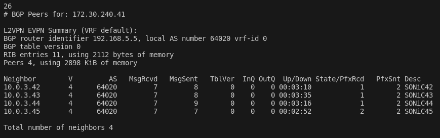{#fig:evpncli
width="100%"}

Hier sollten bei jedem angezeigten Gerät alle weiteren Nachbarn
auftauchen sowie im Status UPsein.

Weiterhin können die bereits gelernten Routen der BGP-Instanz auf
Vollständigkeit untersucht werden.

    vtysh -c 'show bgp l2vpn evpn'
    BGP table version is 173, local router ID is 192.168.5.5
    Status codes: s suppressed, d damped, h history, * valid, > best, i - internal
    Origin codes: i - IGP, e - EGP, ? - incomplete
    EVPN type-1 prefix: [1]:[EthTag]:[ESI]:[IPlen]:[VTEP-IP]:[Frag-id]
    EVPN type-2 prefix: [2]:[EthTag]:[MAClen]:[MAC]:[IPlen]:[IP]
    EVPN type-3 prefix: [3]:[EthTag]:[IPlen]:[OrigIP]
    EVPN type-4 prefix: [4]:[ESI]:[IPlen]:[OrigIP]
    EVPN type-5 prefix: [5]:[EthTag]:[IPlen]:[IP]

       Network          Next Hop            Metric LocPrf Weight Path
    Route Distinguisher: 192.168.5.5:2
     *> [3]:[0]:[32]:[10.0.3.41]
                        10.0.3.41                          32768 i
                        ET:8 RT:64020:1030
    Route Distinguisher: 192.168.5.13:2
     *>i[3]:[0]:[32]:[10.0.3.43]
                        10.0.3.43                     100      0 i
                        RT:64020:1030 ET:8
    Route Distinguisher: 192.168.5.18:2
     *>i[3]:[0]:[32]:[10.0.3.44]
                        10.0.3.44                     100      0 i
                        RT:64020:1030 ET:8
    Route Distinguisher: 192.168.5.21:2
     *>i[3]:[0]:[32]:[10.0.3.42]
                        10.0.3.42                     100      0 i
                        RT:64020:1030 ET:8
    Route Distinguisher: 192.168.5.22:2
     *>i[3]:[0]:[32]:[10.0.3.45]
                        10.0.3.45                     100      0 i
                        RT:64020:1030 ET:8

Über die Routen Typ 3 werden den BGP-Nachbarn VTEPs bekannt gemacht. In
der Ausgabe lässt sich erkennen, das jeder BGP Nachbar seinen lokalen
[vtep]{acronym-label="vtep" acronym-form="singular+short"} bekannt gibt.
Dies entspricht dem erwarteten Verhalten.

### EVPN Layer-2 Fabric

Nachdem die Grundkonfiguration durchgeführt und getestet wurde können
VLANs für die eigentlichen Nutzer bereitgestellt und getestet werden.
Dafür werden im ersten Schritt auf allen Geräten VLANs angelegt und
anschließend Interfaces diesen zugeordnet. Dies lässt sich interaktiv
mit der EVPN-CLI konfigurieren. Es wird nach Nutzereingaben ein
Konfigurationssegment erzeugt, welches nach Kontrolle und Bestätigung
durch den Anwender auf die SONiC-Switche geladen wird.

Durch Auswahl von Option **\[10\] - Configure User-Interfaces**:

``` {caption="EVPN-CLI: (10) Configure User-Interfaces"}
Interface ID: 12
Access Vlan for Interface [12]: 30
{
   "VLAN": {
      "Vlan30": {
         "members": [
            "Ethernet12"
         ]
      }
   },
   "VLAN_MEMBER": {
      "Vlan30|Ethernet12": {
         "tagging_mode": "untagged"
      }
   },
   "SUPPRESS_VLAN_NEIGH": {
      "Vlan30": {
         "suppress": "on"
      }
   }
}
Write to all devices ?[y/n]
```

Weiterhin muss das soeben erstellte VLAN einem VTEP zugewiesen und einer
VXLAN-ID vergeben werden, auch diese ist über das EVPN-CLI Tool möglich.

``` {caption="EVPN-CLI: (11) Configure VLAN-VXLAN-Mappings"}
11
VLAN ID: 30
VXLAN VNI: 1030
{
   "VXLAN_TUNNEL_MAP": {
      "vtep|map_1030_Vlan30": {
         "vlan": "Vlan30",
         "vni": "1030"
      }
   }
}
Write to all devices ?[y/n]
```

Im Anschluss sollte ein Ping zwischen den beiden NLAB-PCs die am 41er
und 45er SONiC-Switch angeschlossen möglich sein. Die dadurch gelernten
auf VTEPs gelernten entfernetn MAC-Adressen lassen sich für alle Switche
im EVPN-CLI Tool anzeigen:

``` {caption="EVPN-CLI: Auf VTEPs gelernte MAC-Adressen"}
28
# Device: 172.30.240.41
show vxlan remotemac all
+--------+-------------------+--------------+-------+---------+
| VLAN   | MAC               | RemoteVTEP   |   VNI | Type    |
+========+===================+==============+=======+=========+
| Vlan30 | 9a:89:d8:b0:1f:16 | 10.0.3.45    |  1030 | dynamic |
+--------+-------------------+--------------+-------+---------+
Total count : 1


# Device: 172.30.240.42
show vxlan remotemac all
+--------+-------------------+--------------+-------+---------+
| VLAN   | MAC               | RemoteVTEP   |   VNI | Type    |
+========+===================+==============+=======+=========+
| Vlan30 | 9a:89:d8:b0:1f:16 | 10.0.3.45    |  1030 | dynamic |
+--------+-------------------+--------------+-------+---------+
| Vlan30 | ea:55:9d:f7:0f:7d | 10.0.3.41    |  1030 | dynamic |
+--------+-------------------+--------------+-------+---------+
```

Die Ausgabe des 42er Switches zeigt das auch unbeteiligte Hosts, an
denen aber entsprechendes VLAN konfiguriert ist, beide MAC-Adressen
lernen.

``` {caption="EVPN-CLI: BGP EVPN Layer 2 Routen"}
vtysh -c 'show bgp l2vpn evpn'
BGP table version is 2, local router ID is 192.168.5.5
Status codes: s suppressed, d damped, h history, * valid, > best, i - internal
Origin codes: i - IGP, e - EGP, ? - incomplete
EVPN type-1 prefix: [1]:[EthTag]:[ESI]:[IPlen]:[VTEP-IP]:[Frag-id]
EVPN type-2 prefix: [2]:[EthTag]:[MAClen]:[MAC]:[IPlen]:[IP]
EVPN type-3 prefix: [3]:[EthTag]:[IPlen]:[OrigIP]
EVPN type-4 prefix: [4]:[ESI]:[IPlen]:[OrigIP]
EVPN type-5 prefix: [5]:[EthTag]:[IPlen]:[IP]

   Network          Next Hop            Metric LocPrf Weight Path
Route Distinguisher: 192.168.5.5:2
 *> [2]:[0]:[48]:[12:ef:1d:46:00:44]
                    10.0.3.41                          32768 i
                    ET:8 RT:64020:1030
{...}
Route Distinguisher: 192.168.5.22:2
 *>i[2]:[0]:[48]:[06:c8:38:33:39:36]
                    10.0.3.45                     100      0 i
                    RT:64020:1030 ET:8
{...}


Displayed 7 out of 7 total prefixes
```

Die vorig gezeigten Routen Typ-3 wurden aus der Ausgabe entfernt. Die
MAC-Adressen wurden zwischen den BGP-Instanzen über Routen vom Typ 2
bekannt gemacht.

### EVPN Layer-3 Fabric

EVPN kann über die vorig gezeigten Layer-2 Services hinaus ein ein
geroutetes Netzwerk virtualisieren und Erreichbarkeitsinformationen
verteilen. Die Informationen werden in diesem Fall nicht zwischen
[vtep]{acronym-label="vtep" acronym-form="singular+short"}s verteilt,
sondern zwischen [vrf]{acronym-label="vrf"
acronym-form="singular+short"}-Instanzen. Diese können beliebig im
Netzwerk platziert werden, die Daten werden zwischen den VRFs über ein
eigenes Transfer-Netzwerk übertragen welches durch eine eigene VXLAN-VNI
definiert wird. Dafür ist eine Erweiterung der Basiskonfiguration
notwendig. Nachfolgend können mittels eines neuen Routentyps auch
Layer-3 Erreichbarkeitsinformationen für die virtualisierten
Gast-Netzwerke verteilt werden.

``` {caption="SONiC: VRF01 Basic Config"}
13
Transfer VNI/VLAN?:1000
{
   "VRF": {
      "Vrf01": {
         "fallback": "false",
         "vni": "1000"
      }
   },
   "VLAN": {
      "Vlan1000": {}
   },
   "VLAN_INTERFACE": {
      "Vlan1000": {
         "vrf_name": "Vrf01"
      }
   },
   "VXLAN_TUNNEL_MAP": {
      "vtep|map_1000_Vlan1000": {
         "vlan": "Vlan1000",
         "vni": "1000"
      }
   },
   "BGP_GLOBALS": {
      "Vrf01": {
         "local_asn": "64020"
      }
   },
   "BGP_GLOBALS_AF": {
      "Vrf01|l2vpn_evpn": {
         "dad-enabled": "true"
      },
      "Vrf01|ipv4_unicast": {
         "max_ebgp_paths": "1",
         "max_ibgp_paths": "1",
         "route_flap_dampen": "false"
      }
   },
   "BGP_GLOBALS_ROUTE_ADVERTISE": {
      "Vrf01|L2VPN_EVPN|IPV4_UNICAST": {}
   },
   "ROUTE_REDISTRIBUTE": {
      "Vrf01|connected|bgp|ipv4": {}
   }
}
```

Folgend werden die Konfigurationssegme im vorherigen Listing erläutert:

-   **Vrf01** - Es wird ein VRF angelegt und diesem eine VNI zugewiesen.

-   **VLAN** - Für ein symmetrisches Routing über ein dediziertes
    Transfernetzwerk wird ein eigenes VLAN mit entsprechender VXLAN-VNI
    benötigt. Dies muss auf allen Switchen identisch konfiguriert
    werden.

-   **Route Redistribute** - Die lokalen Routen des Switches, die sich
    durch die lokalen Interface ergeben, müssen in die Tabellen der
    BGP-Instanz übetragen werden

-   **Route Advertise** - Die lokalen BGP-Routen werden mittels die
    Konfiguration den benachbarten BGP-Instanzen bekannt gemacht

Im Gegensatz zu der Enterprise Version von DELL, werden in dem aktuellen
Zweig der offenen Variante derzeit noch nicht alle hier gezeigten
Konfigurationsartefakte in entsprechende FRR-Konfigurationen umgesetzt.
Folgende Konfigurationszeilen werden nicht aus der REDIS-Datenbank in
die FRR-Konfiguration übernommen.

    router bgp 65100 vrf Vrf01 
        address-family l2vpn evpn                                          
            advertise ipv4 unicast                                              
            end

Als aktueller Workaround ist die Funktion **\[15\]** im EVPN-CLI Tool
implementiert, welche die Konfiguration auf allen Switchen nachholt. Da
die FRR-Konfigurationen allerdings bei Konfigurationsvorgängen durch den
frrcfgd mittels Jinja2 neu erzeugt und überschrieben werden, bleibt
diese Konfiguration nicht persistent und muss entsprechend gelegentlich
erneut eingefügt werden.

Im Anschluss werden über das EVPN-CLI Tool mehrere VLAN-Interfaces
erstellt werden, zwischen denen geroutet werden können. Es können sowohl
lokale VLANs ohne eingehängte VTEPs, als auch globale VLANs mit
zugeordnetem VXLAN verwendet werden.

``` {caption="EVPN-CLI Tool"}
15
Specify Switch-Host IP Address: 172.30.240.41
Specifiy VLAN ID: 600
Specify CIDR Subnet for Interface: 192.168.60.1/24
{
  "VLAN": {
    "Vlan600": {
      "vlanid": "600"
    }
  },
  "VLAN_INTERFACE": {
    "Vlan600": {
      "vrf_name": "Vrf01"
    }
  }
}
{
  "VLAN_INTERFACE": {
    "Vlan600": {},
    "Vlan600|192.168.60.1/24": {}
  }
}
```

Das Konfigurationselement VLAN\_INTERFACE wird bewusst doppelt in diese
Reihenfolge erzeugt, da das VLAN unbedingt erst an ein VRF gebunden
werden muss, bevor die IP-Adresse konfiguriert wird. Der hier gezeigte
Schritt kann für weitere Netzwerke wiederholt werden.

``` {caption="EVPN-CLI: EVPN Layer-3 Routen"}
# Device: 172.30.240.45
vtysh -c 'show bgp l2vpn evpn'
BGP table version is 1, local router ID is 192.168.5.22
Status codes: s suppressed, d damped, h history, * valid, > best, i - internal
Origin codes: i - IGP, e - EGP, ? - incomplete
EVPN type-1 prefix: [1]:[EthTag]:[ESI]:[IPlen]:[VTEP-IP]:[Frag-id]
EVPN type-2 prefix: [2]:[EthTag]:[MAClen]:[MAC]:[IPlen]:[IP]
EVPN type-3 prefix: [3]:[EthTag]:[IPlen]:[OrigIP]
EVPN type-4 prefix: [4]:[ESI]:[IPlen]:[OrigIP]
EVPN type-5 prefix: [5]:[EthTag]:[IPlen]:[IP]

   Network          Next Hop            Metric LocPrf Weight Path
Route Distinguisher: 192.168.0.1:4
 *>i[5]:[0]:[1]:[128.0.0.0]
                    10.0.3.41                0    100      0 ?
                    RT:64020:1000 ET:8 Rmac:0c:ce:c4:57:00:00
Route Distinguisher: 192.168.1.1:4
 *>i[5]:[0]:[24]:[192.168.1.0]
                    10.0.3.42                0    100      0 ?
                    RT:64020:1000 ET:8 Rmac:0c:81:4c:79:00:00
```

Die Informationen werden über Routen vom Typ 5 ausgetauscht. In der
Ausgabe ist zu erkennen, dass jeweils der Host 41 und 42 ein Netzwerk
propagieren. Im Anschluss sollte ein Ping zwischen allen vier Netlab PCs
möglich sein.

Fazit
-----

In diesem Versuch wurde ein Netzwerk auf Basis von BGP-EVPN mittels der
virtuellen Variante von SONiC implementiert. Durch die Standardisierung
sämtlicher verwendeter Protokolle, einem hohen Implementierungsgrad bei
den verschiedenen Anbietern und der vergleichsweise einfachen
Konfiguration ist der Ansatz derzeit sehr beliebt und verbreitet. Das
Konzept kann manuell durch Konfiguration der einzelnen Devices oder
mittels selbst entwickelter oder eingekauften Konfigurations- und
Managementtools implementiert werden. Die Art und Weiße der
Konfiguration bietet sich für Automatisierungsansätze an da zum Beispiel
Port-Konfigurationen generisch erstellt werden können und keine
Abhängigkeiten im Netzwerk wie die Verfügbarkeit eines VLANs durch ein
Netzwerk hindurch beachtet werden muss. Ein Beispiel für ein kaufbares
Konfigurations- und Managementtool ist Racksnet. Ebenso machen sich
viele Hersteller-eigene Fabric-Lösungen BGP-EVPN zu Nutze. Der zentraler
SDN Aspekt Traffic Engineering kann allerdings nicht ohne weiteres
implementiert werden. Die Pfade des Netzwerkverkehrs werden durch das
verwendete Routingprotokoll bestimmt, welche kein geregeltes Loadsharing
anbieten.

MPLS Segment Routing (mit EVPN?\]
=================================

Anhänge
=======
