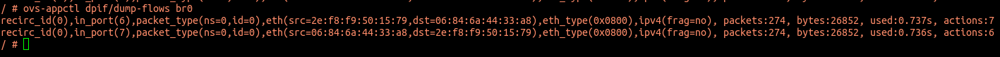
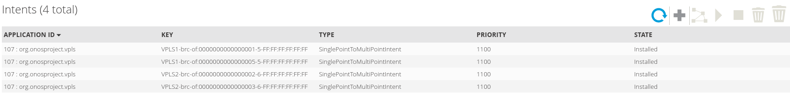
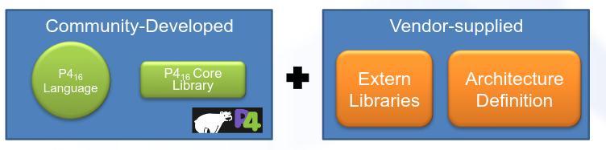
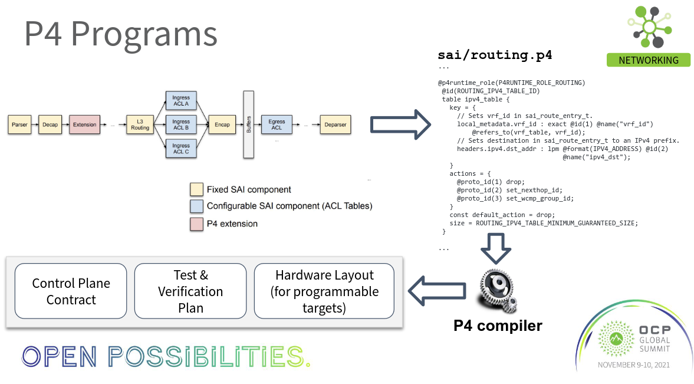
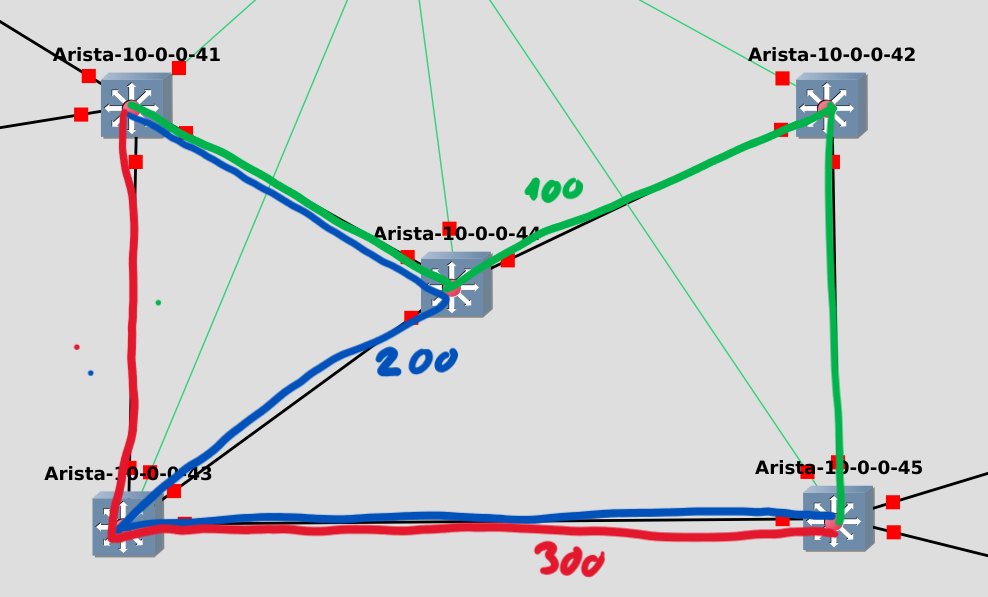

---
author:
- Benedikt Heuser
bibliography:
- literatur.bib
date: 02.11.2023
title: 'Evaluation und Simulation aktueller Software-Defined-Networking
  Konzepte'
---

{width="30%"}

Hochschule RheinMain\
Fachbereich ITE\
Studiengang EE-CS

**Masterthesis**\

1.2

  -------------- ----------------------------------- --
  verfasst von   **Benedikt [Heuser]{.smallcaps}**   
                 Matrikelnummer 105320               
                                                     
  am                                                 
                                                     
  -------------- ----------------------------------- --

[Kompiliert am  um  - Erstellt mit LaTeX]{style="color: 0.4"}

Einleitung
==========

Die Hochschule Rhein-Main betreibt einen GNS3-Server mit einer
Nutzerverwaltung sowie einer Template-Funktion zur Durchführung von
Praktikas im Netzwerkbereich. In dieser Thesis sollen
[sdn]{acronym-label="sdn" acronym-form="singular+short"} Architekturen
sowie entsprechende Netzwerkkomponenten gefunden werden, die sich auf
dieser Plattform virtualisieren lassen. Ziel ist es hiermit
[sdn]{acronym-label="sdn" acronym-form="singular+short"} Technologien im
Rahmen der Lehre auf der Plattform demonstrieren und untersuchen zu
können. Für dieses Ziel müssen verschiedene Fragen beantwortet werden.

Zu Beginn muss die Frage nach aktuellen SDN-Architekturen beantwortet
werden. Dafür wird im ersten Schritt der Begriff SDN definiert. Der
Begriff SDN wird oft eng mit der Technologie OpenFlow verbunden,
beschreibt aber eine grundlegende Idee Computernetzwerke zu gestalten.
Es wird eine Marktanalyse durchgeführt um Technologien auszumachen die
bei am Markt erhältlichen Lösungen eingesetzt werden und diese
zusätzlich Technologien auf ihre Verbreitung bewerten zu können.

Die zweite Aufgabe besteht darin gefundene Technologien und
Architekturen auf der Plattform der Hochschule simuliert werden können.
Die hier zu beantwortende Frage ist die Frage nach virtualisierbaren
Netzwerkkomponenten, welche benötigte Protokolle und Funktionen
unterstützen um entsprechende Architekturen zu simulieren.

*Software-defined networking (SDN) is obsolete, \...* - das zumindest
behauptet das Beratungsunternehmen Gartner in Ihrem Hype Cycle for
Enterprise Networking, 2023. Diese Aussage wird im Rahmen der
Auseinandersetzung mit aktuellen SDN-Technologien eingeordnet und
versucht zu bewerten.

Jeder ausgemachten Technologie wird ein eigenes Kapitel gewidmet,
welches im Anschluss für sich betrachtet eine vollwertige Beschreibung
der Simulation und der Technologien beinhalten soll. Diese Simulation
werden im weiteren auch als Lab bezeichnet. In einem kurzen Fazit sollen
Erkenntnisse einfließen, sowie in einigen wenigen Worten die Technologie
im Kontext SDN eingeordnet werden.

Tradionelles Netzwerk {#sec:tn}
---------------------

Da im weiteren Verlauf öfter ein Vergleich zu einem traditionellen
Netzwerkgezogen wird, soll diesem Begriff in diesem Kapitel Kontext
gegeben werden.

Die Aufgabe eines Netzwerkes ist es Computern und anderen Endgeräten
untereinander die Kommunikation untereinander zu ermöglichen. Hierbei
hat sich Ethernet zum faktischen Standard etabliert. Ethernet ist eine
Technologie die bereits in den 1970er Jahren von Xerox entwickelt worden
ist. An einem Ethernet-Netzwerk können mehrere Teilnehmer angeschlossen
werden. Ähnlich einer Bus-Topologie haben alle Teilnehmer sich
ursprünglich das selbe physikalische Medium geteilt, was eine
Kollisionsdetektion in Form von CSMA/CD notwendig machte. Eine Belastung
des Netzwerkes von über 60 Prozent führte zu vielen Kollisionen, was das
Netzwerk ineffizient machte. Als nächsten Entwicklungsschritt wurden
Bridges eingeführt, welche Pakete auf Basis Ihrer MAC-Adresse nur an den
dedizierten Ziel-Host weiterleiten [@bridge]. Heutige am Markt
verfügbare Switche sind aus funktionaler Sicht Bridges. Diese
segmentieren damit Ethernet-Netzwerke und verringern Kollisionen durch
Reduktion von Datenverkehr zu Hosts die nicht an den Daten interessiert
sind.

Auf Ethernet wird zur globalen Adressierung von Geräten über einzelne
Ethernet-Netze hinweg IP genutzt. IP-Netzwerke werden unterteilt in
Subnetze, definiert durch einen IP-Adressbereich und einer dazugehörigen
Subnetzmaske. Innerhalb eines Subnetzes kommunizieren Hosts über
Ethernet direkt miteinander. Zwischen Subnetzen kommunizieren sie über
Router, welche in mehreren Subnetzen gleichzeitig eine Schnittstelle
besitzen. Der Host schickt sein Paket um einen Host in einem anderen
Subnetz zu erreichen an den Router, der das Paket entsprechend
weiterleitet - oder auch routet. Der Host kennt das Router unter dem
Synonym Default-Gateway.

Die IP-Kommunikation basiert auf dem Address-Resolution-Protocoll, kurz
ARP. Das Protokoll dient dazu, zu einer IP-Adresse die zugehörige
MAC-Adresse aufzulösen. Dazu sendet er einen Broadcast an alle
Teilnehmer des Netzwerkes woraufhin der gesuchte Host mit seiner
MAC-Adresse antwortet. Unter Kenntnis der MAC-Adresse adressiert er
seine Nachricht mit dieser MAC-Adresse und schickt sie in Richtung des
Switches. Der Switch hat eine Tabelle mit MAC-Adressen und den
zugehörigen Schnittstellen und leitet das Paket analog dazu weiter. Hat
er keinen entsprechenden Eintrag schickt er das Paket über alle
Interfaces heraus. Befindet sich ein Host in einem anderen Netzwerk,
entscheidet der Host das Paket nicht direkt, sondern über sein
Default-Gateway zu versenden. Dies ist in der Regel ein Router mit eine
IP-Adresse im selben Subnetz.

Sowohl das ARP-Protokoll als auch die Layer-2 Paketweiterleitung
benötigen Broadcasts, also das fluten (engl. flooding) von Paketen um zu
funktionieren. Genau dieser Mechanismus führt bei traditioneller
Netzwerke in Hinsicht aus Skalierbarkeit und Ausgestaltung der Topologie
zu Einschränkungen.

Um ein einfaches Zusammenstecken sowie redundante und vermaschte
Ethernet-Topologien zu ermöglichen wurde im ersten Schritt das
Spanning-Tree-Protocoll, kurz STP, eingeführt. Dieses berechnet eine
Baumstruktur und schaltet vereinfacht gesagt alle Interfaces im Netzwerk
ab die die im Pfad dieses Baumes liegen. Dadurch wird die logische
Netzwerktopologie schleifenfrei und erfüllt damit diese Anforderung von
Ethernet. Da Spanning-Tree nicht gut skaliert sowie keine optimale
Ausnutzung aller verfügbaren Pfade ermöglicht wurde als weiterer offene
Standard Shortes-Path-Bridging, kurz SPB, erschaffen. Dieses Arbeitet
auf Prinzip von Netzwerkvirtualisierung mit ISIS für
Erreichbarkeitsinformationen und MAC-in-MAC um Pakete zu verpacken und
zu übertragen.

Die Kernaspekte die SDN begegnen möchte sind schlussfolgernd:

-   Ethernet erfordert eine logische Baumstruktur

-   Layer-2 Redundant hat eine hohe Komplexität (STP, MLAG)

-   Ethernet erlaubt kein Traffic-Engineering

-   Broadcasts erzeugen bei großen Netzwerken eine relevante
    Netzwerkauslastung

Gründe für SDN
--------------

Die Idee hinter Software-Defined-Networking ist es das Netzwerk im
gesamten Programmierbar zu gestalten. Die Motivationen sowie Probleme
die dadurch gelöst werden sollen sind vielfältig. Sie beziehen sich zum
einen auf die administrative Sicht, bei der zum Beispiel die manuelle
Konfiguration sämtlicher Teilnehmer eines Netzwerkes entfallen soll.
Weiterhin sollen darüber Mechaniken implementiert werden können, die bei
traditionellen Netzwerke nicht möglich sind wie zum Beispiel Layer-2
Pfad Redundanz und Traffic-Engineering.

Der Begriff SDN
---------------

In diesem Kapitel wird eine Differenzierung des Begriffes
Software-Defined-Networking versucht.

Der Begriff [sdn]{acronym-label="sdn" acronym-form="singular+short"}
wird gerne als Marketingbegriff eingesetzt ohne dabei einen wirklichen
Hinweis auf Eigenschaften des beworbenen Produktes zu geben. Es liegt
keine scharfe Definition des Begriffes vor. Der Begriff kam im
Zusammenhang mit Entwicklungen der Stanford Universität auf, die mit
Hilfe von [of]{acronym-label="of" acronym-form="singular+short"} die
[dp]{acronym-label="dp" acronym-form="singular+short"} eines Switches
programmieren konnten. Damit ließen sich Controller-basierte
Netzwerkkonzepte realisieren.

Allgemein betrachtet wird die Bezeichnung Software-Definedfür Geräte
verwendet, deren Funktionen und deren Funktionsweise per Software
definiert werden kann. Ein Beispiel sind Software-Defined-Radios. Diese
Geräten verfügen über eine Antenne welche in verschiedenen Frequenzen
Signale modulieren können. Über eine entsprechende Software lassen sich
diese Geräte dann zum Beispiel für Bluetooth, WLAN oder Zigbee
einsetzen. Die eigentliche Funktion der Geräte ist also durch Software
definiert. Oft verschwimmt der Begriff auch mit dem Begriff
Virtualisierung. So werden Systeme im Storage-Bereich, welche auf
Grundlage von mehreren Servern einen gemeinsamen Speicher virtualisiert
darstellen auch gerne als Software-Defined-Storage bezeichnet.

Im Netzwerk-Bereich beschreibt der Begriff zum einen die Entkopplung der
[cp]{acronym-label="cp" acronym-form="singular+short"} von der
[dp]{acronym-label="dp" acronym-form="singular+short"}, was die
Notwendigkeit einer programmierbaren [dp]{acronym-label="dp"
acronym-form="singular+short"} sowie Protokolle zur Kommunikation dieser
beiden untereinander bedingt. Durch eine zentrale
[cp]{acronym-label="cp" acronym-form="singular+short"} lassen sich
weiterhin genannte Optimierungen auf Ethernet-Ebene deutlich einfache
implementieren. Weiterhin beschreibt es die Schaffung von offenen
Schnittstellen von der [cp]{acronym-label="cp"
acronym-form="singular+short"} hin zu zentralen Management-Instanzen um
die Administration eines Netzwerkes zu zentralisieren und zu
automatisieren. Der Begriff wird auch für Fabrics verwendet, die durch
Netzwerkvirtualisierung eine wichtige Grundlage für die
Programmierbarkeit eines Netzwerkes schaffen.

### Unterscheidungsmerkmale SDN

Grundlegend lassen sich Netzwerkkonzepte im Allgemeinen und vor allem
dehnen die in die SDN Definition passen über verschiedene Merkmale
unterscheiden und einordnen.

#### Asymmetrisch vs Symmetrisch

[sdn]{acronym-label="sdn" acronym-form="singular+short"} Architekturen
lassen sich unterscheiden in Asymmetrisch und Symmetrisch. Bei
asymmetrischen Architekturen wird die [cp]{acronym-label="cp"
acronym-form="singular+short"} zentralisiert und in der Regel als eine
Software-Anwendung implementiert. Bei symmetrischen Modellen wird die
[cp]{acronym-label="cp" acronym-form="singular+short"} verteilt direkt
auf den einzelnen Netzwerkgeräten implementiert. Die Vorteile
asymmetrischer Modelle sind die zentrale Konfiguration und die
Verzichtbarkeit von Protokollen zur Verteilung von Informationen.
Nachteilig ist, dass dieser Controller einen Single Point of Failure
darstellt. Zusätzlich können zentrale Controller nicht unbegrenzt
skalieren. Vorteile symmetrischer Modelle ist die Architektur-bedinge
Redundanz und Skalierung bei wachsender Netzwerkgröße. Traditionelle
Netzwerkkonzepte mit autonom lernenden Bridges und Routing-Protokollen
sind hierbei als Symmetrisch zu bezeichnen.

#### Floodless vs Floodbased

Wie in Kapitel [1.1](#sec:tn){reference-type="ref" reference="sec:tn"}
beschrieben basieren wichtige Mechaniken von Ethernet/IP Netzwerken auf
Broadcasts. Broadcasts sind im Allgemeinen in großen Netzwerken und
vermaschten Topologien problematisch. Daher versuchen einige Ansätze
diese Broadcasts zu unterdrücken beziehungsweise zu optimieren.
Gesendete Broadcasts zur Auflösung von Adressen werden zum Beispiel
abgefangen und direkt mit Informationen aus einer Datenbank beantwortet.
Architekturen deren Verbreitung von Erreichbarkeits-Informationen nicht
auf Broadcasts basiert werden daher allgemein als Floodless bezeichnet.
Broadcasts werden allerdings auch gerne von Anwendungen auf der
Applikationsebene eingesetzt um zum Beispiel alle Drucker in einem
Netzwerk zu finden, was eine entsprechende Implementierung von
intelligenten Broadcasts oft notwendig macht.

#### Hostbased vs Netbased

Traditionellerweise sind Netzwerkfunktionen auf dedizierter
Netzwerkhardware abgebildet. Ein Host ist über eine
Ethernet-Schnittstelle ohne VLAN-Tag mit dem Netzwerk verbunden. Durch
das Aufkommen von Virtualisierungsplattformen und anderen
Applikationsplattformen wie Kubernetes welche innere
Netzwerkarchitekturen haben, wurde begonnen Netzwerkfunktionalität auf
die Server zu ziehen. Prominentes Beispiel ist der OpenvSwitch, welcher
dafür verwendet wird Netzwerk an Virtuelle Maschinen zu provisionieren.
Netzwerkfunktionen wie Routing oder Netzwerkvirtualisierung kann direkt
auf dem Anwendungsserver abgebildet werden. Vorteilhaft ist hier die
enge mögliche Integration zwischen Anwendungen und dem Netzwerk.
Prominente Beispiele sind OpenStacks Neutron, VMwares NSX und Flow von
Nutanix. Diese Produkte erlauben die Provisionierung von
Netzwerkdiensten auf der Anwendungsschicht.

### Erwartungen an SDN

Wie festgestellt gibt es keine scharfe Definition des Begriffes SDN.
Weiterhin wird versucht die auf SDN-Netzwerke projizierten Erwartungen
zu Beschreiben um entsprechende Lösungsansätze skizzieren zu können.

#### Erwartung 1: Controllerbasiert - Programmierbarkeit und Zentrales Management

Durch Einsatz eines zentralen Controllers können mehrere Probleme gelöst
werden. Durch die Zentralisierung der [cp]{acronym-label="cp"
acronym-form="singular+short"} können
Ethernet-Weiterleitungsentscheidungen auf Basis einer umfassenden
Kenntnis des Netzwerkes intelligent getroffen werden. Es können optimale
Pfade auf Basis verschiedener Metriken ermittelt werden. Durch die
Zentralisierung des Management ist die Konfiguration an einer zentralen
Stelle möglich. Während ein zentrales Management bei einer
zentralisierten Controlplane ein positiver Nebeneffekt ist, können auch
bei symmetrischen Netzwerkkonzepten dedizierte Management-Controller zum
Einsatz kommen. Viele moderne Lösungen setzen dabei auf ein
Cloud-basiertes zentrales Management für die verschiedenen Komponenten
eines Netzwerkes.

#### Erwartung 2: Redundanz, Skalierfähigkeit und Weiterleitungsoptimierungen

Wie in Kapitel [1.1](#sec:tn){reference-type="ref" reference="sec:tn"}
beschrieben erlaubt Ethernet abseits der Nutzung von Spanning-Tree keine
redundanten Datenpfade und Grenzen bei der sinnvollen Größe von
Netzwerken. Datenpfade laufen stets entlang eine Baumstruktur. Durch den
Einsatz von Netzwerkvirtualisierungen oder auch der Zentralisierung der
[cp]{acronym-label="cp" acronym-form="singular+short"} lassen sich eben
diese Einschränkungen mit unterschiedlichen Methoden aufheben oder
zumindest mindern.

#### Erwartung 3: Disaggregation Funktion/Software von Hardware

Die Software auf Netzwerkhardware ist in der Regel eng an die jeweilige
Hardwareplattform gekoppelt und in seiner Bedienung und Funktionalität
herstellerspezifisch. Das Mischen von Plattformen verschiedener
Hersteller kann sich als problematisch erweisen, da zum Beispiel
Protokolle im Detail unterschiedlich implementiert sind. Zudem kommen
teilweise Hersteller-proprietäre Protokolle zum Einsatz. Beispiel
hierfür sind Stacking-Mechanismen oder [mlag]{acronym-label="mlag"
acronym-form="singular+short"} Protokolle.

Der Einsatz einer einzelnen Softwareplattform in einem Netzwerk auf
Hardwareplattformen verschiedener Hersteller kann diesem Problem
entgegen wirken. Der Vendor-Lockin kann damit minimiert werden. Die
Funktionsweise eines Netzwerkswitch wird hierbei durch die aufgespielte
Software definiert, die Hardware wird austauschbar. Herausforderung
hierbei ist die Programmierung der eingesetztes Hardware durch das
[sos]{acronym-label="sos" acronym-form="singular+short"} über dafür
notwendige Treiber.

#### Erwartung 4: Traffic Engineering

Traffic-Engineering beschreibt die Implementierung eines geschlossenen
Regelkreises in einem Netzwerk. Auf gemessene Metriken wie die
Auslastung einer Netzwerkstrecke kann durch die Umleitung von Daten über
andere Pfade im Netzwerk reagiert werden. Notwendig dafür sind
transparente Metriken, die Programmierbarkeit von Datenpfaden und ein
Regelglied welches die erhobenen Daten auswertet und entsprechend
reagiert. In der realen Welt sind derzeit SD-WAN Lösungen im Trend, die
die Nutzung verschiedener WAN-Strecken von Unternehmen optimieren.

### Der Begriff Netzwerkvirtualisierung

Der Begriff der Netzwerkvirtualisierung beschreibt die Abbildung einer
Netzwerkinfrastruktur unabhängig der darunter liegenden physikalischen
Topologie. Ein einfaches Beispiel sind VLANs. Im komplexeren Fall lassen
sich Netzwerke auf Basis von Enkapsulierungsprotokollen wie zum Beispiel
VXLAN vollständig virtualisieren. Gerade im Service-Provider Bereich, wo
mehrere Kunden eine gemeinsame physikalische Infrastruktur nutzen wird
Netzwerkvirtualisierung in der Regel eingesetzt. Der Begriff wird
ebenfalls für den Einsatz virtueller Switche auf
Virtualisierungsplattformen genutzt.

### Der Begriff Fabric

Der Begriff Fabric wird üblicherweise für Konzepte genutzt, bei denen
Switche in einer vermaschten Topologie angeordnet werden. Die
Einschränkungen herkömmlicher Strukturen, in denen ein Netzwerk
sternförmig aufgebaut werden muss, was Konzepte mit mehreren Stufen wie
Core, Aggregation und Edge erfordert, sollen hier nicht gelten.
Weiterhin impliziert eine Fabric eine vereinfachte Konfiguration von
Services, im optimales Fall an einer zentralen Stelle oder zumindest nur
am Rand des Netzwerkes. Das Netzwerk soll aus konfigurativer Sicht als
ein Gesamtes und nicht als eine Vielzahl von Netzwerkkomponenten gesehen
werden.

### SDN im Wandel der Zeit

Mit der Aussage SDN is obsolete bezieht sich Gartner mit hoher
Wahrscheinlichkeit auf Controller- und Pfadbasierte Ansätze auf Basis
von OpenFlow die ab 2014 den Begriff SDN maßgeblich geprägt haben. Wie
in der weiteren Martkanalyse gezeigt wird, fristet die Technologie
OpenFlow ein Nischendasein in spezialisierten Einsatzgebieten. Der
funktionelle Nachfolger von OpenFlow ist P4Runtime, die Technologie wird
von der [onf]{acronym-label="onf" acronym-form="singular+short"} auch
gerne als Next-Gen SDN bezeichnet. Die Technologie findet zwar Beachtung
bei Service-Providern und Cloud-Anbietern wie Google [@p4google], zeigt
aber keine relevante Durchdringung bei Enterprise-Produkten. Teilweise
werden zwar P4-basierte Geräte angeboten, die Fähigkeit diese
Programmieren zu können wird allerdings oft nicht an den Endanwender
weitergegeben, sondern lediglich dazu genutzt dynamisch Funktionen durch
die Hersteller implementieren zu können, siehe Kapitel
[3.3](#sec:arista){reference-type="ref" reference="sec:arista"} und
[3.1](#sec:cisco){reference-type="ref" reference="sec:cisco"}.

Das klassische SDN spielt im Enterprise-Segment keine Rolle mehr. Der
Begriff wurde in den letzten Jahren allerdings wieder aufgenommen für
sogenannten SD-WAN Technologien. Diese basieren in der Regel weder auf
OpenFlow noch auf P4Runtime. SD-WAN Lösungen nehmen Metriken
verschiedener WAN-Anbindung eines Unternehmensstandortes auf wie Jitter,
Latenz oder Auslastung und weißt im Anschluss dynamisch Datenverkehr
entsprechend optimale Pfade zu. Damit lässt sich Verkehr über
verschiedene Strecken zwischen Standorten sowie über mehrere
Internet-Breakouts verteilen. Die Etablierung eines geschlossenen
Regelkreises passt zu den in dieser Thesis definierten Zielen von SDN.

Nimmt man diese Definition zugrunde lassen sich durchaus aktuelle
Netzwerkkonzepte finden dies sich als Software-Defined bezeichnen
lassen. Die in den weiteren Kapitel vorgestellten Lösungen adressieren
hierbei durchaus verschiedene Problemstellungen. Als Beispiel lassen
sich mit BGP-EVPN Fabrics aufbauen in denen sich mit geringem
Konfigurationsaufwand Layer-2 und Layer-3 Services provisionieren
lassen, was wiederum Management-Controller basierte Konzepte ermöglicht.
P4 und P4Runtime wiederum machen das Verhalten eines einzelnen Gerätes
programmierbar und ermöglichen über eine generische Schnittstelle welche
für jede P4-Anwendung frei definiert werden kann die Zentralisierung der
[cp]{acronym-label="cp" acronym-form="singular+short"}. MPLS Segment
Routing ermöglicht Traffic-Engineering in dem es die Programmierung von
festgelegten Pfaden im Netzwerk erlaubt. Hiermit ist die Implementation
von geschlossenen Regelkreisen in Netzwerken ohne eine Zentralisierung
der Controlplane wie bei OpenFlow möglich.

Der Begriff SDN hat also durchaus noch heute Relevanz, darf aber nicht
gleichgesetzt werden mit dem 2014 definiertem Begriff SDN der Lösungen
auf Basis von OpenFlow bezeichnet hat.

Die Technologie OpenFlow, beziehungsweise das klassische SDN, ist in
teilen an dem Ansprich gescheitert als allumfassende Lösung für den Bau
von Netzwerken zu dienen. Die stetige Weiterentwicklung von Protokollen
und damit notwendige Anpassungen der OpenFlow-Spezifikationen die
wiederum durch die Anbieter von Netzwerkhardware implementiert werden
mussten sowie Skalierungsprobleme zentralisierter Architekturen sind
weitere mögliche Gründe für das Scheitern von OpenFlow am Markt.
Spezialisierte Produkte hingegen die das Protokoll gezielt für kleinere
Problemlösungen nutzen setzen das Protokoll bis heute ein. Ein Beispiel
dafür ist Nevion mit einer SDN-Lösung speziell für die
Videoübertragungsindustrie[@nevion].

In einem bereits 2015 erschienenem informativen RFC wurde auf die
Problematik des undefinierten Begriffes SDN eingegangen sowie der
Begriff entsprechend versucht einzuordnen[@sdn]. Beschreibendes Zitat
aus dem RFC - *SDN research often focuses on varying aspects of
programmability, and we are frequently confronted with conflicting
points of view regarding what exactly SDN is. (\...) For example, both
OpenFlow \[OpenFlow\] and the Network Configuration Protocol (NETCONF)
\[RFC6241\] have been characterized as SDN interfaces, but they refer to
control and management, respectively..*

Netzwerksimulation
------------------

Ähnlich wie in anderen Technologiesektoren entwickeln sich die Ansätze
und Technologien im Netzwerkbereich mit steigender Geschwindigkeit
weiter. Netzwerke zu simulieren kann hilfreich zur Evaluierung von
Konzepten, zur Validierung von Änderungen an bestehenden Netzwerken und
zur Schulung und Lehre sein. Ein Netzwerk zu simulieren ist nicht nur
erheblich kostengünstiger, sondern ermöglicht auch den Aufbau komplexer
Topologien mit weniger zeitlichem und arbeitstechnischem Aufwand.
Zentrale Herausforderung für eine realitätsnahe Simulation ist die
Realisierung von hardwarenahen Funktionen, welche bei den physikalischen
Geräten direkt im Chip implementiert sind.

Die Vorteile einer Netzwerksimulation haben auch viele Hersteller
erkannt und bieten eigene Simulationsplattformen an. Gerne genutzter
Marketingbegriff hierfür ist Digital Twin, zu Deutsch Digitaler
Zwilling.

Ein Überblick über derzeit von Herstellern vertriebene
Simulationslösungen:

-   Cisco Modeling Labs

-   H3C Cloud Lab

-   ExtremeCloud IQ Co-Pilot: Digital Twin

-   Aruba AOS-CX Switch Simulator

Diese sind teilweise Cloud-basiert wie die Lösung von Cisco oder
Extreme, und teilweise lokale Programme auf Basis von frei erhältlichen
Hypervisoren wir VirtualBox, siehe die H3c Lösung Cloud Lab.

Einige Hersteller bieten auch eine virtuelle Variante ihres Switch-OS
an, um dieses in eigenen Simulationsumgebungen einzusetzen. Beispiele
sind:

-   **DELL OS10** - Dell bietet auf seiner Homepage ein GNS-3 Bundle von
    DELL-OS10 an.

-   **Extreme EXOS** - Extreme bietet im Marktplatz von GNS-3 eine
    virtuelle Variante ihres Switch-Betriebsystemes an.

-   **vEOS** - Arista bietet eine allgemeine virtuelle Variante ihres
    Betriebsystemes an, welche dadurch auch in GNS-3 lauffähig ist.

-   **SONiC** - Die Entwickler von SONiC bieten eine virtuelle Variante
    SONIC-VSin Repository an.

Die Betriebssysteme lassen ich in der Regel auf den gängigen
Hypervisoren Qemu, VirtualBox und VMware ausführen.

Grundlagen
==========

Disaggregation Software und Hardware
------------------------------------

Die Paketweiterleitung wird in Netzwerkgeräten typischerweise über
[asic]{acronym-label="asic" acronym-form="singular+short"}s
(Application-Specific Integrated Circuit) und in selteneren Fällen mit
FPGAs (Field Programmable Gate Array) implementiert. Die häufiger
eingesetzten ASICs haben ihre Funktionen in unveränderbarer Hardware
integriert. So kann in einem ASIC nachträglich nur sehr begrenzt eine
neue Funktion wie zum Beispiel VXLAN integriert werden. Vorteil dieser
ASICs ist allerdings die hohe parallele Performance die bei der
Weiterleitung benötigt werden. Für einen einfachen Vergleich, in der
Spezifikation PCI Express sind derzeit pro Lane 15,13 Gigabyte möglich.
Der aktuelle High-End Prozessor AMD Threadripper 3990X hat insgesamt 64
Lanes zur Anbindung von Peripherie über PCI-Express und kann damit eine
theoretische maximale Bandbreite von 64 x 15,13 = 968,32 Gigabyte in der
Sekunde leisten. Der aktuelle High-End Switching-ASIC von Broadcom, der
Tomahawk 5 kann in der Sekunde 64 x 100 = 6400 Gigabyte verarbeiten. Der
stark vereinfachten Vergleich soll zeigen, dass selbst die theoretisch
maximale Datenmenge bei Nutzung aller PCI Express Lanes durch einen
aktuellen x86 Prozessor fließen kann ein Bruchteil der Bandbreite
aktueller Switching-ASICs ist. Außer acht gelassen wird die Tatsache,
dass der ASIC in dieser Bandbreite zusätzlich
Weiterleitungsentscheidungen zu jedem Paket trifft.

In der Regel werden nicht alle Funktionen eines Switches durch den ASIC
abgedeckt. Komplexe Funktionen wie Spanning-Tree Berechnungen oder
Routing-Protokolle werden in der CPU des Switches abgebildet. Dafür kann
der ASIC die dafür notwendigen Pakete, bei diesen Beispielen
Spanning-Tree BPDUs oder Nachrichten von Routing-Protokollen, an die CPU
weiterleiten. Der Weg eines Paketes über den ASIC wird allgemein als
Fast-Path bezeichnet, wird ein Paket zur Verarbeitung an die CPU
ausgeleitet wird dieser Weg als Slow-Path bezeichnet.

Dadurch das die ASICs in den Netzwerkgeräten in vielen Fällen von den
Herstellern selbst entwickelt sind, spezifische Funktionen abdecken und
vielen Fällen auf verschiedenen Konzepten der Paketweiterleitung beruhen
besteht eine enge Abhängigkeit zwischen dem Betriebssystem auf dem
Switch und der jeweiligen darunterliegenden Hardware.

{#fig:co1 width="100%"}

In dem linken Teil der Abbildung [2.1](#fig:co1){reference-type="ref"
reference="fig:co1"} ist dies dargestellt. In den Switchen der
verschiedenen Herstellern werden ASICs aus eigener Produktion eingebaut
oder auch ASICs von Drittherstellern. Unter anderem die Firmen Broadcom
und Nvidia vertreiben Netzwerk-ASICs an Netzwerkausrüster. Diese werden
dann allgemein als Merchant-Silicon bezeichnet. Der Zugriff auf diese
Hardware erfolgt über proprietäre Programmierschnittstellen
beziehungsweise bei Merchant-Silicon durch den Chip-Entwickler
bereitgestellte Schnittstellen, die in der Regel nicht quelloffen sind.

Auf der rechten Seite wird ein heute immer häufiger genutztes Konzept
gezeigt. Als Betriebssystem auf dem Switch kommt ein gewöhnliches Linux
zum Einsatz. Dieses spricht in manchen fällen über eine standardisierte
oder quelloffene Programmierschnittstelle mit der jeweils verbauten
Hardware. Hier gibt es verschiedene Lösungsansätze. Teilweise kommen
proprietäre Treiber zum Einsatz, bei Cumulus Linux wurde ein Dienst
switchd geschrieben der verschiedene Hardware-ASICs quelloffen
abstrahiert hat. Für SONiC wurde eine Schnittstelle definiert an die die
ASIC-Produzenten mir ihrem Treiber andocken müssen. Funktionen wie
Routing und andere Controlplane-Protokolle sind als Dienste im Linux
integriert. Die Varianten sind hier vielfältig und werden und es gibt
eine Menge Kontraststufen zwischen den beiden Zeichnungen. Manche
Hersteller wie Arista erlauben den direkten Zugriff auf ihre zugrunde
liegendes Linux sowie die Installation von eigenen Anwendungen in
diesem.

Standardisierte Schnittstellen bringen die Möglichkeit das
Switchbetriebssystem auszutauschen. Gerade bei Plattformen mit häufig
eingesetzten Merchant-Silicon Chips wie der Broadcom Trident Serien, ist
oft die Möglichkeit gegeben ein alternatives Switchbetriebsystems zu
installieren. Beispiel sind die Open-Networking Switche von Dell wie dem
S5224F-ON, wobei das ON für Open-Networking steht. Eine Integration
verbreiteter ASICs, wie das bei Merchant-Silicon in der Regel der Fall
ist, ist für die Anbieter dritter Betriebssysteme attraktiver als die
Integration von ASICs mit geringen Stückzahlen.

{width="100%"}

Einen weiteren konsequenten Ansatz die Software von der Hardware zu
entkoppeln ist es die Hardware programmierbar zu machen. Das
[sos]{acronym-label="sos" acronym-form="singular+short"} bringt seinen
eigenen Programmcode für den Hardware-Chip mit, und definiert darüber
Weiterleitungsverhalten und benötigte Tabellen. Diese programmierbaren
Chips werden allgemein als programmierbare NPUs - Network processing
unit - bezeichnet. Eine Möglichkeit ist die Verwendung von FPGAs, welche
schon lange auf dem Markt sind. Ein Beispiel hierfür ist der Arista
Switch FPGA auf Basis des Xilinx Virtex UltraScale+ oder der Cisco Nexus
3550. P4 ist eine spezifische Beschreibungssprache für
Paketverarbeitungs-Pipelines im Netzwerkbereich. Für die Sprache gibt es
Compiler für die gängigen FPGA-Plattformen wie Xilinx oder AMD Vivado,
oder auch für den Einsatz von P4 spezialisierten Chips wie dem Intel
Tofino. Unter anderem Arista vertreibt Switche auf Basis des Intel
Tofinos.

### SAI

{#fig:evpncli width="50%"}

[sai]{acronym-label="sai" acronym-form="singular+short"}, Switch
Abstraction Interface, ist eine offene Schnittstelle zur Programmierung
der Dataplane und damit der Hardware eines Switches. SAI ist eine
Sammlung von C-Aufrufen in der entsprechende Funktionen der
Hardware-Treiber verlinkt werden. Die Besonderheit von SAI ist es, dass
es Aufgabe der Hersteller von Switching-Hardware ist entsprechende
Treiber zu liefern die sich in SAI integrieren. Festgelegt wird in
diesem Fall die Schnittstelle zwischen Treiber und Controlplane. Es ist
nicht Aufgabe der Controlplane sich an spezifische
Hardware-Schnittstellen anzupassen. Durch den Einsatz von SONiC durch
Microsoft in der Azure-Cloud und durch viele andere Hersteller ist diese
Standardisierung die erste mit einer relevanten Marktmacht um sich
durchzusetzen. [@sai]

### ONIE

{#fig:onie width="100%"}

ONIE ist eine Art erweiterter Bootloader und bietet die einfache
Möglichkeit Betriebssysteme auf Netzwerkhardware zu installieren. ONIE
implementiert dabei die bei Netzwerkhardware bekannte Mechanik einer
Primär- und einer Sekundärpartition, welche es nach einem Fehlerhaften
Update erlaubt wieder zur alten Installation zurückzukehren. Weiterhin
implementiert ONIE eine Linux-Shell in Form von Busybox und wird
beispielsweise von DELL genutzt um Firmware-Updates auf der Hardware
durchzuführen.

Netzwerksimulation
------------------

Die Simulation von Netzwerken basiert auf der Virtualisierung des
[sos]{acronym-label="sos" acronym-form="singular+short"} auf einem
Hypervisor. Eingesetzt werden je nach Betriebssystem-Architektur QEMU,
Dynamips, Virtualbox, VMware oder auch Containertechnologien wie Docker.
Die Mehrheit aktueller Enterprise-Switche basieren auf regulären
x86-Architekturen mit UNIX-artigen Betriebssystemen wie Linux. Dazu
gehört unter anderem Ciscos IOS-XE und XR, Extremes EXOS und VOSS und
einige mehr. Die Virtualisierung dieser Systeme stellt keine größere
Herausforderung dar da verbreitete Technologien genutzt werden. Um einen
virtuellen Link zwischen zwei virtuellen Switchen zu stecken können UDP
Tunnel eingesetzt werden.

{#fig:gns3-udp
width="100%"}

In dieser Abbildung sind zwei UDP Verbindungen zwischen zwei offenen
Ports auf dem lokalen Loopback-Interface zu sehen. Jeweils für jede
Richtung einen. Diese Verbindungen werden durch den GNS3 eigenen ubridge
Dienst erstellt.[@ubridge] Vorteil dieses Verfahrens ist, das jegliche
Art von Interfaces miteinander Verbunden werden können. Weiterhin
besteht die Möglichkeit den Linux-Netzwerkstack zu nutzen. So können
immer jeweils zwei Interfaces in eine Linux-Bridge gesteckt werden um
eine Kommunikation zu ermöglichen. Diese funktioniert allerdings nur mit
Interfaces der virtuellen Instanzen die dem Kernel des Hosts bekannt
sind. Die durch GNS3 erstellten QEMU VMs haben zum Beispiel kein
virtuelles Interface im Linux Kernel des Hosts. Gleichzeitig ist eine
gemeinsame Topologie mit UDP Tunnel problemlos über mehrere
Virtualisierungshosts möglich, während dies bei Linux-Bridges nicht ohne
weiteres möglich ist. Zu beachten sind die Performance Einschränkungen
bei den UDP Tunneln, da die Pakete durch einen kompletten Software-Stack
gehen.

Die größte Herausforderung ist die Implementierung von hardwarenahen
Funktionen der Switche in die virtuellen Versionen. Im optimalen Fall
wird ein Paket welches an einem Switch ankommt direkt, zum Beispiel von
einem ASIC, weitergeleitet und passiert nicht die CPU des Switches.
Lediglich Protokoll-Pakete wie zum Beispiel BGP-Pakete, LLDP-Pakete oder
STP-Pakete werden an die CPU weitergeleitet um dort verarbeitet zu
werden. Moderne Switche setzen MAC-basierte Layer-2 Weiterleitung,
IP-basierte Layer-3 Weiterleitung sowie die Implementierung von Filtern
in Form von ACLs direkt in der Hardware um. Da ein virtueller Switch
keine Hardware wie einen ASIC hat, durchlaufen alle Pakete den TCP/IP
Stack des [sos]{acronym-label="sos" acronym-form="singular+short"}es.
Die Simulation von [cp]{acronym-label="cp"
acronym-form="singular+short"} Funktionen wie Routing-Protokollen ist
damit in der Regel trivial da keine Änderungen an dem
[sos]{acronym-label="sos" acronym-form="singular+short"} vergenommen
werden müssen. Alle Funktionen die allerdings in die Hardware eines
Switches geschrieben werden, müssen durch andere Mechaniken ersetzt
werden.

Relevantes Qualitätsmerkmal bei den virtuellen Varianten ist der
Implementierungsgrad von eigentlich in der Hardware abgebildeten
Funktionen. In der Regel ist einfaches VLAN basiertes Switching und
Routing implementiert. Seltener verfügbar sind komplexere Funktionen wie
ACLs, also Filterlisten oder Quality-of-Service. Das fehlen dieser
Funktionen kann auch Abseits von direkter Nutzung problematisch sein.
Für MLAG-Konstrukte ist die Filterung gewisser Pakete auf der
Verbindungsstrecke zwischen den beiden Switchen notwendig. Im Beispiel
von dem virtuellen DELL OS-10 lässt sich ein MLAG, bei DELL VLT genannt,
zwar erfolgreich konfigurieren, funktioniert aber Aufgrund mangelnder
Filterung auf dem VLT-Link nicht korrekt.

Die Ansätze Funktionen in die virtuellen Switche zu implementieren
unterscheiden sich hierbei. Arista setzt zum Beispiel einen eigenen
Dienst ein der alle Pakete entgegen nimmt und entsprechend weiterleitet.
Dies ermöglicht dem Hersteller eine einfache Virtualisierung einer
großen Bandbreite an Funktionen. Nachteilig ist hierbei die geringe
Performance. SONiC hingegen bildet die Mechaniken auf Basis der
Linux-Netzwerkstack ab. Die Linux Interfaces werden durch einen Dienst
konfiguriert. Für erweiterte Funktionen werden Tabellen wie
MAC-Adresstabellen im Betrieb manipuliert. Dies ermöglicht eine
deutliche höhere Performance, die Abbildung komplexer Funktionen ist
allerdings komplexer.

### GNS3

GNS3 - Graphical Network Simulator-3 - ist eine quelloffene Plattform
zur Simulation von Netzwerken. GNS3 bietet eine graphische
Benutzeroberfläche in der Komponenten angeordnet werden können sowie
untereinander vernetzt werden können. Die Anwendung ist Server-Client
basiert. Der Server ist im Backend für die Virtualisierung der
verschiedenen angelegten Geräte zuständig, wobei verschiedene
Virtualisierungstechnologien eingesetzt werden können. Die Vernetzungen
zwischen den Geräten basiert auf UDP Tunneln welche mittels
ubridgerealisiert werden. GNS3 bietet weiterhin hilfreiche Tools wie die
Möglichkeit über die Oberfläche Wireshark-Mitschnitte auf bestimmten
UDP-Tunneln zwischen Geräten zu starten sowie Filter auf diesen
anzulegen. Weiterhin bietet GNS3 mit einem NAT-Knoten die Möglichkeit
einen Internet-Breakout zu realisieren sowie über einen Cloud-Knoten die
Möglichkeit ein physikalisches Interface in die Topologie einzubinden um
eine Schnittstelle zu echten Hardware-Komponenten herzustellen.

{width="100%"}

### GNS3-Server-Manager

Der GNS3-Server-Manager ist eine Web-Anwendung betrieben durch das NLAB
der Hochschule Rhein-Main. Diese Anwendung bietet Nutzern die
Möglichkeit auf Basis von Vorlagen GNS3-Server bereitzustellen. Die
GNS3-Server werden über OpenVPN erreichbar gemacht. Die Dokumentation
für diese Anwendung ist zu finden unter
<https://github.com/nlab4hsrm/gns3-Server-Manager/tree/main/Doc>

Services im Netzwerk - Netzwerkvirtualisierung {#sec:services}
----------------------------------------------

Die Netzwerkvirtualisierung beschreibt die Bereitstellung von
Netzwerkdiensten unabhängig der zugrunde liegenden Infrastruktur.
Technisch wird dies in der Regel durch Tunnelprotokolle zur
netzwerkunabhängigen Übertragung von Paketen durch ein Netzwerk
hindurch.

Prinzipiell unterscheidet man zwischen drei Services die in einem
Netzwerk bereitgestellt werden können. Zur Unterscheidung wird der
Begriff Overlay-Netzwerk oder Gast-Netzwerk für das bereitgestellte
Netzwerk das der Benutzer am Rand des Netzwerk zu sehen bekommt
verwendet. Der Begriff Underlay-Netzwerk beziehungsweise
Transport-Netzwerk wird für das zugrundeliegende Netzwerk für die
eigentliche Datenübertragung verwendet.

{width="100%"}

Auch als Pseudowire bekannt ist die Bereitstellung eines Layer-1
Services. Einfacher ausgedrückt wird hier ein Kabel durch eine
Netzwerk-Infrastruktur simuliert. Die beiden Switche auf dehnen das
virtuelle Kabel terminiert verhalten sich für den außenstehenden
Betrachter wie rudimentäres Patchpanel. Dies wird in der Regel nur für
sehr spezielle Anwendungsfälle wie Testaufbauten an Hochschulen
verwendet, oder wenn der Betreiber des Netzwerkes für Kunden wirklich
als reiner Dienstleister auftritt.

{width="100%"}

Als Layer-2 Service bezeichnet man die Bereitstellung von
Ethernet-Netzwerken an verschiedenen Endpunkten des Netzwerkes. Die
konfigurierten Schnittstellen des Netzwerkes verhalten sich hierbei für
den Außenstehenden Betrachter wie ein großer Switch. Typischerweise
werden in vielen Unternehmen Policys an VLANs aufgehängt was zu dem
Wunsch führt VLANs an jedem Punkt des Unternehmens dynamisch verfügbar
zu haben. Oftmals wird eine Portauthentifizierung eingesetzt, die dafür
sorgt das dem Mitarbeiter unabhängig seines Standortes sein VLAN mit den
damit verknüpften Berechtigungen zugewiesen wird. Ebenfalls werden
Layer-2 Services auch für Anwendungen benötigt die eine direkte Layer-2
Verbindung voraussetzen, weil sie zum Beispiel Broadcasts zur
Kommunikation einsetzen. Dazu gehören oft Komponenten wie vernetzte
Türschlösser, Stechterminals oder alte Industrie-Steuerungen die diese
Anforderung mit sich bringen.

{width="100%"}

Zuletzt lassen sich auch Layer-3 Services bereitstellen. Dies bedeutet
die Bereitstellung eines virtuellen gerouteten Netzwerkes auf Basis des
Underlay-Netzwerkes. Die Bereitstellung kann mittels Switched-Ports auf
denen ein geroutetes VLAN liegt oder über Routed-Ports erfolgen.
Technisch wird dies durch VRFs- Virtual Routing and Forwarding -
Instanzen gelöst. Der Hauptsächliche Vorteil der Nutzung von VRFs
gegenüber der direkten Nutzung des gerouteten Netzwerkes ist die
vollständige Separierung zwischen diesen Netzwerken. Dies kann zum einen
verwendet werden um Schutzzonen voneinander zu trennen oder aber um die
Netzwerkinfrastrukturen verschiedener Kunden auf ein und derselben
Hardware-Infrastrukturen abzubilden.

Traffic-Engineering
-------------------

Traffic-Engineering beschreibt die aktive Gestaltung und Optimierung von
Datenflüssen in Netzwerken. Dies kann eingesetzt werden um vorhandene
Infrastrukturen optimal auszunutzen. Zum Beispiel können bei einer
Lastsituation ein indirekter Pfad mit einer schlechteren Metrik genutzt
werden um den direkten Pfad vor einer Überlast zu schützen. Für ein
wirksames Traffic-Engineering ist zum einen die Erhebung von Messdaten
der einzelnen Strecken, eine Instanz welche den Zustand des Netzwerkes
kennt und Pfadentscheidungen trifft, sowie eine Netzwerkarchitektur
welche die dynamische Lenkung von Datenverkehr ermöglicht notwendig.

Routing-Protokolle berechnen ihre Pfade Aufgrund von notwendigen Hops,
wobei diese über die Konfiguration von Gewichten beeinflussbar sind. Der
Pfad der hierbei gewinnt wird im Anschluss verwendet, unabhängig von der
Lastsituation. Damit dieser Pfad nicht verwendet wird könnte das Gewicht
einzelner Strecken erhöht werden, was allerdings sämtlichen Datenverkehr
betreffen würde und eine generelle hohe Komplexität hat. Es ist keine
granulare Steuerung von Datenverkehr möglich. In Layer-2 Netzwerken
folgen Pfade immer den Weg des Broadcasts innerhalb einer logischen
sternförmigen Topologie. Erste Implementierungen die ein exaktes und
granulares Traffic-Engineering ermöglicht haben waren Flow-basierte
Konzepte auf Basis von OpenFlow. Mit MPLS Segment Routing existiert eine
weitere Technologie die eben dies erlaubt.

Programmierbare Netzwerke
-------------------------

Bei der Programmierbarkeit eines Netzwerkes muss zwischen zwei Ebenen
unterschieden werden. Zum einen ist damit die Konfiguration von
Netzwerkkomponenten über Programmierschnittstellen gemeint. Moderne
Netzwerkbetriebssysteme bieten hierfür standardisierte Schnittstellen
wie SNMP, Netconf sowie proprietäre REST-APIs an. Die klassischerweise
verwendete CLI ist in der Regel auch per SSH zu erreichen und lässt sich
ebenfalls bedingt als Programmierschnittstelle verwenden. Die
Programmierbarkeit eines Netzwerkes wird hierbei weiterhin durch die
genutzte Netzwerkarchitektur gestützt. Muss zur Provisionierung eines
neuen VLANs dieses auf jedem Switch im Netzwerk angelegt werden und die
Topologie beachtet werden um keine Schleifen zu erzeugen ist die
Komplexität meist zu hoch um diese effizient durch eine Software
durchzuführen. Die Nutzung von Netzwerkvirtualisierung kann zum Beispiel
diese Problematik abfangen.

Zum anderen kann damit die vollständige Programmierbarkeit der
Netzwerkhardware selbst gemeint sein. Das Verhalten eines gängigen
Enterprise-Switches wie einem Cisco Catalyst lässt sich in der Regel
nicht programmieren sondern nur konfigurieren. Die Möglichkeiten sind
eng gesteckt durch die Implementationen der Hersteller. Zum Beispiel
FPGA-basierte Switche lassen sich hingegen in ihrer Funktion frei
programmieren. Die Nutzung einer Netzwerk spezifischen
Beschreibungssprache mitsamt der hierfür gegeben Schnittstelle P4Runtime
ermöglicht eine vollständige Programmierung des Netzwerkes.
Anwendungsfälle sind hier selten Enterprise-Netzwerke, da hier die
Komplexität zu hoch ist und die Vorteile zu gering sind. Geeignete
Anwendungsfälle ist der Einsatz eines Switches für dedizierte Funktionen
wie zum Beispiel ein Load-Balancing vor einem Anwendungscluster.
Programmierbare Hardware kann ebenfalls eingesetzt werden um dynamisch
durch den Hersteller Funktionen nachreichen zu können.

Marktanalyse {#sec:market}
============

Die Marktanalyse dient zur Findung aktueller im Enterprise-Umfeld
eingesetzter Technologien. Zusätzlich können auf Basis der Marktanalyse
vorgestellte Technologien auf Relevanz bewertet werden. Eine
Netzwerkarchitektur die auf Basis von Protokollen arbeitet die in
praktisch keinem Enterprise-Netzwerkequipment integriert ist hat hierbei
geringere Relevanz. Aus diesem Grund werden die verschiedenen
Netzwerk-Plattformen der Hersteller betrachtet. Die meisten Hersteller
bieten ein ganzheitliches Netzwerkkonzept rund um ein einfaches
Webgui-basiertes Managementtool an, welche ebenfalls aus technologischer
Sicht betrachtet werden.

Zur Identifikation relevanter Hersteller wird der Gartner Bericht für
LAN und WLAN Lösungen für Unternehmen genutzt, in dem die Vision und die
entsprechende Fähigkeit die Vision zum Implementieren bewertet wird.

{#fig:gartner1 width="100%"}

Betrachtet werden die Lösungen der Hersteller die in der Abbildung
[3.1](#fig:gartner1){reference-type="ref" reference="fig:gartner1"} im
Quadranten Leadergeführt werden. Gartner definiert ihre
Bewertungskriterien nur in einem kompletten Bericht, welcher
kostenpflichtig erworben werden muss. Die Grafik wird nicht zur
Bewertung der Hersteller untereinander sondern lediglich als
Anhaltspunkt für eine Auswahl von Herstellen genutzt. Daher wird auf
eine exakte Quellenanalyse verzichtet.

Cisco {#sec:cisco}
-----

Cisco bietet drei verschiedene Switching-Plattformen an. Die Nexus-Serie
sind Komponenten für das Rechenzentrum, die Catalyst-Serie sind Access-
und Distributionskomponenten für den Campus. Zuletzt hat Cisco mit
Meraki einen Netzwerkausrüster gekauft und dessen Portfolio als dritte
Option in ihr Angebot übernommen. Die Fokus der Meraki-Switche liegt auf
einem vereinfachtem Management aus der Cloud.

Die Netzwerkkomponenten der verschiedenen Serien arbeiten jeweils mit
ihrem eigenen Cisco-Proprietären Betriebssystemen. Es ist, bis aus
wenige Ausnahmen, nicht möglich Betriebssysteme von Drittanbietern zu
installieren. Die wenigen Ausnahmen bieten eine Unterstützung für SONiC.
Das aktuell auf der Catalyst-Plattform eingesetzte IOS-XE unterstützt
auf einigen Plattformen OpenFlow sowie gängige Konfigurations- und
Virtualisierungsprotokolle.

Mit dem Cisco Silicon One hat Cisco eine P4 basierte programmierbare NPU
im Portfolio. Der Chip wird unter anderem bei der im Jahr 2023
angekündigten Catalyst 9000 Serie neben den Cisco eigenen
[asic]{acronym-label="asic" acronym-form="singular+short"}s mit dem
Namen UADP - Unified Access Data Plane verbaut. Die NPU wird nur in
eigenen Hardwareserien verbaut. Die Fähigkeit den Chip zu programmieren
wird nicht an den Endanwender weitergegeben. Der Silicon One G200 ist
zum Beispiel im Cisco Catalyst 9500X eingebaut, und kann in der größten
Ausbaustufe 8 x 400 Gbit/s und insgesamt 12,1 Tb/s verarbeiten. [@sone]

Cisco bietet für die gängigen Plattformen wie auch die aktuellste Cisco
Catalyst 9000 Plattform virtuelle Varianten an, welche für Trainings-
und Schulungszwecke gedacht sind. Diese sind allerdings nicht frei
erhältlich und überwiegend für die Cisco eigene Simulationsplattform
Cisco Modelling Labs gedacht, welche kostenpflichtig ist.

### Cisco Extensible Network Controller

Der Cisco Extensible Network Controller, kurz XNC ist ein klassischer
SDN Controller auf Basis des OpenDaylight Controllers. Neben dem
standardisiertem OpenFlow Protokoll nutzt der Controller proprietäre
Cisco Protokolle aus dem Cisco Open Network Environment Plattform Kit,
kurz onePK. [@xnc]

![CISCO XNC - Bildquelle: [@xnc]](media/xnc.png){width="100%"}

Das Produkt wurde 2022 abgekündigt.

### Cisco ACI

Die Application Centric Infrastructur, kurz ACI, ist eine von Cisco im
Jahre 2014 vorgestellte SDN Lösung für die Nexus-Serie und damit das
Datacenter. Die Lösung basiert auf einem Controller mit dem Namen
Application Policy Infrastructure Controller, kurz APIC. Als
[sb]{acronym-label="sb" acronym-form="singular+short"}-Protokoll
zwischen Controllern und Hardware wird Opflex eingesetzt [@opf]. Mit dem
Cisco eigenem Protokoll lassen sich auch Geräte und Software von
Drittherstellern in die Fabric einbinden. Zudem gibt es auf der
Applikationsseite Schnittstellen zu Red Hats Ansible, Terraform und
weiteren [iac]{acronym-label="iac" acronym-form="singular+short"}
Lösungen. Zusätzlich gibt es Schnittstellen zu Applikationsplattformen
wie Kubernetes und OpenShift, um auch sich auch hier in die
Infrastruktur zu integrieren.[@aci] [@aci2]

{width="100%"}

In dieser Abbildung ist der Initialisierungsvorgang einer ACI in den
verschiedenen Schritten beschrieben. Die Switches finden direkt
angebundene APICs per LLDP und fordern ihre Konfiguration an. Dieser
Vorgang erstreckt sich schrittweise über die gesamte Infrastruktur.

{width="100%"}

Die Lösung basiert auf einem [uo]{acronym-label="uo"
acronym-form="singular+short"} Ansatz. Im Gastnetzwerk wird VXLAN und
MP-BGP eingesetzt, im Transportnetz kommt das Routing-Protokoll ISIS zum
Einsatz. [@aci3] Die Lösung wird bis heute, Stand 2023, aktiv von Cisco
vertrieben.

### Cisco SD-Access

Cisco SD-Access ist die aktuelle Campus Lösung von Cisco. Mit diesem
Produkt will Cisco moderne Konzepte wie [ztna]{acronym-label="ztna"
acronym-form="singular+short"} oder Mikrosegmentation in skalierbaren
Netzwerken umsetzen. Die Lösung basiert auf einem
[uo]{acronym-label="uo" acronym-form="singular+short"} Ansatz und einem
dedizierten Managementcontroller Cisco Catalyst Center. Der Controller
kann lokal und in der Cloud betrieben werden. Als Kapsellungsprotokoll
auf der Dataplane wird auch hier [vx]{acronym-label="vx"
acronym-form="singular+short"} eingesetzt. Cisco setzt für die
Controlplane LISP ein. Der Grund dafür wird diskutiert [@sdlisp].

![SD-Access Fabric Roles -- Example - Bildquelle:
[@csda]](media/cisco-sda-design-guide_8.png){width="100%"}

Juniper
-------

Juniper bietet Netzwerkausrüstung für Service Provider, Rechenzentren
sowie für [can]{acronym-label="can" acronym-form="singular+short"} an.
Die Switche für [can]{acronym-label="can" acronym-form="singular+short"}
werden unter dem Namen EX geführt. Juniper entwickelt für diese
Netzwerkkomponenten eigene ASICs[@junasi]. Bei den
[dcn]{acronym-label="dcn" acronym-form="singular+short"} bietet Juniper
auch einige Modelle auf Basis von Broadcom Chips an, die teilweise auch
offiziell SONiC unterstützen.

Das Juniper eigene Betriebssystem heißt Junos-OS und unterstützt unter
anderem BGP-EVPN. Eine automatisierte und WebGUI basierte Konfiguration
und Administration eines solchen [uo]{acronym-label="uo"
acronym-form="singular+short"}-Konzeptes ermöglicht Juniper mit der
Cloudlösung Juniper Mist und der On-Premise Lösung Apstra.

### Juniper Apstra

Apstra ist ein On-Premise Controller, der durch mehrere VMs
implementiert wird. Apstra erlaubt die Administration und Konfiguration
von verschiedenen Netzwerkdesigns, wobei der Fokus auf EVPN mit VXLAN
liegt. Apstra ist ein zugekauftes Produkt und unterstützt daher auch
andere Plattformen wie Cisco Nexus, Arista EOS und SONiC. Dafür werden
auf den Switchen jeweilige Agents installiert, welche dem Apstra-Server
eine entsprechende REST-API anbieten. [@junapstra]

### Juniper Mist

{#fig:mist width="80%"}

Juniper Mist ist eine Cloud-Anwendung zu Konfiguration, Administration
und Überwachung von Juniper Netzwerkgeräten verschiedene Architekturen
auf Basis von BGP-EVPN und VXLAN unterstützt. Diese werden in Abbildung
[3.2](#fig:mist){reference-type="ref" reference="fig:mist"} gezeigt.
Juniper wirbt mit einer KI-Integration, welche bei der Fehlerfindung und
Behebung unterstützt. [@junevpn] [@junmist].

### Juniper Northstar

Northstar ist ein Controller für Traffic-Engineering für MPLS-Netzwerke
und IP-Netzwerke auf Basis von Segment Routing. Der Controller arbeitet
Pfad-basiert und programmiert durch Auswertung von Netzwerkauslastung
und darauffolgender Pfadberechnung einen geschlossenen Regelkreislauf.

{#fig:evpncli width="100%"}

Arista {#sec:arista}
------

Arista bietet ein breites Portfolio an Netzwerkkomponenten für
Datacenter- Campusnetzwerken. Die Datacenterswitche sind zu erkennen an
Modellnummern mit 4 Ziffern wie zum Beispiel 7060CX2-32S. Die
Campusswitche sind zu erkennen an Modellnummern mit 3 Ziffern wie zum
Beispiel 720XP-48Y6. Die Switche basieren überwiegend auf Broadcom Chips
[@aristams]. Arista hat ein eigenes [sos]{acronym-label="sos"
acronym-form="singular+short"} mit dem Namen EOS. Es gibt eine virtuell
Variante, vEOS, und einer containerisierte Variante, cEOS. Beide sind
für den produktiven Betrieb gedacht.

Aristas Linux-basiertes Switch-Betriebssystem EOS wirbt mit einer großen
Bandbreite von Schnittstellen über alle Ebenen um diese in
[sdn]{acronym-label="sdn" acronym-form="singular+short"} Konzepte zu
integrieren. EOS steht für Extensible Operating System. Arista wirbt mit
der Möglichkeit dieses Betriebssystemen mit RPM-Paketen einfach
erweitern zu können um beispielsweise neue Funktionen implementieren zu
können. Neben OpenFlow hat Arista ein funktional erweitertes Protokoll
mit dem Namen DirectFlow entwickelt, um Flow-Regeln in den Switch zu
programmieren. Dies nutzte eine Firewall Lösung von Palo Alto, um
Regelwerke direkt auf den Switches zu implementieren [@aristapalo]. Als
weitere Programmierschnittstellen nennt Arista bei seinem EOS:

-   Linux

-   EOS extensible APIs (eAPIs) using JSON

-   Open source Go, Python and Ruby based object models

-   Native Go and Python on box scripting

-   XMPP

-   Advanced Event Manager

-   SQLite Databases

-   OpenFlow und DirectFlow

-   EOS SDK

Zusätzlich beherrscht EOS die gängigen Overlay-Protokolle wie VXLAN.

![Arista Open Networking - Bildquelle:
[@aon]](media/Open-Networking-1.png){#fig:arista1 width="100%"}

In Abbildung [3.4](#fig:arista1){reference-type="ref"
reference="fig:arista1"} sind die vielfältigen Einsatzmöglichkeiten von
Arista Hardware sowie dem Arista eigenen [sos]{acronym-label="sos"
acronym-form="singular+short"} gezeigt. So erlaubt Arista den Einsatz
andere Software auf Ihren Switchen und stellt einen containerisierte
Variante ihres [sos]{acronym-label="sos" acronym-form="singular+short"}
bereit, um dieses auf Fremdhardware einzusetzen. Als Hardwareabstraktion
wird [sai]{acronym-label="sai" acronym-form="singular+short"} genutzt.
Es wird zum Beispiel der Facebook Switch Wedge 100 von Arista
unterstützt [@aristaoh].

Arista hatte schon früh eine OpenFlow-Implementierung, welche allerdings
wieder entfernt wurde. Arista setzt anstelle von ONIE ihre eigene Lösung
Abootein, die es ermöglicht andere [sos]{acronym-label="sos"
acronym-form="singular+short"} zu installieren. Aristas EOS unterstützt
die gängigen offenen und standardisierten Konfigurationsprotokolle.

Weiterer nennenswerter Bestandteil des Portfolios ist die 7170 Serie.
Dieser Switch basiert auf dem P4 programmierbaren Intel Tofino. Dies
nutzt Arista dafür, um den Switch mit verschiedenen Anwendungsprofilen
anzubieten und Features dyamisch implementieren zu können. Dazu gehören
die Profile Network Service Offload, Stateless Cloud Load Balancing,
Broadcast Media Tools und einige mehr. Der Switch wird mit Aristas EOS
betrieben, welches auf dieser Plattform P4Runtime unterstützt.
[@aristap4]

### CloudVision

CloudVision ist eine Controller-basierte Lösung zur WebGUI basierten
Administration von Netzwerken. Kern ist eine Managementinstanz die per
gRPC Netzwerkhardware mit dem hauseigenen Betriebssystem EOS verwaltet.
Arista unterstützt dabei mehrere Netzwerkkonzepte, welche sich jeweils
als Configlets in dem Git Account des Herstellers finden lassen. Die
hier präferierten Netzwerkarchitekturen basieren auf einer
Netzwerkvirtualisierung mit EVPN und VXLAN[@aristaevpn]. Weiterhin
bietet Arista mit NetDB und sFlow Möglichkeiten reichhaltige
Telemetriedaten von den Geräten zu sammeln. [@cve]

![Arista Open Networking - Bildquelle:
[@aristacvds]](media/arista-cloudvision-api.png){#fig:aristaapi
width="100%"}

Die Abbildung [3.5](#fig:aristaapi){reference-type="ref"
reference="fig:aristaapi"} zeigt den Einsatz von gRPC als Interface zu
den eigenen Switchen hin. Der Controller bietet eine Integration zu
VMwares SDN-Lösung NSX.

HPE Aruba
---------

HPE hat lange Zeit Netzwerkkomponenten unter dem Namen ProCurveangeboten
die mit dem Betriebssystem ProVision betrieben wurden. Nach der
Akquisition von Aruba, einem Hersteller von hauptsächlich
Wireless-Komponenten, wurden die Switche unter Aruba vermarktet und das
Betriebssystem in ArubaOS-Switch umbenannt. Mittlerweile vertreibt HPE
unter dem Markennamen Aruba sowohl Campus- als auch Datacenterswitche
mit dem neu entwickelten Betriebssystem ArubaOS-CX. Zusätzlich vertreibt
HPE Netzwerkhardware des chinesischen Herstellers H3C mit dem
Betriebssystem Comware unter eigenem Namen.

Das Betriebssystem ArubaOS-CX ist konfigurierbar über eine klassische
CLI sowie eine Rest-API, welche laut Hersteller alle Funktionen der CLI
abdeckt.

Während die ProCurve Geräte von HPE mit ProVision noch OpenFlow
unterstützt haben, haben die aktuell vertriebenen Comware- und Aruba
gebrandeten Netzwerkkomponenten keine Unterstützung von OpenFlow.

### HPE VAN SDN Controller

{width="100%"}

Der Controller, der später umbenannt wurde zu Aruba VAN SDN Controller,
ist ein Controller auf Basis von OpenFlow. Das Produkt ist abgekündigt.
[@hpevan]

### Aruba Central

Aruba Central ist ein Controller zur Konfiguration und Administration
von Aruba Komponenten. Der Controller kann On-Premise und in der Cloud
betrieben werden. Der Controller spricht per HTTP mit den angebundenen
Aruba-CX Geräten. Aruba Central NetConductor unterstützt bei der
Implementierung von [uo]{acronym-label="uo"
acronym-form="singular+short"}-Netzwerkarchitekturen mittels einem
Fabric Wizard, bietet eine Telemetrie mit Network Insights und Dienste
wie [nac]{acronym-label="nac" acronym-form="singular+short"}. Als
mögliche Architekturen werden Konzepte auf Basis von
[vx]{acronym-label="vx" acronym-form="singular+short"} und BGP-EVPN
unterstützt [@arubac].

DELL
----

DELL hat im Jahr 2011 den Netzwerkausrüster Force10 übernommen. Die bis
dahin angebotenen Geräte waren im Auftrag gefertigte Hardware von
Broadcom und Marvell Technology Group, welche unter dem Markennamen
PowerConnect vertrieben wurden. Zusätzlich wurden Netzwerkgeräte von
Juniper und Brocade mit dem PowerConnect Logo angeboten. Durch die
Übernahme von Force10 stieg DELL in den Enterprise-Netzwerk Markt mit
eigenen Geräten ein. Diese Entwicklung führt zu mehreren verfügbaren
Software-Plattformen mit den Namen DNOS6, DNOS9 und dem aktuellstem
Ableger DNOS10.

-   **DNOS6** - Ehemaliges PowerConnect OS. Läuft überwiegend auf der
    DELL N-Serie, einfache Access Switche

-   **DNOS9** - Ehemaliges Force10 OS, wurde zusammen mit dem Hersteller
    übernommen und weiterentwickelt.

-   **DNOS10** - Dell eigenentwickeltes und Linuxbasiertes Smart
    Fabric[nos]{acronym-label="nos" acronym-form="singular+short"}.

Ein Großteil des Netzwerk Portfolios von DELL basiert auf Broadcom
Hardware. Dell hat einige [on]{acronym-label="on"
acronym-form="singular+short"}-Switche mit [onie]{acronym-label="onie"
acronym-form="singular+short"} im Portfolio die teilweise offiziell für
Cumulus Linux sowie für SONiC unterstützt werden. DELL bewirbt aktiv den
Einsatz von SONiC auf den eigenen Switchen. Cumulus wird bei neuen
Geräten nicht mehr unterstützt.

Das aktuellste DELL OS10 unterstützt OpenFlow, allerdings nicht auf
allen Hardwareplattformen. Dell hat keinen eigenen OpenFlow-Controller
im Portfolio.

### SmartFabric

{width="100%"}

Dell bietet mit SmartFabric ebenfalls eine eigene Fabric Lösung an.
Dieser läuft nicht als dedizierter Controller, sondern ist las
verteiltes System auf mehreren DELL OS10 Instanzen implementiert. Die
einzelnen Switche bilden einen Cluster und wählen einen Master. Die
Switche müssen dafür in einen speziellen L3FABRICBetriebsmodus
geschaltet werden. Auf Basis dessen kann eine Fabric mit einem Layer-3
BGP Transportnetzwerk und einem VXLAN Overlays provisioniert werden. Die
Rollen Leaf und Spine werden statisch zugewiesen. Die Leaf Pärchen
werden per VLT in einem [mlag]{acronym-label="mlag"
acronym-form="singular+short"}-Cluster gekoppelt. Die Lösung ist eng
integriert in Dells [hci]{acronym-label="hci"
acronym-form="singular+short"} Plattform VXRail.

EXTREME
-------

Extreme bietet über den Zukauf vieler Hersteller über die Jahre ein
breites Portfolio von Lösungen. Aktuell vermarktet Extreme für den
Campus Bereich hauptsächlich Universal-Switche, welche in der Lage sind
zwei verschiedene hauseigene Betriebssysteme auszuführen. Im standard
wird EXOSeingesetzt, ein Extreme eigenes Betriebssystem was durch die
Jahre durch zugekaufte Betriebssysteme wie EOS von Enterasys profitiert
hat. Das Betriebssystem wird mittlerweile Switching Engine genannt und
ist auf traditionellere Netzwerke spezialisiert.

Die Extreme Switche basieren auf Broadcom Hardware. Die aktuellen
Universall-Switche nutzen ONIE, erlauben allerdings nicht die
Installation von dritten [sos]{acronym-label="sos"
acronym-form="singular+short"}

Extreme hatte zeitweise eine Unterstützung für OpenFlow in EXOS, sowie
einen eigenen Controller im Portfolio [@exofc].

Es findet sich im Portfolio mit dem Extreme 9920 eine Plattform auf
Basis des Intel Tofino 2. Hierbei handelt es sich um einem modularen
Core-Switch. Auch hier wird die Programmierbarkeit lediglich intern
verwendet, es werden keine Schnittstellen wie die P4Runtime
bereitgestellt. [@exp4]

### Extreme Fabric

Zusätzlich gibt es VOSS, ein von Avaya dazugekaufte Plattform welches
für eine Fabric auf Basis von Shortest Path Bridging, kurz SPB,
optimiert ist. Als Enkapsulierungprotokoll wird IEEE 802.1ah - Provider
Backbone Bridging genutzt. Pfadberechnungen und die Verteilung von
Erreichbarkeitsinformationen werden durch ISIS durchgeführt. Diese
Architektur gilt als technologischer Nachfolger von Spanning-Tree, hat
aber obwohl sie in weiten Teilen standardisiert ist nur eine geringe
Marktdurchdringung.

### Extreme IP Fabric

Mit der Extreme IP Fabric hat auch Extreme ein Lösungsansatz auf Basis
von [vx]{acronym-label="vx" acronym-form="singular+short"} und BGP-EVPN
im Portfolio. Die IP-Fabric wird allerdings nur auf einer speziellen
Hardware-Serie angeboten die mit einem eigenen Betriebssystem - SLX-OS -
laufen, welches durch die Akquisition von Brocades Datacenter-Networking
Sparte hinzugewonnen wurde.

OpenFlow Controller
-------------------

Bei der Suche nach OpenFlow-basierten Controllern fällt auf, dass
gefundene Webseiten und Dokumentationen größtenteils veraltet sind.
Kommerzielle Produkte bekannter Hersteller wie HPE VANoder Cisco XNC
sind allesamt abgekündigt. Mit Lumina, einem Anbieter einer
kommerziellen OpenDayLight Version, hat einer der letzten Anbieter im
Jahr 2020 das Geschäft eingestellt. Lumina ging als Ausgliederung der
[sdn]{acronym-label="sdn" acronym-form="singular+short"}-Sparte von
Brocade hervor.[@lumina]

Die derzeit populären drei offenen Projekte sind OpenDayLight, FAUCETund
ONOS. Die Projekte haben unterschiedliche Fokussierungen in ihrer
Anwendung. Faucet ist ein auf Basis von dem Framework RYUentwickelter
einfach gehaltener Controller. Er stellt die grundlegend notwendigen
Funktionen für einfache Netzwerke bereit. OpenDayLight ist ein deutlich
größeres und modulares Projekt, welches im speziellen für eine
Integration in eine OpenStack Umgebung gedacht ist. ONOS besitzt die
selbe modulare Architektur wie OpenDayLight, der Fokus liegt allerdings
auf großen Backbone- und Carriernetzwerken.

Im folgenden wird ein Blick auf die Anzahl der eingereichten
Code-Änderungen in den Github-Repositories der einzelnen Projekte
geworfen. Daraus soll eingeschätzt werden inwieweit die Projekte aktuell
gepflegt werden.

{width="100%"}

{width="100%"}

{width="100%"}

Diese Graphen sind nicht vollständig repräsentativ da bei dem
OpenDaylight und dem ONOS Projekt der originale Code auf einer anderen
Kollaborations-Plattform - gerrit - gehostet wird. Die Repositories in
Github sind Spiegelungen. Ein Trend ist dennoch zu erkennen. Während das
Projekt ONOS praktisch keine Weiterentwicklung mehr erfährt, wird der
OpenDaylight Controller und Faucet derzeit noch im geringen Umfang
gepflegt.

Open-Networking
---------------

In diesem Kapitel werden in knapper Form Hardware-Plattformen
vorgestellt, die den Betrieb dritter Betriebssysteme erlauben.

### Open-Networking Hardwareplattformen

   Anbieter        Plattform               NPU          Boot Loader     Supported 3rd Party OS    
  ----------- -------------------- ------------------- ------------- ---------------------------- --
     CISCO     8000 Series Router      SiliconOne          ONIE                 SONiC             
    Juniper       ua. QFX 5200      Broadcom Tomahawk      ONIE                 SONiC             
    Arista     einige DCS-7000er    Broadcom diverse       Aboot                SONiC             
    Arista         DCS-7170er         Intel Tofino         Aboot                SONiC             
   HPE Aruba           \-                  \-               \-                    \-              
   HPE Aruba     S, Z, E Serie      Broadcom diverse.      ONIE         SONiC, Cumulus, Picos     
    EXTREME            \-           Broadcom diverse.      ONIE                   \-              
    NVIDIA          SN-Serie         Nvidia Spectrum       ONIE             Cumulus, SONiC        
   EdgeCore           Alle          Broadcom diverse       ONIE       SONiC, Cumulus, Picos uvm.  

**Cisco** bietet mit dem Series Router eine Plattform an, welche auf
einem speziellem offenem OpenBios basieren. Auf diesem ist eine
Installation von ONIE möglich. Der Router unterstützt offiziell SONiC.

**Juniper** unterstützt mit mehreren Switchen auf Basis des Broadcom
Tomahawks aus der QFX Serie offiziell SONiC.

**Arista** bietet für eine große Anzahl seiner Netzwerkkomponenten eine
entsprechende SAI Implementierung und Treiber in ihrem Github, es gibt
aber auch fertige Images im SONiC Repository. Auf den eigenen Geräten
setzt Arista kein ONIE sondern Aboot ein. Interessanterweise gibt es für
Arista EOS eine Version für ONIE die ebenfalls SAI unterstützt.
[@aristaon]

**HPE** verkauft viele Netzwerkkomponenten von Fremdherstellern die
verschiedene Betriebssysteme unterstützen. Die aktuellen HPE Aruba
Komponenten unterstützen keine Installation von dritten
Betriebssystemen. Da Aruba aktuell in vielen Geräten eigene eng
integrierte ASICs einsetzt ist eine Unterstützung für offene
Betriebssysteme in näherer Zukunft auf diesen Plattformen
unwahrscheinlich.

**Dell** unterstützt in der aktuellen Serie die den Namenszusatz ON
(Open-Networking) tragen viele Betriebssysteme. Dell setzt fast
ausschließlich Broadcom Chips ein, eine technischer Unterstützung durch
viele offene Betriebssysteme ist damit gegeben.

Obwohl die aktuellen **Extreme Networks** Switche auf Broadcom Chips
basieren sowie ONIE unterstützen erlaubt Extreme keine fremden
Betriebssysteme auf Ihren Netzwerkkomponenten.

Die ehemaligen Mellanox Netzwerkkomponenten, welche von **NVIDIA**
übernommen worden sind, basieren auf eigenen ASICs. Die
Netzwerkkomponenten unterstützen in der Regel Cumulus, SONiC und ONYX.
ONYX ist der neue Name der ursprünglichen MLNX-OS, welches von Mellanox
übernommen wurde.

**Edgecore** gehört zu den Whitebox Herstellern die Switche auf Basis
von Broadcom Chips und ONIE ohne eigenes Betriebsystem vertreiben.
Dadurch sind die vorallem auf die Unterstützung von offenen
Betriebsystemen angewiesen und unterstützen alle gängigen
Softwareplattformen

Neben Edge-Core gibt es noch weitere Hersteller von Whitebox-Hardware,
wie zum Beispiel Accton, Delta oder Quanta.

Protokollimplementationen
-------------------------

In diesem Abschnitt soll eine tabellarische Übersicht über die
Implementation in dieser Thesis genannten Protokolle und Technologien in
den relevanten Software-Plattformen gegeben werden.

::: {#tab:dpp}
       Plattform          OpenFlow       P4Runtime   BGP-EVPN     
  ------------------- ----------------- ----------- ---------- -- --
     CISCO IOS-XE         Latest^1^         \-        Latest      
     CISCO IOS-XR         Latest^1^      Latest^1^    Latest      
       Junos OS        14.2R-Latest^1^      \-        Latest      
      Arista EOS          4.15-4.29         \-        Latest      
   ArubaOS-Switch^2^       Latest           \-          ?         
      ArubaOS-CX             \-          Latest^1^    Latest      
   HPE Comware(H3C)          \-             \-        Latest      
       DELL OS10          Latest^1^         \-        Latest      
     Extreme EXOS       15.3-30.4^1^        \-          \-        
     Extreme VOSS            \-             \-          \-        
      Extreme SLX            \-             \-        Latest      
         SONiC               \-            PINS       Latest      
        Stratum              \-            Nativ        \-        
      OpenvSwitch          Latest         Geplant       \-        

  : Dataplane SDN Protokolle
:::

-   1 - Hardware-Plattform abhängig

-   2 - Ehemaliges HPE Provision

In der Tabelle [3.1](#tab:dpp){reference-type="ref" reference="tab:dpp"}
werden die aktuellen Implementierungen von Protokollen die in den
weiterhin vorgestellten Konzepten verwendet werden gezegit. Es fällt
auf, dass sowohl Arista als auch Extreme OpenFlow nicht mehr in den
aktuellen Betriebssystemen unterstützt. Auch sehr neue Betriebssysteme
wie SONiC haben keinen OpenFLow-Implementierung. P4Runtime Unterstützung
findet sich bei den Enterprise-Herstellern bei Cisco und Arista,
allerdings nur auf einigen wenigen Plattformen die auf spezieller
programmierbarer Hardware basieren. Bei Cisco ist dies der SiliconOne,
bei Arista der Intel Tofino. Für den OpenVSwitch finden sich im Internet
Vorschläge [@ovsp4], für SONiC wurde es in den aktuellsten Versionen
bereits über PINS implementiert [@sonicpins]. Mit PINS - P4 Integrated
Network Stack wird versucht P4Runtime auch auf Geräten mit nicht
unmittelbar programmierbarer Hardware wie den Broadcom ASICs zu
implementieren.

Evaluation und Simulation ausgewählter Konzepte
===============================================

In den folgenden Kapiteln werden mehrere [sdn]{acronym-label="sdn"
acronym-form="singular+short"}-Konzepte erläutert sowie auf Basis
virtualisierte Netzwerkkomponenten in GNS3 simuliert. Für die
Implementierung eines Designs wird, wenn möglich, die Referenztopologie
aus [4.1](#sec:ref){reference-type="ref" reference="sec:ref"} genutzt.

Begonnen wird mit jeweils zwei Architekturen auf Basis von OpenFlow,
welche sich in ihrer Logik zur Weiterleitung von Paketen unterscheiden.
Der erste Ansatz zeigt eine Netzwerkarchitektur die auf traditionellen
Ethernet-Mechaniken auf Basis von Broadcasts zur Weiterleitung von
Paketen basiert. Der Zweite Ansatz nutzt einen Flow-basierten Ansatz.

In einem dritten Lab werden die Möglichkeiten eines mit P4
programmierbaren Switches sowie die Steuerung von diesem über eine
abgesetzte Controlplane mit P4Runtime gezeigt. In diesem Lab wird ein
einzelner Layer-2 Switch auf Basis des offenem Betriebssystems Stratum
simuliert. Der Fokus von diesem Lab liegt auf der Programmierung einer
Dataplane und zeigt daher kein Netzwerkkonzept zur Abdeckung der
Referenztopologie.

In einem vierten Lab werden die Möglichkeiten von
Netzwerkvirtualisierung mit BGP-EVPN und VXLAN gezeigt. Es werden
Layer-2 und Layer-3 Services in der gezeigten Referenztopologie
bereitgestellt. Eingesetzt wird hierfür eine virtuelle Variante des
offenen Netzwerk-Betriebssystems SONiC.

In dem letzten Lab wird eine Architektur gezeigt die Traffic-Engineering
ermöglicht. Das Konzept basiert auf Segment-Routing und MPLS. Als
virtuelle Netzwerk-Plattform wird EOS von Arista eingesetzt.

Referenztopologie {#sec:ref}
-----------------

In diesem Kapitel wird eine Referenztopologie beschrieben, die ein
typisches Netzwerk eines mittelständischen Unternehmens zeigen soll.

{width="100%"}

Das Unternehmen erstreckt sich über fünf Standorte. In den Standorten
und sind Serverräume mit Business-Anwendungen wie ERP-Systeme (Enterpise
Ressource Planning) angesiedelt. Weiterhin gibt es in Gebäude 3
Produktionsanlagen die einen hochverfügbaren Zugang zu den
Business-Anwendungen benötigen, da sie bei Abbruch der Verbindung nicht
produzieren können. Weiterhin gibt es ein abgelegenes Büro (2) sowie ein
Training-Zentrum zur Schulung von Kunden (5).

{#fig:reftop
width="100%"}

Das hier gezeigte Netzwerk lässt sich als Campus-Netzwerk
kategorisieren. Zwischen den gezeigten Gebäuden liegen Glasfaser-Kabel.
Die physikalische Topologie wird durch diese bestimmt und ist damit nur
mit aufwendigen baulichen Maßnahmen anpassbar. In der Simulation wird
ein Standort als ein einzelner Switch repräsentiert. Dies entspricht
üblicherweise nicht der Realität. Normalerweise werden kritische
Netzwerkkomponenten zumindest doppelt ausgelegt. Technologien für die
doppelte Auslegung von logisch einzelnen Netzwerkkomponenten wie MLAG,
Stacking und EVPN Multihoming werden in den Simulationen nicht
betrachtet. Fokus liegt auf der effizienten und resilienten
Provisionierung von Netzwerk-Services in einem vermaschten Netzwerk.

Allgemeines Ziel ist es die Standorte untereinander zu vernetzen und dem
Unternehmen die in Kapitel [2.3](#sec:services){reference-type="ref"
reference="sec:services"} erläuterten Services bereitzustellen.
Gleichzeitig sollen die Glasfaserstrecken dabei zum einen optimal
ausgenutzt werden und zur gegenseitigen Redundanz genutzt werden. Der
Ausfall einer Strecke soll den Betrieb des Netzwerken nicht
beeinflussen. Die Provisionierung von neuen Services als tägliche
administrative Aufgabe soll dabei hoch automatisierbar und aus diesem
Grund möglichst trivial gehalten sein.

Für die einfache Vernetzung von Geräten in einem Netzwerk reichen
eigentlich grundlegende Layer-3 Services aus, die keiner
Netzwerkvirtualisierung bedürfen. Die Notwendigkeit von Layer-2 und
Layer-1 Services bedingt sich historisch und aus spezifischen
Anwendungen. Der Bedarf nach Stretched Layer-2 Netzwerken, also
Ethernet-Netzwerken die an verschiedenen Bereichen des Campus verfügbar
sind entsteht durch zwei Anwendungsfälle. Zum einen basiert die
Hochverfügbarkeit vieler Anwendungen darauf, das sie im Falle eines
Ausfalles eines Server-Raums an einer anderen Stelle des Campus,
beispielsweise in einem zweiten Serverraum, mit der selben IP-Adresse
wieder hergestellt werden. Andere Anwendungen bilden ein verteiltes
Cluster und teilen sich eine virtuelle IP-Adresse, wofür ebenfalls das
gleiche Layer-2 Subnetz an zwei Stellen des Campus benötigt wird. Ein
zweiter Grund besteht in der historischen Beschaffenheit von Netzwerken,
das Regelwerke mit Subnetzen beziehungsweise VLANs verknüpft werden.
Beispielsweise wird ein VLAN für einen Geschäftsbereich wie die
Personalabteilung erstellt und entsprechende Firewall-Regeln an diesem
VLAN aufgehangen. Der Wunsch ist nun das ein Mitarbeiter der
Personalabteilung an allen Stellen des Campus auf sein VLAN und den
damit verknüpften Regeln zugreifen kann. Zuletzt existieren viele
Spezialanwendungen in einem Netzwerk wie Türsteuerungen oder
Zeiterfassungsterminals, die konzeptuell eine direkte Layer-2 Verbindung
zu einem zentralen Controller benötigen weil sie zum Beispiel Broadcasts
zur Kommunikation einsetzen.

Seltener benötigt werden Layer-1 Services. Diese sind zum Beispiel in
Entwicklungslaboren von Hochschulen zu finden, bei denen die
Notwendigkeit besteht ein Versuchsaufbau mit einem virtuellen Kabel mit
einer zweiten Komponenten an anderer Stelle der Hochschule zu verbinden.

Auswahl virtueller Switche
--------------------------

Für die Simulation der weiterhin genannten Konzepte wird jeweils ein
virtueller Switch mit einer Implementierung der eingesetzten
Technologien OpenFlow, BGP-EVPN, P4Runtime und d)MPLS Segment-Routing
benötigt. An dieser Stelle wird kurz die Auswahl der entsprechend
eingesetzten Plattformen begründet.

#### OpenFlow

Bei den getesteten virtuellen Hardware-Plattformen mit einer OpenFlow
Implementierung kann OpenFlow zwar konfiguriert werden, die Regeln
werden aber nicht umgesetzt. Bei den Hardware-Appliances werden die
Regeln direkt in die Hardware programmiert. Eine Umsetzung in den
virtuellen Versionen ist daher komplex und bedarf Entwicklungsaufwand.
Aus diesem Grund wird für die OpenFlow-basierten Konzepte der
OpenVSwitch eingesetzt. Dieser wird in OpenStack Umgebungen eingesetzt.
Da der OpenStack Netzwerk-Stack in Form von Neutron auf OpenFlow
basiert, ist die Implementierung von OpenFlow im OpenVSwitch als
vollständig anzunehmen.

#### BGP-EVPN

BGP-EVPN wird von SONiC in der virtuellen Variante unterstützt. Nicht
unterstützt werden derzeit Anycast-Gateways sowie EVPN-Multihoming.

#### P4Runtime

Für P4Runtime wird die Referenzimplementierung Stratum auf Basis der
P4-Referenzimplementierung bmv2verwendet. Bei SONiC wird P4Runtime über
PINS implementiert, ist allerdings aktuell nicht in der virtuellen
Variante umgesetzt. Eine Umsetzung in der virtuellen Variante mittels
DPDK befindet sich im Backlog - SONiC with P4 DPDK (PNA architecture) --
Basic SoftSwitch with DPDK - Deferred from 202205 release der SONiC
Roadmap. [@sonicroadmap].

#### MPLS

Gesucht wurde eine Plattform die MPLS-Routing in seiner virtuellen
Variante implementiert. SONiC unterstützt in der aktuellen Version
Segment-Routing lediglich mit IPv6 als Transportprotokoll. Als
Kandidaten konnten ausgemacht werden:

-   Cisco IOS-XE

-   Juniper vQFX

-   Arista vEOS

Da die Cisco-Plattform nicht frei erhältlich ist, ist diese Variante
ausgefallen. Die Simulation sollte sowohl mit Junipers vQFX als auch mit
Aristas vEOS möglich sein. Für die Simulation wurde sich für den
virtuellen Switch von Arista entschieden.

OpenFlow Lab I - Broadcastbasiertes Forwarding mit FAUCET
=========================================================

Architektur und Technologien {#sec:of1}
----------------------------

In diesem erstem Lab wird versucht die in Kapitel
[4.1](#sec:ref){reference-type="ref" reference="sec:ref"} gezeigte
Referenztopologie sowie die beschriebenen Netzwerkservices mittels einem
zentralen Controller der als zentralisierte Controlplane agiert
abzubilden. Als Kommunikationsprotokoll zwischen Control- und Dataplane
wird OpenFlow verwendet. In diesem ersten OpenFlow-Lab kommt der
Controller Faucet zum Einsatz. Dieser arbeitet im Gegensatz zu den
meisten anderen OpenFlow-basierten Controllern nicht Pfad-basiert.

{#fig:fauarch
width="100%"}

Es wird die im Kapitel [4.1](#sec:ref){reference-type="ref"
reference="sec:ref"} gezeigte Topologie umgesetzt. Es werden insgesamt
vier simulierte Endgeräte an das Netzwerk angeschlossen, welche sich in
zwei verschiedenen Subnetzen befinden. Dies erfordert einen Layer-2 und
einen Layer-3 Service, damit alle Endgeräte untereinander kommunizieren
können.

### Faucet

Faucet ist ein quelloffenes Projekt welches auf dem ebenfalls
quelloffenem Python-Framework für OpenFlow Ryu basiert. Faucet bietet
die Konfiguration von VLANs sowie ein dezentrales Routing. Mit dem
Projekt chewie, welches ebenfalls von Faucet betrieben wird, gibt es
einen integrierten Authentifizierungsdienst Endgeräte an einem Port
authentifizieren kann. Faucet bietet ein fertiges Konzept Metriken in
dem Netzwerk zu erheben und über Grafana zu visualisieren.

Faucet bietet die Möglichkeit mehrere Switche zu stacken um das
Verhalten eines einzelnen großen Switches zu simulieren. Primärer Grund
hierin liegt in der möglichen redundanten Vernetzung der Switche
untereinander, sprich einer vermaschten Topologie. Faucet berechnet
ähnlich wie Spanning-Tree einen Baum hin zu einem wählbaren Switch
entlang dessen Broadcasts weitergeleitet werden. Als Root-Bridge wird
der Switch mit der numerisch kleinsten ID gewählt. Damit der Controller
eine Baumstruktur erstellen kann, muss dieser die Topologie des
Netzwerkes kennen. Faucet setzt dafür eine statische Konfiguration der
Topologie voraus. In der Konfigurationsdatei wird neben der Topologie
auch die [uni]{acronym-label="uni" acronym-form="singular+short"}, die
VLANs, das Layer-3 Routing sowie alle weiteren Eigenschaften des
Netzwerkes konfiguriert. Die Konfiguration liegt im YAML-Format ab.

    $ /etc/faucet/faucet.yaml

Diese zentrale Art der Konfiguration erlaubt automatisierte und
dynamische Änderungen an dem Netzwerk an einer zentralen Stelle.

### OpenFlow

[of]{acronym-label="of" acronym-form="singular+short"} ist ein Protokoll
zur Kommunikation zwischen einer [cp]{acronym-label="cp"
acronym-form="singular+short"} und [dp]{acronym-label="dp"
acronym-form="singular+short"} um diese physikalisch und logisch
voneinander trennen zu können. Das Protokoll spezifiziert die
Nachrichten die zwischen den Einheiten ausgetauscht werden. Durch diese
Nachrichten werden von dem Controller generierte Flow-Regeln auf die
jeweilige Dataplane programmiert. OpenFlow kann vielseitig eingesetzt
werden, so kann mittels des Protokoll die Controlplane eines Netzwerkes
vollständig zentralisiert werden. OpenFlow kann auch dafür genutzt
werden nur bestimme Flows umzuleiten, beispielsweise für die
Realisierung eines Traffic-Engineerings oder zur Durchsetzung von
Regelwerken. [@ofs]

{#fig:evpncli
width="80%"}

Auf einem Interface eingehende Pakete werden auf Basis der
implementierten Flow-Regeln weitergeleitet.

Flow-Regeln können auf verschiedene Header eines Ethernet-Pakets greifen
wie MAC-Adresse, IP-Adresse oder ein VLAN Tag. Zusätzlich wird eine
Aktion definiert. Diese Aktion kann das versenden des Ethernet-Paketes
auf einem bestimmten Interface oder das Überschreiben eines weiteren
Headers durch einen neuen Wert sein.

{#fig:evpncli width="70%"}

Die Regeln können in mehrere untereinander verkette Tabellen geschrieben
werden. Die Tabellen werden mittels eine ID identifiziert. Die Pakete
durchlaufen nicht automatisch alle Tabellen, die Pakete werden den
Tabellen mittels Regeln zugewiesen. [@ofs]

Das Protokoll basiert auf einer Menge von definierten Nachrichten,
welche über den normalen TCP/IP Stack übertragen werden:

-   HELLO - Herstellen einer Verbindung.

-   FEATURE REQUEST/ REPLY - Controller fragt damit Informationen vom
    Switch wie OpenFlow Version ab.

-   GET CONFIG REQUEST/ REPLY - Controller fragt Konfigurationen vom
    Switch an

-   PACKET-In - Erhällt ein Switch ein Paket auf das keine Nachricht
    passt, kann er das Paket an den Controller senden.

-   FLOW MOD - Damit sendet der Controller Flow-Regeln an den Switch.

-   BARRIER - Abfrage des Controllers ob alle vorher gesendeten
    Anweisungen umgesetzt worden sind.

OpenFlow ist kein abgeschlossener Standard. Das Protokoll ist unter
stetiger Weiterentwicklung. Seit dem initialen Release mit Version 1.1
ist eine Vielzahl von Versionen erschienen. Aktuell veröffentlicht ist
die version 1.6. Hinzu kam zum Beispiel die Möglichkeit mehrere Tabellen
zu definieren oder die Möglichkeit auf neue Header zu matchen. Seit
Version 1.5.0 ist es zum Beispiel möglich Regeln auf TCP-Flags
anzuwenden. Diese stetige Weiterentwicklung stellt Netzwerk-Ausrüster
vor die Herausforderung diese Funktionen kontinuierlich zu
implementieren. Teilweise treffen sie hier auf durch die Hardware
gegeben Limitationen, so dass Funktionen modifiziert implementiert
werden oder weggelassen werden.

### Virtueller Switch: OpenvSwitch

Der OpenvSwitch (abgekürzt OvS) ist ein quelloffener Software-Switch.
OpenvSwitch wird in Virtualisierungsumgebungen und Cloud-Umgebungen
verwendet um virtuelle Maschinen an ein Netzwerk anzuschließen. Der
OpenvSwitch verbindert hierbei physikalische Interfaces eines Servers
mit virtuellen Interface von zum Beispiel virtuellen Maschinen. Der
Switch implementiert Layer-2 Funktionen wie VLANs,
[stp]{acronym-label="stp" acronym-form="singular+short"} sowie
komplexere Technologien wie VXLAN.

{width="100%"}

OpenvSwitch nutzt unter Linux ein eigenes Kernel-Modul für die
Weiterleitung von Paketen. Die Weiterleitungsregeln werden durch den
Dienst vswitchd programmiert, der als Controlplane fungiert und im Falle
von OpenFlow die Regeln entsprechend konvertiert und abstrahiert. Die
Netlink Kommunikation erfolgt mittels Flow Keys, welche Regeln zur
Weiterleitung von Paketen definieren. [@ovsdp].

{#fig:ovsdp
width="100%"}

Über den in der Abbildung [5.4](#fig:ovsdp){reference-type="ref"
reference="fig:ovsdp"} gezeigten Befehl lassen sich die in das
Kernel-Modul implementierten Regeln ausgeben. In diesem Fall sind zwei
Hosts an den Switch angebunden, die untereinander Kommunizieren. Es
existiert für jeweils jede Richtung eine Regel welche auf die Pakete
greift und als entsprechende Aktion an den entsprechenden Port
weiterleitet.

Alternativ kann Data Plane Development Kit, kurz DPDK, als Controlplane
genutzt werden, welches im Linux-Userspace ausgeführt wird und aufgrund
einer anderen Architektur höhere Übertragungsraten als das OpenvSwitch
Kernel-Modul erreicht. DPDK unterstützt weiterhin die Auslagerung von
Funktionen auf die physikalische Netzwerkkarte um weitere
Performance-Optimierungen zu erreichen. Ein detaillierter Vergleich
zwischen der Performance verschiedener Technologien unter dem
OpenvSwitch findet sich unter [@ovsdpperf].

OpenFlow Regelwerk I - Statisch
-------------------------------

In diesem Abschnitt soll die Funktionsweise der Paketweiterleitung mit
Faucet an Beispielhaften Regeln generisch erläutert werden. Als Beispiel
werden die ausgelesenen Regeln aus dem Switch OpenVSwitch-5 betrachtet.
Zuerst werden die wichtigsten initialen Regeln nach der Initialisierung
von Faucet betrachtet. Die Regeln sind im mehreren Tabellen kaskadiert.
Nachfolgend steht UNI für User-Network-Interface und NNI für
Network-Network-Interface. Um die weiteren Regeln einordnen zu können
werden folgende Informationen gegeben:

-   **eth1** - Link zu dem Switch 2

-   **eth2** - Link zu dem Switch 3

-   **eth5** - Client-Interface mit VLAN-Tag 100

-   **eth2** - Client-Interface mit VLAN-Tag 200

-   **VLAN 100** - 192.168.0.1/24 / 00:00:00:00:00:11 virtuelle MAC

-   **VLAN 200** - 192.168.1.1/24 / 00:00:00:00:00:22 virtuelle MAC

{width="100%"}

-   **Regel 0-1**: Weiterleitung von LLDP-Paketen an den Controller.

-   **Regel 2-3**: Pakete ohne VLAN-Tag werden auf den NNIs zwischen den
    Switchen verworfen.

-   **Regel 5-6**: Eingehende Pakete auf den UNIs werden der
    Konfiguration entsprechend mit VLAN-IDs markiert und an Tabelle 1
    weitergeleitet.

-   **Regel 6-7**: Eingehende Pakete auf den NNIs werden an die Tabelle
    1 weitergeleitet.

Die LLDP Pakete nutzt Faucet um Ausfälle von Network-Network Strecken zu
detektieren. Sobald keine LLDP-Pakete auf einem Interface mehr ankommen,
wird die Baumstruktur neu berechnet damit Broadcasts wieder alle Teile
des Netzwerkes erreichen. Alle Pakete auf die bis hier keine Regel
zugetroffen hat werden verworfen.

{width="100%"}

-   **Regel 58+60**: Broadcasts die aus Richtung der Root-Bridge kommen
    werden an alle UNIs weitergeleitet.

-   **Regel 59+61**: Broadcasts von NNIs werden auf allen auf dem
    Baumpfad liegenden NNIs weitergeleitet

-   **Regel 62+63**: Broadcasts von UNIs werden auf allen auf dem
    Baumpfad liegenden NNIs weitergeleitet

In dieser Tabelle wird die Behandlung von Broadcasts ersichtlich.
Broadcasts werden nur an [uni]{acronym-label="uni"
acronym-form="singular+short"}s sowie über Interfaces die Teil eins
durch Faucet berechneten Baumes sind weitergeleitet. Dies verhindert die
Bildung von Schleifen und den daraus resultierenden Broadcast-Storms

{width="100%"}

Im Gegensatz dazu leitet die Root-Bridge, in diesem Fall OpenvSwitch-1
Broadcast-Pakete an alle aktiven Interfaces weiter.

{width="60%"}

In der Abbildung ist die in diesem Labor konfigurierte Baumstruktur
dargestellt. Als Root-Bridge nutzt Faucet die Bridge mit der kleinsten
ID. Es kann sinnvoll sein diese zentral in einem Netzwerk zu
positionieren.

OpenFlow Regelwerk II - Dynamisch
---------------------------------

Für die Entstehung von dynamischen Regeln werden zwei Endgeräte an die
UNIs angeschlossen und ein Ping zwischen diesen beiden durchgeführt.

{width="100%"}

Der Wireshark-Mitschnitt zeigt zwei Besonderheiten dieser
Netzwerkarchitektur. Mit Paket 7 in der Abbildung sieht man die
ARP-Antwort für Host-2 für sein Routed-Gateway. Es ist lediglich die
Antwort und nicht die Anfrage ersichtlich, da die Anfrage vom
eingehenden Switch an den Controller gesendet wurde. Die Antwort
wiederum wird als Broadcast im gesamten Netzwerk ersichtlich. Gleiches
Verhalten zeigt sich bei der ARP-Auflösung des zweiten Endgerätes durch
den Router. Während die Anfrage in diesem Fall durch den Controller
durch das Netzwerk geflutet wird, wird die Antwort des Hosts direkt vom
eingehenden Switch an den Controller gesendet.

Weitere Besonderheit ist der Austausch der Ping-Nachrichten auf direktem
zwischen den Hosts, obwohl ein Routing zwischen den beiden VLANs mit der
ID 100 und 200 stattfindet. Dieses dezentrale Routing wird im folgenden
Erläutert.

{width="100%"}

-   **Regel 45**: Pakete aus dem VLAN 100 mit der Zieladresse des Hosts
    im VLAN 200 werden hier geroutet. Zu diesem Zweck wird die
    Quell-Macadresse durch die des virtuellen Router-Interfaces im VLAN
    200 ausgetauscht und die Ziel-Macadresse durch die des jeweiligen
    Zieles ausgetauscht. Anschließend werden die Pakete in Tabelle 4
    weiter behandelt. Das Routing geschieht immer jeweils auf dem Switch
    auf dem das Paket eingeht, wodurch ein dezentrales Routing
    realisiert wird.

{width="100%"}

-   **Regel 66**: Das eben geroutete Paket wird durch diese Regel über
    das Interface eth1 an den jeweiligen Switch mit dem zu erreichenden
    Host gesendet.

{width="100%"}

Eine Betrachtung der MAC-Adressen auf den Paketen verdeutlicht die
soeben erläuterte Mechanik. Die Pakete haben als Quell-Macadressen
jeweils die Adressen der virtuellen Gateways, und als Ziel-Macadresse
bereits die des zu erreichenden Hosts. Das Routing findet also jeweils
auf dem Switch statt, auf dem das Paket eingegangen ist.

Simulation
----------

Für die Simulation kann das vorbereitete Template OpenFlow-Lab auf dem
GNS3-Server-Manager der Hochschule genutzt werden. In diesem sind die
Docker-Container für Faucet und den OpenVSwitch bereits vorbereitet.
Zusätzlich ist bereits ein Projekt erstellt, in dem die
Referenztopologie angelegt ist.

Der **OpenVSwitch** wird als Docker-Container in die
Simulations-Umgebung implementiert. Es wird ein fertiger Container aus
dem öffentlichen Dockerhub Repository verwendet -
gns3/openvswitch:latest. Der OpenvSwitch ist vorgefertigt in dem
GNS3-Markplatz verfügbar.

Für **Faucet** wird ein eigener Container erstellt, der im
Container-Repository der Hochschule abgelegt ist unter nlab4hsrm/faucet.
Die notwendigen Konfigurationen liegen im Container ab. Diese
Konfigurationsdateien und das entsprechende Dockerfile liegen im
Versuchsordner ab.

### Konfiguration OpenvSwitche

Die IP-Adresse für die Verbindung zum Controller kann über Edit Config
im GNS3-Kontextmenü der jeweiligen Switche gesetzt werden. Auf den
OpenvSwitchen muss über das Terminal eine OpenFlow-Bridge erstellt,
konfiguriert sowie Ports zu dieser hinzugefügt werden.

``` {caption="Faucet OpenVSwitch Konfiguration 1"}
# Configure OpenFlow Bridge
ovs-vsctl add-br of
ovs-vsctl set bridge of protocols=OpenFlow13
ovs-vsctl set bridge of fail_mode=secure
ovs-vsctl set bridge of other-config:datapath-id=0000000000000001
ovs-vsctl set-controller of tcp:10.0.0.250:6653
```

Es wird das verwendete Protokoll, OpenFlow in der Version 1.3,
festgelegt. Der fail\_mode=secure sorgt dafür das der OpenvSwitch keine
Pakete weiterleitet wenn er keine Verbindung zum Controller hat. Die
Datapath-ID identifiziert die einzelnen OpenvSwitch-Instanz eindeutig
gegenüber dem Faucet Controller. Die OpenFlow-Kommunikation wird aktiv
durch den Switch aufgebaut. Dafür wird die IP-Adresse des Controllers an
dieser Stelle konfiguriert.

Im Anschluss werden die genutzten Interfaces von der Standard-Bridge
entfernt und der OpenFlow-Bridge hinzugefügt.

``` {caption="Faucet OpenVSwitch Konfiguration 2"}
ovs-vsctl del-port eth1
ovs-vsctl add-port of eth1
ovs-vsctl set Interface eth1 ofport_request=1
ovs-vsctl del-port eth2
ovs-vsctl add-port of eth2
ovs-vsctl set Interface eth2 ofport_request=2
ovs-vsctl del-port eth3
ovs-vsctl add-port of eth3
ovs-vsctl set Interface eth3 ofport_request=3
ovs-vsctl del-port eth4
ovs-vsctl add-port of eth4
ovs-vsctl set Interface eth4 ofport_request=4
ovs-vsctl del-port eth5
ovs-vsctl add-port of eth5
ovs-vsctl set Interface eth5 ofport_request=5
ovs-vsctl del-port eth6
ovs-vsctl add-port of eth6
ovs-vsctl set Interface eth6 ofport_request=6
ovs-vsctl del-port eth7
ovs-vsctl add-port of eth7
ovs-vsctl set Interface eth7 ofport_request=7
ovs-vsctl del-port eth8
ovs-vsctl add-port of eth8
ovs-vsctl set Interface eth8 ofport_request=8
```

Mittels dem ofport\_requestwird den Schnittstellen eine feste
OpenFlow-ID zugewiesen. Wird dieser Befehl nicht gesetzt, kann der
OpenFlow-ID von der Interface-ID abweichen, was prinzipiell nicht
problematisch ist aber die Komplexität erhöht.

Die Konfiguration lässt sich wie folgt überprüfen:

``` {caption="Faucet OpenVSwitch Konfiguration überprüfen"}
/ # ovs-vsctl show
{...}
    Bridge of
        Controller "tcp:10.0.0.250:6653"
            is_connected: true
        fail_mode: secure
        Port eth4
            Interface eth4
        Port eth1
            Interface eth1
        Port eth7
            Interface eth7
        Port eth8
            Interface eth8
        Port of
            Interface of
                type: internal
        Port eth3
            Interface eth3
        Port eth2
            Interface eth2
        Port eth6
            Interface eth6
        Port eth5
            Interface eth5
    Bridge br1
        datapath_type: netdev
        Port br1
            Interface br1
                type: internal
```

Es sollte die eben angelegte Bridge mit entsprechenden Eigenschaften und
den zugewiesenen Schnittstellen angezeigt werden. Der is\_connected
Eintrag sollte erscheinen sobald Faucet konfiguriert und gestartet ist.

Das Mapping zwischen den Schnittstellen und der OpenFlow-ID lässt sich
mit folgendem Befehl überprüfen:

    / # ovs-vsctl -- --columns=name,ofport list Interface
    {...}
    name                : eth5
    ofport              : 5
    {...}
    name                : eth2
    ofport              : 2
    {...}

### Konfiguration Faucet

Faucet wird über eine YAML-Konfigurationsdatei im Pfad
/etc/faucet/faucet.yaml Konfiguriert. Im Wurzelverzeichnis von Faucet
liegen bereits die Konfiguration für ein Layer-2 und ein Layer-3
Netzwerk für die entsprechende Topologie ab. Diese können an
entsprechende Stelle kopiert werden mittels

    $ cp /faucet-L2.yaml /etc/faucet/faucet.yaml

Die Konfiguration faucet-L2.yaml implementiert zwei VLANs innerhalb
deren die jeweiligen Hosts kommunizieren können. In der erweiterten
Konfiguration faucet-L3.yaml ist zusätzlich ein Routing zwischen den
beiden VLANs implementiert.

Die Konfiguration faucet-L3-yaml untergliedert sich in die drei
Teilbereiche *vlans*, *routers* und *dps*.

In der Sektion *vlans* werden VLANs spezifiziert.

``` {caption="Faucet: VLAN Konfiguration"}
vlans:
    office:
        vid: 100
        description: "office network"
        faucet_mac: "00:00:00:00:00:11"
        faucet_vips: ["192.168.0.1/24"]
```

Den VLANs wird eine Beschreibung sowie optional eine IP-Adresse
zugeordnet. Die IP-Adresse ist für das Routing notwendig und dient dabei
als Default-GW. Es muss zusätzlich hierfür eine virtuelle MAC-Adresse
konfiguriert wird, welche Faucet nutzt um diese der Router-IP
zuzuordnen.

Für ein Routing zwischen den VLANs müssen Router-Instanzen konfiguriert
werden und die jeweiligen VLANs zwischen denen geroutet werden soll
spezifiziert werden.

``` {caption="Faucet: Routing Konfiguration"}
routers:
    router-hosts-servers:
        vlans: [office, server]
```

Unter *dps* werden den Schnittstellen der einzelnen Switche VLANs und
optional Beschreibungen zugeordnet. Weiterhin wird in dieser Sektion das
Stacking konfiguriert und die Topologie definiert.

``` {caption="Faucet: Dataplane Konfiguration"}
dps:
    sw1:
        dp_id: 0x0000000000000001
        hardware: "Open vSwitch"
        stack:
            priority: 1
        interfaces:
            1:
                description: "sw1 isl to sw4"
                stack:
                    dp: sw4
                    port: 1
{...}
            6:
                name: "h3"
                description: "netlab 3"
                native_vlan: server
 {...}
```

Die einzelnen Switche und zugehörigen Schnittstellen werden über ihre
OpenFlow-ID identifiziert. Dem Switch wird eine Priorität im Stack
zugewiesen. Der Switch mit der geringsten Priorität wird Root-Bridge.
Das Interface ist in diesem Beispiel als ein NNI Konfiguriert. Es wird
die jeweils der gegenüberliegende Switch und der dort genutzte Port
angegeben. Interface zeigt die Konfiguration eines UNIs, in diesem
Beispiel wird das VLAN server als VLAN zugeordnet.

### Start des Netzwerkes

Zum Start des Netzwerkes wird nun der FaucetDienst gestartet. Dafür wird
in der Konsole für Faucet folgender Befehl abgesetzt um den Prozess im
Hintergrund zu starten:

    $ faucet &

Faucet legt einen Log unter /var/log/faucet/faucet.log ab, der genutzt
werden kann um die erfolgreiche Initialisierung des Netzwerkes zu
überprüfen.

    $ cat /var/log/faucet/faucet.log
    Mar 12 14:49:17 faucet.valve INFO     DPID 1 (0x1) sw1 Stack node sw1 UNHEALTHY (running 0s ago, stack ports [Port 1, Port 2] (100%) not up)
    Mar 12 14:49:17 faucet INFO     Stack root sw1 (previous None)
    Mar 12 14:49:17 faucet INFO     Reconfiguring existing datapath DPID 1 (0x1)
    Mar 12 14:49:17 faucet.valve INFO     DPID 1 (0x1) sw1 no ACL changes
    Mar 12 14:49:17 faucet.valve INFO     DPID 1 (0x1) sw1 no VLAN changes
    Mar 12 14:49:17 faucet.valve INFO     DPID 1 (0x1) sw1 no METERS changes
    Mar 12 14:49:17 faucet.valve INFO     DPID 1 (0x1) sw1 no port changes
    Mar 12 14:49:17 faucet.valve INFO     DPID 1 (0x1) sw1 Stack topology change detected, restarting stack ports
    Mar 12 14:49:17 faucet.valve INFO     DPID 1 (0x1) sw1 Port 1 (sw1 isl to sw4) down
    Mar 12 14:49:17 faucet.valve INFO     DPID 1 (0x1) sw1 Port 2 (sw1 isl to sw3) down
    Mar 12 14:49:17 faucet.valve INFO     DPID 1 (0x1) sw1 Using stacking root flood reflection
    Mar 12 14:49:17 faucet.valve INFO     DPID 1 (0x1) sw1 IPv4 routing is active on VLAN office vid:100 untagged: Port 5 with VIPs ['192.168.0.1/24']
    Mar 12 14:49:17 faucet.valve INFO     DPID 1 (0x1) sw1 IPv4 routing is active on VLAN server vid:200 untagged: Port 6 with VIPs ['192.168.1.1/24']
    Mar 12 14:49:17 faucet.valve INFO     DPID 1 (0x1) sw1 Port 1 (sw1 isl to sw4) up
    Mar 12 14:49:17 faucet.valve INFO     DPID 1 (0x1) sw1 Port 2 (sw1 isl to sw3) up
    Mar 12 14:49:17 faucet.valve INFO     DPID 1 (0x1) sw1 Configuring VLAN server vid:200 untagged: Port 6
    Mar 12 14:49:17 faucet.valve INFO     DPID 1 (0x1) sw1 Configuring VLAN office vid:100 untagged: Port 5
    Mar 12 14:49:17 faucet.valve INFO     DPID 1 (0x1) sw1 warm starting

Faucet sollte für jeden Switch, identifizierbar an der Datapath-ID,
einen ähnlich aussehenden Log produzieren. Ist dies für alle
konfigurierten Switche der Fall, kann die Konnektivität zwischen den
Endgeräten mittels Ping und Iperf3 überprüft werden.

### Hilfreiche Befehle

Die in einem OpenvSwitch programmierten Flow-Regeln können über das
Terminal des jeweiligen Switches mit folgendem Befehl ausgegeben werden:

``` {caption="OpenvSwitch: Flows ausgeben"}
ovs-ofctl -O OpenFlow13 dump-flows br0
```

Die Logs von Faucet lassen sich mit folgendem Befehl anzeigen:

``` {caption="'Faucet: Logs anzeigen'"}
cat /var/log/faucet/faucet.log
```

Nach Konfigurationsänderungen muss der Dienst von Faucet neu gestartet
werden. Dazu wird im ersten Schritt die Job-ID des Dienstes über
folgenden Befehl gefunden:

    jobs

Anschließend kann unter Angabe der Job-ID der Prozess beendet wird, um
ihn im Anschluss wieder starten zu können.

    kill %<job-id>

Fazit
-----

Faucet ist eine solide OpenFlow-basierte Controller-Lösung welche ein
Netzwerk mit Layer-2 und Layer-3 Services bereitstellen kann. Faucet
zeigt die Vorteile eines zentral konfigurierbaren Netzwerkes mit dem
Potential zur einfachen Automatisierung, macht sich aber mögliche
Vorteile durch eine zentrale Controlplane nicht zu nutze. Zwar wird
Spanning-Tree ersetzt durch eine eigene Mechanik, Pfade in dem
vermaschten Netzwerk verlaufen aber dennoch entlang einer Baumstruktur
und sind damit nicht in jedem Fall optimal. Faucet bietet keine direkten
Möglichkeiten für Traffic-Engineering.

OpenFlow Lab II - Pfadbasiertes Forwarding mit ONOS
===================================================

In diesem Lab wird ein Netzwerk auf Basis des OpenFlow-Controllers ONOS
simuliert. Dieser arbeitet Pfad-basiert und implementiert für jede
Kommunikationsbeziehung einen eigenen Datenpfad. ONOS erkennt
automatisch die eingesetzte Netzwerktopologie durch mitschneiden von
LLDP-Paketen.

{#fig:onostop
width="100%"}

Die Konfiguration der OpenvSwitche sowie die eingesetzte Topologie ist
identisch zum OpenFlow Lab I und kann dort nachgelesen werden.

### ONOS

ONOS wird entwickelt unter der [onf]{acronym-label="onf"
acronym-form="singular+short"} und ist dessen Referenzimplementierung
eines Netzwerk-Controllers. ONOS basiert auf Modulen und lässt sich
dadurch beliebig in seiner Funktionalität erweitern. ONOS ist
spezialisiert für Backbone-Netzwerke und ist nicht für den Einsatz in
Campus-Netzwerken bestimmt. ONOS zeigt allerdings wie ein Pfad-basiertes
Netzwerk aufgebaut werden kann.

ONOS wird bis heute durch neue Module erweitert und von der ONF genutzt
um neue Technologien wie zum Beispiel P4Runtime zu demonstrieren. ONOS
ist zentraler Bestandteil der aktuellen SD-Fabric auf Basis von
P4Runtime und MPLS-Segment Routing, was aber nichts mehr mit OpenFlow zu
tuen hat. In diesem Lab wird lediglich das Plugin Reactive Forwarding
eingesetzt, welches Layer-2 Dienste in einem Netzwerk anbietet.

#### Layer-2 Fabric - Reactive Forwarding

Mit dem Plugin *Reactive Forwarding* lässt sich ein über mehrere Switche
verteiltes Layer-2 Netzwerk implementieren. Die Switche können dabei
redundant untereinander vernetzt werden. Der Weg der Pakete durch dieses
Netzwerk erfolgt entlang von durch den Controller berechneten Pfaden.
Bei dieser Implementierung werden keine Broadcasts weitergeleitet.
ARP-Pakete werden durch den Controller abgefangen und entsprechend
beantwortet.

Sobald sich die Switche mit dem ONOS Controller per
[of]{acronym-label="of" acronym-form="singular+short"} verbunden haben
werden folgende Regeln in die Switche programmiert:

{width="100%"}

Jeder Regel besteht aus einem Kriterium für die Pakete auf die sie
angewendet werden sollen, dem Match Criteria, und einer Aktion die im
Anschluss mit dem Paket ausgeführt werden soll, der Action. Die hier
gezeigten drei Regeln sorgen dafür, dass alle ARP, LLDP und BDDP Pakete
an den Controller geschickt werden. BDDP ist ein nicht standardisiertes
Protokoll welches ähnlich wie LLDP funktioniert, allerdings spezifisch
bei OpenFlow-Controllern eingesetzt wird. Vorteil ist das diese Pakete
in der Regel von dritten Ethernet-Switchen im nicht verworfen werden.
Durch die LLDP Pakete lernt ONOS die Topologie. Durch die abgefangenen
ARP Requests gewinnt der Controller die Information über den Ort eines
Hosts mit dessen MAC und IP-Adresse. Mit dieser Tabelle kann der
Controller die ARP-Requests weitere Netzwerkteilnehmer beantworten.
Sobald ein Host nun kommunizieren möchte kennt ONOS den Ort beider
involvierten MAC-Adressen und kann entsprechend einen Pfad durch das
Netzwerk programmieren.

{width="100%"}

Nach einem Ping zwischen den beiden Endgeräten nlab4hsrm-netlab-1 und
nlab4hsrm-netlab-2, gezeigt in der Abbildung
[6.1](#fig:onostop){reference-type="ref" reference="fig:onostop"}, sind
drei neue Regeln in dem Switch-1 ersichtlich. Es sind zwei Regeln für
beide Kommunikationsrichtungen implementiert. Broadcasts werden nicht
weitergeleitet.

#### Layer-2 Fabric - VPLS

Mit dem Plugin *vpls* lassen sich Layer-2 Domänen spezifizieren die zum
einen voneinander abgekapselt sind und zum anderen Broadcasts
ermöglichen. Die hier gezeigte Technologie hat nichts mit der
gleichnamigen Technologie VPLS in Zusammenhang mit MPLS zu tun, ähnelt
dieser nur in Teilen funktionell.

{width="100%"}

Die Konfiguration des VPLS-Plugins resultiert in einem erweiterten
Regelwerk. Die ersten vier Regeln bleiben identisch. Bei den Regeln für
die eingehenden Pakete auf Port eth5 wird als erste Aktion das Paket mit
dem Wert 0x8100 markiert, was ein nach IEEE 802.1Q (VLANS) getagtes
Paket spezifiziert. Anschließend wird die VLAN-ID in das entsprechende
Feld geschrieben. Mit Regel 6 wird eine die Weiterleitung von Broadcasts
implementiert.

#### Netzwerk Visibilität

{#fig:onosperf
width="100%"}

Ein konzeptioneller Vorteil von dieser Art von Netzwerken ist, dass der
Zustand des Netzwerkes dem Controller bekannt ist. Die Abbildung
[6.2](#fig:onosperf){reference-type="ref" reference="fig:onosperf"}
zeigt ein Ausschnitt der WebGUI von ONOS mit der visualisierten
Auslastung der einzelnen Pfade des Netzwerkes. Auf Basis dieser
Informationen sind Entscheidungen zu optimalen Pfaden möglich.

Simulation
----------

Für die Simulation kann das vorbereitete Template OpenFlow-Lab auf dem
GNS3-Server-Manager der Hochschule genutzt werden. In diesem sind die
Docker-Container für Faucet und den OpenVSwitch bereits vorbereitet.
Zusätzlich ist bereits ein Projekt erstellt, in dem die
Referenztopologie angelegt ist. Die Konfiguration der OpenvSwitche ist
identisch zum OpenFlow Lab I und kann dort nachgelesen werden.

### Konfiguration ONOS

Der ONOS-Controller wird als Docker-Container implementiert und kann
direkt aus dem GNS3-Marktplatz installiert werden.

ONOS kann über eine integrierte Weboberfläche, einer Kommandozeile und
über eine REST-API konfiguriert werden. Zentrales Konfigurationselement
ist eine JSON-Datei welche sich über eine Rest-API ausgeben und
modifizieren lässt.

Im ersten Schritt werden die notwendigen Module aktiviert. Dies erfolgt
am komfortabelsten über die Web-GUI. Die Management-IP von ONOS kann im
Kontextmenü von GNS3 unter Edit config bearbeitet werden. Im
vorbereitetem Template hat ONOS dafür mehrere Interfaces. Eines wird zur
Kommunikation mit den OpenvSwitchen verwendet und ein weiteres wird
mittels dem Cloud-Knoten über den VPN erreichbar gemacht. Die Management
IP-Adresse sollte also innerhalb des GNS3-Server IP-Adressbereich
liegen.

Anschließend kann die Web-GUI über folgende URL aufgerufen werden. Zur
Anmeldung werden die Zugangsdaten onos/rocks verwendet.

    http://<mgmt-ip>:8181/onos/ui/

Die CLI ist erreichbar über SSH mit folgenden Terminal-Befehl:

    ssh -p 8101 onos@<mgmt-ip>

Unter dem Menüpunkt Applikationen werden nun folgende Plugins aktiviert:

-   OpenFlow Provider Suite

-   Reactive Forwarding

Notwendige Abhängigkeiten werden automatisch aktiviert.

{#fig:evpncli
width="100%"}

Wechselt man nun zu dem Menüpunkt Topology sollten die Switche angezeigt
werden und die Verbindungen zwischen diesen eingezeichnet sein. Ein Ping
sollte nun zwischen den Endgeräten im gleichen Subnetz möglich sein.
Durch drücken der Taste H werden erkannte Hosts auch in der Webgui von
ONOS angezeigt.

### Konfiguration ONOS VPLS

Für Broadcasts und zur Separierung von Netzwerken wird das Plugin VPLS
eingesetzt. Dafür muss eine JSON-Konfiguration über die REST-API in den
Controller geladen werden. In diesem Lab wird dafür Postman genutzt, die
Nutzung anderer Tools wie curl ist ebenfalls möglich. Die vollständige
in diesem Lab genutzte Konfiguration liegt im Versuchsordner ab.

``` {caption="ONOS Interface Konfiguration für VPLS"}
"of:0000000000000003/5": {
            "interfaces": [
                {
                    "name": "v100-3-5",
                    "vlan": "100"
                }
            ]
        },
        "of:0000000000000002/5": {
            "interfaces": [
                {
                    "name": "v100-2-5",
                    "vlan": "100"
                }
            ]
        }
```

Die Konfiguration der VLANS erfolgt durch gezeigte beispielhafte
JSON-Datei. Die für dieses Lab notwendige Konfiguration findet sich im
Versuchsordner. Jedes Interface in dem OpenFlow Netzwerk ist
spezifiziert durch eine Bridge-ID und einer Port-Nummer. Den Ports wird
ein jeweiliges VLAN-Tag zugewiesen.

{width="100%"}

Der Upload der Konfiguration kann wie in der Abbildung gezeigt erfolgen.
Abgeändert werden muss die IP-Adresse im URL-Pfad nach folgendem Schema:

    http://<mgmt-ip>:8181/onos/v1/network/configuration/

{width="100%"}

Wichtig ist, dass der Application-Typekorrekt gesetzt wird. Anderenfalls
schlägt der Aufruf fehl.

{width="100%"}

Die Broadcast-Domänen werden über Intents abgebildet, welche sich in der
WebGUI von ONOS betrachten lassen. Es existiert für jeden Port ein
Intent, welcher die Weiterleitung von Broadcast-Paketen an verschiedene
Endpunkte definiert.

Fazit
-----

ONOS zeigt durch seine Implementierung eines verteilten Layer-2 Switches
die Vorteile einer zentralen Controlplane. ONOS kennt die Topologie und
berechnet und installiert für jede Kommunikationsbeziehungen spezifische
Pfade durch das Netzwerk. Dies vereinfacht die Konfiguration eines
Netzwerkes massiv und bildet die ideale Grundlage für
Traffic-Engineering oder die Implementierung von Regelwerken direkt im
Datenpfad. Im aktuellen Zustand kann Aufgrund mangelnder Reife der
Plugins sowie der Dokumentation ONOS nicht für den produktiven Einsatz
in Enterprise-Netzwerken empfohlen werden. Zusätzlich ergibt sich aus
der Marktanalyse, dass das Protokoll OpenFlow eine immer geringere
Verbreitung findet.

P4Runtime Lab - Programmierbare Dataplane
=========================================

Architektur und Technologien {#architektur-und-technologien}
----------------------------

P4Runtime ist ein Protokoll für die Kommunikation einer abgesetzten
Controlplane und einer Netzwerkkomponente. Im Unterschied zu OpenFlow
ist die Implementierung auf Seite der Dataplane nicht durch einen
Standard vorgegeben.

P4 und P4Runtime stellen damit mehr ein Framework zur Verfügung um
Technologien wie VXLAN zu implementieren. Die Art und Weise der
Implementierung, welche Funktionen auf eine externe Controlplane
ausgelagert wird und wie diese kommunizieren liegen damit vollständig in
Händen des Entwicklers. Eine beispielhafte Referenzimplementierung zeigt
die Open-Networking-Foundation mit der SD-FABRIC. Mittels P4
programmierbarer Switche mit Stratum als Betriebssystem wird ein
Netzwerk auf Basis der Technologien Segment-Routing und IPv6 errichtet.
Über P4Runtime wird eine externe Controlplane angebunden welche
Applikationen die direkte Steuerung des Netzwerkes ermöglicht. Dies kann
zum Beispiel in 5G Mobilfunknetzwerken eingesetzt werden, wo jedem
einzelnen Nutzer gewisse Datenkontingente zugestanden werden und
entsprechend die Verbindung gedrosselt wird.

P4Runtime benötigt im Gegensatz zu OpenFlow eine durch den Nutzer
gegebene Dataplane-Definition. In diesem Lab soll ein virtueller Switch
über P4 programmiert werden und eine abgesetzte Controlplane über
P4Runtime angebunden werden. Da dies an einem einfachem Beispiel gezeigt
werden soll wird ein einzelner Layer-2 Switch mit zwei angeschlossenen
Endgeräten gezeigt. Es wird keine komplexe Topologie und kein Layer-3
Routing implementiert.

P4
--

P4 ist eine durch ein Konsortium entwickelte Programmiersprache zur
Beschreibung des Verhaltens einer Dataplane. [@p4] P4 ist aktuell durch
kein RFC standardisiert, die Nutzung der Sprache in RFCs wird lediglich
in einem Draft erwähnt [@p4rfc]. Das Projekt steht als freies Projekt
unter der Linux Foundation.

P4 benötigt einen Compiler für das jeweilige Ziel auf dem das Programm
ausgeführt werden soll. Verfügbare Compiler sind zum Beispiel:

-   Intel P4 Studio - beinhaltet Compiler für Intel Tofino.

-   p4c-bm2-ss - Compiler für bmv2, eine Referenz Softwareswitch
    Implementierung für P4.

-   p4c-ebpf - Compiler für eBPF - ein Linux Kernelmodul zur
    performanten Paketverarbeitung

-   p4c-dpdk - Compiler für dpdk - ein Linux Modul zur performanten
    Paketverarbeitung

-   Xilinx P4-SDNet - Compiler für Xilinx FPGAs

-   AMD Pensando SSDK - Compiler für AMD Pensando DPUs

P4 ist Protokollunabhängig und hat damit keinen nativen Support für
bestimmte Technologien wie VXLAN. Header von eingehenden Paketen können
nach belieben geparsed werden und entsprechend verarbeitet werden. Zu
diesem Zwecke können Parser, Tabellen und entsprechende Aktionen
definiert werden. Damit liegt die Pipeline der Paketverarbeitung
vollständig in den Händen des Entwicklers.

{#fig:p4arch
width="100%"}

Ein P4 Programm besteht aus mehreren Komponenten. Während die Sprache
selbst und viele Funktionen aus der Core Library zum Standard gehören
und auf allen Plattformen verfügbar sind, sind die möglichen
Architektur-Komponenten durch den Compiler vorgegeben. Die
entsprechenden Compiler bringen Architekturen mit, beziehungsweise
müssen die jeweiligen Architekturen unterstützen.

{width="100%"}

In der Abbildung sind verschiedene Architekturen gezeigt. Die
Architektur V1Model wird häufig eingesetzt und unter anderem auch durch
den bmv2 Softwareswitch genutzt. Die Idee hinter PSA ist die Schaffung
einer Architektur welche sich allgemein auf verschiedener Hardware
abstrahieren lässt. Der Compiler für den Intel Tofino zum Beispiel
unterstützt die Architekturen V1Model, PSA und die eigene Architektur
TNA.

### P4Runtime

{width="30%"}

P4Runtime ist ein gRPC basiertes Protokoll zwischen einem
Netzwerk-Controller und einer in der Regel per P4 programmierten
Netzwerkkomponente. Mit dem Protokoll können zum einen P4-Programme auf
Netzwerkkomponenten übertragen werden und zum anderen auf Objekte wie
Tabellen zugegriffen werden. Die zugreifbaren Objekte werden bereits in
dem P4-Programm definiert und müssen sowohl dem P4Runtime-Server aus
auch dem Client bekannt sein. Sie werden gespeichert in einer .p4info
Datei. gRPC wiederum basiert auf protobufs, welches Daten im
Binär-Format seriell überträgt. Bei protobufs ist es im allgemeinen
notwendig, das die übertragenen Datenformate vorab beiden Seiten bekannt
sind.

### PINS

In der Regel ist P4Runtime auf Netzwerkgeräten implementiert, die auf
einer per P4 programmierbaren Hardware basieren. Dazu gehört zum
Beispiel Intels Tofino. Mit dem Projekt PINS wird die Schnittstelle auch
auf nicht P4-basierter Hardware implementiert. Die Freiheiten in der
Programmierung durch die Beschreibungssprache P4 sind hierbei stärker
eingeschränkt durch vorgegebene Blöcke in der Pipeline, die in
unveränderlicher Hardware abgebildet sind.

{width="100%"}

PINS dockt dabei oberhalb der Abstraktionsschicht SAI an.

### Virtueller Switch: Stratum-bmv2

Stratum ist ein Betriebssystem für Switche welches fundamentaler
Bestandteil aktueller Konzepte der [onf]{acronym-label="onf"
acronym-form="singular+short"} ist. Beispiele sind die Projekte TRELLIS,
welches neben dem Einsatz von P4Runtime noch OpenFlow unterstützt sowie
das aktuelle Projekt SD-FABRIC, welches vollständig auf dem Einsatz von
Stratum basiert. Das Betriebssystem wird auch als Thin-os bezeichnet und
fokussiert sich auf die Bereitstellung einer P4Runtime Schnittstelle zur
Programmierung der Dataplane. Stratum bietet neben der P4Runtime noch
die Schnittstellen gNMI und gNOI. Es gibt keine CLI abseits der
Linux-Boardmittel, als Schnittstellen sind lediglich die P4Runtime, gNOI
und gNMI implementiert. Stratum unterstützt Plattformen auf Basis von
Intels Tofinos, Broadcoms Tomahawk, sowie den Software-Switch bmv2.
[@stratum]

{#fig:faucettop
width="100%"}

Stratum integriert die Peripherie über entsprechende Treiber. Die
eigentliche Forwarding-Hardware wird über entsprechende SDKs
angesprochen. Die hier gezeigte SDKLT, Software Development Kit Logical
Table ist eine Schnittstelle von Broadcom zur Programmierung der
Broadcom eigenen ASICs. *These goals are best achieved by having a
networking stack that is efficient, customizable and open at all layers,
including the layer configuring the switch ASIC. SDKLT enables hardware
vendors, Network OS vendors and end users to build tailored,
highly-automated, high-quality, high-performance networking solutions
that meet the needs of both distributed control-plane and centralized
SDN-controller environments. In table-based programming, all the device
physical resources such as MAC Address Tables, L3 route tables, TCAMs,
etc. are exposed as logical tables.* [@sdklt]

### P4Runtime Go Controller {#sec:go-client}

Dieser Controller ist ein privat entwickeltes und quelloffenes Projekt
gefunden auf Github. Es handelt sich um ein kleines P4-Programm welches
einige wenige *tables* und *actions* zur Weiterleitung von
Ethernet-Paketen implementiert. Mittels eines abgesetzten und in GO
geschriebenen Controllers wird das Lernen von MAC-Adressen implementiert
sodass der Switch sich wie eine Bridge verhält. [@p4go]

Im weiteren werden die beiden Komponenten auf Basis ihres Quellcodes
erläutert.

#### l2\_switch.p4

In diesem P4-Pogramm wird die Dataplane des Switches definiert.

    #include <core.p4>
    #include <v1model.p4>

Zu Beginn wird die Bibliothek *core.p4* geladen, welches weiterhin
benötigte Routinen und Typdefinitionen enthält. An dieser Stelle wird
ebenfalls die Architektur des P4-Targets geladen. Hier wird die in
Abbildung [7.3](#fig:v1model){reference-type="ref"
reference="fig:v1model"} gezeigte Architektur verwendet.

{#fig:v1model width="100%"}

Das Model besteht aus einer festen Pipeline-Definition. Im weiteren
Verlauf des P4-Programms werden die einzelnen Blöcke beschrieben. Dafür
kennt die Sprache *parser*- und *control* Blöcke.

``` {caption="l2\\_switch.p4 - ParseImpl"}
\begin{lstlisting}[caption=l2\_switch.p4 ParseImpl]
parser ParserImpl(packet_in packet, out headers hdr, inout metadata meta, inout standard_metadata_t standard_metadata) {
    state parse_ethernet {
        packet.extract(hdr.ethernet);
        transition accept;
    }
    state start {
        transition parse_ethernet;
    }
}
```

Im ersten Block wird das empfangene Ethernet-Paket geparsed. Der
Funktionsblock nimmt einen komplettes Ethernet-Paket entgegen -
*packet\_in packet* - und gibt die Metadaten wieder zurück - *out
headers hdr*. Der Block arbeitet wie eine FSM - Finite State Mashine.
Der Block startet im Zustand *start* und wechselt ohne weitere Logik in
den Zustand *parse\_ethernet*. In diesem wird der Header extrahiert und
anschließend in den Zustand *accept* gewechselt, das Ende der FSM. Die
Variablen in der Definition des Funktionsblock können als *in*, *out*
und *inout* definiert werden. Alle Variablen die als *out* oder *inout*
definiert sind werden dabei an den nächsten Funktionsblock, also dem
Checksum Verificator weitergegeben.

``` {caption="'l2\\_switch.p4 - verify Checksum'"}
control verifyChecksum(inout headers hdr, inout metadata meta) {
    apply { }
}
```

Dieser Block ist in diesem einfachen P4-Programm leer, die Checksumme
wird also nicht überprüft.

``` {caption="'l2\\_switch.p4 IngressImpl'"}
control IngressImpl(inout headers hdr, inout metadata meta, inout standard_metadata_t standard_metadata) {
    action drop() {
        mark_to_drop(standard_metadata);
    }
    action learn_mac() {
        digest<digest_t>(0, {hdr.ethernet.srcAddr, standard_metadata.ingress_port});
    }
    action fwd(PortId_t eg_port) {
        standard_metadata.egress_spec = eg_port;
    }
    action broadcast(McastGrp_t mgrp) {
        standard_metadata.mcast_grp = mgrp;
    }
    table smac {
        key = {
            hdr.ethernet.srcAddr: exact;
        }
        actions = {
            learn_mac;
            NoAction;
        }
        const default_action = learn_mac();
        size = 4096;
        support_timeout = true;
    }
    table dmac {
        key = {
            hdr.ethernet.dstAddr: exact;
        }
        actions = {
            fwd;
            broadcast;
            drop;
        }
        default_action = drop();
        size = 4096;
    }
    apply {
        igPortsCounts.count(standard_metadata.ingress_port);
        smac.apply();
        dmac.apply();
    }
}
```

In diesem Block wird die eigentliche Weiterleitungsentscheidung
getroffen. Dafür werden vier *actions* sowie zwei *tables* definiert.
Bei der Definition der Tabelle werden die möglichen Aktionen sowie eine
Standardaktion definiert. Die vier Aktionen bilden die bekannten drei
Handlungsmöglichkeiten einer Bridge ab, ein Paket zu verwerfen (drop),
weiterzuleiten (fwd), zu fluten (broadcast) und zusätzlich eine neue
MAC-Adresse auf einer Schnittstelle zu lernen (learn\_mac).

Die smac Tabelle hat als Beispiel als default\_action die Aktion
learn\_mac definiert. Die Einträge der Tabelle sehen wie folgt aus:

``` {caption="'l2\\_switch.p4 - textit{smac} Tabellen Eintrag'"}
P4Runtime sh >>> for te in table_entry["IngressImpl.smac"].read():
            ...:     print(te)
            ...:
table_id: 36205427 ("IngressImpl.smac")
match {
  field_id: 1 ("hdr.ethernet.srcAddr")
  exact {
    value: "\\x86\\xee\\xaf\\x2a\\x62\\x8e"
  }
}
action {
  action {
    action_id: 21257015 ("NoAction")
  }
}
idle_timeout_ns: 10000000000
{...}
```

Sobald eine MAC-Adresse bekannt ist und in dieser Tabelle steht wird die
Aktion *NoAction* ausgeführt und das Paket damit nicht an den Controller
gesendet. Ist eine MAC-Adresse nicht bekannt wird die Standardaktion
*learnmac* ausgeführt.

``` {caption="l2\\_switch.p4 - \\textit{dmac} Tabellen Eintrag"}
table_id: 45595255 ("IngressImpl.dmac")
match {
  field_id: 1 ("hdr.ethernet.dstAddr")
  exact {
    value: "\\x1e\\x98\\x5e\\x39\\x8f\\x3d"
  }
}
action {
  action {
    action_id: 19387472 ("IngressImpl.fwd")
    params {
      param_id: 1 ("eg_port")
      value: "\\x08"
    }
  }
}
```

Analog dazu wird bei der Tabelle dmac verfahren. Zusätzlich wird hier
ein Parameter zurückgegeben. In diesem Fall wird die ID der
Schnittstelle auf dem das Ethernet-Paket weitergeleitet werden soll
übergeben.

Unter dem Schlüsselwort apply werden die in dem Block durchgeführten
Aktionen definiert, in gezeigten Beispiel wird erst ein Counter
inkrementiert, die smac-Tabelle mit entsprechender Aktion und
abschließend die dmac-Tabelle mit entsprechender Aktion aufgerufen.

``` {caption="l2\\_switch.p4 - DeparserImpl"}
control DeparserImpl(packet_out packet, in headers hdr) {
    apply {
        packet.emit(hdr.ethernet);
    }
}
```

Analog zu den gezeigten Modulen durchläuft das Paket die weiteren Module
bis es vom Deparser entsprechend vorher gesetzter Werte weitergeleitet
oder eben verworfen wird.

``` {caption="l2\\_switch.p4 - Instanziierung V1Model"}
V1Switch(p = ParserImpl(),
         ig = IngressImpl(),
         vr = verifyChecksum(),
         eg = EgressImpl(),
         ck = computeChecksum(),
         dep = DeparserImpl()) main;
```

Zuletzt wird eine Instanz des V1Models mit den soeben definierten
Blöcken erstellt.

#### main.go

Pakete mit unbekannter Quell-Macadressen werden wie im vorherigen
Kapitel gezeigt an den Controller gesendet. In dem GO Programm wird
dafür eine eine gRPC Verbindung aufgebaut, eine P4Runtime Session auf
Basis der gRPC Verbindung instanziiert und mittels einer go-Routine auf
eingehende Nachrichten reagiert.

``` {caption="main.go - Aufbau einer P4Runtime Sesssion"}
conn, err := grpc.Dial(addr, grpc.WithTransportCredentials(insecure.NewCredentials()))
{...}
c := p4_v1.NewP4RuntimeClient(conn)
{...}
p4RtC := client.NewClient(c, deviceID, electionID)
```

Der Aufbau einer P4Runtime Session wird in dem Listing vereinfacht
dargestellt. Es resultiert ein Objekt mit dem die Verbindung auf
eingehende Nachrichten abgehört werden kann. Die P4Runtime-Session wird
auf Basis einer bestehenden gRPC-Session aufgebaut.

``` {caption="'main.go - GO-routine zur Verarbeitung eingehender Nachrichten'"}
go func() {
        ctx := context.Background()
        handleStreamMessages(ctx, p4RtC, messageCh)
    }()
```

Mittels eine GO-Routine welche asynchron im Hintergrund läuft wird auf
eingehende Pakete reagiert.

``` {caption="main.go - Aufruf der Funktion learnMacs"}
func handleStreamMessages(ctx context.Context, p4RtC *client.Client, messageCh <-chan *p4_v1.StreamMessageResponse) {
    for message := range messageCh {
        switch m := message.Update.(type) {
        case *p4_v1.StreamMessageResponse_Packet:
            log.Debugf("Received PacketIn")
        case *p4_v1.StreamMessageResponse_Digest:
            log.Debugf("Received DigestList")
            if err := learnMacs(ctx, p4RtC, m.Digest); err != nil {
                log.Errorf("Error when learning MACs: %v", err)
            }
{..}
        }
    }
}
```

Durch eine *case*-Abfrage wird auf Digest-Nachrichten, also von der
Dataplane aufgrund unbekannter MAC-Adresse an den Controller gesendeten
Paketen, die Funkion learnMacs ausgeführt.

``` {caption="main.go - Die Funktion learnMacs"}
func learnMacs(ctx context.Context, p4RtC *client.Client, digestList *p4_v1.DigestList) error {
{...}
        smacEntry := p4RtC.NewTableEntry(
            "IngressImpl.smac",
            map[string]client.MatchInterface{
                "hdr.ethernet.srcAddr": &client.ExactMatch{
                    Value: srcAddr,
                },
            },
            p4RtC.NewTableActionDirect("NoAction", nil),
            smacOptions,
        )
        if err := p4RtC.InsertTableEntry(ctx, smacEntry); err != nil {
            log.Errorf("Cannot insert entry in 'smac': %v", err)
{...}
    return nil
```

In diesem Ausschnitt der *learnmacs*-Funktion wird die Instanziierung
eines neuen Tabellen-Eintrags sowie die anschließende Übertragung des
Eintrags auf den Stratum-Switch gezeigt. Hierbei handelt es sich um
einen Eintrag in der Tabelle *smac* mit der Aktion *NoAction*.

Simulation
----------

### Stratum-bmv2 Container

Der Switch wird in Form eines Docker-Containers virtualisiert. Der
Software Switch Stratum-bmv2 wird über ein Debian-Paket installiert,
welches selbst aus entsprechendem Quellcode kompiliert werden muss. Die
Vorgehensweise für die Erstellung des Debian-Pakets ist in dem
entsprechenden Github Repository dokumentiert.[@stratum-git]. Das
bereits kompilierte Debian-Paket, ein Dockerfile sowie eine zugehörige
GNS3-Appliance Beschreibungsdatei (\*.gns3a) liegen im Versuchsordner
ab.

    $ docker build . -t nlab4hsrm/stratum-bmv2:<tag>

Der Container wird mit gezeigtem Befehl erstellt. Der Befehl muss im
Verzeichnis in dem das Dockerfile sowie das Debian-Paket abliegt
ausgeführt werden. Als Basis-Image wird das ältere Debian Buster
verwendet. Ein Versuch mit dem aktuellerem Bookworm schlug fehl

Der Container kann im Anschluss in GNS3 als Applikation angelegt werden.
In dem GNS3-Server-Manager Template Stratum\_P4\_Lab ist die Applikation
vorbereitet.

{#fig:evpncli
width="100%"}

Es werden 9 Schnittstellen provisioniert, wobei die erste - eth0- als
Management-Schnittstelle genutzt wird. Als Start command des Containers
wird die Anwendung stratum\_bmv2 aufgerufen der als Parameter der Pfad
zur Chassis-Konfiguration übergeben wird.

    root@stratum-bmv2-2:/# stratum_bmv2 -chassis-config-file=/etc/stratum/chassis_config.pb.txt
    16:09:25.746376    82 logging.cc:72] Stratum version: not stamped.
    16:09:25.746848    82 main.cc:124] Starting bmv2 simple_switch and waiting for P4 pipeline
    {...}
    16:09:25.750290    82 hal.cc:127] Setting up HAL in COLDBOOT mode...
    16:09:25.750356    82 config_monitoring_service.cc:94] Pushing the saved chassis config read from /etc/stratum/chassis_config.pb.txt...
    16:09:25.754789    82 bmv2_chassis_manager.cc:519] Registered port status callbacks successfully for node 1.
    16:09:25.754822    82 bmv2_chassis_manager.cc:61] Adding port 1 to node 1
    16:09:25.802373    82 bmv2_chassis_manager.cc:61] Adding port 2 to node 1
    16:09:25.838375    82 bmv2_chassis_manager.cc:61] Adding port 3 to node 1
    16:09:25.870373    82 bmv2_chassis_manager.cc:61] Adding port 4 to node 1
    16:09:25.902369    82 bmv2_chassis_manager.cc:61] Adding port 5 to node 1
    16:09:25.938369    82 bmv2_chassis_manager.cc:61] Adding port 6 to node 1
    16:09:25.970402    82 bmv2_chassis_manager.cc:61] Adding port 7 to node 1
    16:09:25.998498    82 bmv2_chassis_manager.cc:61] Adding port 8 to node 1
    {...}
    16:09:26.049036    82 hal.cc:220] Stratum external facing services are listening to 0.0.0.0:9339, 0.0.0.0:9559, localhost:9559...

Nach starten des Switches kann sich der Log durch öffnen eines Terminals
mit einem Doppelklick auf die Netzwerkkomponente betrachten. Die sollte
die im Listing gezeigten Zeilen enthalten. Wichtig ist, das die 8 Ports
hinzugefügt worden sind und Stratum auf den Ports 9339 und 9559
Verbindungen akzeptiert.

### p4runtime-controller Container

``` {caption="P4-Runtime Dockerfile"}
FROM ubuntu:22.04
ENV DEBIAN_FRONTEND noninteractive

# install tools
RUN apt-get update \
        && apt-get upgrade -y \
        && apt-get install -y iputils-ping iproute2 nano ssh python3 python3-pip

RUN pip3 install p4runtime-shell

ADD P4_LAB /P4_LAB

CMD ["/bin/bash"]
```

Als Controller wird ein selbst erstellter Docker-Container verwendet.
Dieser enthält die kompilierte GO-Anwendung, beschrieben in Kapitel
[7.2.4](#sec:go-client){reference-type="ref" reference="sec:go-client"},
sowie eine in Python geschrieben P4Runtime-Shell mit der sich dynamisch
Objekte von einem Switch anzeigen und modifizieren lassen. Die
GO-Anwendung beinhaltet den ebenfalls bereits kompilierten P4-Code für
den Stratum Software-Switch.

    $ python3 -m p4runtime-sh --grpc-addr <Switch Management IP>:<gRPC Port>

Diese P4Runtime-Shell lässt sich als Python-Modul mit dem hier gezeigten
Befehl als interaktive Shell aufrufen.

### Start des Netzwerkes

{#fig:evpncli
width="100%"}

Zur Demonstration wird eine Topologie erstellt mit einem Stratum-Switch
sowie einem P4Runtime-Controller. Zu Beginn werden dem Controller sowie
dem Stratum Software-Switch IP-Adressen zugewiesen. Dies kann über den
Punkt Edit config im GNS3-Kontextmenü unter Auswahl der jeweiligen
Geräte durchgeführt werden. Da keine externen Verbindungen benötigt
werden ist die Nutzung des Cloud-Knotens und die damit notwendige
Nutzung des 172.30.0.0/24er Netzwerkes optional. Nun sollte die
Verbindung zwischen Controller und Switch mittels Ping überprüft werden.
Ist dies erfolgreich, kann fortgefahren werden.

    ./P4_LAB/l2_switch -addr=172.30.240.110:9559 -device-id=1 -ports=1,2,3,4,5,6,7,8 &

Im Anschluss wird eine Konsole auf dem Controller-Knoten gestartet und
der Controller mit dem gezeigten Befehl gestartet. Die gezeigte
IP-Adresse muss entsprechend angepasst werden. Durch das nachgestellte &
wird der Prozess im Hintergrund ausgeführt und die Linux-Konsole ist
weiter nutzbar.

Nun sollte ein Ping zwischen den beiden an dem Software-Switch
angeschlossenen Endgeräten möglich sein, sofern diese eine IP-Adresse im
gleichen Subnetz konfiguriert haben.

    $ python3 -m p4runtime-sh --grpc-addr <Switch Management IP>:<gRPC Port>

Im nächsten Schritt kann auf dem Controller eine p4runtime-shell
gestartet werden um die Tabellen auf dem Stratum Software-Switch
auszulesen. Auch hier muss die IP-Adresse entsprechend angepasst werden.

Über folgenden Befehl lassen sich alle verfügbaren Tabellen auflisten:

``` {caption="P4Runtime-Shell: Tabellen auflisten"}
P4Runtime sh >>> tables
IngressImpl.dmac
IngressImpl.smac
```

Die Informationen über eine Tabelle lassen sich wie folgt ausgeben:

``` {caption="P4Runtime-Shell: Tabellen Informationen anzeigen"}
P4Runtime sh >>> tables["IngressImpl.dmac"]
Out[20]:
preamble {
  id: 45595255
  name: "IngressImpl.dmac"
  alias: "dmac"
}
match_fields {
  id: 1
  name: "hdr.ethernet.dstAddr"
  bitwidth: 48
  match_type: EXACT
}
action_refs {
  id: 19387472 ("IngressImpl.fwd")
}
action_refs {
  id: 22047199 ("IngressImpl.broadcast")
}
action_refs {
  id: 17676690 ("IngressImpl.drop")
}
size: 4096
```

Um die einzelnen Einträge einer Tabelle anzuzeigen muss in der
Python-Shell eine Schleife konstruiert werden:

``` {caption="P4Runtime-Shell: Tabelleneinträge anzeigen"}
P4Runtime sh >>> for te in table_entry["IngressImpl.smac"].read():
            ...:     print(te)
            ...:
```

Fazit
-----

Das Lab zeigt in einem einfachem Beispiel die Funktionsweise und die
Implementierung einer P4-basierten Netzwerkkomponente und des
zugehörigen Controllers.

P4Runtime ist ein konsequenter Ansatz Netzwerkkomponenten und
Architekturen programmierbar zu gestalten. Mit P4Runtime lassen sich
Controller-basierte Architekturen in zentraler und dezentraler Form
realisieren. P4 bildet weiterhin eine mächtige Abstraktionsschicht
zwischen der Vorstellung eines Anwenders wie das Netzwerk zu
funktionieren hat und der eigentlich eingesetzten Hardware. Portable
P4-Programme entkoppeln hierbei konsequent die Hardware von der
Funktion. Die Programmierbarkeit ist weiter zuträglich neue Funktionen
einfach in bestehende Netzwerke integrieren zu können.

P4-basierte Netzwerkarchitekturen haben für Enterprise-Segment eine
geringe Relevanz da hier Zeit und Kompetenz fehlt eigene Anwendungen zu
schreiben, was der eigentlich primäre Vorteil von P4 ist. Eigentliche
Vorteile der Programmierbarkeit auf diesem Level werden durch Anbieter
im Carrier- und Cloudumfeld ausgeschöpft, die auf Basis von P4
leistungsfähige und anwendungsspezifische Loadbalancer oder ähnliches
entwickeln. Mögliche Vorteile im Enterprise-Segment sind die
Implementierung neuer Funktionen im Feld was die Lebensdauer von
Hardware erhöhen kann. Zeitgleich ist ein Unternehmen nicht auf eine
bestimmte Hardware-Serie von einem Hersteller angewiesen und kann
unabhängig seiner logischen Netzwerkarchitektur eine andere P4-basierte
Hardwareplattform einkaufen.

P4 kommt damit am nächsten und konsequentesten an die Definition von SDN
heran. Die ONF beschreibt P4 als NG-SDN -Next Generation Software
defined Networking.

BGP-EVPN Lab - Netzwerkvirtualisierung mit SONiC {#sec:evpnlab}
================================================

Architektur und Technologien {#architektur-und-technologien-1}
----------------------------

In diesem Lab wird eine Netzwerkvirtualisierung auf Basis von VXLAN und
BGP-EVPN gezeigt. Es sollen Layer-2 und Layer-3 Services wie in Kapitel
[2.3](#sec:services){reference-type="ref" reference="sec:services"}
beschrieben provisioniert werden können. VXLAN wird dabei als
Enkapsulierungsprotokoll verwendet um Datenpakete über Tunnel durch ein
Transportnetzwerk zu übertragen. Als Controlplane zwischen den VXLAN
Tunnelendpunkten (kurz VTEPs) wird BGP-EVPN eingesetzt. BGP-EVPN nimmt
hierbei mehrere Funktionen war. Es macht die VTEPs untereinander bekannt
um baut damit automatisch alle notwendigen Tunnel auf. Weiterhin werden
Layer-2 Erreichbarkeitsinformationen zwischen den VTEPs signalisiert
damit die Anzahl der Broadcasts reduziert werden. Für die
provisionierung von Layer-3 Services werden ebenfalls lokal verfügbare
IP-Prefixes an die anderen Teilnehmer des Netzwerkes signalisiert.

{width="100%"}

Die Netzwerkarchitektur erfordert hierfür die Konfiguration dreier
voneinander größtenteils unabhängiger Schichten. Während die Schichten
zwar voneinander unabhängig agieren bauen sie funktional aufeinander auf
und bedingen sich gegenseitig.

### Underlay Netzwerk

Als Underlay-Netzwerk wird ein IP-Netzwerk verwendet. Jeder Switch
erhält eine eindeutige Loopback-Adresse und jedes NNI -
Network-Network-Interface - eine IP-Adresse in einem Transfernetzwerk.
Ziel dieses Netzwerk ist alle Loopback-Adressen untereinander erreichbar
zu machen. Da eine statische Konfiguration von Routen hier komplex wäre
und nicht auf Änderungen im Netwerk reagiert, wird ein Routing-Protokoll
eingesetzt. In diesem Lab wird OSPF verwendet, das Routing-Protokoll ist
beliebig ersetzbar durch andere IGPs - Interior-Gateway-Protocoll - wie
ISIS oder EIGRP.

Die im Overlay-Netzwerk gespannten Tunnel terminieren auf den
Loopback-Adressen im Underlay-Netzwerk. Ein VXLAN-Tunnel hat keine
Kenntnis über die zugrunde liegende Paketweiterleitung. Der VXLAN Tunnel
benötigt lediglich eine per IP erreichbare Gegenstelle. Das
Transport-Netzwerk sollte Jumbo-Frames unterstützen, da durch die
VXLAN-Enkapsulierung ein Overhead entsteht und die Pakete größer als die
normalen 1500-Bytes werden können.

### Overlay Netzwerk

VXLAN ist eine Technologie um Ethernet-Tunnel über ein geroutetes
Layer-3 Netz zu spannen. VXLAN steht dabei für Virtual Extensible LAN
und ist in dem RFC 7348 standardisiert[@vxlan]. VXLAN unterscheidet
zwischen 16 Millionen Netzwerken und erlaubt in großen Umgebungen die
doppelte Nutzung von VLAN-IDs. VXLAN kombiniert die Fähigkeit Layer-2
Tunnel über geroutete Strecken zu ziehen mit der Fähigkeit VLANs doppelt
zu nutzen, um eine ganzheitliche Netzwerkvirtualisierung zu schaffen.
Die ist entscheidender Vorteil von Technologien wie IEEE 802.1ad QinQ
oder GRE, welche nur jeweils eine der beiden Problem lösen.

{width="70%"}

VXLAN Pakete werden mittels eines zusätzlichen VXLAN-Headers realisiert.
VXLAN-Pakete werden mittels UDP versendet, um ein doppeltes TCP mit
seinen negativen Effekten durch Slow-Congestion und Retransmission zu
vermeiden.

{#fig:vxlan1 width="100%"}

In Abbildung [8.1](#fig:vxlan1){reference-type="ref"
reference="fig:vxlan1"} ist ein Beispiel für einen einfachen
VXLAN-Tunnel gegeben. VXLAN ermöglicht es, einen Layer-2 Netzwerk über
eine geroutete Verbindungsstrecke zu ziehen. Dafür werden auf den beiden
gezeigten Switchen jeweils ein VTEP benötigt, welche die Pakete
verpacken und an den jeweiligen anderen VTEP senden.

Ein Trace auf dem Verbindungsstrecke zwischen den beiden Switchen zeigt
bei einem Ping zwischen den beiden Hosts folgende Pakete:

{#fig:vxlan2 width="100%"}

In der Abbildung [8.2](#fig:vxlan2){reference-type="ref"
reference="fig:vxlan2"} ist der äußere Header des VXLAN-Pakets mit der
markiert. Dieses UDP Paket wird von der Loopback-Adressen des einen
Switches zu dem anderen gesendet. Die VTEPs liegen jeweils auf den
Loopback-Adressen der beiden Switche.

{#fig:vxlan3 width="100%"}

Eigentlich relevante Vorteile eines VXLAN-Overlays werden in der
Abbildung [8.3](#fig:vxlan3){reference-type="ref"
reference="fig:vxlan3"} ersichtlich. Physikalisch wird eine
Dreiecks-Topologie genutzt. Für das virtueller Ethernet-Netzwerk verhält
sich diese Topologie allerdings Sternförmig. Es muss zur Vermeidung von
Broadcast-Storms keiner der Verbindungen geblockt werden. Dies wird
dadurch möglich, das ein Switch ein aus einem VXLAN-Tunnel kommendes
Paket niemals wieder in einen VXLAN-Tunnel hinein sendet. Diese Logik
macht es allerdings ebenfalls notwendig VXLAN-Tunnel immer Full meshed
anzulegen. Es muss zwischen jedem VTEP ein Tunnel jedem weiteren VTEP
gespannt werden, wenn ein gemeinsamen Layer-2 Netz anliegt.

Damit die VTEPs die Pakete entsprechend weiterleiten können, haben sie
eigene Tabellen welche MAC-Adressen zu gegenüberliegenden VTEPs
zuordnen. Zum lernen dieser Zuordnungen gibt es mehrere Methoden.

#### Head End Replication

Bei dieser Methode wird [bum]{acronym-label="bum"
acronym-form="singular+short"}-Traffic der von den Hosts ausgeht an alle
eingetragenen Remote-VTEPs über Unicasts weitergeleitet. Der VTEPs
lernen die MAC-Adressen durch die gleichen Broadcast-Mechanischem wie
normale Switche. Jedem VTEP müssen alle anderen VTEPs in dem Netzwerk
statisch bekannt gemacht werde.

#### IP-Multicast

Diese Methode basiert ebenso wie die vorherige auf den bekannten
Broadcast-Mechanismen. Im Unterschied werden die entfernten VTEPs nicht
einzeln eingetragen sondern der [bum]{acronym-label="bum"
acronym-form="singular+short"}-Traffic wird an eine Multicast-Adresse
geschickt die die anderen VTEPs abonnieren.

#### OVSDB Controller

Ein Controller synchronisiert über das OVSDB-Protokoll die
MAC-Adresstabellen zwischen den einzelnen VTEPs. Damit kann der
[bum]{acronym-label="bum" acronym-form="singular+short"}-Traffic
reduziert werden und das Verhalten des Netzwerken beeinflusst werden.

#### BGP-EVPN

BGP-EVPN ist eine Erweiterung des Routing-Protokolls
[bgp]{acronym-label="bgp" acronym-form="singular+short"} und eine
weitere Variante eine Controlplane-Funktionalität für ein
VXLAN-Overlay-Netzwerk zu implementieren. Erreichbarkeitsinformationen
werden zwischen VTEPs über BGP ausgetauscht. EVPN, eine
BGP-Adressfamilie, steht dabei für Ethernet Virtual Private Network.
EVPN ist standardisiert in mehreren RFCs wie in RFC 7209, RFC 7432, RFC
8365 und RFC 8317[@evpn]. EVPN implementiert zusätzlich weitere Features
wie EVPN Multihoming, was es ermöglicht LAGs auf beliebige Endgeräte in
der EVPN-Fabric zu ziehen.

### Overlay Controlplane

Als Controlplane für das Overlay wird BGP-EVPN eingesetzt. Hierfür wird
auf jedem Switch BGP konfiguriert sowie alle anderen Teilnehme des
Netzwerkes eingetragen. Durch das IP-Underlay sind alle weiteren
BGP-Instanzen direkt erreichbar, weswegen iBGP und eine einheitliche
AS-Nummer verwendet werden kann.

Zu den EVPN-Routen, die zwischen den BGP-Instanzen ausgetauscht werden
gehören:

-   **Type 1 - Ethernet Auto-Discovery Route** - Diese Route wird hier
    für EVPN Multihoming eingesetzt. Es wird die Erreichbarkeit einer
    bestimmen MAC-Adresse ausgetauscht für eine Konvergenz bei Ausfall
    eines Links.

-   **Type 2 - MAC/IP Route** - Diese Route wird verwendet um
    Informationen über lokal gelernte MAC-Adressen an die Partner zu
    übertragen. Die IP-Adresse wird übertragen um ARP-Anfragen direkt
    vom eingehenden VTEP beantworten zu können und diese nicht durch das
    Netzwerk fluten zu müssen. Die Adressfamilie wird für Layer-2
    Services verwendet.

-   **Type 3 - Inclusive Multicast Route** - Diese Route wird eingesetzt
    um [vtep]{acronym-label="vtep" acronym-form="singular+short"}s im
    Netzwerk bekannt zu machen um benötigte VXLAN-Tunnel automatisch
    aufbauen zu können.

-   **Type 4 - Ethernet Segment Route** - Notwendig für EVPN Multihoming

-   **Type 5 - IP Prefix Route** - IP Prefixe werden für Layer-3
    Services im Netzwerk benötigt.

[@evpn]

### Virtueller Switch: SONiC

SONiC steht für Software for Open Networking in the Cloud. Ursprünglich
von Microsoft für die Azure Cloud entwickelt steht dieses Projekt nun
unter der Linux Foundation. SONiC hat durch seinen Einsatz in der Azure
Cloud sowie den Enterprise-Versionen von DELL oder Edge-Core eine große
Marktdurchdringung. Die hieraus resultierende Marktmacht ist zuträglich
für eine üppige Liste von kompatibler Hardware, einer der relevantesten
Faktoren für den Erfolg von offenen Betriebssystemen für Switche.

![SONiC Architektur - [@sonarch]](media/sonarch.png){#fig:sonarch
width="100%"}

In Abbildung [8.4](#fig:sonarch){reference-type="ref"
reference="fig:sonarch"} ist die Architektur von SONiC dargestellt.
Relevanter Vorteil gegenüber früherer offener Betriebssysteme ist die
Art und Weise der Integration von Forwarding-Hardware. Während bei
früheren offenen Plattformen wie *Cumulus Linux* die einzelnen ASICs von
oben durch das Betriebssystem integriert wurden, erfordert SAI eine
Integration der Forwarding Hardware von unten durch die jeweiligen
Lieferanten. *Hardware vendors are expected to provide a SAI-friendly
implementation of the SDK required to drive their ASICs.[@saiasic]*. Für
ein breites Angebot SAI-Kompatibler Hardware am Markt ist eine große
Marktdurchdringung dieser offenen Schnittstellung Voraussetzung.
Anderenfalls ist die Integration dieser Schnittstellen für
Hardware-Lieferanten wie Broadcom uninteressant.

SONiC bietet eine virtuelle Variante welche auf einem speziellem
*syncd*-Modul basiert. Dieser Prozess der in der regulären Variante für
die Programmierung der Hardware zuständig ist bildet die Dataplane im
Linux-Netzwerkstack ab. Es werden virtuelle Interfaces im Linux-Kernel
(tun/tap) verwendet. Die Pakete werden durch den *syncd*-Prozess
zwischen den virtuellen und den virtualisierten physikalischen
Front-Ports transferiert. Während im originalen SONiC-Wiki keinen
erläuterten Eintrag zu Implementierten Features listet, benennt Broadcom
zu der von ihnen Angebotenen virtuellen Enterprise-Variante folgende
Features:

    Features Supported with SONiC-VS Image:
        eBGP / iBGP - (underlay and overlay)
        MC-LAG
        OSPF underlay with BGP / EVPN as overlay
        Numbered and un-numbered interfaces
        BGP un-numbered
        Route leaking
        Multi-VRF (Multi-tenants)
        BFD

Die hier gelisteten Funktionen konnten in der offenen virtuellen
SONiC-Variante erfolgreich getestet werden. Nicht implementiert und hier
ebenfalls nicht gelistet sind die EVPN-Features Anycast-Gateways und
Multihoming. Weiterhin schreibt Broadcom: *SONiC-VS image provides users
the ability to verify the control plane functions (for example. BGP,
MC-LAG) on a typical data center switch. The data plane functionality
(for example ACL, QOS, PBR) is not supported by SONiC-VS as it does not
have underlying physical platform.* [@broadcomsonic]. Die hier genannten
nicht verfügbaren Features wurden in diesem Lab nicht verwendet und
wurden daher nicht getestet. Es ist nicht davon auszugehen das die
Features in der offenen virtuellen SONiC-Variante implementiert sind.

SONiC selbst ist auf Basis der Container-Technologie Docker modular
aufgebaut.

    $ docker ps

Über bekannte Docker-Befehle lassen sich die einzelnen Module
betrachten:

{#fig:sondock
width="100%"}

Durch diese Architektur kann das System durch weitere Module erweitert
werden. Wie in der Abbildung [8.4](#fig:sonarch){reference-type="ref"
reference="fig:sonarch"} gezeigt, ist zentraler Bestandteil der
Architektur eine REDIS-Datenbank. Diese wird unter anderem als zentrale
Ablage für Informationen, Konfigurationen und als Message-Broker
genutzt.

Es stehen mehrere Methoden zur Verfügung die in der REDIS-Datenbank
abgelegten Konfiguration zu modifizieren:

-   Direkte Manipulation mittels REDIS-CLI oder anderen
    REDIS-Schnittstellen.

-   Laden von Konfigurationsartefakten aus YAML-Dateien mittels config
    load \*.yaml

-   Click-CLI - Eine Python-basierte CLI welche eine gewohnte
    CLI-Semantik direkt in der Linux-Shell verfügbar macht

-   SONIC-CLI - Ein Management-Framework welches an die Semantik eines
    DELL-OS 10 angelehnt ist

-   Standardisierte Konfigurationsschnittstellen wie gNMI oder Restconf
    auf Basis installierter Agenten

Die REDIS-Datenbank lädt ihren Inhalt bei Initialisierung nach
Systemstart aus der Datei etc/sonic/config\_db.json. Durch die Befehle
config save und config load lässt sich der Inhalt der Datenbank in die
Datei schreiben beziehungsweise laden.

Ein Sonderfall stellt die Konfiguration des eingesetzten
Routingframeworks FRR dar. SONiC hat dafür drei konfigurierbare Modi
implementiert.

-   **sonic-bgpcfgd** - Dieser Modus ist aktueller Standard, welcher
    ohne einen entsprechenden Eintrag konfiguriert ist. Die
    Konfiguration von FRR wird durch SONiC aus der REDIS-Datenbank
    generiert. Die Datenbank bleibt damit zentrales
    Konfigurationselement. Die Click-CLI hat lediglich wenige Show
    Befehle, kann BGP aber nicht konfigurieren. Die Konfiguration über
    das in der REDIS-Datenbank implementierte YANG-Modell ist kaum
    dokumentiert und muss hauptsächlich durch lesen des Codes
    nachvollzogen werden.

-   **sonic-frrcfgd** - Dieser Konfigurationsdienst funktioniert gleich
    dem älteren bgpcfgd und kann als dessen Nachfolger betrachtet
    werden. Zentraler Vorteil ist eine bessere Unterstützung dynamischer
    Konfigurationsänderungen. Bei dem älteren bgpcfgd muss in der Regel
    der Service neu gestartet werden, was für eine Unterbrechung im
    Netzwerk sorgen kann.

-   **Split-Mode** - In diesem Modus wird FRR nicht von SONiC-Diensten
    konfiguriert. FRR wird über die vtysh Shell konfiguriert. Diese
    Konfiguration wird in eigenen Strukturen gespeichert und bleibt
    Persistent. Der Hersteller Edge-Core nutzt in seiner
    Enterprise-Distribution diesen Modus und dokumentiert diesen in den
    eigenen Dokumenten.

Die REDIS-DB wird außerdem als Schnittstelle zwischen den einzelnen
Prozessen genutzt und bildet zentrales Element des
Switch-Abstraction-Interfaces. Diese ist in Form einer Datenbank-Tabelle
realisiert, in welche durch die Controlplane durch die SAI definierte
Schlüssel eingetragen werden. Diese Tabelle wird durch ein
Plattform-spezifischen Prozess ausgelesen und die darunter liegende
Hardware entsprechend programmiert. Im Beispiel des virtuellen SONiC
heißt der Container des containerisierten Prozesses syncd-vs, bei einer
Broadcom Plattform heißt dieser syncd-brcm.

Im folgenden wird der Inhalt und die Struktur der ASIC\_DB erläutert.
Dafür werden über die REDIS-CLI, ein Kommandozeilentool für
REDIS-Datenbanken, verschiedene Schlüssel aus der Datenbank ausgelesen.
Als Datentyp werden allgemein Hashes eingesetzt, welche pro Schlüssel
mehrere untergeordnete Schlüssel Paare erlauben. Der jeweilig notwendige
Befehl wird in den folgenden Listings gegeben.

``` {caption="ASIC-DB - Physical Port"}
127.0.0.1:6379[1]> hgetall "ASIC_STATE:SAI_OBJECT_TYPE_PORT:oid:0x1000000000002"
 1) "NULL"
 2) "NULL"
 3) "SAI_PORT_ATTR_ADMIN_STATE"
 4) "true"
 5) "SAI_PORT_ATTR_SPEED"
 6) "40000"
 7) "SAI_PORT_ATTR_MTU"
 8) "9122"
 9) "SAI_PORT_ATTR_PORT_VLAN_ID"
10) "20"
```

Jede physikalische Schnittstelle - Front-Port - hat eine eigene
eindeutige ID. Folgende Informationen werden hier abgelegt:

-   **Admin State** - Administrativer Status des Interfaces.

-   **Speed** - Interface-Geschwindigkeit in Mbit/s

-   **MTU** - Maximale größe eines Ethernet Frames - dieser Wer
    entspricht einem Jumbo-Frame

-   **VLAN-ID** - Dem Interface zugeordnetem PVID

``` {caption="ASIC-DB - Bridge Port"}
127.0.0.1:6379[1]> hgetall "ASIC_STATE:SAI_OBJECT_TYPE_BRIDGE_PORT:oid:0x3a000000000b6b"
1) "SAI_BRIDGE_PORT_ATTR_TYPE"
2) "SAI_BRIDGE_PORT_TYPE_PORT"
3) "SAI_BRIDGE_PORT_ATTR_PORT_ID"
4) "oid:0x1000000000002"
5) "SAI_BRIDGE_PORT_ATTR_ADMIN_STATE"
6) "true"
7) "SAI_BRIDGE_PORT_ATTR_FDB_LEARNING_MODE"
8) "SAI_BRIDGE_PORT_FDB_LEARNING_MODE_HW"
```

Interfaces die eine Bridge zugeordnet werden bekommen weiterhin eine
Bridge-Port-ID zugeordnet.

``` {caption="ASIC-DB FDB Eintrag"}
127.0.0.1:6379[1]> hgetall "ASIC_STATE:SAI_OBJECT_TYPE_FDB_ENTRY:{\"bvid\":\"oid:0x26000000000b6a\",\"mac\":\"F2:DB:FB:66:CC:B2\",\"switch_id\":\"oid:0x21000000000000\"}"
1) "SAI_FDB_ENTRY_ATTR_TYPE"
2) "SAI_FDB_ENTRY_TYPE_DYNAMIC"
3) "SAI_FDB_ENTRY_ATTR_BRIDGE_PORT_ID"
4) "oid:0x3a000000000b6b"
```

Die vorig genannte Bridge-Port-ID wird unter anderem für
[fdb]{acronym-label="fdb" acronym-form="singular+short"}-Einträge
verwendet, in dem damit das Interface spezifiziert wird auf dem eine
MAC-Adresse gelernt wurde. Durch die bvid wird der Eintrag einem VLAN
zugeordnet.

``` {caption="ASIC-DB VLAN"}
127.0.0.1:6379[1]> hgetall "ASIC_STATE:SAI_OBJECT_TYPE_VLAN:oid:0x26000000000b6a"
1) "SAI_VLAN_ATTR_VLAN_ID"
2) "20"
```

Jedes VLAN wird in einem eigenem Eintrag definiert, in dem einer bvid
eine VLAN-ID zugeordnet wird.

``` {caption="ASIC-DB VLAN-Member"}
127.0.0.1:6379[1]> hgetall "ASIC_STATE:SAI_OBJECT_TYPE_VLAN_MEMBER:oid:0x27000000000b6c"
1) "SAI_VLAN_MEMBER_ATTR_VLAN_ID"
2) "oid:0x26000000000b6a"
3) "SAI_VLAN_MEMBER_ATTR_BRIDGE_PORT_ID"
4) "oid:0x3a000000000b6b"
5) "SAI_VLAN_MEMBER_ATTR_VLAN_TAGGING_MODE"
6) "SAI_VLAN_TAGGING_MODE_UNTAGGED"
```

Jede Mitgliedschaft eines Interface zu einem VLAN wird durch einen
eigenen Schlüssel repräsentiert, in dem VLAN-ID, PORT-ID sowie der
Tagging-Mode spezifiziert wird.

``` {caption="ASIC-DB Trap"}
127.0.0.1:6379[1]> hgetall "ASIC_STATE:SAI_OBJECT_TYPE_HOSTIF_TRAP:oid:0x22000000000b75"
1) "SAI_HOSTIF_TRAP_ATTR_TRAP_TYPE"
2) "SAI_HOSTIF_TRAP_TYPE_BGP"
3) "SAI_HOSTIF_TRAP_ATTR_TRAP_GROUP"
4) "oid:0x11000000000b73"
5) "SAI_HOSTIF_TRAP_ATTR_PACKET_ACTION"
6) "SAI_PACKET_ACTION_TRAP"
7) "SAI_HOSTIF_TRAP_ATTR_TRAP_PRIORITY"
8) "4"
```

Durch Traps wird der [dp]{acronym-label="dp"
acronym-form="singular+short"} mitgeteilt, welche Pakete an die
[cp]{acronym-label="cp" acronym-form="singular+short"} beziehungsweise
der CPU weitergeleitet werden sollen. In diesem Fall werden Pakete die
Teil des Routing-Protokoll [bgp]{acronym-label="bgp"
acronym-form="singular+short"} sind an die CPU weitergeleitet.

#### Virtuelle Performance {#sec:sonicperf}

SONiC basiert auf der Linux-Distribution Debian. Dem Kernel sind für
jeden Front-Port ein virtualisierter Physical Interface und ein
entsprechendes Virtual Network Interface bekannt. Das physikalische
Interface wird mittels QEMU virtualisiert.

``` {caption="SONiC: Linux Interfaces"}
root@SONiC-41:/home/admin# ip link
{...}
3: eth1: <BROADCAST,MULTICAST,PROMISC,UP,LOWER_UP> mtu 9122 qdisc fq_codel state UP mode DEFAULT group default qlen 1000
    link/ether 0c:ce:c4:57:00:01 brd ff:ff:ff:ff:ff:ff
{...}
17: Ethernet4: <BROADCAST,MULTICAST,UP,LOWER_UP> mtu 9100 qdisc mq state UNKNOWN mode DEFAULT group default qlen 1000
    link/ether 0c:ce:c4:57:00:00 brd ff:ff:ff:ff:ff:ff
```

Das Interface *eth1* ist hier das physikalische Interface, das Interface
*Ethernet4* das zugehörige virtuelle Interface. Die virtuellen
Interfaces werden durch den Dienst *syncd* angelegt sowie die Pakete
zwischen diesen Interface jeweilig weitergeleitet.

Das eigentliche Paketweiterleitung zwischen den virtuellen
Schnittstellen basiert auf Linux-Bridges, die entsprechend MAC-Adressen
lernen.

``` {caption="SONiC: Virtuelle Interfaces in Linux VLANs"}
root@SONiC-41:/home/admin# bridge vlan
port              vlan-id
docker0           1 PVID Egress Untagged
Ethernet12        30 PVID Egress Untagged
Ethernet16        40 PVID Egress Untagged
Bridge            30
                  40
                  1000
dummy             1 PVID Egress Untagged
vtep-1000         1000 PVID Egress Untagged
vtep-30           30 PVID Egress Untagged
vtep-40           40 PVID Egress Untagged
```

Die [vtep]{acronym-label="vtep" acronym-form="singular+short"}s werden
als virtuelle Linux-Interfaces angelegt um entsprechend Pakete in den
VLANs anzunehmen beziehungsweise in diesen zu versenden. Auf diesen
virtuellen Interfaces werden die über EVPN signalisierten MAC-Adressen
statisch gelernt.

``` {caption="SONiC: Switchting Performance Iperf3 - GRO on"}
[ ID] Interval           Transfer     Bitrate         Retr
[  5]   0.00-9.23   sec  3.35 MBytes  3.04 Mbits/sec  960             sender
[  5]   0.00-9.23   sec  0.00 Bytes  0.00 bits/sec                  receiver
```

Eine einfache Eingangsmessung auf der Plattform der Hochschule mit
Iperf3 zwischen zwei Interfaces auf einem virtuellen SONiC ohne Routing
ergab eine Performance von circa **3Mbit/s**.

    admin@SONiC-41:~$ lspci
    00:00.0 Host bridge: Intel Corporation 440FX - 82441FX PMC [Natoma] (rev 02)
    00:01.0 ISA bridge: Intel Corporation 82371SB PIIX3 ISA [Natoma/Triton II]
    00:01.1 IDE interface: Intel Corporation 82371SB PIIX3 IDE [Natoma/Triton II]
    00:01.3 Bridge: Intel Corporation 82371AB/EB/MB PIIX4 ACPI (rev 03)
    00:02.0 VGA compatible controller: Device 1234:1111 (rev 02)
    00:03.0 Ethernet controller: Intel Corporation 82540EM Gigabit Ethernet Controller 
    00:04.0 Ethernet controller: Intel Corporation 82540EM Gigabit Ethernet Controller 
    00:05.0 Ethernet controller: Intel Corporation 82540EM Gigabit Ethernet Controller
    00:06.0 Ethernet controller: Intel Corporation 82540EM Gigabit Ethernet Controller
    00:07.0 Ethernet controller: Intel Corporation 82540EM Gigabit Ethernet Controller 
    00:08.0 Ethernet controller: Intel Corporation 82540EM Gigabit Ethernet Controller 
    00:09.0 Ethernet controller: Intel Corporation 82540EM Gigabit Ethernet Controller 
    00:0a.0 Ethernet controller: Intel Corporation 82540EM Gigabit Ethernet Controller 
    00:0b.0 Ethernet controller: Intel Corporation 82540EM Gigabit Ethernet Controller 
    00:0c.0 Ethernet controller: Intel Corporation 82540EM Gigabit Ethernet Controller
    00:0d.0 SCSI storage controller: Red Hat, Inc. Virtio block device

In der virtuellen SONiC-Version wird als Netzwerkadapter ein *Intel
82549EM Gigabit Ethernet* Adapter virtualisiert. Dieser ist theoretisch
in der Lage 1 Gbit/s zu übertragen.

Um den Durchsatzes zu optimieren wurde mit *ethtool* die aktivierten
Features auf dem virtuellen Netzwerkadapter ausgelesen:

    admin@SONiC-41:~$ ethtool -k eth4 | grep ' on'
    tx-checksumming: on
            tx-checksum-ip-generic: on
    scatter-gather: on
            tx-scatter-gather: on
    tcp-segmentation-offload: on
            tx-tcp-segmentation: on
    generic-segmentation-offload: on
    generic-receive-offload: on
    rx-vlan-offload: on
    tx-vlan-offload: on [fixed]
    rx-vlan-filter: on [fixed]

Die beiden Features *tcp-segmentation-offload* und
*generic-receive-offload* sind derzeit aktiviert.
*generic-receive-offload* schreibt eingehende Ethernet Pakete eines
Streams in einen Puffer und verpackt diese anschließend in einen
größeren Frame, der an die CPU weitergegeben wird. Dadurch wird eine
Entlastung der CPU durch eine geringe Anzahl von Interrupts durch die
Netzwerkkarte erreicht. Bei Netzwerkkomponenten ist dieses Verhalten
nicht erwünscht, Pakete sollen ohne Veränderung weitergeleitet werden.
Deshalb wird das Feature abgeschaltet.

Nach Abschaltung des Features *generic-receive-offload* erreicht die
Iperf3-Messung ein deutlich besseres Ergebnis:

``` {caption="SONiC: Switching Performance Iperf3 - GRO off"}
[ ID] Interval           Transfer     Bitrate         Retr
[  5]   0.00-10.00  sec   258 MBytes   217 Mbits/sec  1302             sender
[  5]   0.00-10.04  sec   255 MBytes   213 Mbits/sec                  receiver
```

Die Abschaltung der Funktion *tcp-segmentation-offload* erbrachte
hingegen keine Messbaren Verbesserungen.

``` {caption="SONiC: CPU Auslastung Switch"}
admin@SONiC-41:~$ top
top - 08:36:22 up  1:37,  1 user,  load average: 2.52, 1.49, 1.23
Tasks: 231 total,   1 running, 226 sleeping,   0 stopped,   4 zombie
%Cpu(s): 13.5 us, 56.2 sy,  0.0 ni,  6.1 id,  0.0 wa,  0.0 hi, 24.2 si,  0.0 st
MiB Mem :   3846.7 total,   1024.9 free,   2021.0 used,   1033.2 buff/cache
MiB Swap:      0.0 total,      0.0 free,      0.0 used.   1825.7 avail Mem

    PID USER      PR  NI    VIRT    RES    SHR S  %CPU  %MEM     TIME+ COMMAND
   2547 root      20   0 1354936  28920  13344 S 167.2   0.7   1:48.18 syncd
     21 root      20   0       0      0      0 S   2.0   0.0   0:01.00 ksoftir+
  22075 root      20   0       0      0      0 Z   1.7   0.0   0:00.32 python3
```

Eine Betrachtung der CPU Auslastung des Switches während einer Messung
mit Iperf3 zeigt eine hohe Auslastung der CPU durch den *syncd* Prozess.
In diesem läuft die Funktion die Pakete von dem physikalischem Interface
an das virtuelle Interface zu übertragen. Es wäre prinzipiell möglich
die Leistung des Switches durch die Provisionierung von mehr
Rechenleistung zu steigern. Relevante Erkenntnis ist, dass die
Netzwerkperformance nun maßgeblich durch die bereitstehende
CPU-Performance des GNS3-Servers abhängt. Diese kann je nach Nutzung
durch andere Studenten beziehungsweise Prozesse variieren, was
Performance-Vergleiche auf Grundlage dieser Plattform schwer
nachvollziehbar und kaum aussagekräftig macht.

Simulation
----------

Zur Simulation ist ein GNS3-Server-Manager Template BGP-EVPN-Lab
vorbereitet. In diesem sind die als Appliances SONiC, ein Versuchs-PC
Netlab sowie ein Management-Container vorbereitet. Der Versuchs-PC wird
an das BGP-EVPN Netzwerk angeschlossen um die Konnektivität durch das
Netzwerk zu testen. Der Management-Container wird zur zentralen
Konfiguration der SONiC-Komponenten genutzt. Zu diesem Zweck wurde ein
kleines interaktives CLI-Tool entwickelt welches die Konfiguration von
den SONiC-Switchen vornimmt und diverse Informationen aus den Switchen
ziehen und kompakt darstellen kann.

### Topologie

{width="100%"}

Es wird die in dem Kapitel [4.1](#fig:reftop){reference-type="ref"
reference="fig:reftop"} gezeigte Topologie simuliert. Die lilafarbenen
Verbindungen verbinden die Management-Interfaces mit dem Cloud-Knoten
sowie dem Management Controller. Werden für die Management-Interfaces
IP-Adressen im Subnetz des GNS3-Server verwendet, was bei der Plattform
der Hochschule 172.30.0.0/16 entspricht, können die Netzwerkkomponente
über die OpenVPN-Verbindung erreicht werden. Über das Transport-Netzwerk
werden Layer-2 und Layer-3 Gastnetzwerke gespannt. Dafür werden jeweils
zwei Teilnehmer in zwei verschiedenen Subnetzen angeschlossen, um eben
die Services testen zu können.

Der Versuchsordner BGP-EVPN-Network-Virtualization-Lab baut sich dabei
wie folgt auf:

``` {caption="BGP-EVPN Versuchsorder"}
|-- evpn-management-controller
|   |-- BGP_EVPN_LAB
|   |   |-- evpn
{...}
|   |   |-- evpn-cli.py
|   |   |-- files
|   |   |   |-- vtysh-fix.cmd
|   |   |   `-- vtysh-template.cmd
|   |   |-- hosts
|   |   |-- temp.json
|   |   `-- topology.csv
|   `-- Dockerfile
|-- Konfigurationen
|   |-- SONiC-41.json
|   |-- SONiC-42.json
|   |-- SONiC-43.json
|   |-- SONiC-44.json
|   |-- SONiC-45.json
|   |-- vtysh-41.cmd
|   |-- vtysh-42.cmd
|   |-- vtysh-43.cmd
|   |-- vtysh-44.cmd
|   `-- vtysh-45.cmd
`-- sonic-switch
    `-- sonic-gns3a.sh
```

Alle weiter genutzten und generierten Konfigurationen sind in dem Ordner
*Konfigurationen* abgelegt, werden aber für die Versuchsdurchführung
nicht benötigt. Die Konfigurationen werden durch die im weiteren
erläuterte *evpn-cli* im Ordner *evpn-management-controller* generiert.

### SONiC

Verwendete Scripte und Konfigurationen liegen im Versuchsordner ab.
Fertige SONiC-Builds für verschiedene Softwarestände werden auf der
Webseite <https://sonic.software/> zum Download angeboten.

Nach Download eines aktuellen SONIC-VS Images kann mittels dem Script
sonic-gns3a.sh eine entsprechende GNS3-Appliance Datei für den Upload in
GNS3 erstellt werden. Das Script basiert auf einer Vorlage aus dem
originalen SONiC-Repository. Angepasst wurden der zugewiesene
Arbeitsspeicher sowie die Anzahl der virtuellen CPUs. Die im original
spezifizierten 2 Gigabyte haben sich in Versuchen als zu wenig erwiesen
und für Prozessabstürze gesorgt.

Das Script wird wie folgt aufgerufen:

    $ ./sonic-gns3a.sh -f <image-filename>

### NLAB Management Controller

Der Management Container kann über das im Versuchsordner abgelegte
Dockerfile über folgenden Aufruf erzeugt werden:

    $ docker build . -t nlab4hsrm/netlab-mgmt:<tag>

Es wird ein Ubuntu-Image genutzt, Python mit verschiedenen Bibliotheken
installiert sowie die im Repository abgelegten Scripte und
Konfigurationsdateien in den Container kopiert.

Die Dateihierarchie des Lab Ordners BGP\_EVPN\_LAB ist wie folgt
aufgebaut:

    |-- evpn
    |   |-- generate_l3.py
    |   |-- generate.py
    |   |-- sonictoolset.py
    |-- hosts
    |-- run-cli.py
    |-- topology.csv

In der *hosts* Datei werden die Management-IP-Adressen der SONiC Switche
eingetragen. In der *topology.csv* ist die Verbindung der Switche
untereinander definiert, wobei eine Zeile der Tabelle für einen Link
steht und die Switche über ihr letztes IP-Tupel der Management-IP
spezifiziert werden. Gestartet werden kann das Tool mit dem Befehl

    $ ./run-cli.py

{#fig:evpncli width="100%"}

Das Tool führt über SSH Befehle auf den SONiC-Switchen aus und überträgt
per SCP Konfigurationsdateien im JSON Format. Die Konfigurationen
speichert das Tool in lokalen temporären Python-Dictionarys. Diese
können initial mit bestehenden Konigurationen aus den Switchen befüllt
werden. Auf Grundlage dieser initialen Konfigurationsdatei sowie der
Topologie-Beschreibung im CSV Format kann das Tool jeweils
Konfigurationen für BGP-EVPN erstellen und diese anschließend wieder auf
die SONiC-Switche aufspielen. Weiterhin sind einige
Konfigurationsvorgänge wie das Anlagen von VLANs und entsprechenden
VXLAN-Mappings als Funktionen implementiert.

### Konfiguration SONiC

#### Grundlegende Einrichtung

Nachdem die SONiC-Switche gestartet sind, kann in der GNS3-GUI ein
Telnet-Terminal zu den einzelnen Switchen gestartet werden und mit den
Zugangsdaten [admin/YourPaSsWoRd]{.smallcaps} sich angemeldet werden. Im
ersten Schritt wird die Management-IP-Adresse konfiguriert, was mit
Linux-Tool iproute2 möglich ist:

    $ sudo ip addr add 172.30.240.41/16 dev eth0

Es wird eine IP-Adresse innerhalb des Subnetzes der GNS3-Umgebung der
Hochschule verwendet. Damit lässt sich später der Switch auch von
außerhalb erreichbar machen.

Im Anschluss kann optional noch *generic-receive-offload* auf allen
Interfaces deaktiviert werden, wie in Kapitel
[8.1.4.1](#sec:sonicperf){reference-type="ref"
reference="sec:sonicperf"} beschrieben, um die Performance zu
verbessern. Die EVPN-CLI bietet eine entsprechende Option um
*generic-receive-offload* später auf allen Interfaces zu deaktivieren.

Im nächsten Schritt werden alle Management-IP Adressen die im vorherigen
Schritt gesetzt worden sind in die *hosts*-Datei eingetragen.

``` {caption="Hosts-Konfiguration im EVPN-CLI Tool"}
172.30.240.41
172.30.240.42
172.30.240.43
172.30.240.44
172.30.240.45
```

Zusätzlich muss die aufgebaute Topologie in der **topology.csv**
hinterlegt werden.

``` {caption="Topologie-Konfiguration im EVPN-CLI Tool"}
,peer1,peer2
0,41,44
1,41,43
2,43,44
3,43,45
4,42,44
5,42,45
```

Jede virtuelle Kabelverbindung ist durch eine Zeile repräsentiert und
wird durch jeweils zwei Geräte definiert, welche selbst durch ihr
letztes Tupel der Management-Adresse identifiziert werden. Die
Reihenfolge der Einträge ist dahingehende Entscheidend, das für das
erste vorkommen eines Switches das erste Interface genutzt wird, für das
zweite Vorkommen das zweite Interface, weitere Vorkommen der Logik
entsprechend.

Bevor die EVPN-CLI genutzt werden kann, muss auch diesem eine
IP-Adressen zugewiesen werden. Da es sich um einen Docker-Container
handelt, funktioniert dies am komfortabelsten über den Menüpunkt Edit
configim GNS3-Kontextmenü. Im Anschluss kann dieser gestartet werden und
mittels Ping die Erreichbarkeit der Management-Interfaces der
SONiC-Switche überprüft werden. Dies ist Voraussetzung für die weiteren
Schritte.

Ist der Ping-Versuch erfolgreich, kann nun das Konfigurationstool im
Management-Container gestartet werden über:

    python3 /BGP_EVPN_LAB/evpn_cli.py

Die grundlegende Konfiguration der SONiC-Switche für BGP-EVPN erfolgt
über folgende Schritte:

-   Option **\[0\]** - Herunterladen der aktuellen Konfigurationen von
    den Switchen. Hier sind Informationen enthalten, die für die
    Generierung neuer Konfigurationen notwendig sind. Sobald dies
    abgeschlossen ist, sollte unter Loaded configs fünfmal der Begriff
    sonic auftauchen.

-   Option **\[6\]** - Dadurch werden die geladenen Konfigurationen
    durch neu generierte Konfigurationen ersetzt. Darin enthalten sind
    Konfigurationen für die Transfer-Links, das OSPF-Routing, die VXLAN
    Virtualisierung sowie BGP-EVPN.

-   Option **\[5\]** - Hierdurch werden die soeben generierten
    Konfigurationen auf die Switche übertragen sowie entsprechende
    Dienste auf den Switchen neu gestartet.

#### Erläuterung Konfiguration

Die erstellte und hochgeladene Konfiguration lässt sich unter Option im
EVPN-CLI Tool oder direkt auf dem Switch betrachten. Die Konfigurationen
liegen auf dem Switch im JSON Format ab. Ein hilfreiches Werkzeug um
diese zu analysieren ist das Linux-Tool jq, welches im weiteren
verwendet wird.

Um die Konfiguration zu betrachten wird eine SSH-Session zu dem 41-er
SONiC Switch gestartet. Mit folgendem Befehl werden die einzelnen
Konfigurationselemente aus der JSON Datei ausgegeben:

    admin@SONiC-42:~$ cat /etc/sonic/config_db.json | jq 'keys'
    [
      "AUTO_TECHSUPPORT",
      "AUTO_TECHSUPPORT_FEATURE",
      "BGP_DEVICE_GLOBAL",
      "BGP_GLOBALS",
      "BGP_GLOBALS_AF",
      "BGP_NEIGHBOR",
      "CRM",
      "DEVICE_METADATA",
      "FEATURE",
      "FLEX_COUNTER_TABLE",
      "INTERFACE",
      "KDUMP",
      "LOGGER",
      "LOOPBACK",
      "LOOPBACK_INTERFACE",
      "MGMT_INTERFACE",
      "NTP",
      "OSPFV2_ROUTER",
      "OSPFV2_ROUTER_AREA",
      "OSPFV2_ROUTER_AREA_NETWORK",
      "PASSW_HARDENING",
      "PORT",
      "SNMP",
      "SNMP_COMMUNITY",
      "SYSLOG_CONFIG",
      "SYSLOG_CONFIG_FEATURE",
      "SYSTEM_DEFAULTS",
      "VERSIONS",
      "VXLAN_EVPN_NVO",
      "VXLAN_TUNNEL"
    ]

Relevante Konfigurationselement die deren Schlüssel BGP, INTERFACE,
OSPFV2 sowie VXLAN enthalten. Diese werden der Reihenfolge nach
Erläutert.

``` {caption="SONiC-Konfig: BGP\\_GLOBALS"}
admin@SONiC-42:~$ cat /etc/sonic/config_db.json | jq '.BGP_GLOBALS'
{
  "default": {
    "local\_asn": "64020"
  }
}
```

In dieser Sektion wird die AS-Nummer für die BGP Session festgelegt.

``` {caption="SONiC-Konfig: BGP\\_GLOBALS\\_AF"}
admin@SONiC-42:~$ cat /etc/sonic/config_db.json | jq '.BGP_GLOBALS_AF'
{
  "default|l2vpn\_evpn": {
    "advertise-all-vni": "true"
  }
}
```

In dieser Sektion wird für die Adressfamilie l2vpn\_evpn festgelegt,
dass alle lokalen VTEPs per BGP an die Nachbarn propagiert werden
sollen.

``` {caption="SONiC-Konfig: BGP\\_NEIGHBOR"}
admin@SONiC-42:~$ cat /etc/sonic/config\_db.json | jq '.BGP_NEIGHBOR'
{
  "default|10.0.3.41": {
    "admin\_status": "true",
    "local\_addr": "10.0.3.42",
    "name": "SONiC41",
    "peer\_type": "internal"
  },
  "default|10.0.3.43": {
    "admin\_status": "true",
    "local\_addr": "10.0.3.42",
    "name": "SONiC43",
    "peer\_type": "internal"
  },
  "default|10.0.3.44": {
    "admin_status": "true",
    "local_addr": "10.0.3.42",
    "name": "SONiC44",
    "peer_type": "internal"
  },
  "default|10.0.3.45": {
    "admin_status": "true",
    "local_addr": "10.0.3.42",
    "name": "SONiC45",
    "peer_type": "internal"
  }
}
```

Jeder BGP-Nachbarschaft muss explizit durch einen eigenen Eintrag
konfiguriert werden. Als lokale Adresse wird die dafür angelegte
Loopback-Adresse verwendet. Wird diese nicht spezifiziert wird die
IP-Adresse des jeweiligen ausgehenden Interfaces genutzt, wodurch eine
Nachbarschaft nicht erfolgreich aufgebaut werden kann. Durch setzen des
peer\_types auf internal wird iBGP verwendet. Dies setzt identisch
konfigurierte AS-Nummern bei allen BGP-Nachbarn voraus.

``` {caption="SONiC-Konfig: INTERFACES"}
admin@SONiC-42:~$ cat /etc/sonic/config_db.json | jq '.INTERFACE'
{
  "Ethernet0": {},
  "Ethernet0|192.168.5.17/30": {},
  "Ethernet4": {},
  "Ethernet4|192.168.5.21/30": {}
}
```

IP-Adressen auf Interfaces werden durch Schlüssel in dieser Sektion
konfiguriert. Diese IP-Adressen liegen in kleinen 30er Netzen und dienen
als Transfernetzwerke auf den NNIs (Network-Network-Interfaces). Eine
Überschneidung der Subnetze mit Nutzdaten ist unproblematisch, da diese
in eigenen VRFs geroutet werden.

``` {caption="SONiC-Konfig: LOOPBACK\\_INTERFACES"}
admin@SONiC-42:~$ cat /etc/sonic/config_db.json | jq '.LOOPBACK_INTERFACE'
{
  "Loopback0": {},
  "Loopback0|10.0.3.42/32": {}
}
```

Loopback-Interface haben die technische Besonderheit gegenüber normalen
Interfaces, dass sie jederzeit aktiv sind. Bei vielen Netzwerkgeräten
werden reguläre IP-Interfaces oft erst aktiv, wenn das jeweilige VLAN
oder das Interface aktiv ist. Dies wiederum kann einen aktiven Port in
dem entsprechenden VLAN voraussetzen. Das hier konfigurierte Interface
wird für die BGP-Session und für das [vtep]{acronym-label="vtep"
acronym-form="singular+short"} verwendet.

``` {caption="SONiC-Konfig: OSPFV2\\_ROUTER"}
admin@SONiC-42:~$ cat /etc/sonic/config_db.json | jq '.OSPFV2_ROUTER'
{
  "default": {
    "enable": "true",
    "router-id": "10.0.3.42"
  }
}
```

In diesem Segment wird eine OSPF-Instanz aktiviert und eine Router-ID
vergeben. Die Router-ID kann frei gewählt werden. Die ID entsprechend
der verwendeten Loopback-Adresse gilt als gängige Konvention.

``` {caption="SONiC-Konfig: OSPFV2\\_ROUTER\\_AREA"}
admin@SONiC-42:~$ cat /etc/sonic/config_db.json | jq '.OSPFV2_ROUTER_AREA'
{
  "default|0.0.0.0": {}
}
```

Um OSPF skalierbarer zu machen, kann das Netzwerk in mehrere Bereiche -
Areas - unterteilt werden. Da dies bei der gegeben Größe nicht notwendig
ist, wird lediglich die Area .0.0 verwendet.

``` {caption="SONiC-Konfig: OSPFV2\\_ROUTER\\_AREA\\_NETWORK"}
admin@SONiC-42:~$ cat /etc/sonic/config_db.json | jq '.OSPFV2_ROUTER_AREA_NETWORK'
{
  "default|0.0.0.0|10.0.3.42/32": {},
  "default|0.0.0.0|192.168.5.17/30": {},
  "default|0.0.0.0|192.168.5.21/30": {}
}
```

Weiterhin müssen der OSPF Instanz die angeschlossenen Netzwerke bekannt
gemacht werden. Eine dedizierte Aktivierung von OSPF auf den
entsprechenden Interfaces ist nicht notwendig. Konfiguriert wird die
Loopback-Adresse, damit diese nach außen propagiert wird, sowie die
beiden direkt angeschlossenen Transfernetzwerke.

``` {caption="SONiC-Konfig: VXLAN\\_TUNNEL"}
admin@SONiC-42:~$ cat /etc/sonic/config_db.json | jq '.VXLAN_TUNNEL'
{
  "vtep": {
    "src_ip": "10.0.3.42"
  }
}
```

Für die Konfiguration von VXLAN wird ein [vtep]{acronym-label="vtep"
acronym-form="singular+short"} für das VXLAN Protokoll angelegt und
diesem ein vorhandenes IP-Interface zugewiesen. Verkapselte Pakete
werden von dieser Adresse aus versendet. Es wird die jeweilige
Loopback-Adresse verwendet.

``` {caption="SONiC-Konfig: VXLAN\\_EVPN\\_NVO"}
admin@SONiC-42:~$ cat /etc/sonic/config_db.json | jq '.VXLAN_EVPN_NVO'
{
  "nvo-hsrm": {
    "source_vtep": "vtep"
  }
}
```

Das im vorherigem Segment erzeugte [vtep]{acronym-label="vtep"
acronym-form="singular+short"} muss abschließend der hier konfigurierten
Netzwerkvirtualisierung zugeordnet werden. nvo steht hier für network
virtualization overlay. Der Name für dieses Overlay kann frei gewählt
werden, nvo-hsrm hat keine relevante Bedeutung.

### Validierung der Basis-Konfiguration

#### Validierung Underlay-Netzwerk

Zur Validierung des Transportnetzwerkes kann das EVPN-CLI Tool verwendet
werden. Der Test wird über Option gestartet. Im Anschluss wird von jedem
Switch ein Ping zu jeder benachbarten IP-Adresse und ein Ping zu jeder
weiteren Loopback-Adresse im Netzwerk versucht.

#### Validierung BGP-Konfiguration

Sollte alle Ping-Tests erfolgreich sein, können die BGP-Instanzen
überprüft werden. Dafür wird ein Show-Kommando auf den SONiC Switchen
ausgeführt. Das EVPN-CLI Tool bietet die Möglichkeit dieses
Show-Kommando auf allen Switchen auszuführen und anzuzeigen.

{width="100%"}

Hier sollten bei jedem angezeigten Gerät alle weiteren Nachbarn
auftauchen sowie im Status UPsein.

Weiterhin können die bereits gelernten Routen der BGP-Instanz auf
Vollständigkeit untersucht werden.

    vtysh -c 'show bgp l2vpn evpn'
    BGP table version is 173, local router ID is 192.168.5.5
    Status codes: s suppressed, d damped, h history, * valid, > best, i - internal
    Origin codes: i - IGP, e - EGP, ? - incomplete
    EVPN type-1 prefix: [1]:[EthTag]:[ESI]:[IPlen]:[VTEP-IP]:[Frag-id]
    EVPN type-2 prefix: [2]:[EthTag]:[MAClen]:[MAC]:[IPlen]:[IP]
    EVPN type-3 prefix: [3]:[EthTag]:[IPlen]:[OrigIP]
    EVPN type-4 prefix: [4]:[ESI]:[IPlen]:[OrigIP]
    EVPN type-5 prefix: [5]:[EthTag]:[IPlen]:[IP]

       Network          Next Hop            Metric LocPrf Weight Path
    Route Distinguisher: 192.168.5.5:2
     *> [3]:[0]:[32]:[10.0.3.41]
                        10.0.3.41                          32768 i
                        ET:8 RT:64020:1030
    Route Distinguisher: 192.168.5.13:2
     *>i[3]:[0]:[32]:[10.0.3.43]
                        10.0.3.43                     100      0 i
                        RT:64020:1030 ET:8
    Route Distinguisher: 192.168.5.18:2
     *>i[3]:[0]:[32]:[10.0.3.44]
                        10.0.3.44                     100      0 i
                        RT:64020:1030 ET:8
    Route Distinguisher: 192.168.5.21:2
     *>i[3]:[0]:[32]:[10.0.3.42]
                        10.0.3.42                     100      0 i
                        RT:64020:1030 ET:8
    Route Distinguisher: 192.168.5.22:2
     *>i[3]:[0]:[32]:[10.0.3.45]
                        10.0.3.45                     100      0 i
                        RT:64020:1030 ET:8

Über die Routen vom Typ-3 werden VTEPs signalisiert. In der Ausgabe
lässt sich erkennen, dass jeder BGP-Nachbar seinen lokalen
[vtep]{acronym-label="vtep" acronym-form="singular+short"} bekannt
gegeben hat. Dies entspricht dem erwarteten Verhalten.

### EVPN Layer-2 Fabric

Nachdem die Grundkonfiguration durchgeführt und getestet wurde können
Layer-2 Services in Form von Gäste-VLANs provisioniert werden. Im ersten
Schritt werden die VLANs auf den jeweiligen Geräten lokal erstellt und
auf UNIs (User-Network-Interfaces) gelegt. Dies lässt sich zentral mit
der EVPN-CLI für alle Switche durchführen. Es wird nach Nutzereingaben
ein Konfigurationssegment erzeugt, welches nach Kontrolle und
Bestätigung durch den Anwender auf die Switche geladen wird.

Durch Auswahl von Option **\[10\] - Configure User-Interfaces** wird der
Prozess gestartet:

``` {caption="EVPN-CLI: (10) Configure User-Interfaces"}
Interface ID: 12
Access Vlan for Interface [12]: 30
{
   "VLAN": {
      "Vlan30": {
         "members": [
            "Ethernet12"
         ]
      }
   },
   "VLAN_MEMBER": {
      "Vlan30|Ethernet12": {
         "tagging_mode": "untagged"
      }
   },
   "SUPPRESS_VLAN_NEIGH": {
      "Vlan30": {
         "suppress": "on"
      }
   }
}
Write to all devices ?[y/n]
```

Im Anschluss muss dem VLAN eine VXLAN-ID zugewiesen werden. Das ist
ebenfalls über die EVPN-CLI möglich.

``` {caption="EVPN-CLI: (11) Configure VLAN-VXLAN-Mappings"}
VLAN ID: 30
VXLAN VNI: 1030
{
   "VXLAN_TUNNEL_MAP": {
      "vtep|map_1030_Vlan30": {
         "vlan": "Vlan30",
         "vni": "1030"
      }
   }
}
Write to all devices ?[y/n]
```

Im Anschluss sollte ein Ping zwischen den beiden NLAB-PCs die am 41er
und 45er SONiC-Switch am Interface mit der ID 12 angeschlossen sind
möglich sein. Die dadurch gelernten auf VTEPs gelernten entfernetn
MAC-Adressen lassen sich für alle Switche im EVPN-CLI Tool anzeigen:

``` {caption="EVPN-CLI: Auf VTEPs gelernte MAC-Adressen"}
28
# Device: 172.30.240.41
show vxlan remotemac all
+--------+-------------------+--------------+-------+---------+
| VLAN   | MAC               | RemoteVTEP   |   VNI | Type    |
+========+===================+==============+=======+=========+
| Vlan30 | 9a:89:d8:b0:1f:16 | 10.0.3.45    |  1030 | dynamic |
+--------+-------------------+--------------+-------+---------+
Total count : 1


# Device: 172.30.240.42
show vxlan remotemac all
+--------+-------------------+--------------+-------+---------+
| VLAN   | MAC               | RemoteVTEP   |   VNI | Type    |
+========+===================+==============+=======+=========+
| Vlan30 | 9a:89:d8:b0:1f:16 | 10.0.3.45    |  1030 | dynamic |
+--------+-------------------+--------------+-------+---------+
| Vlan30 | ea:55:9d:f7:0f:7d | 10.0.3.41    |  1030 | dynamic |
+--------+-------------------+--------------+-------+---------+
{...}
```

Die Ausgabe des 42er Switches zeigt, dass auch unbeteiligte Switche an
denen aber das entsprechende VLAN anliegt die beide MAC-Adressen lernen.

``` {caption="EVPN-CLI: BGP EVPN Layer 2 Routen"}
vtysh -c 'show bgp l2vpn evpn'
BGP table version is 2, local router ID is 192.168.5.5
Status codes: s suppressed, d damped, h history, * valid, > best, i - internal
Origin codes: i - IGP, e - EGP, ? - incomplete
EVPN type-1 prefix: [1]:[EthTag]:[ESI]:[IPlen]:[VTEP-IP]:[Frag-id]
EVPN type-2 prefix: [2]:[EthTag]:[MAClen]:[MAC]:[IPlen]:[IP]
EVPN type-3 prefix: [3]:[EthTag]:[IPlen]:[OrigIP]
EVPN type-4 prefix: [4]:[ESI]:[IPlen]:[OrigIP]
EVPN type-5 prefix: [5]:[EthTag]:[IPlen]:[IP]

   Network          Next Hop            Metric LocPrf Weight Path
Route Distinguisher: 192.168.5.5:2
{...}
 *> [2]:[0]:[48]:[12:ef:1d:46:00:44]
                    10.0.3.41                          32768 i
                    ET:8 RT:64020:1030
{...}
Route Distinguisher: 192.168.5.22:2
{...}
 *>i[2]:[0]:[48]:[06:c8:38:33:39:36]
                    10.0.3.45                     100      0 i
                    RT:64020:1030 ET:8
{...}


Displayed 7 out of 7 total prefixes
```

Die MAC-Adressen wurden zwischen den BGP-Instanzen über Routen vom Typ 2
bekannt gemacht. Diese Routen lassen sich über die auf den Switchen mit
dem Show-Kommando vtysh -c 'show bgp l2vpn evpn' betrachten.

### EVPN Layer-3 Fabric

EVPN kann neben den gezeigten Layer-2 Services auch Layer-3 Services
anbieten. Die Informationen werden in diesem Fall nicht zwischen
[vtep]{acronym-label="vtep" acronym-form="singular+short"}s verteilt,
sondern zwischen [vrf]{acronym-label="vrf"
acronym-form="singular+short"}-Instanzen. Diese Router-Instanzen können
beliebig im Netzwerk platziert werden. Die Daten werden zwischen den
VRFs über ein eigenes Transfer-Netzwerk übertragen, welches durch eine
eigene VXLAN-VNI definiert wird. Dafür ist eine Erweiterung der
Basiskonfiguration notwendig. Für ein verteiltes Routing wären
Anycast-Gateways notwendig, welche im virtuellen SONiC derzeit nicht
unterstützt werden.

Die erweiterte Basis-Konfiguration für Layer-3 Services lassen sich über
die EVPN-CLI mit der Option generieren und laden.

``` {caption="SONiC: VRF01 Basic Config"}
Transfer VNI/VLAN?:1000
{
   "VRF": {
      "Vrf01": {
         "fallback": "false",
         "vni": "1000"
      }
   },
   "VLAN": {
      "Vlan1000": {}
   },
   "VLAN_INTERFACE": {
      "Vlan1000": {
         "vrf_name": "Vrf01"
      }
   },
   "VXLAN_TUNNEL_MAP": {
      "vtep|map_1000_Vlan1000": {
         "vlan": "Vlan1000",
         "vni": "1000"
      }
   },
   "BGP_GLOBALS": {
      "Vrf01": {
         "local_asn": "64020"
      }
   },
   "BGP_GLOBALS_AF": {
      "Vrf01|l2vpn_evpn": {
         "dad-enabled": "true"
      },
      "Vrf01|ipv4_unicast": {
         "max_ebgp_paths": "1",
         "max_ibgp_paths": "1",
         "route_flap_dampen": "false"
      }
   },
   "BGP_GLOBALS_ROUTE_ADVERTISE": {
      "Vrf01|L2VPN_EVPN|IPV4_UNICAST": {}
   },
   "ROUTE_REDISTRIBUTE": {
      "Vrf01|connected|bgp|ipv4": {}
   }
}
```

Grundlegend wird auf jedem Switch ein virtueller Router angelegt und die
Signalisierung lokaler Prefixe zu den BGP-Nachbarn eingerichtet. Folgend
werden die Konfigurationssegmente aus dem vorherigen Listing erläutert:

-   **Vrf01** - Es wird ein VRF angelegt und diesem eine VNI zugewiesen.

-   **VLAN** - Für ein symmetrisches Routing über ein dediziertes
    Transfernetzwerk wird ein eigenes VLAN mit entsprechender VXLAN-VNI
    benötigt. Dies muss auf allen Switchen identisch konfiguriert
    werden. Das VLAN wird dem VRF zugewiesen.

-   **ROUTE\_REDISTRIBUTE** - Die lokalen Routen des Switches müssen in
    die Tabellen der BGP-Instanz redistributiert werden.

-   **ROUTE\_ADVERTISE** - Die Adressfamilie IPV4\_UNICAST wird für EVPN
    aktiviert.

Im Gegensatz zu der Enterprise Version von DELL, werden in dem aktuellen
Version der offenen Variante derzeit noch nicht alle hier gezeigten
Konfigurationsartefakte in eine entsprechende FRR-Konfigurationen
umgesetzt. Folgende Konfigurationszeilen werden nicht aus der
REDIS-Datenbank in die FRR-Konfiguration übernommen.

    router bgp 65100 vrf Vrf01 
        address-family l2vpn evpn                                          
            advertise ipv4 unicast                                              
            end

Als aktueller Workaround ist die Funktion **\[15\]** im EVPN-CLI Tool
implementiert, welche die Konfiguration auf allen Switchen nachholt. Da
die FRR-Konfigurationen allerdings bei Konfigurationsvorgängen durch den
frrcfgd überschrieben werden bleibt die Konfiguration nicht persistent
und muss entsprechend gelegentlich erneut eingefügt werden.

Im Anschluss können über die EVPN-CLI VLAN-Interfaces erstellt werden,
zwischen denen geroutet wird. Es können sowohl lokale VLANs als auch
globale verfügbare VLANs mit zugeordneter VXLAN-ID geroutet werden.

``` {caption="EVPN-CLI Tool"}
15
Specify Switch-Host IP Address: 172.30.240.41
Specifiy VLAN ID: 600
Specify CIDR Subnet for Interface: 192.168.60.1/24
{
  "VLAN": {
    "Vlan600": {
      "vlanid": "600"
    }
  },
  "VLAN_INTERFACE": {
    "Vlan600": {
      "vrf_name": "Vrf01"
    }
  }
}
{
  "VLAN_INTERFACE": {
    "Vlan600": {},
    "Vlan600|192.168.60.1/24": {}
  }
}
```

Das Konfigurationselement VLAN\_INTERFACE wird bewusst doppelt in diese
Reihenfolge erzeugt, da das VLAN unbedingt erst an ein VRF gebunden
werden muss, bevor die IP-Adresse konfiguriert wird.

``` {caption="EVPN-CLI: EVPN Layer-3 Routen"}
# Device: 172.30.240.45
vtysh -c 'show bgp l2vpn evpn'
BGP table version is 1, local router ID is 192.168.5.22
Status codes: s suppressed, d damped, h history, * valid, > best, i - internal
Origin codes: i - IGP, e - EGP, ? - incomplete
EVPN type-1 prefix: [1]:[EthTag]:[ESI]:[IPlen]:[VTEP-IP]:[Frag-id]
EVPN type-2 prefix: [2]:[EthTag]:[MAClen]:[MAC]:[IPlen]:[IP]
EVPN type-3 prefix: [3]:[EthTag]:[IPlen]:[OrigIP]
EVPN type-4 prefix: [4]:[ESI]:[IPlen]:[OrigIP]
EVPN type-5 prefix: [5]:[EthTag]:[IPlen]:[IP]

   Network          Next Hop            Metric LocPrf Weight Path
Route Distinguisher: 192.168.0.1:4
 *>i[5]:[0]:[1]:[128.0.0.0]
                    10.0.3.41                0    100      0 ?
                    RT:64020:1000 ET:8 Rmac:0c:ce:c4:57:00:00
Route Distinguisher: 192.168.1.1:4
 *>i[5]:[0]:[24]:[192.168.1.0]
                    10.0.3.42                0    100      0 ?
                    RT:64020:1000 ET:8 Rmac:0c:81:4c:79:00:00
```

Die Prefixes der einzelnen VRFs werden über Routen vom Typ 5
ausgetauscht. In der Ausgabe ist zu erkennen, dass jeweils der Host 41
und 42 ein Netzwerk propagieren. Im Anschluss sollte ein Ping zwischen
allen vier Netlab PCs möglich sein.

Fazit
-----

In diesem Versuch wurde eine Netzwerk für die Provisionierung von
Layer-2 und Layer-3 Services mittels Netzwervirtualisierung gezeigt. Als
virtuelle Switch-Plattform kam SONiC zum Einsatz. Durch die
Standardisierung und Verbreitungsgrad verwendeter Protokolle sowie der
vergleichsweise einfachen Konfiguration ist der Ansatz derzeit sehr
beliebt und verbreitet. Die Art und Weiße der Konfiguration bietet sich
für Automatisierungsansätze an da zum Beispiel Port-Konfigurationen
generisch erstellt werden können und keine Abhängigkeiten im Netzwerk
wie die Verfügbarkeit eines VLANs durch ein Netzwerk hindurch beachtet
werden muss. Ein Beispiel für ein kaufbares Konfigurations- und
Managementtool ist Racksnet. Viele Hersteller nutzen BGP-EVPN in ihren
Fabric-Lösungen wie zum Beispiel Aruba Central oder Juniper Apstra.

Netzwerkvirtualisierung ist eine wichtige Komponente für programmierbare
und möglichst autonome Netzwerke, da die Komplexität der Provisionierung
von Netzwerkdiensten in die zugrunde liegende Architektur abgebildet
wird und die tägliche Administration wie die Bereitstellung eines neuen
VLANs an zwei Stellen des Campus trivial wird.

MPLS-SR Lab - Traffic-Engineering
=================================

Architektur und Technologien {#architektur-und-technologien-2}
----------------------------

In diesem GNS3-Lab wird eine Architektur zur Implementierung von
Traffic-Engineering gezeigt. Es werden Pfade durch ein Netzwerk
definiert und im Anschluss Datenverkehr diesen Pfaden zugewiesen. Die
Konfiguration von Pfaden und den Policys erfolgt statisch. Die für eine
potentielle Regelung notwendigen Telemetrie-Daten werden über sFlow
erfasst. Für die Bereitstellung von Gastnetzwerken wird EVPN eingesetzt,
welches aber in diesem Lab keine relevante Rolle besetzt. Eine genauere
Betrachtung von EVPN erfolgt in dem Lab
[8](#sec:evpnlab){reference-type="ref" reference="sec:evpnlab"}.

### Eingesetzte Technologien

#### MPLS

Bei Multiprotocol-Label-Switching, kurz MPLS und spezifiziert in RFC
3031[@mpls], werden Pakete auf Basis von Labeln weitergeleitet. MPLS
Netzwerke sind eigene abgetrennte Systeme und werden über Router mit der
IP-Außenwelt verbunden. An diesen Übergabepunkten werden die eingehenden
Paket mit Labeln markiert, beziehungsweise die Label von ausgehenden
Paketen wieder entfernt. Relevante Eigenschaft von MPLS ist ein
vereinfachter Lookup-Prozess, welche weniger Ressourcen erfordert als
ein IPv4-Lookup. Während ein MPLS Label eindeutig ist, muss für ein
IPv4-Lookup immer die ganze Tabelle überprüft werden um die Route mit
der größten Übereinstimmung zu finden. Diese Eigenschaft basiert auf dem
Longest-Prefix-Match, kurz LPM. Durch geschickte Programmierung kann ein
MPLS-Label direkt auf einen Speicherbereich zeigen in dem die
entsprechende Routing Anweisung steht. Der Eintrag muss im übertragenen
Sinne nicht gesucht werden sondern kann direkt gefunden werden.

#### Segment Routing {#sec:segmentrouting}

{width="100%"}

In einem MPLS Netzwerk müssen Erreichbarkeitsinformationen im Netzwerk
signalisiert werden. Für gewöhnlich wird dafür LDP - Label Distribution
Protocoll eingesetzt. Dieses Arbeitet ähnlich einem IGP. Nachbarschaften
werden zwischen den physikalisch benachbarten Hosts geschlossen. In ein
MPLS-Netzwerk eingehende Pakete werden einer Forwarding Equivalence
Class, kurz FEC, zugeordnet. FECs können zum Beispiel auf ein Ziel
IP-Subnetz korrespondieren. Für jede FEC wird ein Pfad -
*Label-Switched-Path*, kurz LSP - durch das Netzwerk signalisiert. Auf
dem Eingangsrouter erhält das Paket ein dem FEC entsprechendes Label.
Auf dem nächsten Router entspricht die ID des Labels der ID des
Tabelleneintrags mit dem nächsten Label. Das Label wird auf jedem Host
getauscht, zu englisch geswitcht. Diese Mechanik ist namensgebend für
MPLS. RSVP-TE ist eine Erweiterung diesen Konzeptes. Hierbei werden für
die einzelnen FECs und ihren zugehörigen LSPs über ein Protokoll
Bandbreiten auf dem gesamten Pfad angefragt und anschließend reserviert.

Als dritte und modernste Methode kann Segment-Routing verwendet werden,
welches im RFC 8660 spezifiziert ist[@sr]. Segment Routing basiert auf
ISIS oder OSPF und ist damit eine Erweiterung dieser Protokolle. Im
Unterschied zu LDP werden global gültige Labels für die am Rand
sitzenden Router vergeben. Pakete erhalten das Label des Ziel-Routers
und werden auf Basis dessen durch das Netzwerk geleitet. Das Label wird
in diesem Fall nicht gewechselt. Neben den Routern am Rand erhalten auch
die einzelnen Verbindungen Labels. Pakete können wahlweise nur mit dem
Label des Endpunktes oder mit einem Stack aus Labeln versehen werden.
Der Label-Stack wird dabei abgearbeitet, ein Label wird bei erreichen
des jeweiligen Ziel-Abschnitts vom Stack entfernt. Dadurch kann einem
Paket ein dedizierten Pfad zugewiesen werden, was wiederum
Traffic-Engineering ermöglicht.

{width="50%"}

In der Abbildung sind die Global gültigen MPLS-Label dargestellt. Jeder
teilnehmende Router kennt alle globalen Labels der einzelnen Router
sowie den kürzesten Weg zu diesen. Der kürzeste Pfad wird hierbei durch
das jeweilig verwendete IGP berechnet.

Um alternative Pfade zu berechnen kann ein PCE - Path Computation
Elementgrqq - eingesetzt werden. Dies ist ein abgesetzter Controller
welcher auf Basis von Metriken optimierte Pfade berechnen. Diese
optimierten Pfade werden dem Router mitgeteilt auf dem das Paket in das
MPLS-Netzwerk eintritt. Dieser Router ist dafür zuständig das Paket für
einen bestimmten Pfad zu klassifizieren und anschließend das Paket mit
einem entsprechendem Label-Stack zu versehen. Die weiteren Router
benötigen keine Kenntnis über den Pfad und arbeiten stupide den Stack
ab. Dadurch sind nur wenige Zustände notwendig die im Netzwerk
synchronisiert werden müssen, was ein architektonischer Vorteil
gegenüber anderer Ansätze ist.

### MPLS/IPv4 Underlay

Für ein MPLS Netzwerk wird ein IPv4-Netzwerk zwischen den MPLS-Routern
benötigt. Zu diesem Zweck erhält jeder Router eine eindeutige
Loopback-Adresse und es werden Transfernetzwerke auf den
[nni]{acronym-label="nni" acronym-form="singular+short"}s konfiguriert.
Als IGP wird ISIS eingesetzt. Ziel ist eine volle Erreichbarkeit aller
Loopback-Adressen zwischen den Routern. Für die Loopback-Adressen werden
die in Abbildung [9.1](#fig:mplstop){reference-type="ref"
reference="fig:mplstop"} gezeigten Adressen im **10.0.0.0/24** Netz mit
einer **/32** Subnetzmaske verwendet. Für die Transfernetze werden
**/30**-Subnetze aus dem Adressbereich **10.200.0.0/24** verwendet.

ISIS trägt eine Doppelrolle. Zusätzlich als IPv4-Routingprotokoll wird
ISIS für Segment-Routing eingesetzt. ISIS ist damit zuständig für den
Aufbau des MPLS-Netzwerkes in Form von Einträgen in den MPLS-Tabellen.
Ziel ist das jede Loopback-Adresse ein global eindeutiges MPLS-Label
besitzt und den anderen Switchen das MPLS-Label zu den jeweiligen
Loopback-Adressen bekannt ist. Weiterhin berechnet ISIS einen direkte
Pfad zu allen bekannten Routern die ein globales Label tragen. Die
Global eindeutigen Label setzten sich zusammen aus **9000** und dem
letzten Tupel der Loopback-Adresse. Für den ersten Switch mit der
Loopback-Adresse **10.0.0.41** wäre das entsprechende Label **900041**.

### EVPN-Overlay

Für die Signalisierung der lokal bekannten Prefixe der Gastnetze wird
BGP-EVPN eingesetzt. BGP-EVPN trägt in diesem Lab keine tragende Rolle
und ist beliebig austauschbar durch L3VPN oder VPLS. BGP-EVPN wird als
Adressfamilie auf allen Routern aktiviert. In der hier gezeigten
Topologie wird BGP auf allen Switch konfiguriert, da keine Router
existieren die lediglich Teil des MPLS-Netzwerkes sind. Die Gastnetze
müssen auf den Routern später in VRFs angelegt werden.

### Traffic-Engineering Controlplane

Traffic-Engineering auf Basis von MPLS-SR benötigt Pfade in Form von
Label-Stacks und Regelwerke, welcher Datenverkehr welchem Tunnel
zugewiesen wird. Für beide Elemente gibt es verschiedene Wege sie zu
programmieren.

#### Tunnel Konfiguration

Tunnel können statisch auf der CLI konfiguriert werden, über eine eigene
Adressfamilie mit BGP signalisiert oder mittels einem speziellen
Protokoll - *PCEP* - programmiert werden. Die jeweils verfügbaren
Varianten hängen von der verwendeten Plattform ab. Aristas vEOS
unterstützt zum Beispiel in der Version 4.31.2.F kein PCEP, dafür aber
die anderen beiden Varianten. In diesem Lab werden die Tunnel statisch
über die CLI konfiguriert.

#### Traffic-Steering

Es gibt mehrere Varianten Datenverkehr den Tunneln zuzuweisen. Arista
beschreibt folgende Arten des Traffic-Steerings

-   **bsid** - Ein dem Tunnel zugewiesenes MPLS-Label.

-   **color** - Ein über BGP signalisiertes Attribut einer Route.

-   **DSCP** - Differentiated Services Code Point - Gesetzter DSCP Wert

Jedem Tunnel muss bei Konfiguration ein global eindeutiges MPLS-Label,
die sogenannte *b-sid*, zugewiesen werden. Geht auf einem Router mit
einem Tunneleingang ein Paket mit einer zu einem Tunnel passendes
MPLS-Label ein, wird dieses Paket in diesen Tunnel weitergeleitet. Dafür
müssen Pakete vorab mit entsprechenden MPLS-Labeln markiert werden.

Die präferierte Variante um Datenverkehr anwendungsspezifisch und
symmetrisch Tunneln zuzuweisen ist die Zuordnung über DSCP-Werte. Zu
diesem Zweck können Zuordnungen zwischen DSCP-Werten und Tunneln
konfiguriert werden. Der Lookup des DSCP-Wertes sowie die anschließende
Überschreibung der Routing-Entscheidung konnte mit der vorliegenden vEOS
Version nicht umgesetzt werden, da diese eigentlich in der Hardware
implementierte Funktion nicht in der virtuellen Plattform abgebildet
ist.

Die dritte Variante ist die Zuordnung über ein Attribut der Route mit
dem Namen *color*. Entspricht die hier signalisierte Farbe der Farbe
eines anliegenden Tunnels wird das Paket über diesen Tunnel geroutet.
Das Attribut kann durch statisch definierte Route-Maps gesetzt werden.
Attribute können sowohl für über BGP empfangene Routen sowie selbst
signalisierte Routen gesetzt werden.

Aufgrund der fehlenden Umsetzung von *class-based-forwarding* erfolgt
die Zuordnung von Datenverkehr zu Tunneln über Route-Attributen. Die
Attribute werden durch statische Route-Maps gesetzt.

### Virtueller Switch: Arista vEOS

Für dieses Lab wird die virtuelle Variante von Aristas EOS eingesetzt.
Die Appliance ist im GNS3-Markplatz frei verfügbar. Zum herunterladen
des benötigten Images ist eine kostenfreie Registrierung bei Arista
notwendig. Es muss zwischen Arista vEOS und Arista vEOS-lab
unterschieden werden. Arista vEOS ist eine kostenpflichtige Lösung für
den Einsatz in produktiven Umgebungen. vEOS unterstützt zur
Paketweiterleitung die beiden Technologien *kernel* und *dpdk* und wird
explizit als Router beschrieben, was auf fehlende Layer-2 Features
schließen lässt. vEOS-lab hingegen ist eine Version für die Simulation
von Netzwerken. Die Paketweiterleitung basiert auf einem eigenem Prozess
mit dem Namen *etba*. Dieser Prozess bildet die Dataplane des Switches
ab. Mehr Informationen zu Aristas EOS findet sich im Kapitel
[3.3](#sec:arista){reference-type="ref" reference="sec:arista"}.

vEOS ist ein Linux-basiertes Betriebssystem für Switche und Router.
Konfiguration kann über einer klassische CLI vorgenommen werden. Arista
erlaubt den Zugriff auf die Linux-Shell über das absetzen des Befehles
bash in der CLI.

Arista bietet keine Dokumentation über die realisierten
Dataplane-Funktionen der virtuellen Plattform. In der Entwicklung des
Laborversuchs hat sich gezeigt das einfache Layer-2 Features wie
VLAN-Bridging, Layer-3 Routing, VXLAN sowie eine MPLS-Dataplane
implementiert sind. Nicht oder nur teilweise funktioniert haben Lookups
auf DSCP-Werte für Traffic-Engineering sowie die Errichtung eines
Layer-2 VPN über MPLS. Werden in den Endgeräten statische MAC-Adressen
eingetragen funktioniert die Kommunikation, der eigentlich dafür
zuständige ARP-Mechanismus funktioniert aber nicht Aufgrund mangelndem
Broadcast oder einem alternativem ARP-Proxy.

#### Virtuelle Performance {#virtuelle-performance}

Arista bildet in der virtuellen Variante die Paketweiterleitung in einem
Userspace-Dienst mit dem Namen Etba ab. Der Forwarding-Agent kann in
einem modernerem Arfa-Modus - Arista Forwarding Agent, oder in einen
Legacy Python-Modus gestartet werden. Ab vEOS Version 4.30.1.F ist Arfa
standardmäßig aktiviert. Während Arfa eine bessere Performance bieten
soll, fehlen diesem Modus im Vergleich noch einige wenigen Funktionen
wie Multicast oder Q-in-Q. [@arfa]

Bei einer einfachen Messung zwischen zwei Interfaces innerhalb eines
VLANs erreicht die Datenübertragung mit Iperf3 eine Geschwindigkeit von
knapp 3 Mbit/s.

In der Linux-Shell lassen dich über iproute2 alle dem Kernel bekannten
Interfaces ausgeben:

    ip link
    {...}
    7: vmnicet5: <BROADCAST,MULTICAST,PROMISC,UP,LOWER_UP> mtu 10000 qdisc pfifo_fast state UP mode DEFAULT group default qlen 1000
        link/ether 0c:9d:6e:35:00:05 brd ff:ff:ff:ff:ff:ff
    {...}
    30: et5: <BROADCAST,MULTICAST,UP,LOWER_UP> mtu 9214 qdisc pfifo_fast state UP mode DEFAULT group default qlen 1000
        link/ether 0c:9d:6e:00:70:fb brd ff:ff:ff:ff:ff:ff
    {...}

Erkennbar ist, dass zu jedem Front-Port des Switches zwei
Kernel-Interface existieren. Hierbei ist jeweils das *vmnicet\**
Interface das physikalische Interface und das *et\** Interface das
virtuelle interne Interface. Durch ein Mitschnitt mit *tcpdump* wird
ersichtlich das sämtlicher Datenverkehr der über die Front-Ports fliest
über die Kernel-Interfaces vmnic\* läuft. Auf dem internen Interface et5
sind nur Pakete die von der Controlplane des Switches stammen oder an
diese gesendet werden, wie zum Beispiel Spanning-Tree Pakete,
ersichtlich.

Die Performance lässt sich durch Deaktivieren von *Generic Receive
Offload* erheblich steigern.

    sudo ethtool --offload vmnicet5 gro off

Hintergründe hierzu werden in
[8.1.4.1](#sec:sonicperf){reference-type="ref"
reference="sec:sonicperf"} erläutert.

Weiterhin lässt sich beobachten, dass die Paketverlustrate auf 100%
steigt sobald Pakete eine gewisse Größe überschreiten. Dieses Phänomen
tritt nur auf wenn die Pakete über MPLS-Strecken geroutet werden.

Eine Messung mit Iperf über eine MPLS Strecke verdeutlicht das Phänomen:

    root@netlab-192-168-1-2:/# iperf3 -c 192.168.2.2
    Connecting to host 192.168.2.2, port 5201
    [  5] local 192.168.1.2 port 60470 connected to 192.168.2.2 port 5201
    [ ID] Interval           Transfer     Bitrate         Retr  Cwnd
    [  5]   0.00-1.00   sec   107 KBytes   879 Kbits/sec    2   1.41 KBytes
    [  5]   1.00-2.00   sec  0.00 Bytes  0.00 bits/sec    1   1.41 KBytes
    [  5]   2.00-3.00   sec  0.00 Bytes  0.00 bits/sec    0   1.41 KBytes
    [  5]   3.00-4.00   sec  0.00 Bytes  0.00 bits/sec    1   1.41 KBytes
    [  5]   4.00-5.00   sec  0.00 Bytes  0.00 bits/sec    0   1.41 KBytes
    [  5]   5.00-6.00   sec  0.00 Bytes  0.00 bits/sec    0   1.41 KBytes
    [  5]   6.00-7.00   sec  0.00 Bytes  0.00 bits/sec    1   1.41 KBytes
    [  5]   7.00-8.00   sec  0.00 Bytes  0.00 bits/sec    0   1.41 KBytes
    [  5]   8.00-9.00   sec  0.00 Bytes  0.00 bits/sec    0   1.41 KBytes
    [  5]   9.00-10.00  sec  0.00 Bytes  0.00 bits/sec    0   1.41 KBytes
    - - - - - - - - - - - - - - - - - - - - - - - - -
    [ ID] Interval           Transfer     Bitrate         Retr
    [  5]   0.00-10.00  sec   107 KBytes  88.0 Kbits/sec    5             sender
    [  5]   0.00-10.04  sec  0.00 Bytes  0.00 bits/sec                  receiver

Die ersten Pakete, welche Aufgrund von TCP slow start noch eine geringe
Größe aufweisen, werden erfolgreich übertragen. Die weiteren Pakete
kommen nicht an der Gegenstelle an. Da Iperf3 die Übertragung
erfolgreich abschließt werden auch die Iperf3-Steuernachrichten
erfolgreich übertragen.

Ein Lösungsansatz ist es die maximale Paketgröße des Sendern zu
reduzieren. Die lässt sich zum einen bei *iperf3* für die jeweilige
Übertragung setzen:

    iperf3 -c 192.168.2.2 --set-mss 1444

Hierbei hat sich bei MPLS 1444 Bytes für *mss* - Maximum Segment Size
als maximal möglicher Wert herausgestellt.

Alternativ lässt sich auf dem Interface die *mtu* - Maximum transmission
unit reduzieren.

    ip link set dev eth0 mtu 1484

Hierbei haben sich 1484 Bytes als maximale Größe ohne hohe Paketverluste
erwiesen wenn MPLS-Strecken involviert sind.

Nachdem deaktiviertem *gro* und auf 1484 Bytes reduzierter *mtu* ist
eine Übertragungsrate über mehrere Hops und MPLS-Strecken mit circa 20
Mbit/s möglich.

    root@netlab-192-168-1-2:/# iperf3 -c 192.168.2.2
    Connecting to host 192.168.2.2, port 5201
    [  5] local 192.168.1.2 port 36500 connected to 192.168.2.2 port 5201
    [ ID] Interval           Transfer     Bitrate         Retr  Cwnd
    [  5]   0.00-1.00   sec  3.13 MBytes  26.3 Mbits/sec    0    155 KBytes
    [  5]   1.00-2.00   sec  2.64 MBytes  22.2 Mbits/sec    7    145 KBytes
    [  5]   2.00-3.00   sec  2.58 MBytes  21.7 Mbits/sec    0    168 KBytes
    [  5]   3.00-4.00   sec  2.58 MBytes  21.7 Mbits/sec    2    130 KBytes
    [  5]   4.00-5.00   sec  2.58 MBytes  21.7 Mbits/sec    0    143 KBytes
    [  5]   5.00-6.00   sec  2.58 MBytes  21.7 Mbits/sec    0    155 KBytes
    [  5]   6.00-7.00   sec  2.58 MBytes  21.7 Mbits/sec    0    168 KBytes
    [  5]   7.00-8.00   sec  2.58 MBytes  21.7 Mbits/sec    3    143 KBytes
    [  5]   8.00-9.00   sec  2.58 MBytes  21.7 Mbits/sec    0    158 KBytes
    [  5]   9.00-10.00  sec  2.58 MBytes  21.7 Mbits/sec    0    166 KBytes
    - - - - - - - - - - - - - - - - - - - - - - - - -
    [ ID] Interval           Transfer     Bitrate         Retr
    [  5]   0.00-10.00  sec  26.4 MBytes  22.2 Mbits/sec   12             sender
    [  5]   0.00-10.11  sec  25.7 MBytes  21.3 Mbits/sec                  receiver

Bei der oben gezeigten Auslastung von circa 20Mbit/s zeigt der
Paketweiterleitungsagent *Etba* eine Auslastung von über 70% der CPU.

    [admin@Arista-1 ~]$ top
    top - 14:37:15 up 1 day,  1:07,  1 user,  load average: 0.41, 0.18, 0.09
    Tasks: 148 total,   3 running, 145 sleeping,   0 stopped,   0 zombie
    \%Cpu(s): 50.5 us, 27.2 sy,  0.0 ni,  0.0 id,  0.0 wa, 16.9 hi,  5.3 si,  0.0 st
    MiB Mem :   1933.5 total,     51.9 free,    844.0 used,   1037.6 buff/cache
    MiB Swap:      0.0 total,      0.0 free,      0.0 used.    859.1 avail Mem

      PID USER      PR  NI    VIRT    RES    SHR S  \%CPU  \%MEM     TIME+ COMMAND
     2510 root      20   0  338232 197296 169764 R  73.8  10.0   4:59.02 Etba
     2303 root      20   0  154088  83068  67732 R   2.6   4.2   0:17.15 MplsUtilL+
     1958 root      20   0   21700  18696  11692 S   0.3   0.9   1:38.14 ProcMgr
     4782 root      20   0       0      0      0 I   0.3   0.0   2:07.08 kworker/0+
        1 root      20   0   14700   8416   6804 S   0.0   0.4   0:06.06 systemd
        2 root      20   0       0      0      0 S   0.0   0.0   0:00.00 kthreadd

Das erhöhen der virtuellen CPU Cores des virtuellen Arista-Switches auf
insgesamt 2 vCPUs erbrachte eine weitere geringfügige
Leistungssteigerung auf einen Durchsatz von insgesamt circa 30 Mbit/s.
Aufgrund der Architektur in Form von Paketweiterleitung auf Basis eines
zentralen Prozessen verhält sich der Switch blocking. Eine
Datenübertragung zwischen zwei Interfaces beeinflusst die
Datenübertragung zwischen zwei weiteren unabhängigen Interfaces auf dem
gleichen Gerät. Vor allem bei paralleler Messungen verschiedener Pfade
durch ein Netzwerk, welche sich aber an einzelnen Punkten im Netzwerk
kreuzen muss dieses Verhalten beachtet werden. Bei dem in diesem Versuch
betrachtetem Traffic-Engineering, wo die Bandbreite durch die Nutzung
mehrerer Pfade erhöht werden soll, führt dies zu einem spezifischem
Verhalten was nur in der virtualisierten Form des Netzwerkes auftritt.
Physikalische Geräte arbeiten typischerweise non-blocking, was bedeutet
das die Dataplane die Kapazität hat alle Interfaces mit voller
Bandbreite zu versorgen. Weiterhin ist die Übertragungsgeschwindigkeit
der simulierten Switche abhängig der Gesamtlast beziehungsweise
Leistungsfähigkeit des jeweiligen GNS3-Servers.

Simulation
----------

### Topologie

Als Topologie wird der in Kapitel [4.1](#sec:ref){reference-type="ref"
reference="sec:ref"} gezeigte Netzwerkaufbau in GNS3 genutzt.

{#fig:mplstop width="100%"}

Grün eingezeichnet hier sind die Verbindungen hin zu den
Management-Interfaces der Switche. Es kommt ein Management-Container zum
Einsatz mit dem Namen mpls-sr-mgmt, welcher eine interaktive CLI zur
Konfiguration der Switche enthält. An zwei Punkten des MPLS-Netzwerkes
werden Endgeräte angeschlossen. In diesem Lab werden nur Layer-3
Services provisioniert um die Möglichkeiten für Traffic-Engineering
durch Segment-Routing und MPLS zu zeigen.

### Konfiguration Arista vEOS

#### Grundkonfiguration

Damit die Switche nachfolgend durch eine Python-API konfiguriert werden
können müssen sie dementsprechend vorbereitet werden. Es müssen eine
IP-Adresse für das Management-Interface, ein Nutzer mit Passwort
angelegt und die in diesem Lab verwendete API aktiviert werden.

``` {caption="Arista vEOS: Grundkonfiguration"}
localhost login: admin
password: <leer-lassen-und-return>

# Aktivierung des Privileged-Moduses, notwendig bei Aenderungen an der Konfiguration.
localhost>enable

# Aktivierung des Konfigurations-Moduses
localhost#configure

# Setzen eines sinnvollen Hostnamens
localhost#hostname Arista-1

# Abstieg in das Konfigurations-Menue des Management-Interfaces
localhost(config)#interface Management1

# Setzen der Management IP Adresse
localhost(config-if-Ma1)#ip address 172.30.240.41/16

# Setzen des Passwortes arista fuer den Nutzer admin
localhost(config)#username admin privilege 15 role network-admin secret arista

# Aktivierung der API fuer die Remote-Konfiguration durch den Controller
management api http-commands
   protocol http
   no shutdown

# Beenden des Konfigurationsmoduses
localhost(config)#end

# Speichern der Konfigurationsaenderung
localhost#write 
```

Die notwendigen Schritte sind im gezeigten Listing dokumentiert. Die
Management IP-Adresse sollte bei Nutzung des Cloud Knotens mit anderen
Nutzern der GNS3-Plattform abgestimmt sein. Bei Nutzung der
GNS3-Plattform des NLABs der Hochschule muss sie in dem
**172.30.0.0/15**-Subnetz liegen um per VPN von außerhalb erreicht
werden zu können.

#### Konfiguration von MPLS-SR und EVPN

Die weitere Konfiguration kann über die *mpls-cli* erfolgen, welche im
Management-Container *nlab4hsrm/mpls-eos-management* enthalten ist.
Alternativ können die Geräte auf Basis der folgenden Erläuterung auch
manuell konfiguriert werden. Die Anwendung liegt in folgender
Ordnerstruktur vor:

``` {caption="mpls-cli - Ordnerstruktur"}
|-- hosts
|-- mpls
|   |-- generate.py
|    -- tools.py
|-- mpls-cli.py
 -- topology.csv
```

In der *hosts* Datei werden die Management IP-Adressen der Switche
eingetragen, eine Adresse pro Zeile. In der *topology.csv* wird die
Topologie definiert. Jede Zeile in der Spalte repräsentiert hierbei eine
Verbindung zwischen zwei Switchen, welche jeweils durch ihre letztes
Management-IP Tupel identifiziert werden. Bei dem jeweiligen ersten
Vorkommen eines Switches wird das erste Interface und bei jedem weiteren
Vorkommen ein von unten ansteigend weiteres Interface konfiguriert.

Die CLI wird innerhalb des Containers gestartet mit dem Befehl:

``` {caption="mpls-cli - Aufruf der CLI"}
root@<docker-id>:/$ python3 /MPLS_LAB/mpls-cli.py
```

{width="100%"}

Durch Eingabe gezeigter Nummern lassen sich die einzelnen Optionen
aufrufen. Es sollten die hier ausgegeben Management-Adressen überprüft
werden auf Korrektheit.

Im ersten Schritt wird die Konnektivität zu allen Switchen mit der
Option überprüft. Hierbei sollte für jeden Switch folgende Zeile
erscheinen:

``` {caption="mpls-cli - Überprüfung Konnektivität"}
# Connectivity for 172.30.240.41
Hostname: Arista-1
FQDN:     Arista-1
Node reachable!
```

Sollten alle Switche erreichbar sein kann die Grundkonfiguration von
MPLS-SR und BGP-EVPN erfolgen. Die erfolgt über die Option . Dies
passiert ohne weitere Eingabe des Nutzers vollautomatisch. Die
generierte Konfiguration kann mit der Option betrachtet werden. Im
weiteren wird die Konfiguration erläutert, wobei weniger relevante sowie
sich wiederholende Elemente nicht berücksichtigt werden.

``` {caption="vEOS Konfiguration - ISIS"}
{...}
interface Ethernet1
   no switchport
   ip address 10.200.0.1/30
   isis enable ISIS-SR
!
{...}
interface Loopback1
   ip address 10.0.0.41/32
   node-segment ipv4 index 41
   isis enable ISIS-SR
{...}
router isis ISIS-SR
   net 20.0000.0020.0200.2041.00
   is-type level-2
   !
   address-family ipv4 unicast
   !
   segment-routing mpls
      router-id 10.0.0.41
      no shutdown
   !
```

ISIS wird bei Arista lokal auf den jeweiligen Interfaces aktiviert und
global pro Router-Instanz konfiguriert. Den [nni]{acronym-label="nni"
acronym-form="singular+short"} Interfaces wird eine IP-Adresse in einem
30er Transfernetz zugewiesen und ISIS unter Angabe der Router-Instanz
aktiviert.

Da ISIS Protokoll-unabhängig wird eine eindeutige Adresse in einem
eigenen Adressformat benötigt, welche mit dem Konfigurationskommando
*net* konfiguriert wird.

Die Adressfamilie *IPv4 Unicast* wird aktiviert, da MPLS auf ein
IP-Netzwerk angewiesen ist. Hierdurch werden alle Loopback-Adressen der
verschiedenen Switche im Netzwerk erreichbar. Weitere Bedingung hierfür
ist es ISIS auch auf dem Loopback-Interface zu aktivieren. Dem
Loopback-Interface wird zusätzlich eine *segment-id* zugewiesen, welche
diesen als MPLS-Endpunkt in diesem Netzwerk eindeutig identifiziert. Als
ID wird das letzte Tupel der Loopback-Adresse verwendet.

``` {caption="vEOS Konfiguration - BGP"}
!
router bgp 64020
   router-id 10.0.0.41
   neighbor NLAB-CORE peer group
   neighbor NLAB-CORE remote-as 64020
   neighbor NLAB-CORE next-hop-self
   neighbor NLAB-CORE update-source Loopback1
   neighbor NLAB-CORE additional-paths receive
   neighbor NLAB-CORE additional-paths send any
   neighbor NLAB-CORE send-community standard extended
   neighbor NLAB-CORE maximum-routes 0
   neighbor 10.0.0.42 peer group NLAB-CORE
   neighbor 10.0.0.43 peer group NLAB-CORE
   neighbor 10.0.0.44 peer group NLAB-CORE
   neighbor 10.0.0.45 peer group NLAB-CORE
   !
   address-family evpn
      neighbor default encapsulation mpls next-hop-self source-interface Loopbac                                                                                                                                                                                                                                                                                                                                                            k1
      neighbor 10.0.0.42 activate
      neighbor 10.0.0.43 activate
      neighbor 10.0.0.44 activate
      neighbor 10.0.0.45 activate
   !
   vrf NLAB
      rd 64020:1
      route-target import evpn 64020:1
      route-target export evpn 64020:1
      redistribute connected
!
```

Nachdem das MPLS-Underlay konfiguriert ist, wird auf den MPLS-Endpunkten
BGP konfiguriert. Über BGP werden die EVPN-Routen mit den jeweils
verfügbaren Layer-3 und Layer-2 Netzwerken verteilt. Die notwendigen
Konfigurationselemente werden auf einer peer group definiert, zu der die
benachbarten Switche dann entsprechend zugeordnet werden. Weiterhin wird
die Adressfamilie *evpn* für alle Nachbarn aktiviert. In dieser wird
auch die Enkapsulierung mittels MPLS festgelegt.

Für die Gastnetzwerke wird ein *VRF* angelegt, welcher innerhalb des
MPLS Netzwerkes über einen Route Distinguisher identifiziert wird. Es
ist möglich weitere *VRFs* zu konfigurieren welche eine logische
Separierung zwischen den Gastnetzwerken ermöglicht. Weiterhin wird
konfiguriert welche Routen per *evpn* empfangen werden und mit welchen
Route Distinguisher sie versehen werden. Durch das redistribute
connected werden alle lokal in diesem *VRF* bekannten Routen über BGP
verteilt.

``` {caption="vEOS Konfiguration - Gastnetzwerk"}
vlan 30
!
interface Vlan30
   vrf NLAB
   ip address 192.168.1.1/24
!
interface Ethernet5
   switchport access vlan 30
!
```

Hier wird ein Beispiel für ein Gastnetzwerk gegeben. Hierfür wird ein
VLAN konfiguriert und diesem eine IP-Adresse zugewiesen. Dieses
Interface wird der Routing-Instanz NLAB zugewiesen. Die letzte Sektion
zeigt die Zuweisung des VLANs auf ein Front-Port des Switches, an dem
nun entsprechend ein Endgerät angeschlossen werden kann.

### Validierung der Basis-Konfiguration

#### Underlay-Netzwerk

Im ersten Schritt wird überprüft, ob das ISIS-Protokoll korrekt arbeitet
und eine IPv4-Konnektivität durch das Netzwerk gegeben ist. Dies kann
durch eine Kontrolle der ISIS Instanzen sowie der verfügbaren über ISIS
gelernten Routen erfolgen. Es muss jeweils eine Route zu allen weiteren
Loopback-Adressen verfügbar sein.

Mittels der Option kann mit der *mpls-cli* der Befehl show isis
neighbors auf allen Switchen abgesetzt werden.

``` {caption="Arista vEOS: show isis neighbors"}
#### 172.30.240.41
 
Instance  VRF      System Id        Type Interface          SNPA              State        
ISIS-SR   default  Arista-3         L2   Ethernet2          c:20:af:91:5a:c5  UP
ISIS-SR   default  arista-4         L2   Ethernet1          c:9d:23:cb:fd:1e  UP

#### 172.30.240.42
 
Instance  VRF      System Id        Type Interface          SNPA              State         
ISIS-SR   default  arista-4         L2   Ethernet1          c:9d:23:cb:fd:1e  UP
ISIS-SR   default  Arista-5         L2   Ethernet2          c:20:ec:98:9f:19  UP
{...}
```

Hier sollten alle Nachbarschaften im Status UP sein.

``` {caption="Arista vEOS: show ip route isis"}
Arista-1#show ip route isis

VRF: default
Source Codes:
       C - connected, S - static, K - kernel,
       O - OSPF, IA - OSPF inter area, E1 - OSPF external type 1,
       E2 - OSPF external type 2, N1 - OSPF NSSA external type 1,
       N2 - OSPF NSSA external type2, B - Other BGP Routes,
       B I - iBGP, B E - eBGP, R - RIP, I L1 - IS-IS level 1,
       I L2 - IS-IS level 2, O3 - OSPFv3, A B - BGP Aggregate,
       A O - OSPF Summary, NG - Nexthop Group Static Route,
       V - VXLAN Control Service, M - Martian,
       DH - DHCP client installed default route,
       DP - Dynamic Policy Route, L - VRF Leaked,
       G  - gRIBI, RC - Route Cache Route,
       CL - CBF Leaked Route

 I L2     10.0.0.42/32 [115/30]
           via 10.200.0.2, Ethernet1
 I L2     10.0.0.43/32 [115/20]
           via 10.200.0.6, Ethernet2
 I L2     10.0.0.44/32 [115/20]
           via 10.200.0.2, Ethernet1
 I L2     10.0.0.45/32 [115/30]
           via 10.200.0.6, Ethernet2
{...}
```

Zusätzlich können auf den einzelnen Geräten die verfügbaren Routen
betrachtet werden. Wie in dieser Ausgabe zu erkennen, sollte zu jeder
weiteren Loopback-Adresse eine Route existieren.

Zur Überprüfung des MPLS Netzwerk lassen sich die MPLS-Tabellen
betrachten.

``` {caption="Arista vEOS: show mpls lfib route"}
Arista-1#show mpls lfib route
MPLS forwarding table (Label [metric] Vias) - 7 routes
MPLS next-hop resolution allow default route: False
Via Type Codes:
          M - MPLS via, P - Pseudowire via,
          I - IP lookup via, V - VLAN via,
          VA - EVPN VLAN aware via, ES - EVPN ethernet segment via,
          VF - EVPN VLAN flood via, AF - EVPN VLAN aware flood via,
          NG - Nexthop group via
Source Codes:
{...}
 IA    116384   [1]
                via M, 10.200.0.6, pop
                 payload autoDecide, ttlMode uniform, apply egress-acl
                 interface Ethernet2
 IA    116385   [1]
                via M, 10.200.0.2, pop
                 payload autoDecide, ttlMode uniform, apply egress-acl
                 interface Ethernet1
 IP    900042   [1], 10.0.0.42/32
                via M, 10.200.0.2, swap 900042
                 payload autoDecide, ttlMode uniform, apply egress-acl
                 interface Ethernet1
 IP    900043   [1], 10.0.0.43/32
                via M, 10.200.0.6, pop
                 payload autoDecide, ttlMode uniform, apply egress-acl
                 interface Ethernet2
 IP    900044   [1], 10.0.0.44/32
                via M, 10.200.0.2, pop
                 payload autoDecide, ttlMode uniform, apply egress-acl
                 interface Ethernet1
 IP    900045   [1], 10.0.0.45/32
                via M, 10.200.0.6, swap 900045
                 payload autoDecide, ttlMode uniform, apply egress-acl
                 interface Ethernet2
```

Hier sollte für jeden Endpunkt und für jeden Transferlink ein Eintrag
mit einem MPLS-Label vermerkt sein. In den MPLS Labeln im 900000er Block
sind die im vorherigen Schritt konfigurierten Node-IDs wiederzuerkennen.

#### Overlay-Netzwerk

Für die Validierung des Overlay-Netzwerkes können sich die BGP
Nachbarschaften sowie die hierüber verteilten Routen betrachtet werden.
Die Nachbarschaften sowie die EVPN-Routen lassen sich über die
*mpls-cli* über die Optionen 21 und 22 ausgeben.

``` {caption="Arista vEOS: show bgp evpn summary"}
#### 172.30.240.41
BGP summary information for VRF default
Router identifier 10.0.0.41, local AS number 64020
Neighbor Status Codes: m - Under maintenance
  Neighbor  V AS           MsgRcvd   MsgSent  InQ OutQ  Up/Down State   PfxRcd PfxAcc
  10.0.0.42 4 64020             54        55    0    0 00:42:23 Estab   0      0
  10.0.0.43 4 64020             54        56    0    0 00:42:24 Estab   0      0
  10.0.0.44 4 64020             58        55    0    0 00:42:24 Estab   1      1
  10.0.0.45 4 64020             56        56    0    0 00:42:23 Estab   1      1
```

Es sollten bei jedem Switch jeweils vier Einträge in dem Zustand Estab
sein.

``` {caption="Arista vEOS: show bgp evpn"}
#### 172.30.240.41
BGP routing table information for VRF default
Router identifier 10.0.0.41, local AS number 64020
Route status codes: * - valid, > - active, S - Stale, E - ECMP head, e - ECMP
                    c - Contributing to ECMP, % - Pending best path selection
Origin codes: i - IGP, e - EGP, ? - incomplete
AS Path Attributes: Or-ID - Originator ID, C-LST - Cluster List, LL Nexthop - Link Local Nexthop

          Network                Next Hop              Metric  LocPref Weight  Path
 * >      RD: 64020:1 ip-prefix 192.168.1.0/24
                                 -                     -       -       0       i
 * >      RD: 64020:1 ip-prefix 192.168.2.0/24
                                 10.0.0.45             -       100     0       i
 * >      RD: 64020:1 ip-prefix 192.178.70.0/24
                                 10.0.0.44             -       100     0       i
```

Sobald auf mehreren Switchen in diesem Netzwerk Interfaces im VRF *NLAB*
mit entsprechenden Netzwerken angelegt sind, sollten diese in den
Tabellen auftauchen. In dieser Ausgabe ist zu sehen, dass das Subnetz
.2.0/24 hinter der Adresse .0.45 verfügbar ist. Da es zu diese Adresse
einen Eintrag in der MPLS-Tablle existiert würde ein Paket in Richtung
diesen Netzwerkes per MPLS versendet werden.

Zum weiteren Test sollte jeweils ein Gastnetzwerk an zwei Enden des
Netzwerkes angelegt werden und Netlab-PCs mit diesem verbunden werden.
Mittels einem Ping zwischen den Netlab Geräten kann das soeben
validierte Netzwerk getestet werden.

### Traffic-Engineering

Für das Traffic-Engineering werden zum einen explizit definierte Tunnel
durch das Netzwerk, und zum Anderen Regeln welche Datenverkehr welchem
Tunnel zugewiesen werden benötigt.

#### Tunnel-Konfiguration

Die Tunnel werden durch *colors* identifiziert. Die *colors* werden
technisch durch Zahlen implementiert, können aber zur Verdeutlichung mit
echten Farben gekennzeichnet werden. Diese werden konfigurativ
allerdings nur als Name hinterlegt und haben keine technische Bedeutung.

{#fig:srtunnel
width="100%"} [\[fig:srtunnel\]]{#fig:srtunnel label="fig:srtunnel"}

In der Abbildung werden drei Tunnel gezeigt. In dem Beispiel sollen am
Switch *Arista-10-0-0-41* drei verschiedene Services wie ein
Video-Streaming Dienst oder einen File-Service angeboten werden. Diese
Services befinden sich alle in jeweils unterschiedlichen IP-Subnetzen.
Die Clients an *Arista-5* sollen diese Services über verschiedene Tunnel
erreichen.

``` {caption="Arista vEOS: Segment-Routing Tunnel"}
!
router traffic-engineering
   segment-routing
      rib system-colored-tunnel-rib
      !
      policy endpoint 10.0.0.45 color 100
         binding-sid 1000100
         name GREEN
         !
         path-group preference 1
            segment-list label-stack 900043 900044 900042 900045
!
```

Der Tunnel wird auf dem Switch konfiguriert, auf dem die Pakete in den
Tunnel eintreten. Die Tunnel sind nicht bidirektional und müssen wenn
Bidirektionalität gewünscht ist auf beiden Seiten konfiguriert werden.
Da die Zuordnung der Tunnel über die IP-Zieladresse verfolgt ist in
diesem Beispiel die Rückrichtung zu dem Client nur über ein en Tunnel
möglich, da diese nur über eine IP-Adresse verfügt.

Die *policy* wird angelegt unter der Bezeichnung eines *endpoints*,
wofür die Loopback-Adresse des Switches auf dem der Tunnel terminiert
eingesetzt wird. Als *color* wird die Zahl gesetzt, welche den Tunnel
identifiziert.

Die Arista Implementation setzt eine gesetzte *binding-sid* voraus.
Diese kann ebenfalls dazu genutzt werden Datenverkehr in diesen Tunnel
zu leiten. Dafür muss ein Paket bereits mit der *binding-sid* als
MPLS-Label durch ein vorgeschaltetes Gerät versehen werden.

Der Name Green dient lediglich zur Visualisierung und hat keine
technische Bedeutung.

Die *path-group* beschreibt für diesen Tunnel einen möglichen Pfad durch
das Netzwerk. Hierbei wir die *path-group* mit der geringsten Präferenz
bevorzugt. Der Switch überprüft, ob er für das erste Label einen
gültigen Eintrag in seiner *lfib* besitzt. Ist dies nicht der Fall würde
einer dies für einen alternativen Pfad ebenfalls überprüfen. Für dieses
Beispiel wird für jeden Tunnel nur ein Pfad konfiguriert. Der Pfad wird
in dem Unterbefehl durch eine Vielzahl von Labeln definiert, welche
nacheinander abgearbeitet werden. Das Paket würde im ersten Schritt an
den Switch mit dem lokalen MPLS-Label geschickt. Dieser entfernt das
oberste Label und sendet das Paket weiter an den Switch mit der .

``` {caption="Arista-10-0-0-41: Tunnel-Konfiguration für Lab"}
router traffic-engineering
   segment-routing
      rib system-colored-tunnel-rib
      !
      policy endpoint 10.0.0.41 color 100
         binding-sid 1000100
         name GREEN
         !
         path-group preference 1
            segment-list label-stack 900042 900044 900041
      !
      policy endpoint 10.0.0.41 color 200
         binding-sid 1000200
         name BLUE
         !
         path-group preference 1
            segment-list label-stack 900043 900044 900041
      !
      policy endpoint 10.0.0.41 color 300
         binding-sid 1000300
         name RED
         !
         path-group preference 1
            segment-list label-stack 900043 900041
!
```

Hier wird die vollständige Konfiguration für die drei in Abbildung
[9.2](#fig:srtunnel){reference-type="ref" reference="fig:srtunnel"}
eingezeichneten Tunnel gezeigt.

#### Policy-Konfiguration

Um Datenverkehr in die entsprechenden Tunnel zu leiten wird in diese
Simulation IP-Steering eingesetzt. Dafür werden Routen mit einer *color*
versehen. Dadurch weiß der Switch über welchen Tunnel der Verkehr
geleitet werden soll. BGP ist in der Lage diese *color* als Attribut
einer Route mit bekannt zu geben. Dadurch ist es möglich die Route auf
dem Quell- und auf dem Ziel-Switch einzufärben. In diesem Beispiel wird
die Route auf dem Quell-Switch, also auf dem Switch auf dem das Netzwerk
tatsächlich existiert, mit der *color* markiert.

``` {caption="Arista vEOS: Route-Maps"}
!
ip prefix-list NLAB-2 seq 10 permit 192.168.2.0/24
!
{...}
!
route-map SET-COLOR permit 10
   match ip address prefix-list NLAB-02
   set extcommunity color 100 additive
!
```

Dafür wird im ersten Schritt eine *Route-Map* konfiguriert. Diese
besteht aus einer *match*-Sektion, in der die Routen spezifiziert werden
auf die die weiteren Regeln angewendet werden. In gezeigten Beispiel
wird eine *Prefix-Liste* konfiguriert, welche im oberen Teil definiert
ist. Teil dieser *Prefix-Liste* ist das Subnetz, welches eingefärbt
werden soll. In der *set*-Sektion wird der Route eine Farbe zugewiesen.

``` {caption="Arista vEOS: Route-Maps an VRF binden"}
vrf NLAB
      rd 64020:1
      route-target import evpn 64020:1
      route-target export evpn 64020:1
      route-target export evpn route-map SET-COLOR
      redistribute connected
```

Damit die *Route-Map* angewendet wird, muss die explizit im
entsprechendem VRF konfiguriert werden. Da in diesem Beispiiel die
Routen markiert werden sollen welche an andere Router gesendet werden,
wird die *Route-Map* zu *route-target export* zugewiesen.

``` {caption="Arista-10-0-0-41: Route-Maps für Lab"}
!
ip prefix-list NLAB-101 seq 10 permit 192.168.101.0/24
ip prefix-list NLAB-102 seq 10 permit 192.168.102.0/24
ip prefix-list NLAB-103 seq 10 permit 192.168.103.0/24
!
mpls ip
!
route-map SET-COLOR permit 101
   match ip address prefix-list NLAB-101
   set extcommunity color 100 additive
!
route-map SET-COLOR permit 102
   match ip address prefix-list NLAB-102
   set extcommunity color 200 additive
!
route-map SET-COLOR permit 103
   match ip address prefix-list NLAB-103
   set extcommunity color 300 additive
!
```

Hier wird die vollständige Konfiguration der Policys über Route-Maps für
den Arista Switch *Arista-10-0-0-41* gezeigt. Die drei vorhanden
Subnetze werden jeweils durch setzen einer entsprechenden Farbe einem
Tunnel zugewiesen.

#### Validierung Traffic-Engineering

Zur Validierung können im ersten Schritt die Routen auf dem Switch
*Arista-10-0-0-45* betrachtet werden. Diese sollte mit einer Farbe
versehen haben und als Next-Hop die entsprechende Policy und den Tunnel
eingetragen haben.

``` {caption="Arista-10-0-0-45: Validierung Traffic-Engineering"}
Arista-5(config-te-sr)#show ip route vrf NLAB
{...}
 C        192.168.2.0/24
           directly connected, Vlan30
 B I      192.168.101.0/24 [200/0]
           via SR-TE Policy 10.0.0.41, color 100, label 100000
              via SR-TE tunnel index 2, weight 1
                 via 10.200.0.21, Ethernet2, label 900044 900041
 B I      192.168.102.0/24 [200/0]
           via SR-TE Policy 10.0.0.41, color 200, label 100000
              via SR-TE tunnel index 3, weight 1
                 via 10.200.0.13, Ethernet1, label 900044 900041
 B I      192.168.103.0/24 [200/0]
           via SR-TE Policy 10.0.0.41, color 300, label 100000
              via SR-TE tunnel index 1, weight 1
                 via 10.200.0.13, Ethernet1, label 900041
{...}
```

In der Ausgabe sind die drei Routen zu erkennen, welche durch den Switch
*Arista-10-0-0-41* signalisiert werden. Die Routen sind mit einer Farbe
versehen und haben dementsprechend als Next-Hop einen Tunnel zugewiesen.

Zur weiteren Validierung können jeweilige Endgeräte in die Netzwerke
gehangen werden und mittels Ping oder Iperf Datenverkehr erzeugt werden.
Durch Mitschneiden und Visualisierung des Datenverkehrs auf den
[nni]{acronym-label="nni" acronym-form="singular+short"}-Strecken mit
den GNS3-Boardmittel lässt sich der Datenpfad nachvollziehen.

In diesem Setup ist die Datenweiterleitung Bidirektional. Da in
Rückrichtung zum **192.168.2.0/24** kein expliziter Tunnel konfiguriert
ist werden die Daten über den von ISIS berechneten kürzesten Pfad
geleitet. Lediglich die Hinrichtung über die oben gezeigten Routen wird
über die Tunnel geleitet.

Fazit
-----

MPLS-SR ist eine vergleichsweise neue Technologie, was sich in einer
mangelhaften Dokumentation der Hersteller-Implementation niederschlägt.
Wie bei neuen Technologien üblich, die gerade für Carrier-Netzwerke
interessant sind, sind die benötigten Features nur in den gehobenen
Serien der Hersteller zu finden. Während VXLAN mittlerweile eine hohe
Verbreitung auch auf günstigen Access-Switchen findet, ist MPLS auf
diesen oft nicht zu finden. Die Technologie hingegen selbst überzeugt
auf Basis von robusten Protokollen wir ISIS und MPLS. Die Art und Weise
wie hiermit Traffic-Engineering betrieben werden kann übertrifft den
Ansatz mit VXLAN bei weitem. Während Traffic-Engineering mit einem
geschlossenem Regelkreis sich in Form von geschlossenen SD-WAN Lösungen
derzeit etabliert, spielt es innerhalb der meisten Enterprise-Netzwerke
eine untergeordnete Rolle. Die Marktanalyse zeigt derzeit keine fertige
Lösung auf Basis von MPLS und Segment Routing, beworben wird bis auf
Extreme durchgängig Lösungen auf Basis von VXLAN und EVPN
beziehungsweise LISP. Der springende Punkt für die Verbreitung von
Netzwerken auf Basis von MPLS-SR wird die Verfügbarkeit von Controllern
sein, welche das Potential des Traffic-Engineering in einem Netzwerk
ausschöpfen. Hier ist es wichtig nicht nur die Auslastung eines Pfades
sondern auch weitere Metriken wie Jitter zu kennen und Anschließend
granular Dienste wie Voice-over-IP auf den best geeigneten Pfad zu
kommissionieren. Es existieren eine PCE Implementation als Applikation
für ONOS, welche aber nicht mehr weiterentwickelt wird und in der
aktuellsten Version nicht mehr vorhanden ist, und eine Applikation für
den OpenDaylight-Controller mit dem Namen Pathman-SR, welche ebenfalls
seit 2018 kein Update erfahren hat und in der Beta stecken geblieben
ist. Als kommerzielle Lösungen sind derzeit Junipers Northstar und eine
Cisco Lösung zu nennen. Cisco implementiert die PCE-Funktion auf ihrem
IOS XRv 9000 Router, welcher ein Netzwerk mit insgesamt 50000 Knoten
verwalten kann. Beide dieser Lösungen sind Carrier-Grade und nicht für
den Enterprise-Markt bestimmt.

Anhänge
=======
